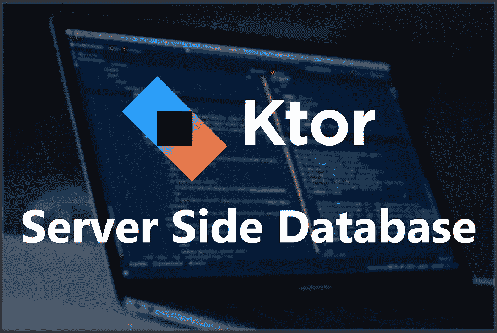

# 服务器端开发中的 Ktor 数据库

> 原文：<https://betterprogramming.pub/ktor-in-server-side-development-databases-b91a3bbe674f>

## 使用 Ktor 的服务器端 Kotlin



作者照片。

在本文中，您将学习如何在 [Ktor](https://ktor.io/) 中使用路由实现数据库。之后，我们将在本地托管并测试它。然后，我们将使用 Kotlin 独有的特性(如扩展)优化代码，使其可扩展到大型项目。

# Ktor 是什么？

根据其官方网站，“Ktor 是一个开源框架，使用强大的 Kotlin 编程语言在互联系统中构建异步服务器和客户端。”Ktor 使用协程来执行异步操作，由 [JetBrains](https://www.jetbrains.com/) 制作。

我们可以使用 Ktor 做的令人兴奋的事情之一是使用 Kotlin 编写 web 服务。如果你是 Ktor 新手，那么先看看 [Ktor 基础文章](https://medium.com/better-programming/ktor-in-server-side-development-the-basics-81ce4bbba878)。如果你想在移动平台上使用 Ktor，它有一个 Android 专用的神器。你可以在这篇[文章](https://medium.com/better-programming/how-to-use-ktor-in-your-android-app-a99f50cc9444)里了解一下。

# 数据库集成

首先，我们需要导入所有必要的依赖项。我们将使用`Exposed`来连接和执行 H2 内存数据库的 SQL 操作。我们需要在`build.gradle`中包含所需的依赖关系。转到`build.gradle`，在 dependencies 标签下添加以下几行:

# 模型和映射

下一步是创建一个模型类——基本上是一个我们需要存储在数据库中的 Kotlin 数据类。在模型的包下创建一个名为`Posts`的新数据类。看一下数据类:

然后创建一个名为`dao`的新包，并创建一个名为`Posts.kt`的 Kotlin 文件，内容如下:

`Posts`是`Post`的映射对象。该对象将有三个字段:id(作为区分各行的主要字段)、title 和 description(每个字段都有文本限制)。该对象充当对象到表的关系映射。

# 数据访问层

这里我们不是直接访问数据库相关的操作，而是创建一个包含所有基本操作(CRUD 操作)的接口。在`dao`包下新建一个文件，添加以下内容:

现在我们有了一个包含所有函数的接口，可以用来执行 CRUD 操作。没有任何延迟，让我们通过创建`PostsDao`类在同一个文件中实现它们。看一看:

`PostsDao`期望`Database`实例作为参数。所有的数据库操作都需要在`Exposed`的事务中执行。因此，我们已经将所有查询语句与事务包装在一起。现在我们已经有了一个可以使用的全功能的 DAO 层。

# 用 Ktor 集成曝光

最后，我们需要初始化 Ktor 应用程序中的`Exposed`T5。首先，我们需要通过传递 H2 内存数据库实例来创建`Dao`实例，然后调用`init()`函数。看一看:

## 配置路线

在这一点上，我们拥有 Dao 和 Ktor。剩下的事情就是创建不同的路由(GET、POST、PUT 和 DELETE)并调用它们各自的`dao`函数。看一看:

*   GET:返回数据库中的所有帖子
*   POST:接收`Posts` JSON 并存储在数据库中
*   PUT:更新 post 记录。
*   删除:删除给定 id 的文章。

# 代码优化

如果你看到模块功能，路由块不适用于大型项目。最终，我们将在端点中添加更多的逻辑，这将导致无法维护的巨大路由块。

克服这个问题的一个方法是利用 Kotlin 中扩展的功能来封装逻辑部分。看一看:

这就是我喜欢科特林的原因。我们可以将代码分离出来，并充分利用它。现在让我们用之前创建的扩展替换所有端点的实现:

# 测试

一旦你完成了所有的步骤，我们必须测试我们创建的 post REST API。首先，点击应用程序类中 main 函数旁边的 run 按钮。现在切换到终端面板，使用 CURL 命令测试服务。看看添加帖子的示例命令:

```
**curl** --data "{/"title/":/"This is title string/",/"description/":/"This is decription string/"}" -H "Content-Type: application/json" --request POST [**http://localhost:8080/addPost**](http://localhost:8080/addPost)
```

目前就这些。希望你学到了有用的东西。感谢阅读！