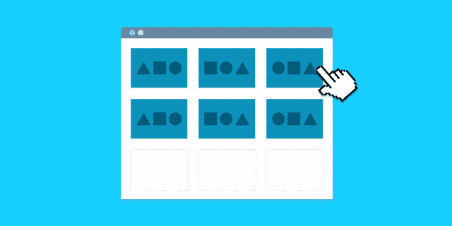

# 简化 Next.js 中的延迟加载

> 原文：<https://betterprogramming.pub/lazy-loading-in-next-js-simplified-435681afb18a>

## 减少组件的加载时间



延迟加载是一个概念，我们可以用它来减少 web 应用程序中特定页面的初始加载时间。

在正常情况下，当用户最初加载页面时，页面的所有内容都会被加载，然而，有时用户并不关心页面底部的内容，也懒得滚动。所以加载所有内容都将是徒劳的。

通过使用延迟加载，我们根据用户的需求呈现内容，所以当用户向下滚动时，我们逐渐加载内容，而不是在页面的初始呈现期间。

在这篇文章中，我将解释我们如何在 Next.js 中延迟加载组件。但是请记住，这并不适用于在服务器端呈现的组件。

设想一个场景，其中您将多个组件加载到一个组件中，比如一个包含许多部分和许多 API 调用的登录页面。

```
import Child1 from "../Child1";
import Child2 from "../Child2";
import Child3 from "../Child3";
import Child4 from "../Child4";
import Child5 from "../Child5";const ParentComponent = () => {
     return <div>
               <Child1/>
               <Child2/>
               <Child3/>
               <Child4/>
               <Child5/>           
         </div>}
```

假设当用户访问上面的页面时，他们在初始视窗中只能看到`Child1`和`Child2`内容。

要查看`Child3`组件的内容，用户需要向下滚动。然而，有些用户甚至不需要看到页面底部的内容。

但是根据我们的代码片段，一旦用户访问页面，所有 5 个子组件都会呈现，如果这些组件中有任何数据提取逻辑，也会有一些 API 调用。

正如我前面提到的，大多数时候这是不必要的，因为一些用户可能甚至不想看到其余的内容。

这是一个可以使用延迟加载来减少组件加载时间的例子。

# 让我们把手弄脏吧

1.  作为第一步，我们需要一种方法来检测用户滚动时特定组件的可见性。为此，我将使用`[IntersectionObserver](https://developer.mozilla.org/en-US/docs/Web/API/Intersection_Observer_API)`。

由于这将被多次使用，我将创建一个[自定义钩子](https://reactjs.org/docs/hooks-custom.html)。

```
import { useState, useEffect } from "react";const useOnScreen = (ref) => {
    const [isIntersecting, setIntersecting] = useState(false); useEffect(() => {
        const observer = new IntersectionObserver(
            ([entry]) => setIntersecting(entry.isIntersecting)
        ); if (ref.current) {
           observer.observe(ref.current);
        } }, []) return isIntersecting;
}export default useOnScreen
```

这个自定义钩子获取一个 ref 并观察它。我们使用`isIntersecting`状态，并使用条目更新状态。`isIntersecting`。从自定义钩子，我们返回`isIntersecting`状态。如果`isIntersecting`值为真，这意味着用户可以看到 ref 元素。

2.在下一步中，我们必须为每个子组件创建 refs，并使用我们的自定义钩子(`useOnScreen`)观察可见性。

```
import Child1 from "../Child1";
import Child2 from "../Child2";
import Child3 from "../Child3";
import Child4 from "../Child4";
import Child5 from "../Child5";
import useOnScreen from "../useOnScreen";const ParentComponent = () => {
   const child3Ref = useRef();
   const child3RefValue = useOnScreen(child3Ref); return <div>
               <Child1/>       
               <Child2/>
               <div ref={child3Ref}>
                 {child3RefValue &&<Child3/>}
               </div>
               <Child4/>
               <Child5/>           
         </div>}
```

现在只有当`*Child3RefValue*` 为*真时`Child3`组件才会渲染。*但是还有一个问题。想象一个场景，用户向下滚动，然后再次向后滚动。在这样的情况下，`*child3RefValue*` 会像假→真→假→真这样更新。

因此，当值更新为 true 两次时，整个`Child3`组件将呈现两次。我们不需要这种情况发生，因此我们需要防止随后的渲染。

3.为了防止组件多次渲染，我们必须在`Parent`组件中保存一个状态值:

```
import Child1 from "../Child1";
import Child2 from "../Child2";
import Child3 from "../Child3";
import Child4 from "../Child4";
import Child5 from "../Child5";
import useOnScreen from "../useOnScreen";const ParentComponent = () => {
   const child3Ref = useRef();
   const child3RefValue = useOnScreen(child3Ref);
   const [isChild3Ref, setIsChild3Ref] =  useState(false);useEffect(() => {
      if (!isChild3Ref)
          setIsChild3Ref(child3RefValue);
   }, [child3RefValue])return <div>
               <Child1/>       
               <Child2/>
               <div ref={child3Ref}>
                 {child3RefValue && <Child3/>}
               </div>
               <Child4/>
               <Child5/>          
         </div>}
```

现在，当`child3RefValue`改变时，`useEffect`将运行，如果只有`isChild3Ref`为`false`，状态将被更新。根据`isChild3Ref`值，`Child3`组件将被渲染。因此，即使用户上下滚动几次，组件也只会呈现一次。

您可以使用 [Next.js 动态导入](https://nextjs.org/docs/advanced-features/dynamic-import) t 更进一步，因此只有当`isChild3Ref`状态值为真时才会导入`Child3`组件。

```
import Child1 from "../Child1";
import Child2 from "../Child2";
import Child4 from "../Child4";
import Child5 from "../Child5";
import useOnScreen from "../useOnScreen";
const Child3 = dynamic(() => import("../Child3"));const ParentComponent = () => {
   const child3Ref = useRef();
   const child3RefValue = useOnScreen(child3Ref);
   const [isChild3Ref, setIsChild3Ref] =  useState(false);useEffect(() => {
      if (!isChild3Ref)
          setIsChild3Ref(child3RefValue);
   }, [child3RefValue])return  <div>
               <Child1/>       
               <Child2/>
               <div ref={child3Ref}>
                 {isChild3Ref && <Child3/>}
               </div>
               <Child4/>
               <Child5/>         
         </div>}
```

# 结论

延迟加载是防止页面上出现不必要内容的好方法。通过使用它，您可以最小化页面的初始加载时间，因为子组件将只在用户需要时呈现。当你遇到类似的情况时，不要忘记尝试一下。

如果你对 Next.js 更感兴趣，你可以参考[我写的关于 Next.js 预渲染的文章](https://medium.com/@kithma/pre-rendering-in-next-js-f042ad18c3c0)。

编码快乐！