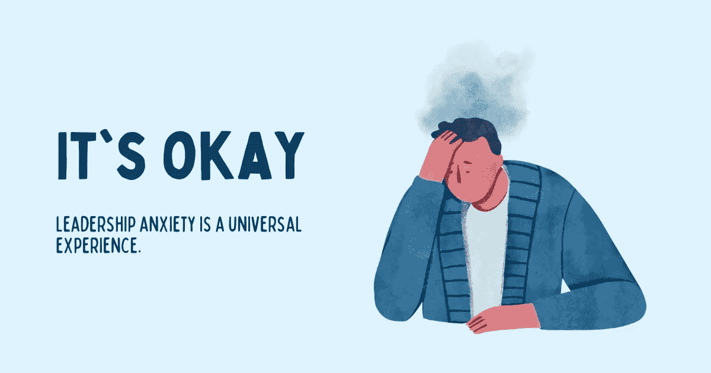

# 领导焦虑:当你感到焦虑时如何领导

> 原文：<https://betterprogramming.pub/leadership-anxiety-how-to-lead-when-you-feel-it-e5ac400b5289>

## 你越是试图控制你的焦虑，它就越是反抗

所有的领导者在他们的领导旅程中都感受到强烈的情感。虽然一些重大决策，如组织重组、谈判、收购和合并，可能是焦虑的来源，但往往是一些日常小事，如即将到来的截止日期、演示或决策会议，可能是压力和焦虑的来源。

产生这种感觉的原因有很多:你可能觉得无法控制自己的处境。事情可能不会如你所愿。你不确定你的决定。你害怕未来会如何展开。你担心让你的团队失望。你担心自己做得不够，需要做得更多。

焦虑在不同的人身上以不同的方式表现出来。

有些焦虑可能是合理和有益的，并在情况需要时引导您采取建设性的行动，如积极规划您组织的未来战略，寻找现有问题的创造性解决方案，或使您的团队更加有效和富有成效地工作。然而，如果任其发展，它经常会导致破坏性的行为模式。

当你充满焦虑的能量时，你可能很难坐得住，并可能向你的团队提出不合理的要求。在做决定时，焦虑会损害你的判断，让你忽略有效的意见，妄下结论，做出错误的假设。当你在做一项重要的工作时，焦虑会分散你的注意力，让你无法专注于手头的工作，让你感觉疲惫，却没有完成多少工作。在某些情况下，焦虑甚至会冻结你，阻止你采取行动或做出重要决定。你可能会过度思考你的处境，让这些想法麻痹你。

> "焦虑是一种情绪状态，表现为担心、紧张和不安."――爱丽丝·博耶斯在《焦虑工具箱:微调你的思维和克服你的障碍的策略》中

源于自我怀疑和冒名顶替综合症的焦虑是人类的自然组成部分。它能激励你质疑自己的选择，直面自己的感受，并积极主动地渴望做得更好。当你让你的领导焦虑阻止你看到你的现实情况时，问题就出现了。当你被自己的焦虑所困扰，以至于模糊了你思考和看清事物的能力。

作为一个领导者，事情不会总是如你所愿。你会面临挫折。你将被要求度过艰难时期。那些事情不是你能控制的。你所能控制的是，你是让你的焦虑点燃你驱散迷雾的欲望，还是让它吞噬你，削弱你和你的团队。

# 作为一名领导者，你应该分享你的焦虑吗？

我最常被问到的问题是:“我如何告诉我的团队我很害怕？作为一名领导者，我的工作不就是展示自信吗？”

我告诉他们这些。如果不加以控制，领导焦虑最不想要的后果就是将这种焦虑传递给你的团队。这个想法不是让你的感觉不真实，而是要小心你传递给你的团队的东西，不要让他们产生恐惧感。你怎么能说出真相而不让他们感到绝望呢？你如何表达你的情绪，让你感到兴奋，而不是绝望？

将你的弱点表现为一种优势，而不是一种需要避免的弱点。当你表现出脆弱时，你并没有传达出你无能或者你不知道自己在做什么的信息。相反，你给人的印象是一个高度自我意识的人，愿意接受现实。在脆弱和说出让别人对你的能力失去信心的话之间有一个微妙的平衡。

向你的团队展示有时有这种感觉是可以的。但是让这些感觉把他们拖垮是不行的。把你的信息集中在可以控制的事情上，不要在你无法控制的事情上浪费时间和精力。

作为一名领导者，展现出[自信谦逊](https://www.techtello.com/confident-humility-in-leadership/)——谦逊地承认事情的现状，并对自己的能力充满信心。你不想让你的人因为你的不安全感而增加负担。同时，你也不想通过描绘一幅美好的画面来误导他们。

说“我对这个决定感到害怕”，只会传达出你在乎把它做好。

说“我知道你们中的一些人可能对合并感到焦虑；我也感觉到了，”让别人在个人和情感上与你联系起来。

许多领导者认为，领导者的焦虑是一件坏事，如果他们专注于展示自己的优势和能力，同时锁定自己的情绪，消除恐惧，他们的人民就会更加信任他们。但是他们忘记了这一点——如果你感到焦虑，它可能不会反映在你的语言中，但它肯定会在你的肢体语言中表现出来。人们可以看到你的不真实，如果你言行不一，他们就不会信任你。著名心理学家、《情商:为什么比智商更重要》一书的作者丹尼尔·戈尔曼(Daniel Goleman)称之为“神经 Wi-Fi”，在这种情况下，人类可以感知他人未说出的感觉，并通过他们的行动检测他们的情绪。

纳尔逊·曼德拉有句名言:“勇气不是没有恐惧，而是战胜恐惧。勇敢的人不是不感到害怕的人，而是战胜恐惧的人。”伟大的领导者会不顾焦虑而行动。他们不掩饰自己的恐惧。他们不会让恐惧拖垮自己。

以下是管理领导力焦虑的三个步骤:

# 1.拥抱不舒服的感觉

处理焦虑的第一步是知道你正在感受它。如果你甚至没有意识到自己的感受，或者你把自己的情绪推到一边，担心它们可能会影响你作为领导者的效率，那么你就不能把你的焦虑转化为建设性的行动。

记住这一点:你越是试图控制你的焦虑，它就越是反击。面对你的感受，即使一开始会不舒服。

为了识别你是否感到焦虑，每当你感到强烈的情绪时，问自己这些问题:

1.  我感到身体不舒服吗？
2.  我感觉我的心脏和头脑在飞速运转吗？
3.  我很难集中注意力吗？
4.  我能认出这些身体反应吗:手心冒汗，胃部翻转，胸口发紧？

一旦你能够坐下来面对你的不适并提出质疑，你就能够认识到它。识别这种感觉，并大声说出它的名字。说“我感到焦虑。”

已检查:将您的情绪标记为焦虑。下一步是确定是什么触发了它。

# 2.识别触发器

了解是什么让你感到焦虑，可以帮助你作为一名领导者意识到某些互动、工作要求或引发焦虑的情况。然后，你可以采取措施，更好地准备应对这些时刻的焦虑。

假设和一大群人开全体会议让你焦虑。你担心自己的公共演讲技巧，这让你变得高度自我意识，更加犹豫不决。了解了这一点，你就可以在会议前制定一个计划来练习你的公开演讲技巧。你可以利用可靠来源的反馈和建议来改进你的演讲，或者雇一个可以帮助你的教练。

问自己这些问题，找出是什么引发了你的焦虑:

*   有没有导致焦虑的特定事件？
*   你在一些人身边会感到焦虑吗？
*   有没有让你焦虑的特定情况——当你第一次做某事时，当你不确定自己的决定时，当在压力下表现时，当事情没有按你预期的方式发展时，当你感到缺乏控制时？为你自己列出这个。

了解引发焦虑的原因还有一个好处。你可以利用这些时刻的反馈来确定焦虑是如何影响你的行为和决定的，并把它们作为下次做得更好的输入。回想一些你感到焦虑的往事，问问自己:

*   那一刻我是如何应对焦虑的？
*   我的行为是有益的还是无益的？
*   下次有什么可以做得更好？

最后一个问题是最重要的一个问题，因为它会立即将你的思维从问题模式切换到解决方案模式。

已检查:确定触发它的原因。下一步是采取有意识的行动。

# 3.放慢速度，有目的地行动

> “在刺激和反应之间有一个空间。在那个空间里，我们有能力选择我们的反应。我们的回应是我们的成长和我们的自由。”—维克多·弗兰克尔

暂停。当你感到焦虑时，学会寻找这个空间。在这样的时刻放慢速度是避免对你的处境做出反应的最好方法，并且有意识地为更有效的反应做准备。

慢下来，仔细看看你的焦虑，问自己这些问题:

*   你对自己最坏的情况感到焦虑吗？现实地看待可能发生和更有可能发生的事情。不要夸大你最大的恐惧。
*   你对未来感到焦虑吗？现在接受这个事实，未来永远是不确定的。不管你多么努力，有些事情总是超出你的控制。承认这个事实。不要试图控制一切。
*   你是否为没有做出最好的决定而焦虑？想一想你需要的信息，以便做出更好的决定，并向能帮助你的人寻求帮助。

作为领导者，你可能会因为许多其他原因而感到焦虑。你所需要做的就是放慢脚步，在那些时刻暂停一下。你最终肯定会得到一个更好的解决方案。

# 摘要

1.  领导焦虑是一种普遍的体验。
2.  不要试图隐藏你的感受或把它推到一边让它消失。你越是试图控制你的焦虑，它就越是反抗。
3.  如果不加以控制，你会把你的焦虑传递给你的团队。不要让你的焦虑限制了你的团队所能达到的成就。
4.  处理焦虑的第一步是承认你正在感受它。带着你的不适坐下，大声说出它。说“我感到焦虑”
5.  下一步是识别引发这种焦虑的人、情况和事件。一旦你知道是什么让你感到焦虑，你就可以更好地准备应对它。利用这些时刻的反馈来确定焦虑如何影响你的行为和决定，以便下次做得更好。
6.  最后，当你感到焦虑时，不要急于行动。不要试图解决任何导致你焦虑的事情。相当慢。停下来有目的地行动。

*这个故事最初发表于*[*【https://www.techtello.com】*](https://www.techtello.com/managing-leadership-anxiety/)*。*