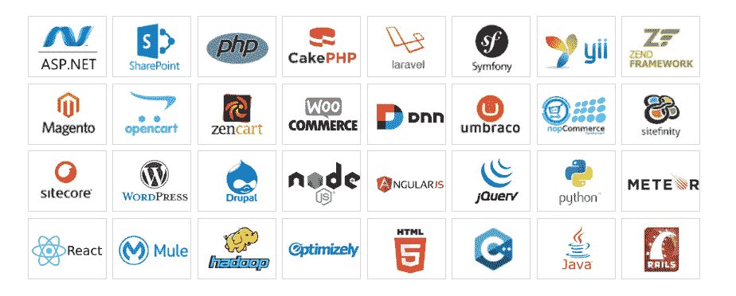

# 从源代码中学习(初学者成长的有效途径)

> 原文：<https://betterprogramming.pub/learn-from-source-code-an-effective-way-to-grow-for-beginners-e0979e9b5a84>

图片来自[与 Raj](https://unsplash.com/@roadtripwithraj) 在 [Unsplash](https://unsplash.com/photos/o4c2zoVhjSw) 的公路旅行

# 序

上周我和一个年轻的程序员聊天，他问我:

“我如何阅读代码？”

我们讨论了一段时间，我描述了几种更有效地阅读源代码的方法。

“你应该写一篇关于这个的文章，”他建议道。

“这对初学者会有帮助的。这不是你从书本或教程里学到的那种东西。”

所以我们开始吧。这些是我从源代码中学习的技巧。

# 为什么我们需要阅读代码

作为程序员，我们每天都要和源代码打交道。经过多年的学习，大多数程序员可以编写代码——或者至少复制和修改代码。

尽管如此，我们教授编程的方式强调的是编写代码的艺术，而不是如何阅读代码。当我说*阅读代码时，*我指的是有意阅读源代码的实践。

众所周知，编程和写作有很多共同点。Donald Knuth 甚至介绍了[识字编程](https://en.wikipedia.org/wiki/Literate_programming)的编程范例。编码和写作都有一个共同的理想:表达我们的想法。

还记得你在学校是怎么学会写作的吗？我们的写作能力来自于从小学开始阅读大量的文本。多年来，我们阅读不同难度的伟大作家的作品，练习各种写作技巧。

> *“如果你没有时间阅读，你就没有时间(或工具)写作。就这么简单。”*
> 
> *—斯蒂芬·金在他的回忆录《论写作》中*

正如斯蒂芬·金所观察到的，一个作家必须广泛而频繁地阅读，以发展自己的声音，并学会如何以迫使读者拿起他们的作品并阅读的方式来写句子和组织故事。

和看书一样，有目的的阅读代码会帮助程序员成长的快很多，尤其是中级程序员。

有意阅读代码有三个好处。

## 站在巨人的肩膀上

我们向他人学习。伟大的源代码就像一部文学杰作。它提供启迪，而不仅仅是信息和知识。

通过浏览 Linux 内核、Redis、Nginx、Rails 或任何其他著名项目的源代码，您可以汲取全世界成千上万顶级程序员的智慧。

在这些项目中可以找到无数好的编程、范例选择、设计和架构的例子。向他人学习的另一个好处是能够避免常见的陷阱。大多数错误已经被别人犯过了。

# 解决难题

在您的编程生涯中，您最终会遇到无法通过 Googling 解决的问题。如果你没有遇到过这种问题，那只能说明你编程的时间还不够长。

阅读源代码是研究这类问题的好方法，也是学习新事物的好机会。

# 去拓展你的局限

大多数程序员只在几个特定领域编码。一般来说，如果你不不断地鞭策自己，你的编程能力会是同事的平均水平。

不要满足于修复一些 bug 或给现有系统添加一些琐碎功能的工作。相反，尝试扩展到一个新的领域。永远试着去寻找一个你在日常工作中没有接触过的新领域——一个你感兴趣的领域。这将从整体上拓宽你对编码的理解。

# 阅读什么样的源代码

好的，所以阅读源代码是有好处的。接下来的问题是:这么多伟大的作品可供选择，我们应该读什么样的源代码？

你必须从选择一个目标开始。没有那个焦点，你理解源头的努力将会变得不那么有效。

以下是一些典型的场景:

1.  **当你想学习一门新的编程语言:**学习一门新的编程语言[不仅仅意味着学习语法](https://coderscat.com/how-to-learn-all-pl)。然而，当学习一门新语言时，阅读源代码是一种非常有效的学习方法。我从项目 [rust-rosetta](https://github.com/rust-rosetta/rust-rosetta) 中学到了很多关于 Rust 的知识。Rosetta Code 是一个收集各种编程语言中常见任务的解决方案的项目。这是学习新编程语言的有用资源。
2.  **当你想理解一个特定的算法或实现时:**例如，我们都使用过标准库中的排序函数。有没有想过是怎么实现的？或者说你需要使用 Redis 中的 set 数据结构，在它的实现中使用了哪些数据结构？为此，您只需要查看项目中与实现相关的部分，通常是一些文件或函数。
3.  **当你在一个特定的框架中编码时:**因为这意味着你对这个框架有一些经验，这是一个阅读框架本身的源代码的好时机。显然，知道它的源代码会提高你的理解能力。

4.当你想拓展到一个新的领域时，阅读这个领域的经典和著名的项目。例如，既然你是做 web 开发的，分布式系统是否让你感兴趣？如果是这样，也许 [etcd](https://github.com/etcd-io/etcd) 是个不错的选择，如果你了解 Golang 的话。你想深入研究一个操作系统的内部吗？那么也许 [xv6](https://github.com/mit-pdos/xv6-public) 会是一个好的开始。我们正处于一个伟大的时代，GitHub 上有许多伟大的开源项目。试着找几个。

记住，根据自己目前的编程技能和知识水平来选择项目。如果你选择了一个远远超出你目前技能水平的项目，你最终会感到沮丧。阅读一些较小的项目，然后转向较大的项目。

如果你在给定的时间里不能理解某些特定的代码，这意味着你有知识缺口。把代码放在一边，试着读一些书、论文或者其他相关的文档。然后等你更有信心的时候再回来。

我们总是以一种模式进步:阅读(代码、书籍、论文)、写作、多读、多写。

# 如何阅读源代码

[《如何阅读一本书》](https://amzn.to/2Pq1LYS)智能阅读指南。

作为初学者，我们如何阅读代码是一门值得投入时间和精力的课程。阅读代码并不容易。仅仅阅读源代码是不够的。你试图理解别人的设计和想法。

## 前提

为了有效地阅读代码，您需要准备一些东西:

1.  一个可以有效使用的编辑器。你需要快速搜索关键词或变量的能力。有时你需要找到函数的引用或定义。对你的编辑器感到舒服。为了变得更有效，学会只用键盘来使用它。这将让你专注于代码而不会被打断。
2.  Git 或类似版本控制工具的基本技能，这样您就可以比较不同版本之间的差异。
3.  与来源相关的文件。这些将作为你阅读的参考——尤其是设计文档、代码约定等等。
4.  对正在使用的编程语言和设计模式有一些了解和经验。对于大型项目，这是强制性的。如果你很了解一门编程语言，你就会知道源代码是如何组织的，范例和最佳实践是什么。当然，这需要时间去积累。耐心点。

## 流程和提示

阅读过程不是线性的。不能只是一个一个的读源文件。相反，大多数时候我们从上到下阅读代码。以下是一些更有效地阅读代码的技巧:

当你开始阅读代码时，总是试图抛出问题。

例如，如果一个应用程序有一个缓存策略，一个很好的问题是如果一个键失效了会发生什么——缓存中的值是如何更新的？

带着这种问题，你是在上下文中阅读代码，或者说心里有一个目标，这让阅读过程变得很享受。你甚至可以对自己做一些假设。然后，有了代码，我们需要确认我们的假设。

这变得有点像间谍活动:你想发现代码的真相，代码的逻辑，以及它如何像故事一样流动。

源代码就像一个乐高玩具，只是已经组装好了。如果你想了解它是如何组合在一起的，你需要与它互动——甚至有时把它拆开。

对于代码，阅读同一源代码的旧版本是有帮助的。阅读与 Git 的区别，并尝试弄清楚一个特定的特性是如何实现的(变更日志对此很有用)。例如，我发现 Lua 的第一个版本要简单得多，这有助于我理解其作者最初的设计思想。

[张家瑜](https://unsplash.com/@danielkcheung?utm_source=unsplash&utm_medium=referral&utm_content=creditCopyText)在 [Unsplash](https://unsplash.com/s/photos/legos?utm_source=unsplash&utm_medium=referral&utm_content=creditCopyText) 上拍照

调试是玩代码的另一种方式。尝试在代码中添加一些断点(或打印点)，并尝试理解打印到控制台的任何输出。

如果你对代码有足够的理解，试着做一些修改。然后重建并运行它。最简单的方法是尝试调整配置，以查看不同配置的结果。之后，你可以尝试添加一些琐碎的功能。如果结果对别人有用，你就应该为上游做贡献。

> *“糟糕的程序员担心代码。优秀的程序员会担心数据结构和它们之间的关系。”*
> 
> *—莱纳斯·托瓦尔兹*

数据结构是程序中最重要的元素。用钢笔或任何你喜欢的工具画出数据结构之间的关系。结果是源代码的映射。在阅读过程中，你需要经常查阅这张地图。像 [scitools](https://scitools.com/) 这样的工具可以用来生成 UML 类图。

大型项目包含多个模块——通常一个模块负责一项任务。这有助于我们减少代码复杂性，并在适当的层次上进行抽象。模块的接口是抽象边界。我们可以阅读一个模块，然后进入另一个模块。如果您正在阅读用 Make 构建的 C/C++项目，Makefile 将是理解模块如何组织的一个很好的入口。

边界本身也是有用的。伟大的代码是组织良好的——它的变量和函数以易读的方式命名。你不需要阅读所有的源文件。不重要或者熟悉的部分可以忽略。如果你已经确认一个模块只是为解析而设计的，那么你已经大致了解了它的功能；然后，您可以跳过阅读该模块。这当然会大大节省时间。

测试用例也是理解代码的一个很好的补充。测试用例是文档。如果你读一个类，试着读相关的测试代码。这可以让你弄清楚一个类的接口，以及它的典型用法。一个集成的测试用例对于用一些特定的输入来调试代码也是有用的，这可以让你跟随程序的整个流程。

在花了很长时间阅读一个项目之后，为什么不写一篇代码的回顾呢？就像书评一样。你可以写下这段源代码中好的或不好的部分，以及你从阅读它中学到了什么。写这种文章会理清你的理解，也有助于其他人阅读源代码。

# 一些好书

照片由[思想目录](https://unsplash.com/@thoughtcatalog?utm_source=unsplash&utm_medium=referral&utm_content=creditCopyText)在 [Unsplash](https://unsplash.com/s/photos/books?utm_source=unsplash&utm_medium=referral&utm_content=creditCopyText) 上拍摄

我发现代码阅读比我想象的要广泛得多。没有真正系统的方法来训练这种技能。一句话，坚持练习找到自己的路。这些是提高你阅读代码能力的好书:

[《设计模式:可复用面向对象软件的要素》](https://www.amazon.com/Design-Patterns-Elements-Reusable-Object-Oriented/dp/0201633612)

[“架构:软件结构和设计的工匠指南](https://amzn.to/2BN8WSR)”

[《如何阅读一本书:智能阅读经典指南](https://amzn.to/2MVbZ1G)》(这本书对一个程序员来说也是有用的。)