# 了解如何构建:使用 NASA API 和 React + Redux 的每日天文图片应用程序—第一部分

> 原文：<https://betterprogramming.pub/learn-how-to-build-astronomy-picture-of-the-day-app-with-nasa-api-and-react-redux-e462ef0c806c>

# 演示

我最近发现 [NASA 有一个公共 API](https://api.nasa.gov/) 。酷！今天就让我们用 API 来构建一些东西吧！

我们要建造什么？我们要建一个叫*天文日图*的 app！

## 先决条件

基本的 JavasScript 经验。

我们使用 [React](https://facebook.github.io/react/) 构建应用程序 UI，使用 [Axios](https://github.com/mzabriskie/axios) 获取数据，使用 [Redux](http://redux.js.org/) 管理应用程序状态。

此外，我们不要忘了 Webpack，它将为我们的浏览器编译所有内容。伟大的工作流程！

# **第一步——脚手架**

请从这个存储库中获取我们的 Webpack 配置。

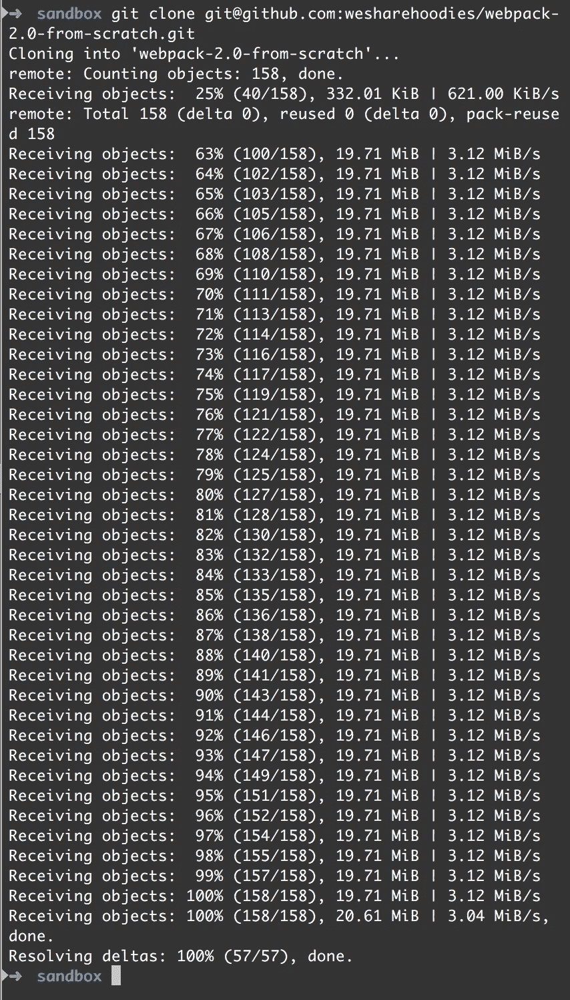

1.  我们将把当前项目重命名为`nasa-react-redux`。
2.  改变目录，跳转到分支`chapter-5`，做一个`git pull origin chapter-5`。
3.  移除`.git` ，因为我们不想让我们的小项目与 Webpack 指南存储库相关联。
4.  安装 npm 依赖项:`npm install`或简称`npm i`。

让我们启动我们的 Webpack 配置，用我们最喜欢的文本编辑器打开项目。

启动 Webpack 的命令是`npm run start` ，如果一切正常，您应该会看到如下内容。

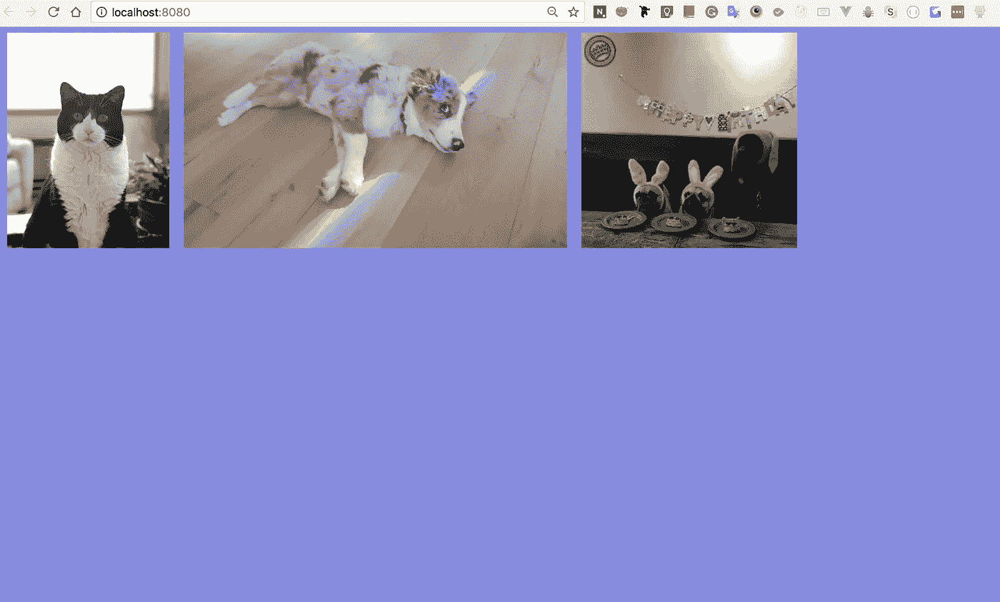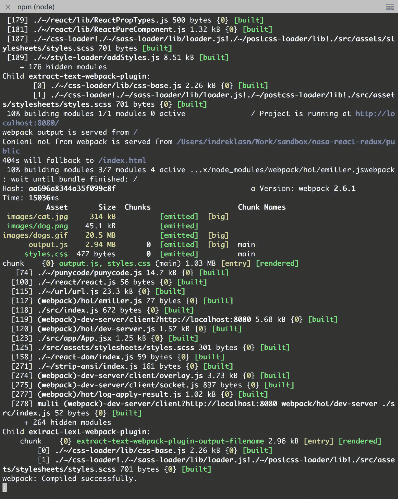

你已经通过了脚手架部分，进入第二步！

# 第二步——注册一个 NASA API 密钥

前往 NASA 官方网站[注册一个 API 密匙](https://api.nasa.gov/index.html#apply-for-an-api-key)。它是非常直接的。钥匙应该马上就能拿到。

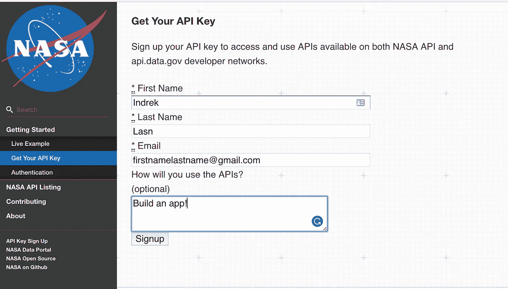

注册并接收 API 密钥

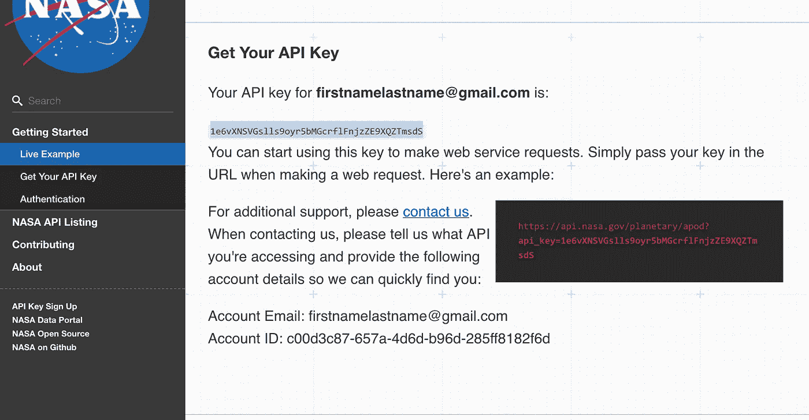

API 密钥也会发送到您的电子邮件中。把钥匙放在安全的地方。

# 第 3 步—使用 React 构建应用程序本身

由于这是一个相当容易构建的应用程序，让我们先用 React 本身来构建应用程序，然后用 React+Redux 来构建，这样我们就可以比较工作流了。我们也将理解*为什么*我们甚至需要像 Redux 这样的状态容器。

React 当前设置的简要说明:

我们在`public**/**`里面有一个`index.html` ，在`src/`里面有一个`index.js`。

简而言之——我们在`index.html`中有一个`#root` div，它挂钩并做出反应。我们让 Webpack 为浏览器读取的普通 JavaScript 编译我们的 React。

显然这是一个可笑的过于简单的解释，但你得到了主要的概念。

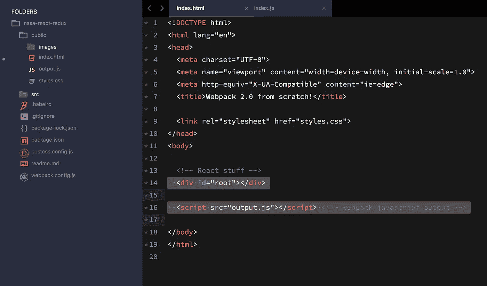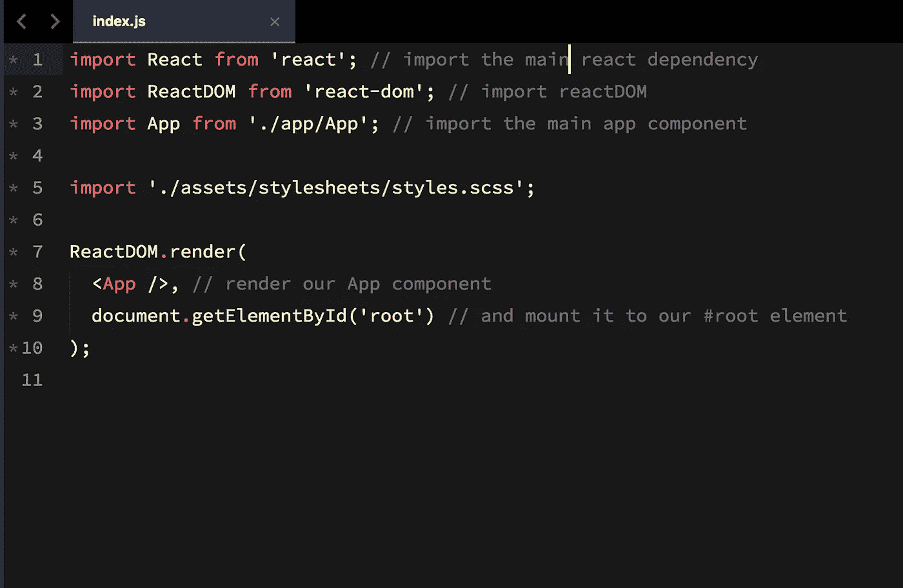

注意:如果你觉得这对你来说太难了，试着用普通的 HTML/CSS/JS 建立几个网站，当你更有信心的时候再回来——当你刚刚开始的时候，这可能很难。

现在加快了步伐。

1.  我们在`src/app` 里面做了一个新的`directory` ，我们称之为`components`。
2.  在`components`中，我们创建了两个额外的文件，分别叫做`AstronomyContainer.js`和`AstronomyCard.js`。
3.  让我们清理`src/app/App.js`并导入`AstronomyContainer.js`。

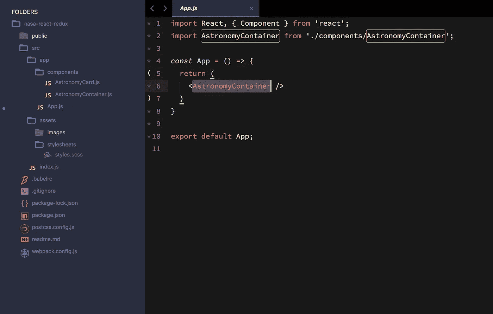

src/app/App.js

# 有状态和无状态

我们现在需要做几件事。

我们需要编写两个组件，其中一个叫做`stateful`(又名智能/动态组件)，第二个叫做`stateless`(又名哑/哑/静态组件)。

你能猜出哪个是哪个吗？

*   无状态—始终返回相同的输出。数据在其中“流动”的组件。主要用于表示某物。不包括状态，只有道具！
*   有状态—有一些活动，组件有一个内部状态。活动的例子:数据获取、用户交互(例如点击按钮)和数据传递。

希望这听起来不会太复杂，这是一个非常简单的概念。

让我们为这两个组件写主干。

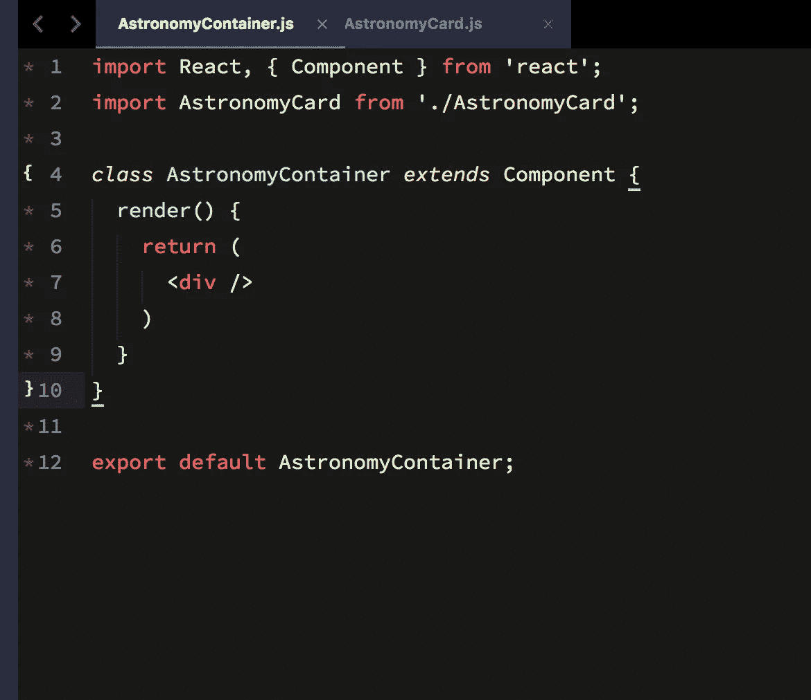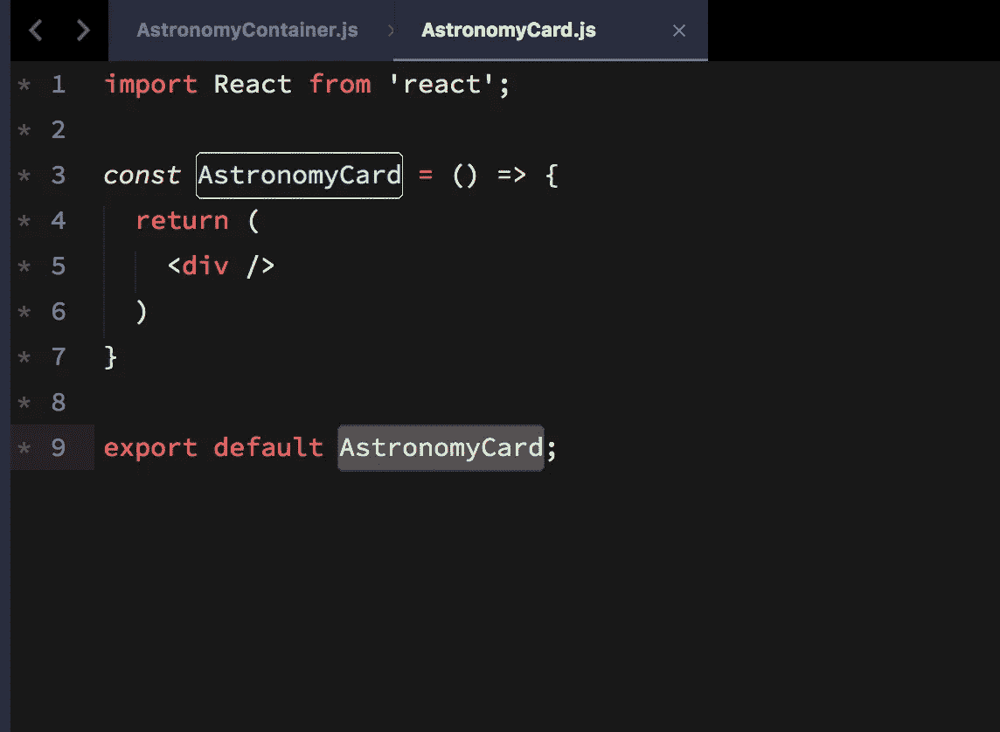

注意一个组件是如何基于`class`的，而另一个不是？

基于类的组件将携带状态。我们为什么需要国家？我们需要状态，这样我们就可以保存动态应用程序中发生的事情。

想想吧。如果用户点击一个按钮，应用程序如何知道下一步该做什么？在点击之前，我们有一个默认状态。在用户点击按钮后，我们改变状态来表示接下来会发生什么。

示例 **:**

我们有一个从零开始计数的计数器。初始状态为零。用户点击按钮。我们如何把这些碎片拼在一起，更重要的是，增加或减少数字？

我们需要某种动态机制来代表我们的行为，并将其转换为代表性的反馈/数据。我们称之为*状态*。一旦你使用状态，你就离不开它。

回到构建应用程序。看一看 [NASA 天文图片中的日端点](https://api.nasa.gov/planetary/apod?api_key=nxKl8yTvpvsXEqRz06mTPnn29uyckFmFCYrnqEIz)。

确保您查看了 URL，并且**将** `**api_key=**`更改为您的个人密钥。

NASA 数据

我们需要以某种方式获取数据。幸运的是，这相对容易。

转到你的项目的根目录，安装 [Axios](https://github.com/axios/axios) 。

`npm i axios`

我现在给你看一些代码。试着理解它——我将在下面解释它。

不要忘记用您的个人密钥替换 API 密钥。

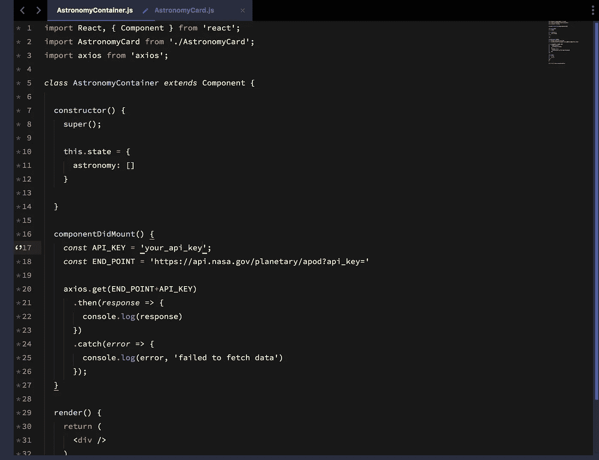

1.  我们进口`axios`
2.  我们调用`constructor()` 方法来初始化我们的状态。初始状态只是一个空数组。
3.  我们称生命周期为`componentDidMount`，在生命周期方法中，我们声明了我们的`END_POINT`和`API_KEY`常量。
4.  在`componentDidMount`方法内部，我们用`axios`调用一个`GET`请求。
5.  `Axios`返回一个承诺，在这个承诺中，我们可以访问数据。数据在`response.data`下。

如果您打开浏览器控制台，您应该能够看到响应。

我们快到了。现在我们需要保存对当前状态的响应。

我们调用`setState()`方法并传入我们的状态对象。

如果我们`console.log()`我们的状态，应该会看到数据！当前组件的最后一步，我们还需要将这个状态传递给我们的子/无状态组件。

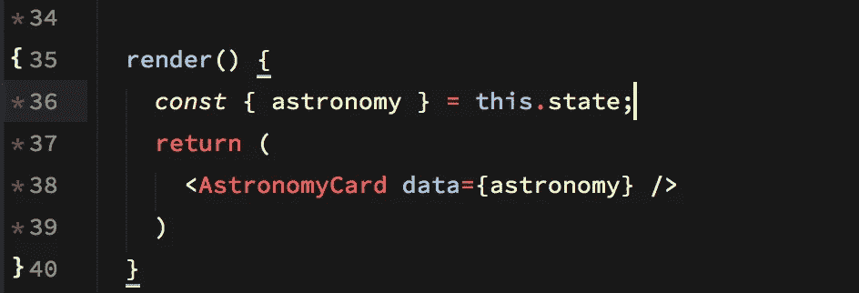

我们通过一个道具作为我们的状态。我已经包括了[奇特的小物体解构。](https://developer.mozilla.org/en/docs/Web/JavaScript/Reference/Operators/Destructuring_assignment)

那么，我们如何使用兄弟中的父数据呢？事实证明，这并不难——React 使用起来既简单又直观。

我们可以访问兄弟中`props.data`下的数据。我正在做的是解构对象，所以我们不必每次都写出长的道具。我们可以写`{title}`而不是`props.data.title`。

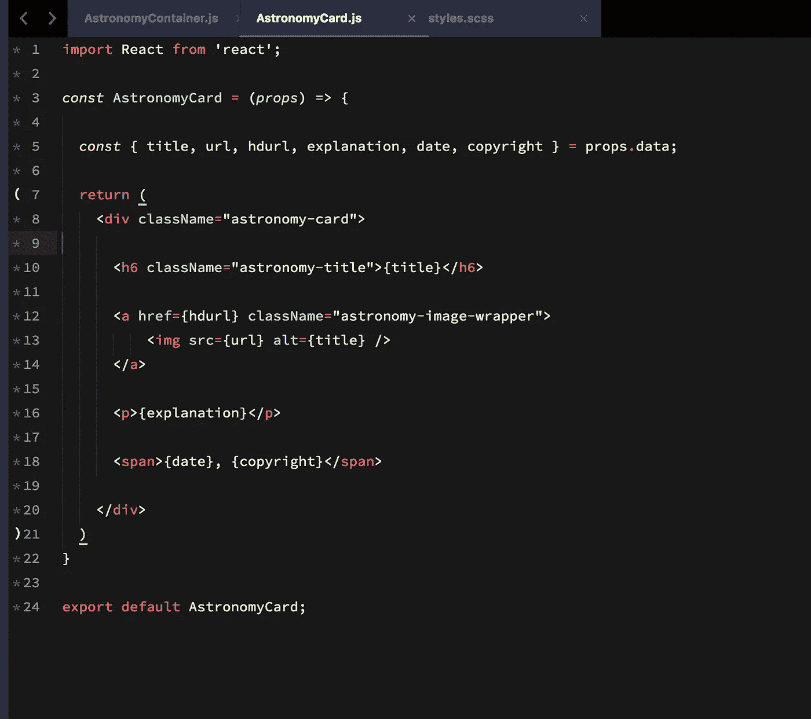

[最后一件事。在这里抓取样式并将它们放置在 i](https://gist.github.com/wesharehoodies/9b6d56699b2b3c38575d0c09f8314738) n `src/assets/stylesheets/styles.scss`

让我们看看我们的应用程序。

不是太多，但我们今天确实做了很多。使用这个 API 可以做更多的事情——这里是端点[的完整列表](https://api.nasa.gov/api.html#apod)——请随意试验。

我们的下一个目标是使用 Redux 进行重构，这将在下一章讨论。Redux 很复杂，我将专门为 Redux 写一整章。

美国宇航局可能会包括视频而不是网址。在这里查看 `[AstronomyCard.js](https://github.com/wesharehoodies/nasa-react-redux/blob/master/src/app/components/AstronomyCard.js)` [文件以获得](https://github.com/wesharehoodies/nasa-react-redux/blob/master/src/app/components/AstronomyCard.js)的解决方案。

# 第二部分

 [## 了解如何使用 NASA API 和 React + Redux(部分…

### 啊哈！所以你回来了！很好！我们将把这一整章献给 Redux。

medium.com](https://medium.com/@indreklasn/learn-how-to-build-astronomy-picture-of-the-day-app-with-nasa-api-and-react-redux-part-ii-83f15970d0e3) 

# 源代码

 [## indreklasn/nasa-react-redux

### 导读:搭建一个 React + Redux 的 app。为 indreklasn/nasa-react-redux 的发展作出贡献

github.com](https://github.com/indreklasn/nasa-react-redux/tree/chapter-1)