# 了解如何使用 NASA API 和 React + Redux 构建每日天文图片应用程序—第二部分

> 原文：<https://betterprogramming.pub/learn-how-to-build-astronomy-picture-of-the-day-app-with-nasa-api-and-react-redux-part-ii-83f15970d0e3>

## 我们将把这一整章献给 Redux


我们将把这一章献给 [Redux](http://redux.js.org/) 。

这是本教程的第一部分。

计划是重构我们的 [React](https://reactjs.org/) 应用程序，以实现 React+Redux。React 当前处理我们的状态，我们希望 Redux 来管理它。

Redux 为什么这么重要？好问题！

从文档来看——Redux 是 JavaScript 应用程序的可预测状态容器。

我们将让 Redux 管理我们应用程序的`state`, React 处理演示 UI(用户界面)。它将责任从 React 中分离出来。

这是如何工作的？我带你去看。


**React + Redux 图(** [**图片取自此处**](https://onsen.io/blog/content/images/2016/Jun/react_redux.png) **)**

# **安装**

首先，让我们安装两个依赖项。

*   **redux:**
    包含所有功能的实际 redux 库。
*   **react-redux:**
    用于 react 和 redux 的胶水。


太好了！现在我们需要用 Redux 连接 React 应用程序。我们将从`react-redux`导入`Provider`，并将我们的应用程序包装在`Provider`标签中。

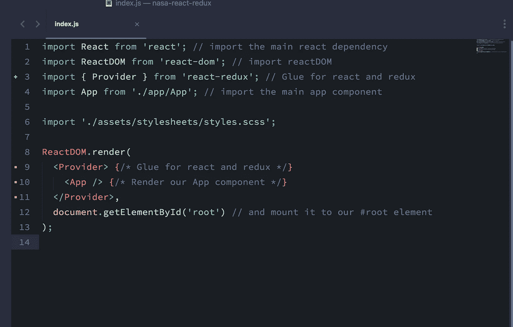

**src/index.js**

# 创建商店

什么是商店？商店是 Redux 术语的一大部分。商店是一个保存应用程序状态的大对象`{}`。商店将我们的`actions`和`reducers`放在一起。

从文档中:

## 商店有以下责任

*   保存应用程序状态。
*   允许通过`[getState()](http://redux.js.org/docs/api/Store.html#getState)`进入状态。
*   允许通过`[dispatch(action)](http://redux.js.org/docs/api/Store.html#dispatch)`更新状态。
*   通过`[subscribe(listener)](http://redux.js.org/docs/api/Store.html#subscribe)`注册监听器。
*   通过`[subscribe(listener)](http://redux.js.org/docs/api/Store.html#subscribe)`返回的函数处理监听器的注销。

`Provider`只需要一个道具——`store`属性。

## 创建商店

让我们用下面的代码在`src/`中创建我们的`Store.js`。

我们从`redux`导入`createStore`方法，并将`rootReducer`作为参数传递。

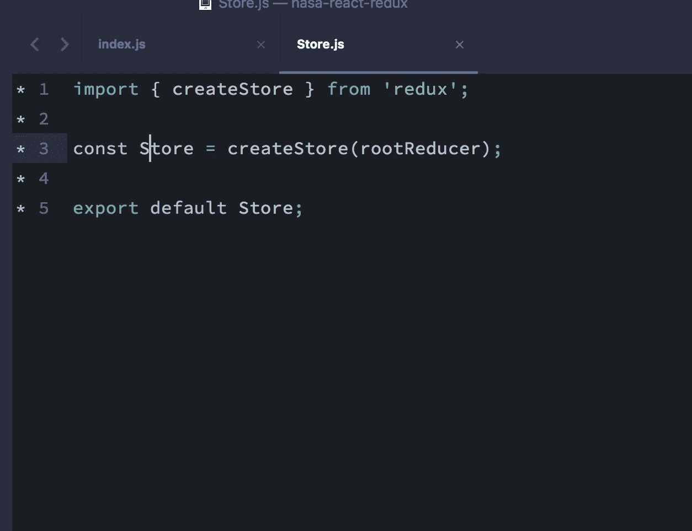

**src/Store.js**

然后我们将它导入到我们的`src/index.js`文件中，并将道具添加到`Provider`标签中。


**src/index.js**

然后我们导入`Store`并将其作为道具传递给`Provider`。

如果我们查看浏览器内部，我们会看到一个红色的大错误。这完全正常——我们还没有做出我们的`rootReducer`。

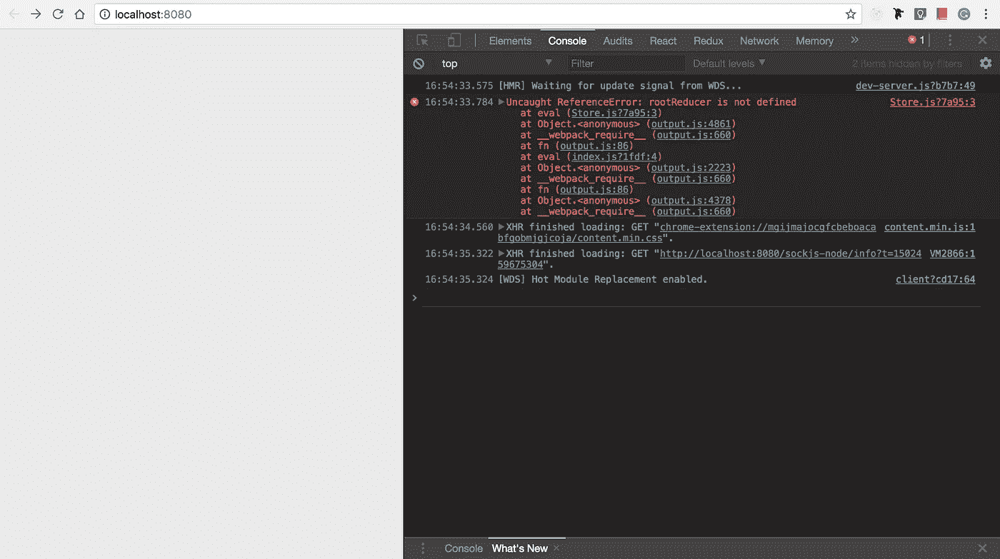

# 还原剂

什么是减速器？

减速器处理将发生在`state`上的逻辑。假设用户单击一个按钮，接下来会发生以下步骤:

1.  一个名为`"BUTTON_CLICKED"`的`action type`带着有效载荷发射`action`。`action`返回一个普通对象。
2.  所有`reducers`都将被调用。类型为`"BUTTON_CLICKED"`的`reducer`将被进一步调用以返回新的`state`。有效载荷通过`action`。默认情况下，所有减速器返回`state`。
3.  `store`监听`reducers`中的任何变化，并保存新的`state.`
4.  `store`传递了*新的* `state` 给我们的反应观点。
5.  React 更新视图。

很多行话——在行动中更容易理解。

我们已经完成了我们的`store` (#3)，现在我们要开始`reducers` (#2)。

你可能会问，“这些都有必要吗？”

不，没必要。你甚至会感到不知所措。但是不要气馁。一旦你理解了所有的行话，Redux 就没有你想象的那么难了。

我们要完成减速器吗？我们的`store`需要它们。

我们将为减速器创建一个名为`src/reducers`的专用目录。在`reducers`目录中，我们创建了一个`index.js`文件。

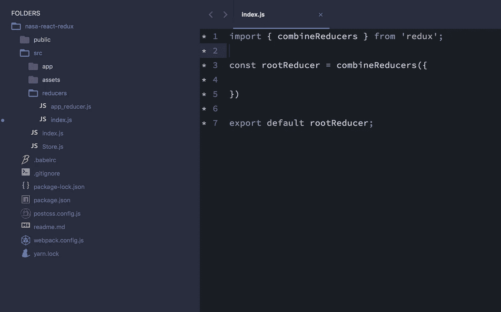

**src/reducers/index.js**

在`src/reducers/index.js`内部，我们从 Redux 导入`combineReducers`。`combineReducers`将我们所有的减速器融为一体。

为什么我们只需要一个减速器？`Store`对应方只接受一个减速器作为参数，即`rootReducer.`

现在我们有一个名为`rootReducer`的常量，我们将其导出。

`Store`接受我们刚刚导出的`rootReducer`。我们可以走了！

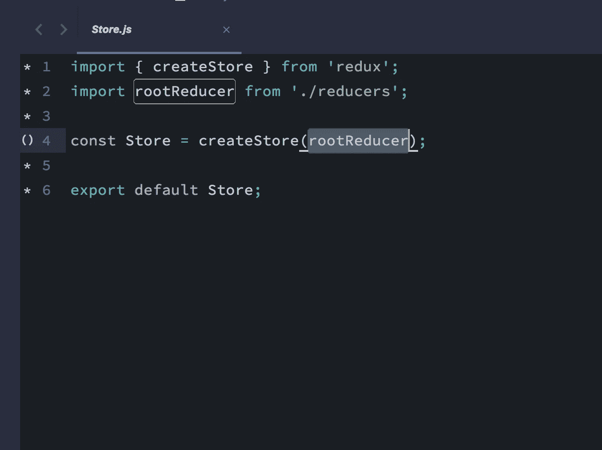

**src/Store.js**

你想知道你的浏览器现在告诉你什么吗？


又一个红色大失误！

不要惊慌，这只是 Redux 想帮助你。如果我们仔细阅读，我们会发现我们的`combineReducers`函数中缺少了一个缩减器。

很有道理。

现在让我们制作第一个真正的减速器。

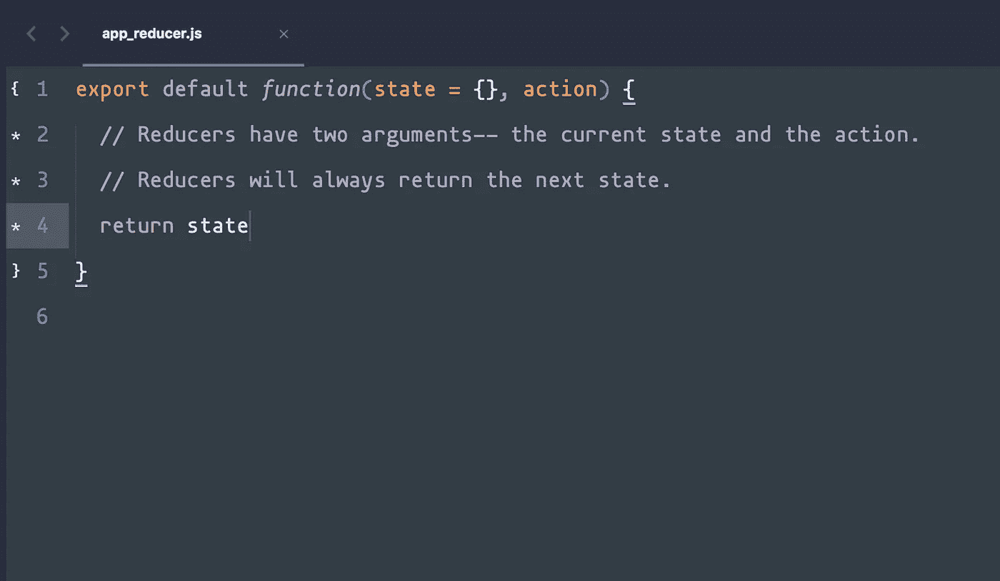

减速器有两个参数:

1.  当前的`state`，我们最初设置为空的`Object {}`。
2.  一个`action`。

减速器将始终返回该状态。

让我们导入我们的`app_reducer.js`，并将其作为参数传递给`combineReducer`。

你可能知道，我们可以将对象作为参数传递给函数。

现在，我们的状态叫做`astronomy`。一旦我们调用了`mapStateToProps`，我们的数据将在`this.props.astronomy`中我们“连接”的组件中。

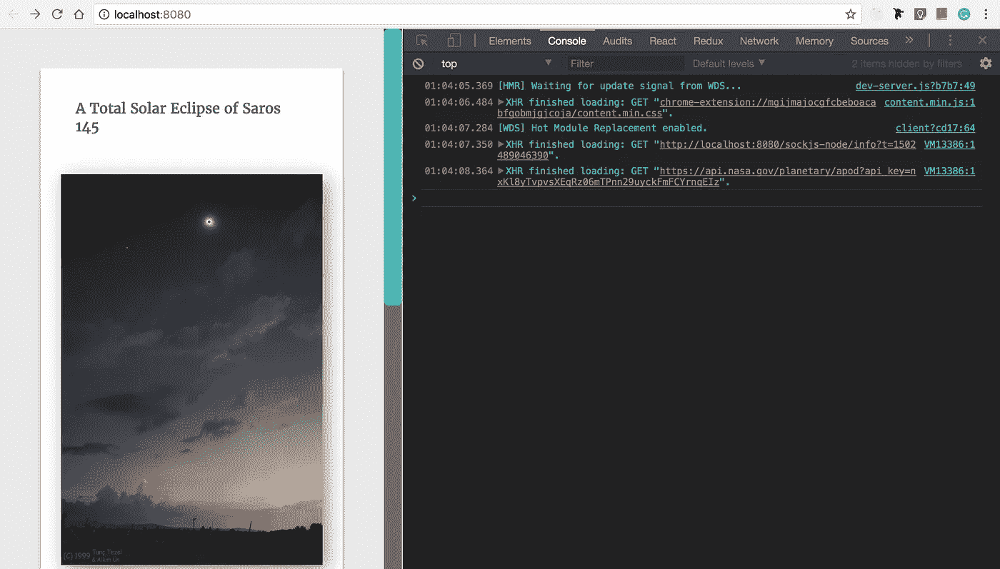

我们的浏览器不再显示红色——我们一定做对了什么！

我们创造了自己的`store`和`reducer`。现在我们必须创建我们的`action`，最后，用我们的 React 组件连接它。

了解我们试图解决哪个问题总是很重要的——从 [NASA API](https://api.nasa.gov/) 获取天文学数据。

我们正在缓慢但肯定地将状态从 React 中分离出来，并让 Redux 处理状态。

接下来:行动**！**

如果你有兴趣阅读更多关于[减速器](http://redux.js.org/docs/basics/Reducers.html)的信息，请查阅 Redux 的文档。

# 创建操作

文档很好地解释了操作:

“动作是将数据从应用程序发送到商店的有效信息负载。他们是商店唯一的信息来源。”

正如我们对 reducers 所做的那样，首先在`src`中创建一个名为`actions`的新目录。

在`actions`目录中，我们将有一个名为`fetch_data.js`的文件。

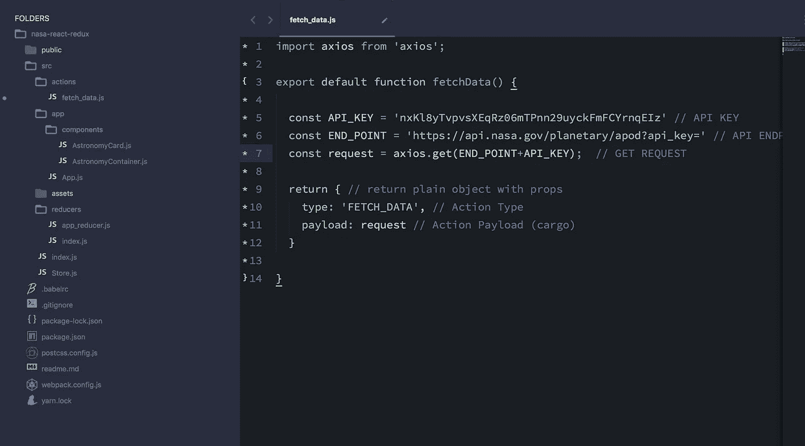

从上到下:

*   我们导入 [Axios](https://github.com/axios/axios) 来取出数据。
*   我们有一个名为`fetchData`的函数，我们将其导出。
*   在函数内部，我们已经为端点声明了几个常量，就像我们之前做的那样。

该操作将返回一个包含以下内容的普通对象:

1.  **动作类型**
    这是为了让减速器识别我们的动作。
2.  **Payload**
    在本例中，它是我们从端点获取的数据。

现在我们需要用 React 组件连接它。我们可以将`action`称为`this.props.fetchData()`并获得我们想要的数据。

我知道仅仅提出一个`GET`请求就很麻烦。但是学习 Redux 将使我们的应用程序更容易推理。

现在我们需要安装一个依赖项来解析我们的`promise`。

Redux 不知道如何处理异步动作。所以我们需要安装[中间件](http://redux.js.org/docs/advanced/Middleware.html)。

```
$ yarn add redux-promise
```

`store`接受`middleware`，中间件在后台附魔我们的应用。

# 应用 Redux 中间件


这里我们做三件事:

1.  从`'redux'`导入`applyMiddleware`。
2.  从`'redux-promise'`导入`promise`。
3.  在我们的`createStore()`函数中传递第二个参数。这个参数叫做`applyMiddleware()`，它接受任何中间件。我们在`applyMiddleware()`函数中传递我们的`promise`中间件。

# 回到减速器

我们已经声明了我们的操作，但是我们的 reducer 对此一无所知。让我们解决这个问题！

我们将添加一个`switch()`语句来检查哪些动作被触发并相应地采取行动。

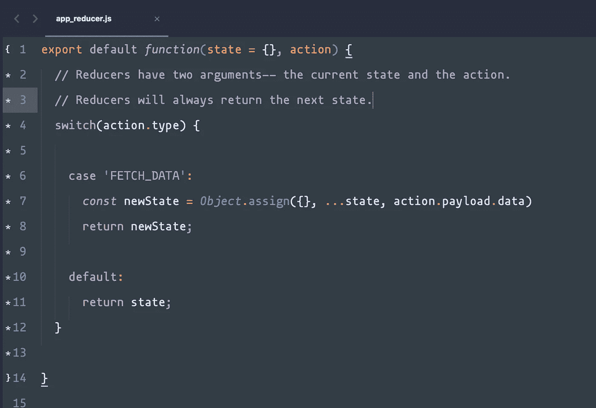

在 Redux 中，默认情况下操作和减少器连接。我们不需要把它们粘在一起。

还记得我们有一个返回带有道具的物体的动作吗？

其中一个道具是减速器中的`type: ‘FETCH_DATA’.`,我们正在检查被触发的动作是否确实是这种类型。如果是，我们还一个*新的* `state`。

我们使用扩展操作符`…`——我们用`action.payload`在一个新数组中传递我们的状态，它是请求数据。

**记住**，我们不突变状态，突变状态是反模式！总是返回新创建的状态。

简单的例子:

## 坏的(改变初始状态)

```
case('FETCH_DATA'):
  state = action.payload.data
  return **state**;
```

为什么不好？因为我们要将现有的`state`赋值给新的*值*。

## 好(不改变初始状态)

```
case 'FETCH_DATA':
   const newState = Object.assign({}, ...state, action.payload.data)
   return **newState**;
```

为什么好？因为我们正在创建一个新的*对象* 包含新的`state`和数据。

我们的下一步是最后一步。我们可以用 React 组件连接它！

# 带有反应视图的布线冗余

我们快完成了，只剩下几件事要完成。

我们要清洁我们的`AstronomyContainer.js`吗？

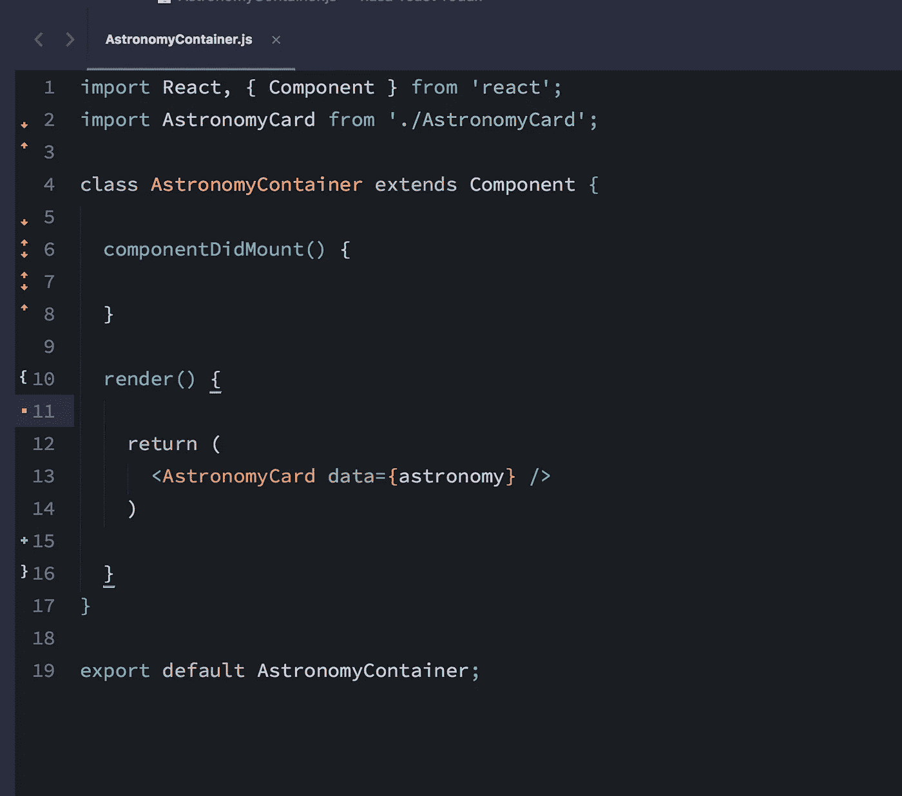

**src/components/astronomycontainer . js**

注意到我们清理了组件内部的所有`state`了吗？再也没有`this.state`了！

这正是您在 Redux 应用程序中想要的。

借助一个名为`connect()`的特殊函数，我们可以毫不夸张地用 Redux 连接 React。


**src/components/astronomycontainer . js**

从`react-redux`导入`connect`方法，并在底部导出该方法。`Connect()`接受两个参数— `mapStateToProps`和`mapDispatchToProps`。

*   `mapStateToProps`
    言出必行。它将 Redux 状态映射到 React props。
*   `mapDispatchToProps`将我们的 Redux 动作转化为 React 道具。

为什么我们在`connect`中的第一个参数是`null`？

`connect`方法期望传递一个`mapStateToProps`函数。但是我们还没有写出来。所以我们通过一个*临时* `null.`

## mapStateToProps

`mapStateToProps`是将 Redux 状态映射到 React 道具的特殊功能。在这种情况下，我们从容器中获取数据，并通过`props`将其传递给一个孩子。

## mapDispatchToProps

`mapDispatchToProps`让我们将我们的行动映射到`props`。在这种情况下，它获取我们的数据。


实现 mapStateToProps

这个函数返回一个对象。它将当前的`state`作为参数，并将道具从我们的减速器映射到`astronomy`。

我们在`src/reducers/index.js`里面有`astronomy`减速器。我们只是把我们的道具映射到它上面。

```
const rootReducer = combineReducers({
 astronomy: AppReducer
})
```

让我们测试一下`this.props.astronomy`是否工作。它应该显示一个空对象。

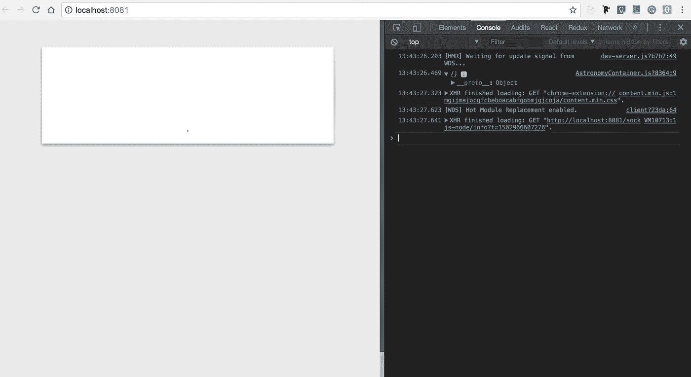

控制台记录我们的 this.props.astronomy

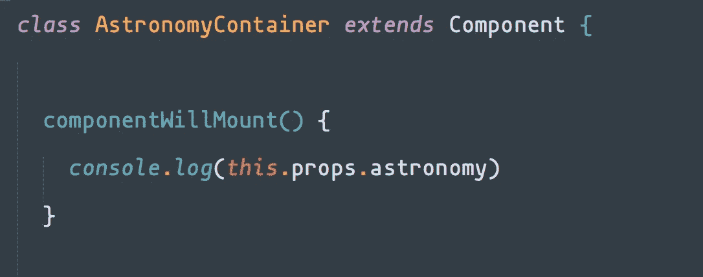

如果您不记得为什么它是一个空对象，也不要担心——Redux 在开始时非常强大。

事实上这很简单。还记得我们必须在我们的 reducer 中设置一个默认的`state`吗，我们将它设置为一个空对象。它返回的正是这个空对象，因为我们还没有做出任何动作。在这种情况下，它获取数据。

```
export default function(state = {}, action) {
 return state;
}
```

# 最后一步—实施操作(获取数据)

实现动作非常简单。

快速提醒:我们的动作位于`src/actions/fetch_data.js`中——文件中有一个名为`fetchData()`的函数，它执行一个`GET`请求。

为了调用我们的`action`并最终获取我们的数据，我们需要做以下三件事。

1.  从`src/actions/fetch_data.js`导入动作。
2.  将我们的动作作为参数传递给`connect`函数。
3.  调用 React `lifecycle`方法中的动作。这种情况下就是`ComponentWillMount()`。

好吧，我们开始吧。

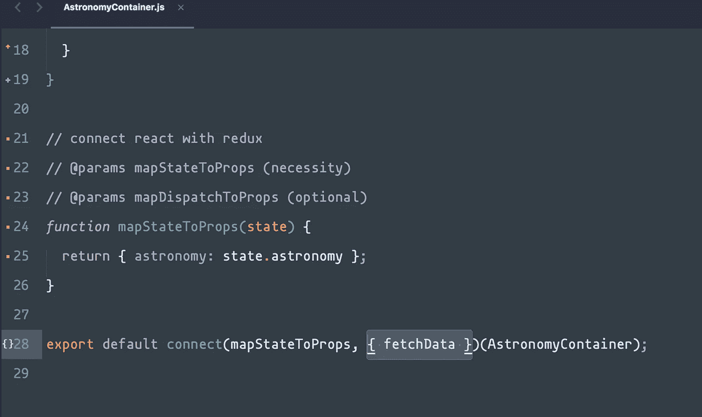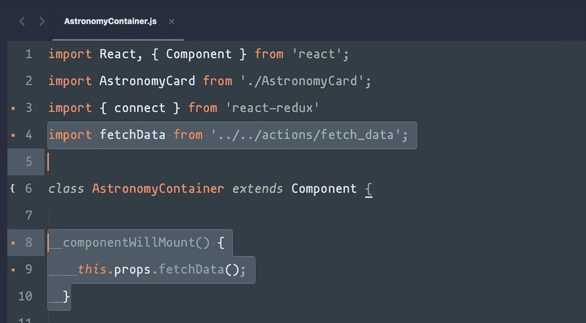

现在看看你的浏览器吧！

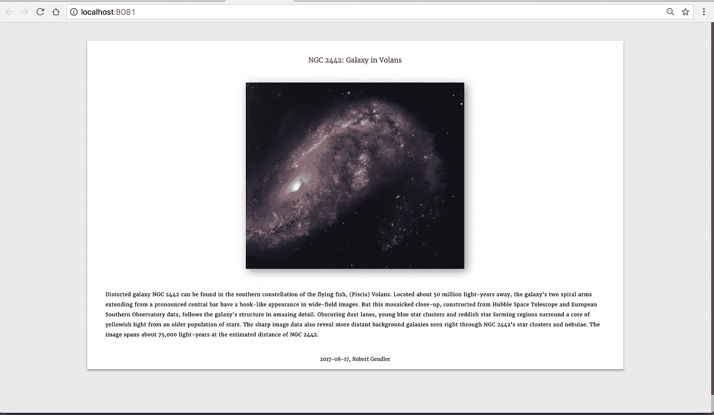

有用！你已经成功地使用 Redux 重构了你的应用。

注意到我们的 React 组件中没有`this.state`了吗？我们让 Redux 处理我们的状态！

谢谢你坚持到最后！你已经了解了 Redux、reducers、`Actions`、`Store,`、`Provider`、`Middleware`、`mapStateToProps()`、`mapDispatchToProps()`和`connect()`，同时构建了一个很酷的天文学应用程序。

如果你想让你的 JavaScript 能力更上一层楼，我推荐阅读“ [*你不知道的 JS*](https://amzn.to/2LSDpG6?source=post_page---------------------------) ”系列丛书。

# 资源

[](https://github.com/wesharehoodies/nasa-react-redux/tree/chapter-2) [## wesharehoodies/NASA-react-redux

### 导读:搭建一个 React + Redux 的 app。通过在…上创建一个帐户，为 wesharehoodies/NASA-react-redux 开发做出贡献

github.com](https://github.com/wesharehoodies/nasa-react-redux/tree/chapter-2) [](https://redux.js.org/basics/actions) [## 动作-重复

### 编辑描述

redux.js.org](https://redux.js.org/basics/actions) 

非常感谢大家的阅读，保持牛逼！❤