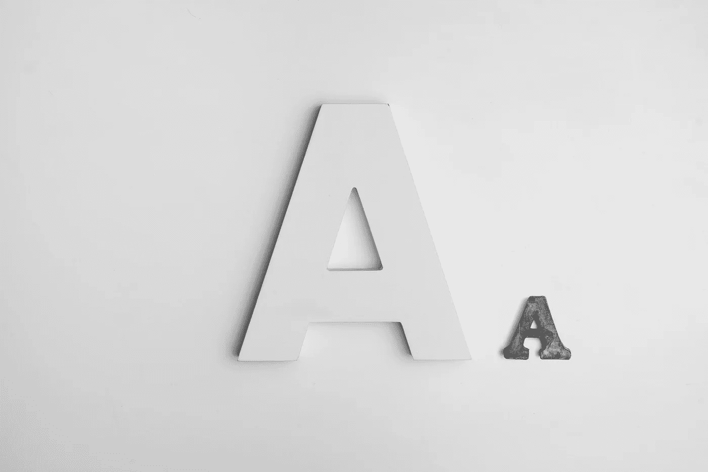

# 学习在 Flutter 中改变字体

> 原文：<https://betterprogramming.pub/learn-how-to-change-fonts-in-flutter-e3de592db5b3>

## 为你的 Flutter 应用程序挑选 1000 多种谷歌字体



亚历山大·安德鲁斯在 [Unsplash](https://unsplash.com/s/photos/fonts?utm_source=unsplash&utm_medium=referral&utm_content=creditCopyText) 上拍摄的照片

四年前，谷歌醒来后想，我们为什么不创建自己的多平台框架，然后带着它“飘起”去呢？

从那以后，Flutter 的受欢迎程度稳步增长，在接下来的三年里，它已经成为应用程序、桌面和 web 开发的首选。也许没那么快，但是这个框架肯定有很大的潜力。

为了表达你的个性，突出大众，自定义文本字体会有所帮助。在接下来的部分中，我们将创建一个显示不同文本字体的应用程序。

因此字体应分为五类:`SansSerif`、`Serif`、`Display`、`Handwriting`、`Monospace`，字体名称可复制。

此外，我将向您展示如何在到达列表末尾时加载更多的对象。以下视频展示了应用程序的最终结果:

Luciano Jung 在 Youtube 上的视频

# 介绍

在这篇文章中，我将向您展示如何在 Flutter 中更改文本字体，并为您提供一些最佳实践。对于实现，我们使用最新版本(2.1.0)中的`google_fonts`包，包括空安全。这支持 Android 和 iOS 应用程序以及 web 和桌面应用程序。

改变文本字体不仅可以帮助你脱颖而出，还可以提升你的品牌形象，改善你的读者体验。在下一节中，我们将逐步引导您在应用中实现上述结果。

# 准备

我们从代码准备开始。要实现下面的代码，您需要将`google_fonts`包集成到您的 Flutter 项目中。

在命令行中运行以下命令:

```
**$** flutter pub add google_fonts
```

这将向您的包的`pubspec.yaml`添加一行代码(并运行一个隐式的`flutter pub get`):

```
dependencies:
  google_fonts: ^latest_version
```

现在，在您的 Dart 代码中，您可以使用以下 import 语句来使用该包:

```
import 'package:google_fonts/google_fonts.dart';
```

# 履行

首先，我将向您展示如何将文本小部件的文本字体更改为 Flutter。为此，将一个`TextStyle`对象传递给文本小部件的 style 属性，您可以按如下方式创建它，并使用`copyWith`根据您的需要进行定制:

你可以在 fonts.google.com 找到所有可用的字体。

如果你想在 Android 手机上测试这段代码，不要忘记在你的项目的`AndroidManifest.xml`文件中添加下面一行:

```
<uses-permission android:name=”android.permission.INTERNET” />
```

你可以在`android/app/main/AndroidManifest.xml`下找到这个，直接写在:

```
<manifest xmlns:android=”http://schemas.android.com/apk/res/android" package=”com.example.package_examples”>
```

## **最佳实践建议**

一旦你决定了应用程序的文本字体，免费下载并保存在项目目录的`assets/fonts`下。

按照[https://flutter.dev/docs/cookbook/design/fonts](https://flutter.dev/docs/cookbook/design/fonts)的指南进行后续步骤。还可以用`google_font`包。这将始终使用本地可用的字体文件。如果离线时不可用，每次小工具初始化时，字体将从互联网下载。如果没有互联网连接，则使用默认的文本字体。

既然您已经知道了如何更改文本字体，现在是代码显示 UI 的时候了。

我们将创建一个`FontCard`小部件，可视化每种字体的标题、文本字体中的一个例句，并允许您复制文本字体名称:

要在点击图标时复制文本字体名称，需要以下功能:

接下来，我们想要创建一个包含所有 google 字体的列表。不幸的是，没有提供列出所有可用字体的 API。

实际的名单也很难找到。因此，为了允许选择多种字体，我选择了一些可用的字体，并把它们和它们的类别一起写在一个散列图中。类别本身被创建为枚举:

细心的读者可能已经注意到，有些变量还没有详细描述。我现在将弥补这一点。类别枚举看起来简单如下:

```
enum Category { SANSSERIF, SERIF, DISPLAY, HANDWRITING, MONOSPACE }
```

然后，应该在状态对象中声明以下属性:

*   `displayCount`指定要显示的`FontCard`小部件的初始数量
*   `TextEditingController`允许更容易地处理文本字符串
*   `filteredFontList`获取所有字体名称，用于类别过滤显示
*   `CategoryMap`将类别枚举分配给字符串
*   `googleFontMap`给每个字体名称分配一个类别

`MaterialDropdownView`是一个定制的小部件，其核心只是一个下拉按钮小部件。对于整个部件看[这里](https://github.com/lucianojung/flutter_package_examples/blob/master/lib/shared/material_dropdown_view.dart)。

上述项目的完整源代码可在 [GitHub](https://github.com/lucianojung/flutter_package_examples/blob/master/lib/packages/google_fonts/google_fonts_main.dart) 获得。

# 结论

我真的很喜欢编写这里介绍的应用程序，在某一点上，它将我推到了实现的极限。

因此，我更希望这篇教程对你们中的一些人的下一个项目有所帮助。`google_fonts`包是为你的应用程序尝试新字体的好方法，而不必先下载它们。

对于大多数 app 来说，不建议总是从网上下载字体。如果字体是本地提供的，你仍然可以使用这个包，但你不必这样做。即使没有`google_fonts`包，也可以使用你想要的所有文本字体，但是它简化了这个过程。

如需完整的示例应用程序源代码，请访问 [GitHub](https://medium.com/r?url=https%3A%2F%2Fgithub.com%2Flucianojung%2Fflutter_package_examples) ，附带的应用程序可用[此处](https://medium.com/r?url=https%3A%2F%2Fflutter-package-examples.netlify.app%2F)。

感谢阅读。