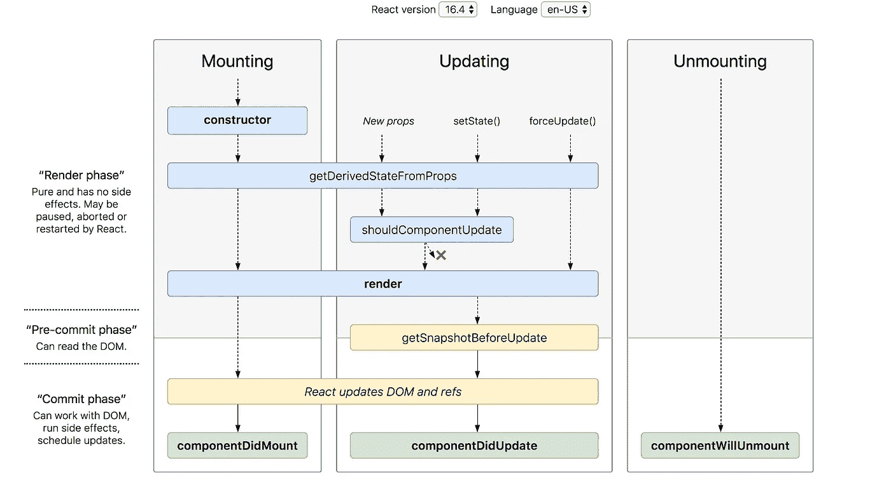

# 一个帮助你学习 React 的生命周期方法的类比

> 原文：<https://betterprogramming.pub/learn-reacts-lifecycle-methods-through-an-analogy-9fc82b990ece>

## 通过现实生活中的构造进行代码构造

[扬西·敏](https://unsplash.com/@yancymin?utm_source=unsplash&utm_medium=referral&utm_content=creditCopyText)在 [Unsplash](https://unsplash.com/s/photos/construction?utm_source=unsplash&utm_medium=referral&utm_content=creditCopyText) 上的照片

我一次又一次地看到学生们纠结于 React 生命周期方法，或者没有充分利用它们。虽然其中一些很难理解，但是学习如何使用它们还是很有好处的。在这个小指南中，我将用一个类比来解释 React 16 生命周期方法中的每一个。

# 背景:什么是生命周期方法？

生命周期方法是从组件第一次被调用时开始发生的事件，直到它从页面上消失(或者直到发生了[垃圾收集](https://javascript.info/garbage-collection))。这是完整的图表:

Wojtek Maj 的 [React 生命周期方法图](http://projects.wojtekmaj.pl/react-lifecycle-methods-diagram/)截图。

有些人把它比作生命的循环:出生、成长、死亡。然而，这种类比让我很难理解更具体的生命周期方法，所以我找到了一个替代方案:一家建筑公司。

# **类比:建筑公司**

让我告诉你一个建筑公司的故事，比如说，生命周期有限责任公司。每张图片和描述都将作为特定时刻或生命周期方法的类比，我们可以假设 React 是建筑公司。我们可以开始了吗？

## 步骤 0:调用组件

**类比:**万岁！今天，在 Lifecycle Buildings LLC，我们完成了一个新建筑项目。工程马上就要开始了！

来源:pexels.com

**说明:**在组件出现之前，它首先被它的父组件调用。例如，`MainContainer`由 App.js 调用，你可以在 render 的返回语句中看到它。

## 第一步:构造函数

**类比:**我们的建造者检查蓝图，以确定他们需要什么工具、材料和工作人员，他们需要订购的材料以及他们实际正在建造的东西。我们开始工作吧！

来源:[pexels.com](http://pexels.com)

**解释:**构造者先点火。它评估道具(类比中的工具、材料和人员)，创建初始状态(要订购的材料)并将函数绑定到类(这在 OOP JS 讲座中听起来应该很熟悉)。

## 第二步:渲染

**类比:**首先，你打下基础，搭建结构和脚手架。

来源:[pexels.com](http://pexels.com)

**解释:** Render 评估状态和道具，返回 JSX，然后被翻译成 DOM 节点(元素)并连接到回调函数。Render 需要表现得像一个纯函数(每次都需要产生相同的结果)，这意味着你不能在那里插入`setState`。如果这样做，您将进入重新呈现器的无限循环，因为状态的变化会使组件重新呈现。

## 步骤 3:组件安装

**比喻:**脚手架搭好了，大家高高兴兴地等着行动。

来源:pexels.com

**解释:**现在你的组件已经被勾画出来了，你可以做任何你想做的事情——尽情地抓取、设置状态或者启动定时器。你的应用程序不会崩溃，因为你有坚实的基础和结构来举办这种聚会！

## 步骤 4:shouldcomponentdupdate

**类比:**问题！与总部有些沟通不畅，他们今天送了太多的泡沫塑料卷。我们不需要它们，但目前我们没有更好的解决方案——我们还不如忽略它们，按计划开展我们的业务。

来源:[pexels.com](http://pexels.com)

**解释:** `shouldComponentUpdate`检查输入的道具和状态，然后给组件开绿灯，使其动作。在`method`定义中放一个布尔表达式。这将有助于组件决定是否是时候进行一次良好的重新呈现，或者是否应该只是放松一下，而不是用不必要的操作来危及应用程序的性能。

## 步骤 5: ComponentDidUpdate

**类比:**新机械终于从总部到了！现在我们可以改变内部的外观。

来源:[pexels.com](http://pexels.com)

**说明:** `componentDidUpdate`让您检查 `prevProps`和`prevState`是否与已经到达的不同。这意味着您可以设置一个跟踪器来检查 props/state 的特定值，如果找到该值，就会执行一个操作。当您的组件需要基于对属性/状态的特定更改而重新渲染时，此方法会很有用。

## 第六步:组件捕获

**类比:**有人替你把风不是很有帮助吗？这是鲍勃，我们的安全经理。鲍勃总是在一切崩溃之前做出反应。

来源:[pexels.com](http://pexels.com)

**解释:** `componentDidCatch`是当你的 app 崩溃时的神奇解决方案。例如，如果你试图映射一个不是数组的东西。这种生命周期方法会发现错误，而不是让整个应用程序崩溃，它会显示一个“出错了”的页面。

## 步骤 7:组件将卸载

**类比:** 50 年后，建筑不再有吸引力，将被摧毁。但首先，也许我们应该确定没人在里面。

资料来源:pexels.com

**解释:** `componentWillUnmount`这是您执行自动保存或结束任何异步进程的最后机会。

如果你想以一种更互动的方式探索这种类比，[我建立了一个怀旧的 2000 年代德国照片故事风格的页面](http://lifecycle-photostory.surge.sh/)。