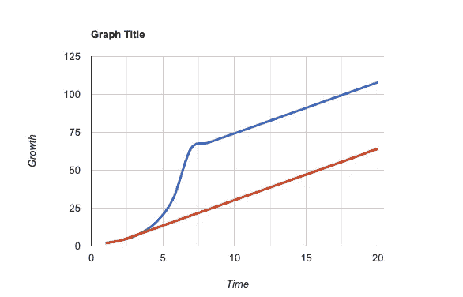

# 学习即投资:努力工作的真正好处

> 原文：<https://betterprogramming.pub/learning-as-investing-the-real-benefits-of-hard-work-fe82e6148a4e>

## 为什么要在职业生涯早期磨砺？


在 [Unsplash](https://unsplash.com?utm_source=medium&utm_medium=referral) 上由 [Garrhet Sampson](https://unsplash.com/@garrhetsampson?utm_source=medium&utm_medium=referral) 拍摄的照片

当你加入一个新的团队或公司时，你会受到一连串信息的冲击。一次吸收所有的知识是不可能的，但是你保留的知识量与你付出的努力成正比。以保守的速度入职有其优点，但我想在这里指出，投入时间和尽可能多的时间是值得的。

当我第一次加入谷歌时，我的导师注意到了我眼中的火花。我想写大量的代码，并学习如何构建面向数亿用户的生产质量的产品。作为一名新的初级工程师，我没有被会议拖慢或打断我的工作流程，所以我有很长一段时间专注于实验、提问、通读文档和现有代码。由于我的勤奋，我能够相当快地提升并在短时间内交付许多特性。

几个月后，作为我参与的轮换计划的一部分，我更换了团队。我渴望留下我的印记。我想尽快达到我在老东家时的效率。但是这次有些不同。我似乎学东西快多了。当转移到不同的产品时，我很惊讶有这么多开发人员技能转移。我的同事对我这么快就能提升感到惊讶。我的经理愿意测试我的能力，并给我一些非常有影响力的项目。在团队的第一年，我编写了团队 UI 框架的代码生成组件，甚至设计并实现了我们应用的缓存和网络层。

两年后的今天，我的影响力已经显著增长。我已经写了 1000 多条 PRs 和 130000 行代码。我仍然在写同样多的代码，同时还领导项目、写文档和指导新手。当然，有些地方我仍然需要成长和发展，但总的来说，我已经成为一名优秀的工程师。

我的导师很久以前就离开了谷歌，但我最近和他聊起了我作为新员工的表现。我们的理论是，我在任期开始时付出的巨大努力对我发展成为今天的高绩效员工至关重要。换句话说，早期学习的价值在我职业生涯的后期获得了巨大的回报。

这是一个有趣的理论，但很有意义。最后，作为一名软件工程师，学习新技能可以节省你的时间。我最近意识到时间是最宝贵的资源。一天只有 24 个小时，最大化生产力就是尽可能高效地利用这 24 个小时。开发技能越多，节省的时间就越多。例如，了解常见的软件开发模式、语法规则和开发工具或过程，可以节省您阅读文档或寻求帮助的时间和精力。最终，您会确切地知道如何修复常见的编译错误消息，这样您就不再需要浪费时间去寻找解决方案了。

我和无数的新毕业生一起工作过，见过各种各样的心态。他们中的一些人拥有和我多年前一样的激情，而另一些人则满足于随波逐流，慢慢来。毫不奇怪，更有雄心的雇员进步更快，发展成为杰出的软件工程师。向对学习和成长感兴趣的人提供指导更容易。他们会问一些深思熟虑的问题，有时甚至会挑战你的思维方式。任何渴望成功的人都应该得到成功的机会。

学习通常通过间隔重复进行。你尝试一些事情，失败几次，然后从你的错误中学习。你犯错误的次数越多，你从中吸取教训的机会就越多。最终，你犯这种错误的次数会越来越少，直到它很少发生。软件工程也是如此。对 PRs、堆栈跟踪和 bug 的注释只是我们从中学习的错误。你做得越多，这些重复就变得越紧，你就变得越好。重要的是你要集中精力，不要过度劳累。如果你一次承担了太多，又把太多的时间分开，你将一事无成。

这里有一个更好的思考方式。把你的职业想象成一场马拉松。如果你在职业生涯开始时加速很快，你会比那些加速较慢的人在更短的时间内走得更远。一个重要的警告是，如果你的加速度变为零，那么早期加速度的好处就没有意义了。继续你的增长至关重要，即使保持同样的速度对你来说是不可行的。你能做的最糟糕的事情就是停止成长。即使你还没有开始你的职业生涯，迟做总比不做好。这里有一些展示这一理念的图表。


图 1



图 2

图 1 显示了正加速度与恒定速度的关系。即使加速在未来放缓，线之间的图形将继续增长。这个原则类似于为什么投资的回报总是远远高于储蓄账户。

图 2 显示了加速度为零的危险。最终，两条线达到恒定速度，导致它们之间的间隙保持恒定。虽然差距仍然存在，但随着时间的推移，它变得不那么重要了。这些值之间的比例差异会随着时间的推移而缩小。如果红线加速，它很容易超过蓝线。

同样重要的是，你要发现自己在做正确的工作。很容易最终从事对你成长没有帮助的项目，尤其是当你没有太多经验的时候。一个好的项目应该是可行的，但足够具有挑战性，能让你走出舒适区。新团队成员通常对他们从事的工作没有太多选择。你可能需要展示你有能力交付大的、有影响力的项目。做更大更好的事情是确保你继续加速的好方法。

# 小心倦怠

就像生活中的一切一样，平衡至关重要。努力工作和过度工作之间只有一线之隔。给自己太大压力会导致长时间的倦怠，最终对你的职业生涯伤害大于帮助。精疲力尽是一件棘手的事情，因为在伤害已经造成之前，你通常不会意识到它正在发生。花太多时间工作是导致倦怠的最常见原因之一。虽然我鼓励新毕业生多做些努力，但更重要的是要明确工作的界限，以避免压力过大。

没有一个放之四海而皆准的方法来避免精疲力竭。每个人都有极限，不先撞上是没办法找到的。你能做的最好的事情就是积极主动地意识到它何时开始发生在你身上，并采取措施防止它变得更糟。

我这么说是因为我自己肯定也经历过几次精疲力竭。导致它的症状和事件总是相同的。我渴望得到认可和影响，所以我接了越来越多的工作。最终，我咬下超过我能咀嚼的东西；避免溺水的唯一方法是延长我的工作时间，让我只想坐在电脑前。我一离开办公桌，工作就占据了我的思想。它变成了一种困扰，让我夜不能寐。迟早我只是崩溃，我需要休假什么的来排毒。总之，我成了自己野心的牺牲品。我承认，随着时间的推移，我的角色会逐渐适应，在保持可持续的工作与生活平衡方面，我还有很多东西要学。

# 结论

职业成长是马拉松，不是赛跑。但是尽可能有一个好的开始还是很重要的。你所要做的就是在第一次开始的时候多付出一点点，你会在未来的几年里受益。你应该总是以某种速度加速你的进步。尽一切努力避免停滞，但不要超越自己的极限。我希望这有所帮助。感谢阅读。

```
**Want to connect?**If you aren’t already, follow me on [Twitter](https://twitter.com/allegretti813)
```