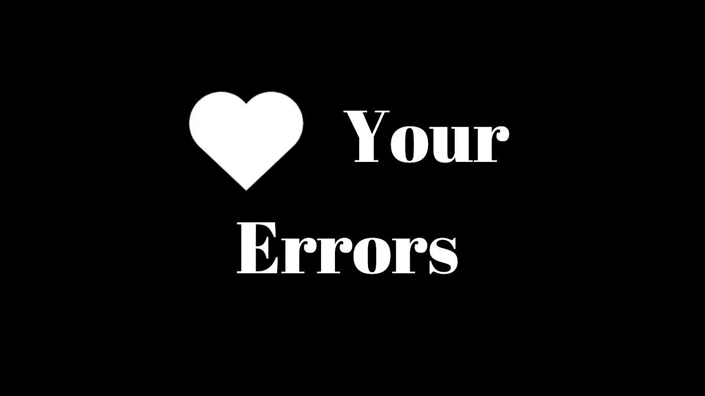

# 学习编码？爱上错误

> 原文：<https://betterprogramming.pub/learning-to-code-fall-in-love-with-errors-e502ed4b4624>

## 不要害怕错误。当你接受失败时，你会成为一个更好的开发者

作者照片。

# 编码可能会令人沮丧

我来分享一个个人故事。我第一次开始编程是在 14 岁的时候。我喜欢玩电脑游戏，所以我认为创建它们是自然而然的下一步。对于一个习惯快速学习的书虫来说，学习编码似乎没什么大不了的。于是买了一本关于 C++的书，下载了一个文本编辑器，开始编码。

我的第一个应用程序大约有十行代码。没用。我忘了那几行中有三个分号。我有点沮丧，修复了错误，重新运行了程序。又死机了。这一次，出现了错别字。我花了将近一个小时才让一个微不足道的应用程序工作起来。

我坚持写了大约两周的代码。我无法承受一次又一次失败的挫败感。仅仅因为一些错别字和丢失的分号，我花了十多年的时间重新尝试编程。

在 [Unsplash](https://unsplash.com/collections/9826757/learning?utm_source=unsplash&utm_medium=referral&utm_content=creditCopyText) 上[杰克森煨](https://unsplash.com/@simmerdownjpg?utm_source=unsplash&utm_medium=referral&utm_content=creditCopyText)的照片。

# 事情总是出错

我现在编程五年了，有了一些进步。尽管如此，我还是几乎每天都被困住了。问题是，编程很难。众所周知，任何可能出错的事情都会出错。这只是时间问题。

对于程序员来说，错误代码是一种自然状态。无论是嵌套异步代码中的某些未处理的错误，还是分号的丢失，错误总是会发生。

# 改变你的视角

作为一个有抱负的开发者，你必须为无数的挫折做好准备。你别无选择，只能与失败为友。正如一贯正确的[塞缪尔·贝克特](https://www.brainyquote.com/quotes/samuel_beckett_121335)所写:

> “试过了。曾经失败过。没关系。再试一次。再次失败。失败得更好。”

尽管 Beckett 可能有一些悲观的想法，但这句话对初学者来说是一个很好的建议。

但是我知道不应该认为一句鼓舞人心的话就足以让你相信失败是可以接受的。所以我将展示你如何喜欢错误，或者甚至通过思维方式的转变爱上它们。

在 [Unsplash](https://unsplash.com/s/photos/perspective?utm_source=unsplash&utm_medium=referral&utm_content=creditCopyText) 上由 [Nadine Shaabana](https://unsplash.com/@nadineshaabana?utm_source=unsplash&utm_medium=referral&utm_content=creditCopyText) 拍摄的照片。

以下是对待错误的一些常见态度，以及如何重新定义错误的建议。

## “那个错误是愚蠢的。”

也许吧。有些错误是愚蠢的。但是有人把它们放在那里给你作为一个线索，告诉你哪里出错了，或者可能出错。错误是为了让你理解发生了什么，它们通常伴随着有用的建议。

想象一下现实生活中的错误消息。例如，你的伴侣似乎对你很生气，但你不知道为什么。由于出色的错误实现，您会收到一条文本消息说，“429 太多请求。”现在你知道她只是累了，所以你应该试着去帮忙，而不是想自己做错了什么。那不是很有帮助吗？

## “又一个错误？这就够了。”

我相信你知道这种感觉。你花了很多时间来修复一个错误。现在代码*已经让*工作了。而且很管用！但是下面两行…又有一个错误。看起来你陷入了新错误的无尽循环中。

但这是一件坏事吗？这是一个新的错误。一个扩展你知识的独特机会。只要你的错误在改变，你就在进步。如果你失败了，你会学到一些东西。当你的代码完美时，你就在你的舒适区，什么也学不到。

所以尝试不同的方法。下次你遇到一个全新的错误时，对自己说，“真有趣。我以前从未见过这种错误。”让我们看看你能以这样的心态实现什么。

## “那只虫子很硬。我先说点别的。”

这是一个棘手的问题。你可以很容易地说服自己，用一些简单的东西热身，然后进入真正的业务是合理的。但是要小心——也许你只是想拖延时间，避免另一次失败。

当你休息好的时候，你有最好的机会取得突破。试着从最具挑战性的任务开始。失败了也不用担心。至少你可以学到一些新东西。

## "我在那个错误上浪费了三个小时，但毫无进展。"

那又怎样？没人受伤。你只是“浪费”了一些时间。但是你真的浪费了吗？也许你只是学到了一些东西。

现在你知道有些方法不起作用了。如果你幸运的话，你甚至可能知道什么是可行的。你就是这样进步的。拥抱失败，以失败为食。

此外，想象一下当你最终解决问题时的满足感。为你的成就感到骄傲。

## “我厌倦了这个。我需要休息。”

这一个是多产的。如果你陷入困境，休息一下通常是个好主意。试着散散步，和同事聊聊天，或者做任何有助于你重新开始的事情。在你休息的时候，问题不太可能变得更严重。

我有一个额外的建议:如果你已经休息了，仍然不能解决问题，试着在睡觉前解决它。你可能认为你睡觉时大脑在休息，但实际上，它在努力工作。所以你很有可能在醒来后就有了解决方案。