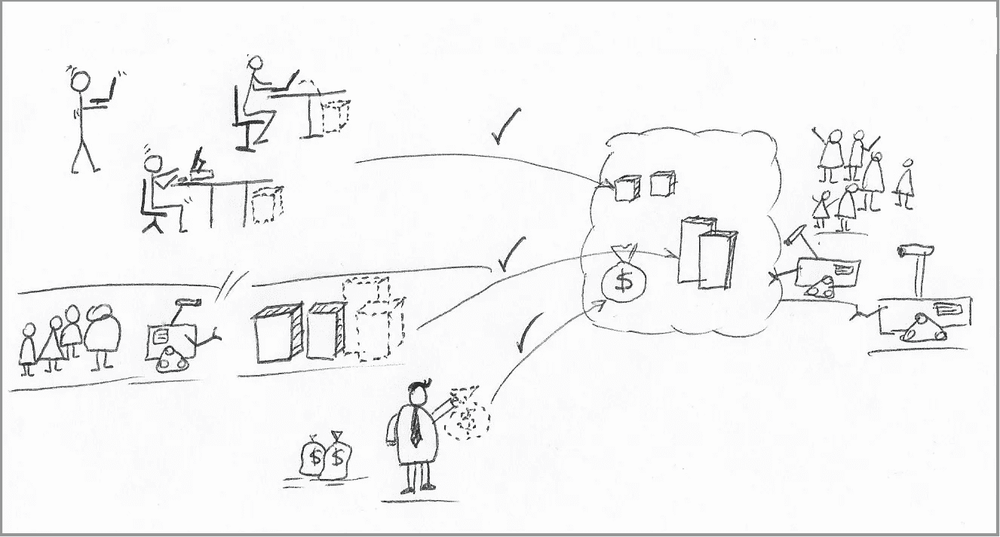

# 你要离开云了吗？

> 原文：<https://betterprogramming.pub/leaving-the-cloud-ad816640d5c3>

## 为未来的长途旅行做好旅行准备。

在从内部迁移到云以及迁移回来的过程中，核心利益相关者是开发人员、操作人员和财务人员(包括产品经理)。)

云支出总是一个令人兴奋的话题，我的意思是以错误的方式令人兴奋。

金钱是一个敏感的话题。当人们感到可能会失去对预算的控制时，他们会感到紧张，这是可以理解的。但是，当你花钱买的东西看起来不像以前的东西时，你如何控制预算呢？

人们会对看似无上限的每月开支感到焦虑。**运营**人们对越来越多的预算用于租赁云容量感到失望。

夹在两大阵营之间，我们发现**的开发者**越来越依赖云计算。新的用例依赖于产品设计和运行时的核心部分——有时是不可替代的。请在阅读过程中密切关注这群利益相关者，因为[他们的行为最终颠覆了云的采用轨迹](https://redmonk.com/sogrady/2010/09/09/the-new-kingmakers/)。

这个故事是关于我们在进入云采用的下一个阶段时需要了解的内容。

这个新阶段可能是许多人第一次接触云，让我们快速回顾一下我们是如何进入云的。这个回顾也帮助我们更好地理解[“离开云”](https://world.hey.com/dhh/why-we-re-leaving-the-cloud-654b47e0)运动的警笛歌。

# 第一波:资源整合

与此同时，第一波向云的迁移也是开拓性的、直截了当的。这是一个“基础设施即服务”的时代

为了后面的孩子们的利益，到目前为止，每个公司都运行着他们的数据中心，软件开发人员在他们的办公桌下运行着虚拟基础设施的地下秘密。*“通宵清洁工被电缆绊倒”*是构建失败的合理解释。

服务器逐渐从开发人员的办公桌转移到内部数据中心。一旦经过整合和折旧，服务器容量就会慢慢跨越法规和技术壁垒，进入“云”上的远程数据中心

**开发人员**并不关心迁移，只要他们仍然有计算能力的终端，只要那些计算机运行他们选择的操作系统。如果我们诚实的话，那些个人服务器在拙劣的升级后可能会很分心，经常花费整个早上甚至几天来重新加载。

人们在一个舒适的环境中实现了转型。他们可以故意将本地托管容量的现状成本与云提供商的估计进行比较，然后批准有利的权衡。与此同时，云提供商小心翼翼地将价格保持在神奇的阈值之下，在这个阈值之下，数学一直是有意义的。

**运营**人们看到服务器和电缆逐渐从他们的数据中心消失。像搬运机架和铺设电缆这样的体力劳动几乎消失了，但是管理由此产生的基础架构仍然像以前一样复杂。当企业需要新的计算机或网络路径时，运营人员使用云管理控制台来复制这些请求。尽管如此，他们仍然需要牢牢掌握配置服务器、分配存储和打造各方之间的安全通信路径。他们能够将精力重新集中在核心任务上，并且看不到对工作安全的直接威胁，他们也欢迎这种转变。

在第一波云迁移中，物理服务器转向云提供商，每个人都欢迎这种变化。

# 第二波:外包中间层

[中间件](https://en.wikipedia.org/wiki/Middleware)，也被称为“粘合软件”，位于实现特定领域逻辑和基础设施的层之间，因此是名字的“中间”部分。

数据库管理器、事务管理器和消息服务器是中间件的经典例子。这个功能过去是(现在仍然是)通用的，但是实现非常复杂，价格也不一样。

除了许可成本之外，还有负责部署、运营以及最后但并非最不重要的七头怪兽[数据管理](https://en.wikipedia.org/wiki/Data_management)的必要人员的成本。

由于中间件在移动和存储业务数据中发挥着核心作用，在法律部门开始向客户发送令人尴尬的信件之前，几乎没有什么即兴发挥的空间，因此在运营预算中也没有什么偷工减料的空间。

只有少数大公司(或大公司中的项目)的部署规模足够大，足以证明拥有一批专门从事特定中间件技术的工程师是合理的。

除了那些运行自己的应用程序的大公司之外，只有一小部分公司能够达到并超过必要的运营规模:云提供商。

这些提供商再次跨越了监管障碍( [HIPAA](https://www.cdc.gov/phlp/publications/topic/hipaa.html) 、 [GDPR](https://gdpr-info.eu/) 、 [SOC](https://resources.infosecinstitute.com/topic/overview-understanding-soc-compliance-soc-1-vs-soc-2-vs-soc-3) )和技术限制，使托管中间件服务成为现实。

开发人员仍然负责数据架构、建模和处理。由于业务逻辑已经在远程运行，谁的服务器在为应用程序运行中间件并不重要。只要性能相当，系统界面(主要是操作系统界面)保持稳定，开发人员就会很高兴。

**运营**可能觉得这一波有点不同，因为它带走了他们的一些责任。高可用性、弹性、存储管理、数据安全性和灾难恢复都消失了。这些过去是(现在仍然是)需要专业人员的复杂活动，并且不再需要类似数量的现场服务。

为了向不熟悉操作中间件的人说明这一点，工程师花费相当于数人年的时间编写定制的自动化过程来部署和管理一对高可用性数据库服务器的情况并不少见。

**金融**人们也可能在这个阶段更加挣扎，因为这意味着资金从运营人员转移到服务部门。虽然经理们可能不关心服务器在哪里运行，但裁员是一个更加敏感的话题。

在下一次迁移浪潮中，中间件服务将迁移到云中。运营团队失去了一些人，更多的预算转向了云服务。

# 第三波:集装箱化时代

随着基础设施和服务稳固地位于云中，下一个抽象是在基础设施中打包和运行代码。 [Heroku](https://www.heroku.com/) 和 [Pivotal](https://www.cloudfoundry.org/) 为应用程序建立了“推送-运行”的概念，为流行的中间件(如 PostgreSQL、MongoDB 和 Redis)利用了少量托管服务产品。

然而，真正的赢家出现在 2016 年左右，在 Docker 和 Kubernetes : [**容器**](https://www.docker.com/resources/what-container/) 之间的容器编排[战争中。](https://www.atlassian.com/microservices/microservices-architecture/kubernetes-vs-docker#:~:text=While%20Docker%20is%20a%20container,CRI%20(Container%20Runtime%20Interface).)

事实证明，对于运输应用程序来说，虚拟机是一种既浪费又笨拙的打包格式。另一方面，容器解决了浪费和包装问题，同时对于关心它的开发人员来说，它看起来仍然足够接近操作系统。

一个伴随的发展是容器图像注册服务和持续集成(CI)服务的新兴产业的激增。这些 CI 服务也构建在容器之上，具有基于容器的编排( [Tekton CD](https://tekton.dev/) )和基于容器的映像创建( [Buildah](https://buildah.io/blogs/2017/06/22/introducing-buildah.html) 、 [Buildkit](https://docs.docker.com/build/buildkit/) 、 [Podman](https://podman.io/) 等。)

在这个阶段，容器成为开发、构建、打包和执行的事实单元。如果有人问云是如何工作的，你可以合理地将其描述为一堆运行在容器之上的[容器，一直到](https://en.wikipedia.org/wiki/Turtles_all_the_way_down)。

集装箱集装箱集装箱。应用程序、中间件、持续集成管道、持续部署、运行时引擎、打包。一切都是容器。

在一旁，我们也看到了 FaaS 阵营的一些进步，主要是作为托管服务的事件处理程序。虽然 FaaS 也可以处理其他异步事件，但它的开发和打包模型明显不同于现在占主导地位的容器模型。随着可以处理许多相同事件的容器服务的扩散，FaaS 的采用仍然是一个相对小众的实践。

当我们从利益相关者的角度来看这个阶段时，我们仍然看到**开发人员**或多或少地没有受到另一个重大转变的影响。对于开发人员来说，容器仍然提供了类似于操作系统的运行时和文件系统接口，所以应用程序代码实际上没有变化。

容器还解决了对作为托管服务不可用的服务器端组件的[提升和转移](https://www.ibm.com/cloud/learn/lift-and-shift?mhsrc=ibmsearch_a&mhq=lift-and-shift#toc-what-is-li-LDeKd9hn)场景的不断发展的需求。最后，标准化的打包和运行时格式允许相同的软件几乎不加修改地在本地和远程机器上运行。从本地到远程环境的无缝过渡意味着本地开发循环和生产环境之间更紧密的结合。这并不是说开发商对这股浪潮漠不关心；他们为此欢呼。

对于**运营**的人来说，这一波感觉很不一样。应用程序运行时所熟悉的操作系统界面消失了，他们需要重新调整他们的实践。每个操作手册、故障排除、日志管理、监控和部署程序都必须重新访问、重新布线或重写。现在，每个有意义的应用程序管理任务都发生在容器层。

新进入者重新定义了基础设施和平台管理的供应商场景，在一个没有现有产品和遗留产品维护成本的环境中轻松前行。IT 工具发展的一个关键方面是服务产品的多样性和能够处理大型系统操作负载的相当复杂的开源项目。运营团队可以创建内聚的管理平台，这在过去是不可想象的。

对于金融人士来说，这是第一波感觉截然不同的浪潮。预算项目看起来有所不同，更换在前两次云迁移浪潮中幸存下来的老化硬件的请求减少了。另一方面，运营和开发部门需要订阅新的 SaaS 产品，并渴望获得其云提供商的服务实例。

试图通过严厉的控制来遏制预算适得其反，内部[平台工程](https://platformengineering.org/blog/what-is-platform-engineering)团队被运营和开发团队需求的指数级增长所压垮。

突然之间[运营支出](https://www.investopedia.com/terms/c/capitalexpenditure.asp#toc-capex-vs-operating-expenses-opex)变成了新的[资本支出](https://www.investopedia.com/terms/c/capitalexpenditure.asp#toc-what-are-capital-expenditures-capex)。

# 一个新家。有了新的架构。

在我们回顾内部部署之前的另一站，让我们停下来了解一下在经历了之前的云迁移浪潮之后，行业处于什么位置。

我挑选了几个突出的类别，并概括了如果今天从一张白纸开始一个新的架构，人们可以考虑的艺术状态:

**运行时:**运行在裸机服务器上的本地应用让位给了虚拟化硬件，随后是运行在 Kubernetes 或托管容器服务上的**容器**。**函数**为应用程序需要处理来自托管服务的事件的用例提供了完整的描述。

**打包** : [容器映像](https://www.techtarget.com/searchitoperations/definition/container-image)成为应用程序和中间件事实上的分发格式，使得容器注册和构建服务成为软件开发过程中不可或缺的一部分。像 [npm](https://www.npmjs.com/) 和 [maven central](https://mvnrepository.com/) 这样的包管理器仍然是容器构建中非常需要的。

**持续集成(CI)** :围绕容器映像的标准化遍及所有构建管道供应商。开发人员希望 CI 工具能够为构建容器映像提供本地支持，最好是从包含`[Dockerfile](https://docs.docker.com/engine/reference/builder/)`的 Git 存储库的 URL 开始。

**架构**:云中的规模经济为各种中间件产品提供了商业案例，这在以前是不可能的。云提供商吹嘘拥有数百种服务的服务目录。许多产品都是“云原生的”(只能通过云提供商获得。)因此，新的软件架构包含了十年前不存在的功能。在没有理由考虑最终转向内部部署的情况下，许多架构现在包括“长尾”服务，这对于没有大规模经济的单个公司来说成本过高。

**预算**:减少内部基础设施和服务占用意味着将资本支出转化为运营支出。对基于云的服务的日益依赖意味着开发人员和 CI 渠道对云资源有了新的渴望。连续交付模式越来越依赖于多阶段管道(开发/测试/阶段/生产/其他)，进一步增加了资源消耗。如今，运营团队监管的基础设施和服务规模大大缩小，技能的规模和广度都被削弱了。

在从基础设施到服务的连续迁移浪潮之后，从云返回的旅程是一个未知的进步，而不是沿着老路返回。

# 旅行前检查你的(发票)行李。

(我保证这是查看内部旅程之前的最后一站。)

任何管理大型云客户的人都知道(或者应该知道)不同的成本模型适合不同的使用模式。

简单回顾一下，让我们看看主要云提供商最常见的定价模式。请注意，云客户可以针对客户内部的不同资源组合不同的定价模式。

*   **现收现付**:在计费周期内为实际使用支付可变月账单。就单位时间(通常是小时或秒)的成本而言，这种模式是最昂贵的，但也是最灵活的。
*   **预付费/订阅**:为服务包支付固定的月(或年)费。在计费期间，您何时消费合同服务并不重要。如果您在此期间需要超出合同套餐的更多服务，您必须支付更多费用。
*   **保留实例:**顾名思义，您可以预定资源能力，通常是在相对较长的期间内，例如 1 年或 3 年。当你需要的比预定的多时，你要为超额消费支付更高的时薪。

**Spot instances:** 您从一个备用容量池中请求计算容量，以获得显著的小时费率折扣。需要注意的是，云提供商可能会在短时间内(通常是几分钟)收回计算实例。)

在进入下一部分之前，我假设想要离开云的人已经深入研究了他们的账单、使用历史和用例，以做出简单的成本节约决策，例如:

*   分配**预留容量**用于长期需求，而不是使用更昂贵的按需容量。
*   对低容量操作使用按调用计费的服务(**功能或容器即服务**)，而不是闲置(并支付)预留容量。
*   与客户经理合作获得**基于数量的折扣**。
*   将 **spot 实例**用于可以容忍中断并且不需要严格服务质量的工作负载——对于 Kubernetes 商店，请查看我在[使用 spot 实例自动扩展工作负载](https://dnastacio.medium.com/running-knative-services-on-aws-spot-instances-5b73202e89dc)上的帖子。
*   聘请专业的**云成本管理咨询公司**。在许多情况下，他们的服务可以在几个计费周期内节省成本。

遵循这些步骤后，您可能仍然觉得您的云账单太高，并决定一头扎进下一部分。然而，这种迁移无疑需要一段时间。在你的组织经历这个过程的时候，每个月少花点钱也无妨。

# “就是它了！我们要离开云了！”

当世界上几乎每个公司都有云足迹时，孤立的意见很快形成暗流。暗流是使用云资源已经变得过于昂贵。

最近，Basecamp 通过这篇关于离开云的博客文章重新点燃了(或者帮助凝聚了)争论。你可以收听《T2》播客的第三集，了解更多即将到来的离别的背景。

然而，发布和播客都需要更多关于其当前和未来系统架构的细节。

*“你说未来系统架构？”*

是的。架构和成本是密切相关的。我不知道 Basecamp 此举背后的技术细节。尽管如此，他们仍在谈论削减使用 AWS RDS(数据库)和 es(搜索)等服务的成本，因为他们需要找到替代品。

开发、运营和产品经理必须一起旅行并到达他们返回本地部署的旅程。

从云到内部部署从来没有一条笔直、畅通无阻的道路。以下是这条道路上的陷阱和顾虑:

**网络出口成本**。云提供商会很乐意将你的数据发送到他们的场所，但除了少数例外，他们会收取检索数据的费用，通常是按量收费。换句话说，您需要注意混合拓扑，在这种拓扑中，一个本地组件不断地从仍然托管在云上的组件中提取大量数据。这些混合拓扑中的一些甚至可能是无意的，重新托管的组件突然需要与仍然托管在云提供商中的组件进行更多的同步检查。

**操作技巧**。在内部引入任何基于云的服务之前，请咨询您的运营团队，了解这些技能在团队中的可用性。

无论系统管理员有多无聊，重复和专业化都是生产力的支柱。重复导致自动化，专业化导致深厚的专业知识。高级工程师的工作效率比那些没有技术经验的人高几倍。

对于许多学科，比如数据库管理，技能差距不仅仅是表现差异。低于某个阈值，整个组织开始冒着灾难性的邓宁-克鲁格效应的风险，他们对这个学科充满信心。直到第一次停电。

操作人员的分散覆盖了根本不同的技术，削弱了重复性和专业化，同时由于更频繁的环境切换而增加了总体压力。

**运行时规模不足**。一些基于云的服务只有在超过临界规模阈值后才有财务意义。有些服务的盈亏平衡点可能是几十个或者几百个客户。它很少是少数，或者更糟，一个。

在最好的情况下，您可以通过部署支持云服务的相同中间件(如 MongoDB 或 PostgreSQL)来跳过 R&D 成本。)最坏的情况是，该服务是专有的纯云服务，比如语音转文本。

即使在最好的情况下，运行 PostgreSQL 实例的小型集群，无论负载有多轻，仍然需要许多固定成本的基础设施配置步骤。在初始配置之后，还有“第 2 天”的活动，例如自动化升级周期、备份过程、治理、配置管理等等。

**经营规模不足**:本题结合了前两者。运营团队在“水平方向”(同一技术的较大规模)上比在“垂直方向”(多种技术的较小规模部署)上扩展得更好。)

我讨论了重复和专门化的方面，但忽略了待命时间表。24x7 随叫随到轮值的典型基线数字建议团队由 6-8 人组成，实际数字取决于平均工作量和换页的性质。

该基线假设轮值人员同样有能力处理最终的停机。你不会发现很多人能够同样地修复操作系统深处(比如一个分离的磁盘)和中间件栈高处(比如一个消息传递死信队列变满)的东西。)

运营领导者一个令人不安的常见错误是在确定待命轮换规模时忽略系统可以生成的警报总数——我在本文的[中讨论了待命的压力来源——压力的主要来源之一是不确定是否拥有处理这种情况的技能、工具和支持。内部各种服务的快速增长是传呼无法解决问题的人的处方，并破坏了现有待命安排的有效性。](http://sourcepatch.blogspot.com/2021/09/asking-wrong-question-should-developers.html?view=magazine)

一个常见且有些站得住脚的反驳观点是，云服务仍然需要运营团队，在内部重新托管服务不应该增加工作量。诚然，托管服务仍然需要操作程序— *如果云实例 X 需要配置变更，该怎么办？云服务 Y 宕机怎么办？* —技能的多样性和复杂性在技术上比管理服务要求更低。当一个数据库实例突然从云中消失时，您需要能够在支持单中描述问题的人，而不是该服务器技术的专家。

这并不是贬低熟练操作员的重要性。人们会惊讶于[开一张好票](http://www.rtpscrolls.com/2012/10/what-is-your-problem-part-1-of-2.html)需要多少经验和技巧。

简而言之，作为一个现实检查，您的随叫随到的轮换将需要更多的人，与产品架构中的服务数量成近似线性的比例。

系统管理员可能很难重建他们的 IaaS 和 PaaS 实践，以托管与典型云提供商相同级别和多样性的服务。而且不一定成本更低。

# 结论

离开云同时也是一个财务和技术决策。内部备用容量仅考虑财务方面，无论是人员还是硬件方面。

在进行任何移动之前，考虑立即节省成本，例如对相同的资源使用不同的分配方法，以及尽可能利用自动扩展功能。对于 Kubernetes 商店来说，[集群自动扩展和 Knative 组合](https://dnastacio.medium.com/running-knative-services-on-aws-spot-instances-5b73202e89dc)可以有效地减少产能浪费。

最重要的是，考虑移动的总成本，而不仅仅是硬件成本。有时使用[甚至更多的云服务](https://dnastacio.medium.com/are-you-spending-too-much-on-kubernetes-179d703ec5c5)可能会降低系统的总拥有成本，解决以下许多问题:

*   系统架构师可能需要为纯云服务寻找替代方案。这需要花费时间来改进产品。
*   开发人员可能需要卷起袖子，编写一些替代方案。这花费了构建新功能的时间。
*   运营团队可能需要增加人员并创建全新的程序(手动或自动。)这可能是一项巨大的努力。
*   随叫随到的时间表可能需要额外的人来支持，以应对页面调出的增加的多样性和复杂性。这一项应该是最难克服的。

我对这种类型的迁移背后的数学(和架构结果)很好奇，在这一点上很少有正式的研究。请在评论区分享你的经历和知识。

**如果你喜欢这个故事，你可能会喜欢另一个关于云计算的故事。**

 [## 你在 Kubernetes 上花费太多了吗？

### 可能吧，是的。

better 编程. pub](/are-you-spending-too-much-on-kubernetes-179d703ec5c5)