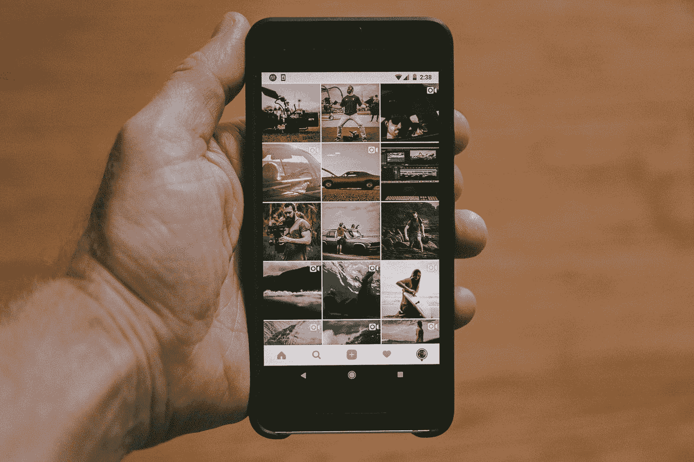

# 我们从使用 React Native 构建应用程序中学到的经验和技巧

> 原文：<https://betterprogramming.pub/lessons-and-tips-we-learnt-from-building-react-native-app-48acb744e76c>

## 结构至关重要


杰夫·谢尔登在 [Unsplash](https://unsplash.com?utm_source=medium&utm_medium=referral) 拍摄的照片

根据我在 Reddit 上创建的一个帖子，我决定写一篇更详细的文章，介绍我和我的团队从我们为客户开发 React 原生应用的经验中学到的一些技巧和教训。希望这能对其他注册护士派上用场！

关于我:我已经在摩洛哥的一家软件公司工作了几年。我们帮助初创公司在网络和移动平台上推广他们的早期技术产品。我们开始采用 React Native 作为我们移动开发服务的主要技术，从那时起，在由 3-4 名 React 开发人员组成的团队的帮助下，我们已经能够向商店发布 4 款基于 RN 的应用程序。

在本文中，我将只关注与 React 本机相关的内容——React 或 JavaScript 建议可以在许多其他文章中找到。例如，我不会谈论 IDEs、beautiier/ESLint、Redux 或 React 生命周期相关的最佳实践。

说了这么多，开始吧。

# 包维护和管理

为发布而设计的应用程序可能有很长的寿命。

新版本、修复漏洞和维护可能需要数月甚至数年时间。在此期间，您正在使用的一个或多个包发生了重大变化，或者您的一个依赖项变得过时或不再维护，这是很常见的。

因此，无论是在开发阶段还是在发布到商店之后，为了让您的应用程序不仅保持活力，而且在性能和稳定性方面更好，让您的`package.json`保持最新是至关重要的:

*   花点时间(每个月左右)去**探索你的依赖项的不同 GitHub repos，**读 changelogs，检测这些包是否有性能上的优化或者大的改进。还有，注意版本冲突。
*   一个没有活动库的库(没有最近的拉请求或变更)，不是一个好的迹象，特别是在 RN 中。**总是检测旧的库，**并且寻找一个替代库，除非这个库做简单的事情并且不需要维护。
*   **不要同时更新或安装多个软件包。**只安装一个，测试一下，确保一切正常，然后等一会儿。喝一杯咖啡，再次测试——一些野生虫子在第一次测试中没有出现。

**注意:**如果你使用 GitHub，你可以集成[dependent bot](https://dependabot.com/)来自动化你每个月的依赖更新。例如，它为每个包更新创建一个有文档记录的 pull 请求。

*   **不要长时间卡在一个老 RN 版本里。你无法想象我们的一个应用程序仅仅从 RN 59 切换到 RN 62 就改进了多少。**

**注意:**当你的 React 原生版本高于 60 时更新相当容易( [React 原生升级助手](https://react-native-community.github.io/upgrade-helper/)可能有用)，但是从 5x 到 60+，我建议用你想要的 RN 版本创建一个新项目。

安装您的`package.json`的所有包和所有本地配置，启动“Hello，World！”app 上模拟器，然后复制粘贴你的 JS 源文件夹。现在，你只需要处理 JS 问题。是的，这看起来有点牵强，而且需要时间，但是这是我们发现的没有本地问题的最安全的更新方式。

*   像 RN 版本一样，**导航和路由必须保持相对最新。导航包由于其贡献者而不断改进，为什么不从中受益呢？例如，我们已经用 React Navigation 5 解决了许多手势问题。**
*   **随时了解 RN 版本的演变，**并始终计划更新(有时你必须与负责业务方面的任何人争论和讨论，以确定这些更新任务的优先顺序)。升级一个 RN 版本对于一个普通的项目来说可能需要整整两天的时间，而且必须由一个人来完成。
*   **不要安装一个巨大的 UI 库**只是为了使用其中的 checkbox 元素。试着花些时间开发你自己的复选框，或者使用专门的复选框包。我并不是说不要使用 UI 库——你可以使用它们来加速一个快速项目的开发，或者如果你确定要使用其中的许多元素。但是在某种程度上，当应用程序具有独特用户界面设计时，这些库在定制方面非常有限。您花在定制上的时间可以用来创建适合您项目的自己的项目，并且您的项目将是可重用的。此外，它们还附带了许多依赖项。没有它你的应用会更轻。
*   不要犹豫使用一些 expo 包，即使是在一个非 expo 项目中(比如苹果认证，脸书登录等等)。).世博会项目是由大公司精心记录和维护的大型项目。

**注意:**对于一个 nonexpo 项目，你必须安装 react-native-unimodules。

*   而且，是的，**纱不错。**

# 图像管理

如果你的应用程序包含或操作几个图像，比如一个社交网络的 feed 或一个图片列表，使用一个简单的`<Image/>`标签可能并不总是表现良好。图像的第一次显现需要很长时间——有时，它们永远不会出现或者会被延迟。为了避免这种情况，您必须:



雅各布·欧文斯在 [Unsplash](https://unsplash.com?utm_source=medium&utm_medium=referral) 上的照片

*   **使用带有图像操作的内容分发网络(CDN)，**例如调整大小、压缩或强制某些扩展，因此您可以编写一个通用函数，将所有图像的 URL 格式化到您的 CDN 服务，例如:

使用通用函数格式化 CDN URLs

具有图像操作的 CDN 具有许多优点。首先，它将从地理上最近的服务器提供图像。它还可以根据需要调整图像的质量和尺寸，而无需重新加载图像，并且您还可以强制图像扩展(例如，使用 WebP 格式可以优化加载时间)。

有很多提供 CDN 和图像处理的付费服务，但是大部分都提出了低流量的免费方案(Cloudinary，imgix，亚马逊 CloudFront [with Lambda 和 S3](https://aws.amazon.com/blogs/networking-and-content-delivery/resizing-images-with-amazon-cloudfront-lambdaedge-aws-cdn-blog/) 等。).

*   **根据图片容器调整图片尺寸。**例如，一幅尺寸为 200x200 的图像完全适合`<Image style={{height :200 , width : 200}}/>`
*   您的资产文件夹中不需要大图片，请务必花时间检查是否有大尺寸的资产。许多在线工具可以在互联网上找到**在不影响质量的情况下缩小图像的尺寸**。
*   还尝试**提供**`**@1x**`**`**@2x**`**`**@3x**`**尺寸**来处理不同的屏幕密度****

# ****各种注册护士建议****

*   ******使用问题和错误跟踪**对于检测和修复错误和意外崩溃非常有帮助。在测试阶段和部署到商店之后，它都非常有用。(一些好的错误跟踪器:Crashlytics、Sentry 或 App Center。)****
*   ******尽快在**(或通过 Google Play 的内部测试)**上发布你的应用，即使你的应用还没有完成。这将有助于你尽早管理发布过程，防止你在最后一刻(那时你肯定会有其他事情要处理)处理它。******
*   ****如果你在 iOS 上开发(反之亦然),一定要花时间检查你的 Android 版本，以确保在两个操作系统上一切正常****
*   ****构建和组织你的组件和项目依赖于你的项目(例如，是否使用 Redux)，但是文件结构没有标准，也没有更好的方法可以让你的应用程序比其他的更好。但是拥有一个干净的项目更酷也更容易维护——对于我们的项目，我们有时使用一个文件夹来重新组织所有的屏幕文件(导航屏幕)和一个文件夹来存放它们的组件和元素。可以总结如下:****

```
 **├── src
│ ├── assets
│ │ ├── fonts
│ │ ├── images
│ ├── components
│ │ ├── feedModule
│ │ │ ├── FeedElement1.js
│ │ │ ├── FeedElement2.js
│ │ ├── chatModule
│ │ │ ├── ChatElement1.js
│ │ │ ├── ChatElement2.js
│ │ ├── genericComponents
│ │ │ ├── C.js
│ │ │ ├── C2.js
│ ├── screens
│ │ ├── feedScreen.js
│ │ ├── chatScreen.js
│ ├── utils
…**
```

****有时我们按模块重组(将屏幕和它的元素放在同一个文件夹中)。你也可以在这里查看详细的原子方法。****

*   ******使用 flex，并尝试在屏幕上定位你的 UI 元素。**当你第一次在 iPad 上打开应用程序时，你会大吃一惊，因为你的风格，它能很好地适应屏幕。****

# ****结论****

****就是这样。你可能已经注意到这篇文章更关注于 RN 项目的结构部分。我认为当你想要构建一个应该被发布的应用程序时，这是一个不可忽视的重要方面。****

****还有其他重要的部分(优化`FlatList`、测试、发布、自动化构建、RN repo 管理等)。)的文章，但紧凑的文章读起来更舒服。也许我会再写一篇。****