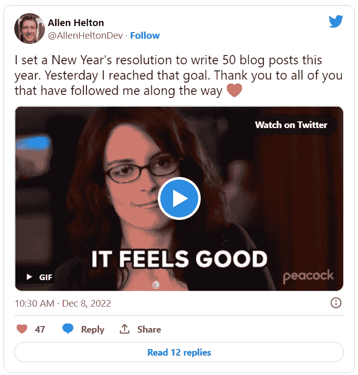

# 一年写 50 篇博文的经验教训

> 原文：<https://betterprogramming.pub/lessons-learned-from-writing-50-blog-posts-in-a-year-4780706fe509>

## 今年写了这么多博客文章很紧张，但我学到的比我预期的要多得多

图片由 freepik 上的[jcomp](https://www.freepik.com/free-vector/think-out-box-concept-open-your-brain-look-new-ideas-that-will-drive-your-business-work-creativity-help-see-business-opportunity-vision-idea-discover-new-solution_21586017.htm#query=will%20power&position=0&from_view=keyword)

2019 年开始写作。我对自己开发的运行回顾的[技术](/8-steps-to-facilitating-a-captivating-retrospective-2324de487706)感到兴奋，并想分享它。我知道让开发人员参与回顾是困难的，我想和其他 scrum 大师分享我的成功。

所以我写了我的第一个帖子…我喜欢它。

当时，我刚刚被安排到一个开发团队，探索如何将我们公司的部门带到云上。我有很多东西要写。我们每天都在学习新的东西，我想和大家分享。

所以我写的比较多。

那一年我发表了 16 篇文章。对新手来说还不错。2020 年，我写了 34。*我被迷住了。*

2020 年 12 月，我挑战自己一年写 50 篇。但是在 2021 年，生活阻碍了我。我没有把它放在首位，也没有考虑我的挑战。我还有点全神贯注于我管理的一个应用程序的产品发布。尽管我尽了最大努力，那年我只能发表 22 篇文章。

但如果不是坚持不懈，我什么都不是。2021 年 12 月，我承诺鞭策自己，完成第一次失败的挑战。一年五十篇博文。那是一周一次，有两次“免费通行证”

12 月 7 日，事情发生了。

这不是一个小壮举，一路上我学到了很多东西。我想分享一些我学到的经验。

# 我像我妻子说的那样固执

2022 年我每周发表一篇文章。这包括假期和我休假的时间。

睡觉和把写作推到一边是很容易的，但是我决心完成它。在某些时候，我怀疑是决心还是固执驱使着我。

有很多天我可能应该睡懒觉，比如 AWS re:Invent 周。我会在凌晨 2 点睡觉，然后在 6 点醒来写完我的博客。

当我在四个小时的睡眠中治疗宿醉时，我断断续续地输入关于[在无服务器环境中可观察性的重要性](/going-serverless-build-an-observability-mindset-38d2d74f9756)时，我有了一点自我实现。我这样做不是因为挑战；我这么做是因为我很固执。

我决心做某事，没有人能阻止我去做。我还在努力决定那是好事还是坏事:)。

# 读者喜欢一致性

2022 年初的时候，我是文章一做就发。这意味着我在一周中的任意一天发布帖子。在过去的几年里，我发布了更多的零星消息。有时，我会在一周内发布两篇，然后两个月内不发布另一篇。

这种不一致导致读者群增长缓慢。在我写作的前三年，我在 Medium 上有 2000 多一点的粉丝。我每个月会有 10 到 50 个新的追随者。

但当我开始每周三坚持发帖时，我的读者群爆炸了。我从一个月 50 个到每天 100 多个。

*比较 2021 年和 2022 年的追随者数量*

我在网上读了一遍又一遍，但一般都拒绝相信。*一致性是关键*是你在内容创作中随处可见的一条信息，但直到今年 3 月，当我开始每周三而不是随机发布文章时，我才开始看到它成为现实。

我确信频率与过去一年的成功有关，但是我相信持续的时间表是建立你的追随者的最重要的部分。

# 常规有助于更好的写作

说实话，年初的时候，我每周都在挣扎着推送内容。

我没有节奏。我会努力整理我的想法，让事情进展顺利。一个非常不一致的工作流程让事情变得更加困难。

但最终，我陷入了一个非常有帮助的日常生活。

我每天都留出同样的时间作为我的“写作时间”这成了我早上例行公事的一部分，帮助我进入正确的内容创作空间。

我是一个早起的人。我发现我的思维敏捷度在上午 10 点前最好，所以我采用了这个早晨惯例:

*   早上 5:15——锻炼
*   早上 6:15——为一天做好准备
*   早上 6:30——开始写作
*   早上 8 点——和孩子们一起吃早餐
*   上午 8:30——开始我一天的工作

这是我周一到周五做的事情。这有助于我做好心理准备，并提供一个专门的写作时间，不与其他优先事项竞争。

更进一步，我有一个日复一日的计划。对于那些不知道的人，我[也每周发布一份简讯](https://readysetcloud.io/newsletter)。所以我必须留出时间来巩固内容，并写我的博客。我的日常安排如下:

*   周一——发布时事通讯，撰写博客文章
*   周二——写博客
*   周三——发布博客和交叉帖子([我刚刚自动化了这一部分](/blog/allen.helton/how-i-built-a-serverless-automation-to-cross-post-my-blogs)
*   周四——搜索互联网，看看人们在为下周的博客帖子谈论什么
*   星期五——处理时事通讯

确切知道我应该做什么和什么时候做的结构和程序提高了我的效率，帮助我从不错过自己设定的最后期限。

# 坚持你的定位

在我把无服务器和 API 作为我博客的焦点之前，我花了几年的时间写作。当我在 2019 年初开始时，我会写下任何想到的东西——[领导原则](https://medium.com/swlh/leading-from-behind-enable-your-team-by-doing-less-918a5b44d55b)、[早期创业实践](https://medium.com/swlh/5-steps-to-building-the-perfect-team-for-your-startup-63b81f19d94)、 [app 现代化](/are-you-really-ready-for-ci-cd-9a8bf6d01b8a)等。作为一名作家，有这么多内容可以探索对我来说是件好事，但由于几个原因，这延缓了我的品牌发展。

我已经提到了一致性在建立追随者中的重要性。但是再深入一点，不仅和你的时间表保持一致很重要，和你的内容保持一致也很重要。我的内容的追随者喜欢无服务器，他们喜欢 API。有些人喜欢领导原则，有些人喜欢早期创业建议，但所有人都喜欢无服务器和 API。

因此，当我在我的领域发布内容时，我与每个人都有联系。我偶尔会写一些其他的话题，但是我发现当我离开这个领域时，我的参与度会下降一些。

我意识到的另一个好处是，当你专注于一件事时，你的知识会变得多深刻。对我来说，那就是无服务器。

我与业内一些最优秀的人建立了关系，并直接向他们学习。我学会了深入研究，并想出了当无服务器比容器更贵时，如何处理像[冷启动](/lets-stop-talking-about-serverless-cold-starts-38e4c1fda963)和[这样的难题。](/when-is-serverless-more-expensive-than-containers-23b318662ce6)

坚持你的专长可以建立你的专业知识，这是我见过的最不一样的。这种专注可以让你探索不寻常的话题，建立自信和可信度。见鬼，这甚至可能是我被命名为 AWS 无服务器英雄的原因。

# 摘要

一年中每周发布一篇博客文章是令人疲惫的。但是它教会了我很多关于我自己的事情，并且帮助我和那些我不会遇到的人建立了关系。

2022 年是我大学以来(可能是有史以来)最大的学习年。我学会了如何学习，并发现了作为一名开发人员写作的许多好处。

2023 年我还会去 50 吗？*大概不是*。

今年我有点太努力了，当我去度假的时候，我真的需要休息一下。也就是说，你仍然可以期待看到我的大量内容，只是可能不是 50。

如果再来一次，我会改变什么吗？*绝对不是*。

我对这一年的结果再高兴不过了。这是一个巨大的挑战，结果远远超出了我的想象。如果你决定接手这样的工作，请告诉我！我很乐意在我的时事通讯中为你提供一些具体的指点或特写[。](https://readysetcloud.io/newsletter)

谢谢大家。

编码快乐！