# 让我们用 Slate.js 和 React 构建一个快速、灵活和可定制的富文本编辑器

> 原文：<https://betterprogramming.pub/lets-build-a-customizable-rich-text-editor-with-slate-and-react-beefd5d441f2>

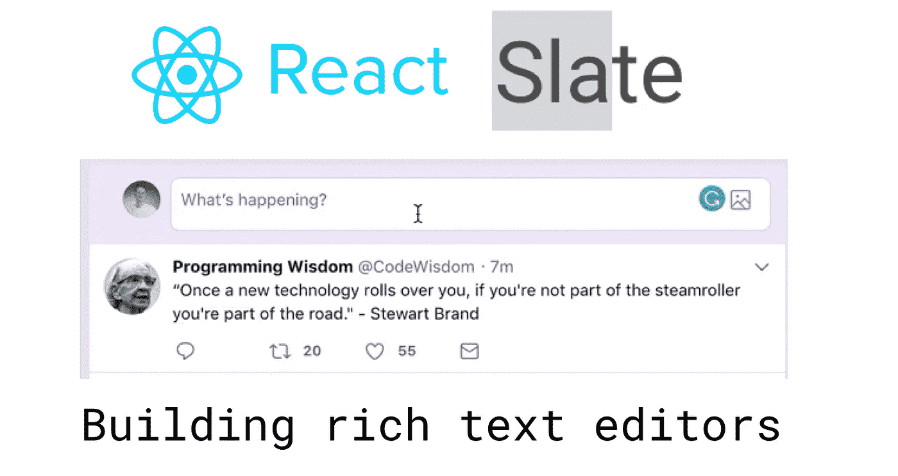

# 什么是富文本编辑器？

富文本编辑器的目的是减少用户将格式表达为有效 HTML 标记的工作量。富文本编辑器为用户提供了格式化文本的选项。

每个人都在某个时候使用过富文本编辑器。那么为什么不造一个呢？以下是一些最常用的富文本编辑器。

*   Reddit、YouTube 和黑客新闻评论。


Reddit 评论部分

*   制作内容的在线编辑——写博客、教程、新闻等。

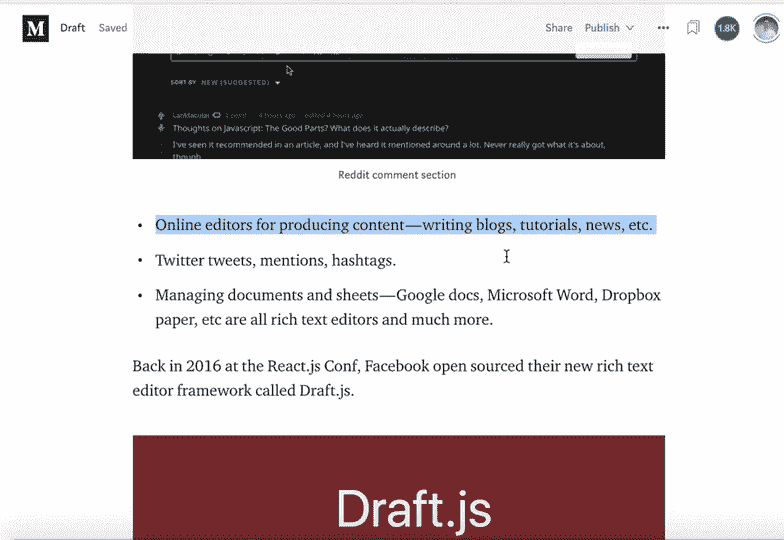

中等

*   Twitter 推文、提及、标签、投票、列表等。


*   编辑文档和 excel 表格，比如谷歌文档，微软 Word，Dropbox Paper。

# Draft.js

2016 年，脸书开源了他们新的富文本编辑器框架，名为 [*Draft.js*](https://draftjs.org/) 。


[https://github.com/facebook/draft-js](https://github.com/facebook/draft-js)

下面是 Draft.js 入门讲座。值得观看 25 分钟的视频，了解脸书团队遇到了什么样的问题，以及他们是如何解决这些问题的。

# 石板. js

在脸书开源 Draft.js 后不久，伊恩·斯托姆·泰勒创建了 [Slate.js](https://www.slatejs.org/)

这里有一个[黑客新闻线程](https://news.ycombinator.com/item?id=14125585)关于 Slate.js 的讨论。


创建 Slate 的理由是合理的。让我们通过创建一个富文本编辑器来检查一下。

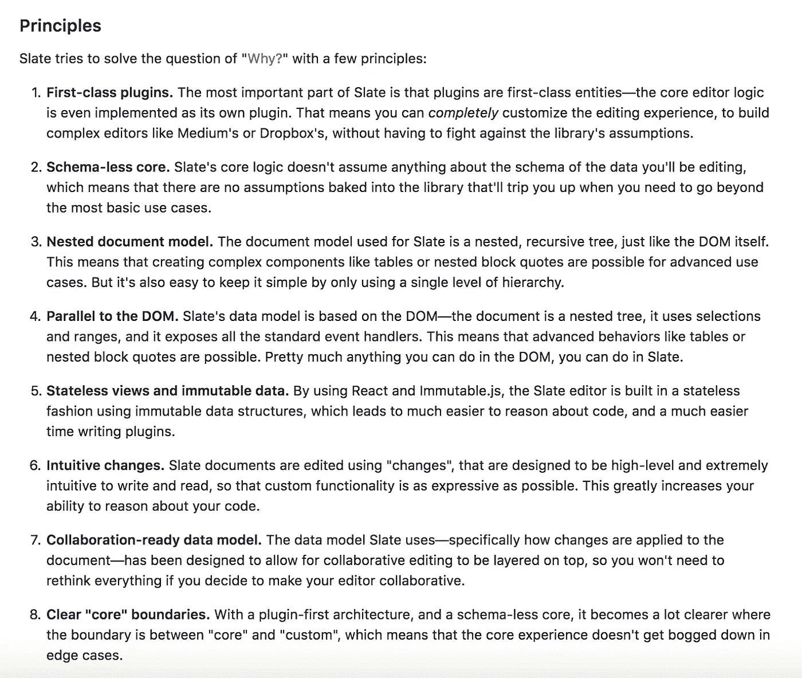

# 入门指南

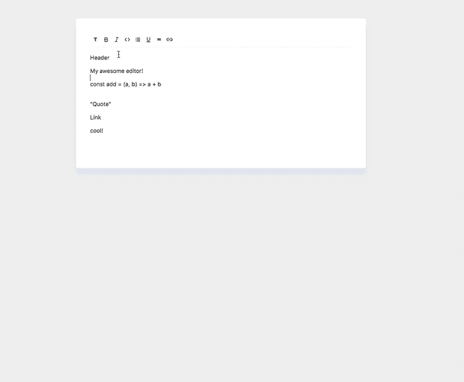

我们将构建的富文本编辑器

这个项目需要以下材料:

*   文字编辑器，任何都行，随便选。
*   [安装了 npm/Yarn 的 Node.js](https://nodejs.org/en/) 。
*   基本的 JavaScript 知识。如果你正在学习诀窍——这个学习 JavaScript 的列表可能对你有用。

我们走吧！

打开你的终端，用 [create-react-app](https://www.npmjs.com/package/create-react-app) 创建一个新的 [React](https://reactjs.org/) 项目。

```
npx create-react-app slate-react-rich-text-editorcd slate-react-rich-text-editornpm start
```


启动我们的 React 应用

Slate 公开了一组用于构建编辑器的模块。最重要的是`Editor`组件。组件是构建一切的基础层。可以把它看作是整个编辑器的根组件。

首先，我们将创建一个文件夹`components`。在`components`目录中，我们将创建两个名为`index.js` 和`TextEditor.js`的文件。

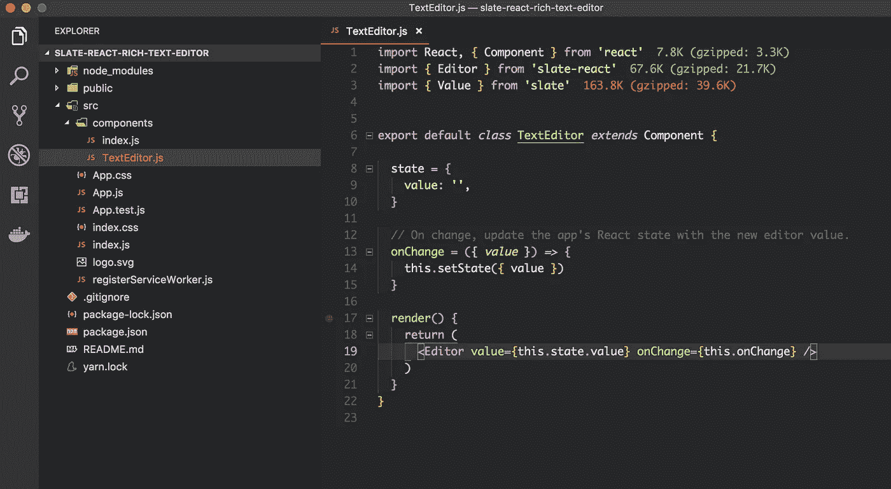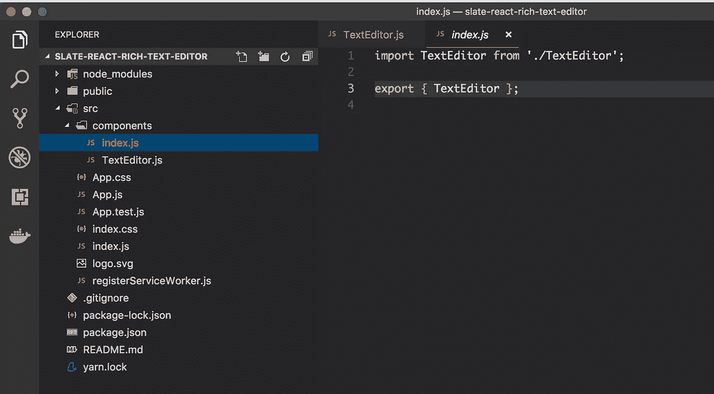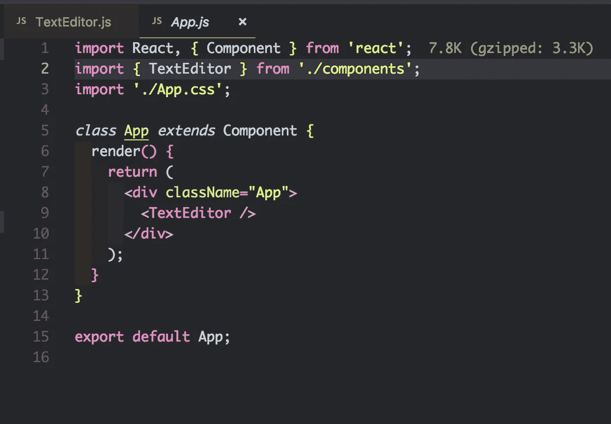

如果我们打开浏览器，这就是我们应该看到的。

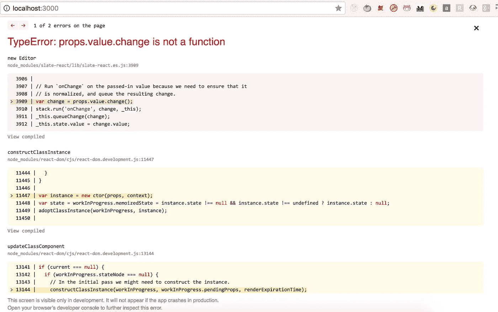

没问题！`Editor`组件期望一个初始的`value`——正如你在[源代码](https://github.com/ianstormtaylor/slate/blob/master/packages/slate-react/src/components/editor.js)中看到的。

参见最后一个**属性类型** —设置为**是必需的**

让我们将初始值添加到编辑器中。一旦我们对 Slate 的工作原理有了基本的了解，我们将在后面深入研究数据的确切模型。

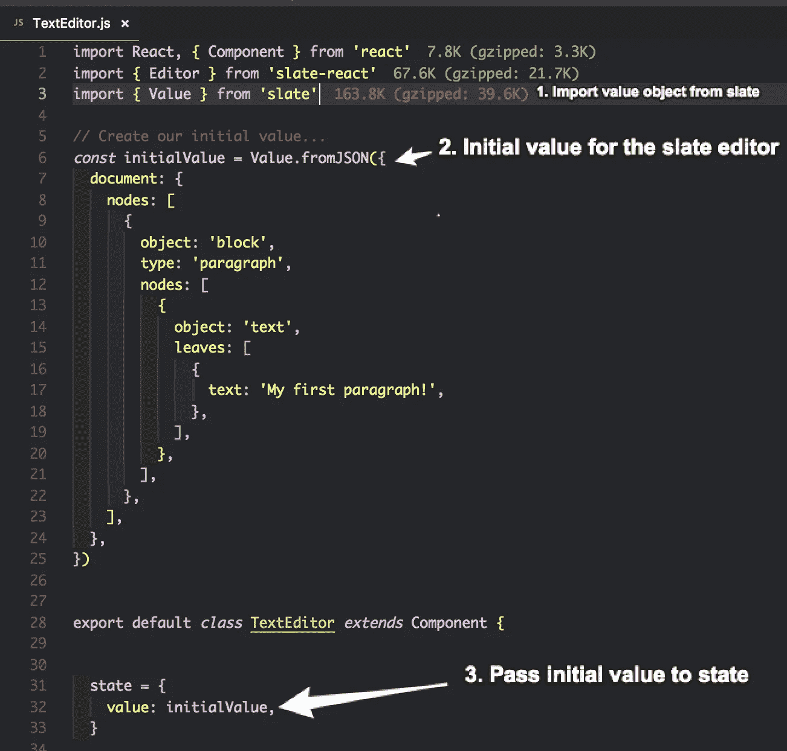

我们最终应该在我们的应用程序上呈现出`My first paragraph!`。

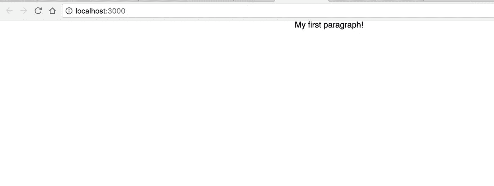

被渲染的段落

起初，文本看起来像一个简单的`<p>`段落。但是如果我们检查这个元素，有一个从我们身边抽象出来的复杂的海洋。

试着点击文本。你看到了什么？


可编辑文本—注意 DOM 元素的复杂层次结构。这一切都已经从我们的引擎盖下抽象出来，我们可以专注于构建我们的“产品”。

文本是可编辑的！如果你没有 React 开发者工具，这里有一个 Chrome 应用商店的链接。

**记得**我们在`Editor`组件中添加了一个`onChange`事件监听器。

1.  `onChange`事件监听器正在监听键盘事件。
2.  抓到一个按键后。
3.  我们用新的击键更新当前状态。
4.  派遣新州。
5.  在屏幕上呈现新状态。

但是，编辑器对我们来说还不是很有用。我们遗漏了一些关键功能，比如格式化、将文本保存在某个地方等等。

# 添加自定义格式

常见的有大标题、副标题、*斜体*、**粗体**、`code`等。格式化文本。

让我们考虑格式化文本的下一步。

一种常见的做法是从按下 command 键开始，如 ctrl 或 cmd。按下 command 键告诉编辑我们正在编辑而不是在键入。

例如，我们可以做的如下:`cmd ⌘+ b`或`alt + b`用于将**粗体**添加到我们选择的文本中。

我们的流程将如下所示:

1.  监听事件/击键。

2.区分按下的按键，是`alt`、`cmd`还是`b`，按什么顺序？如果这些键真的被按下了会发生什么？

3.用所需的格式触发实际的文本更改。

首先为`Editor`添加一个`onKeyDown`事件，并传入回调。

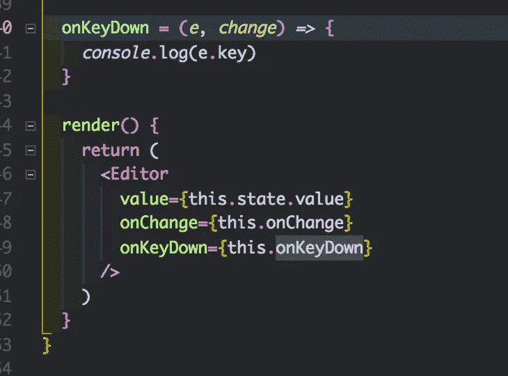

添加 onKeyDown 事件侦听器

我们知道用户按了什么键。让我们根据按下的是哪一个键，让一些事情发生。

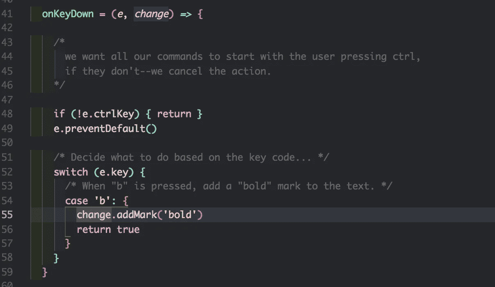

很好，现在我们有了所有的逻辑。如果用户按下`alt + b`，将文本改为粗体。你认为我们应该如何处理造型？

一种方法是创建一个名为`BoldMark.js`的新的可重用组件，我们可以在每次需要粗体文本时重用它。


为粗体文本创建可重用组件


导入和导出新组件

`Editor`组件有一个名为`renderMark`的道具，它接受回调。在`renderMark`中，我们可以决定如何设置文本的样式。


导入 **BoldMark** 组件


来吧，试试看！选择文本并按下`alt + b`:

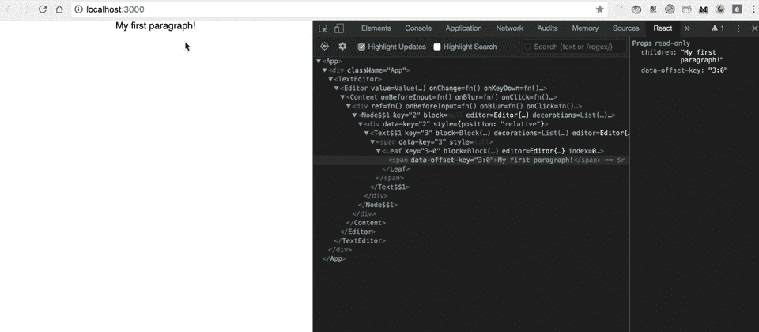

有用！请注意，`BoldMark`组件正在 VDOM 内部呈现。

还有一个问题。如果我们改变主意会怎么样？我们想撤销粗体标记。

石板罩着你。我们可以使用`toggleMark(‘bold’)`来代替添加`addMark(‘bold’ )`:


注意**切换标记**方法，而不是**添加标记**


在浏览器中测试我们的 **toggleMark** 方法

最重要的是，除了斜体的*之外，你能添加同样的功能吗？*

# 意大利语族的

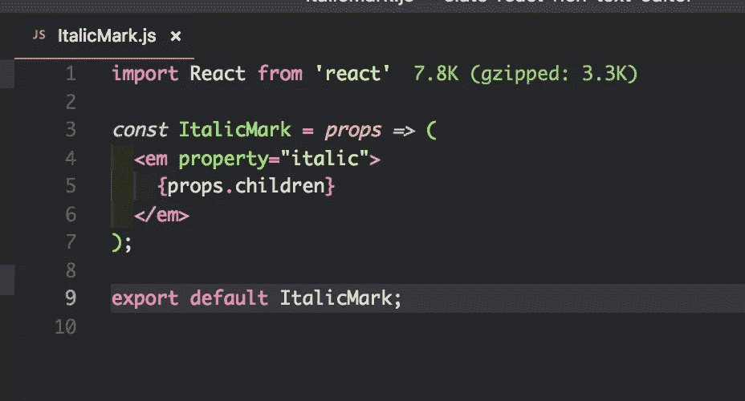

创建斜体标记组件。

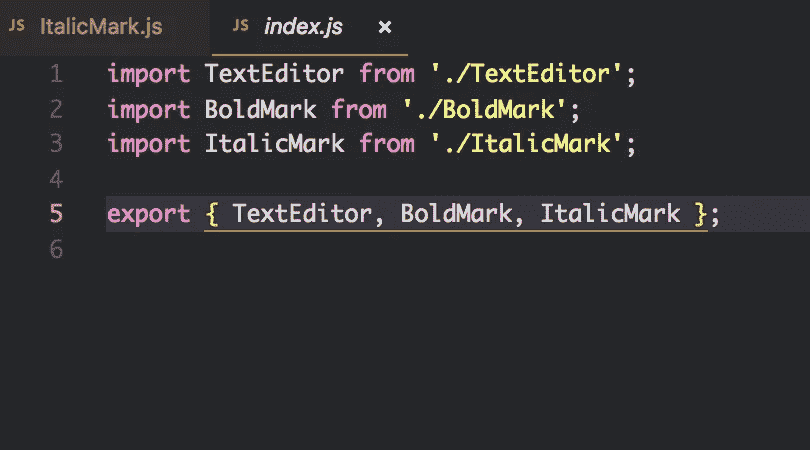

进出口。

接下来，让我们将功能加入到我们的`Editor`中。

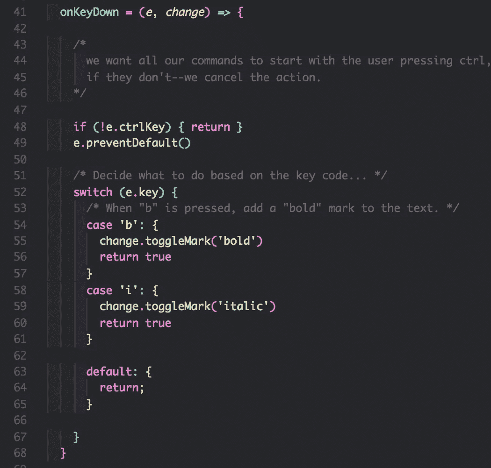

检查按键是否是 I

并在我们的`renderMark`方法中包含该组件。

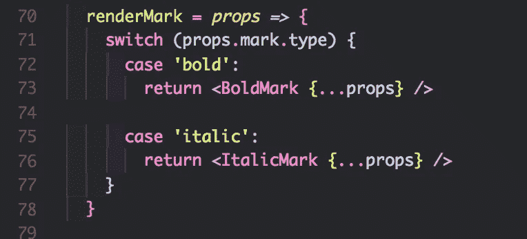

包括斜体标记类型的情况

试试吧！

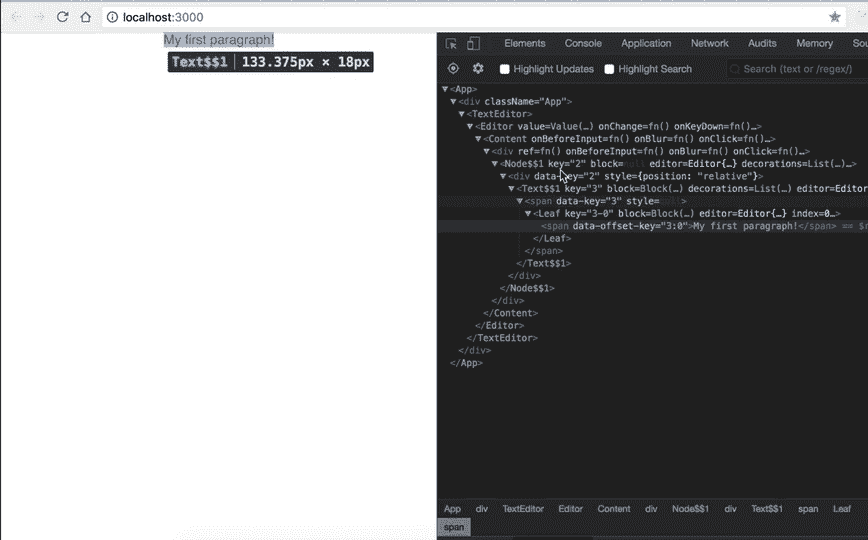

在常规字体和斜体字体之间切换

我们正在实现这一目标，我们将完成更多的工作。

第二部分再见！

[](https://medium.com/free-code-camp/lets-build-a-fast-slick-and-customizable-rich-text-editor-with-slate-and-react-part-ii-3d3908d89664) [## 让我们用 Slate.js 和 React 构建一个快速、灵活和可定制的富文本编辑器——第二部分

### 现在，让我们把它变漂亮

medium.com](https://medium.com/free-code-camp/lets-build-a-fast-slick-and-customizable-rich-text-editor-with-slate-and-react-part-ii-3d3908d89664) 

[Github](https://github.com/wesharehoodies/slate-react-rich-text-editor/tree/part-1) 上的源代码:

[](https://github.com/indreklasn/slate-react-rich-text-editor/tree/part-1) [## indreklasn/slate-react-rtf-editor

### 让我们用 Slate 和 React-indreklasn/Slate-React-rich-text-editor 构建一个可定制的富文本编辑器

github.com](https://github.com/indreklasn/slate-react-rich-text-editor/tree/part-1) 

注:如果你想让你的 React 游戏更上一层楼，就从 [*这本书*](https://amzn.to/2lcAXxO) 开始吧。

感谢阅读！