# 在 AWS 中建立经典的 3 层架构

> 原文：<https://betterprogramming.pub/lets-create-classic-3-tier-architecture-in-aws-cf187664a83c>

## 让我们创造吧！

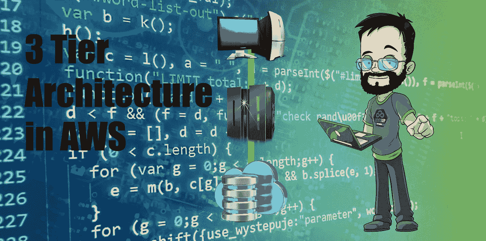

本周的项目要求我们在 Amazon Web Services 中建立一个传统的三层架构。这三层通常被称为 Web 或表示层、应用层和数据库(或简单数据)层。让我们快速浏览一下每个组件:

# 介绍

*   **Web 层—** 这通常是项目面向公众的一面。无论是网站还是 GUI，这都是用户看到的和与之交互的东西。对于我们的项目，我们将有一个运行 Apache 的 EC2 实例自动扩展组来托管一个简单的 HTML 站点，该站点包含在通过网关连接到互联网的 VPC 的几个子网中。安全组会将这些实例的流量仅限于 HTTP。
*   **应用层—** 这一层，听起来像是实际的逻辑，或者代码，或者项目的“大脑”所在的地方。流量将从 Web 层传递到这一层进行处理。在我们的示例中，我们将在私有子网内拥有一组自动扩展的 EC2 实例。安全组将确保只有直接来自 Web 层的流量才能通过。对于这个项目，我们实际上不会有任何运行代码。
*   **数据库层—** 最后一层基本上是存储。它将包含您的解决方案所需的任何数据库或存储设备，如 S3 存储桶。在我们的项目中，这将是一个 MySQL RDS 数据库，位于几个私有子网中。和以前一样，安全组将流量限制为仅来自应用层的入站流量。

我试图把它画出来，所以逻辑上看起来可能是这样的:

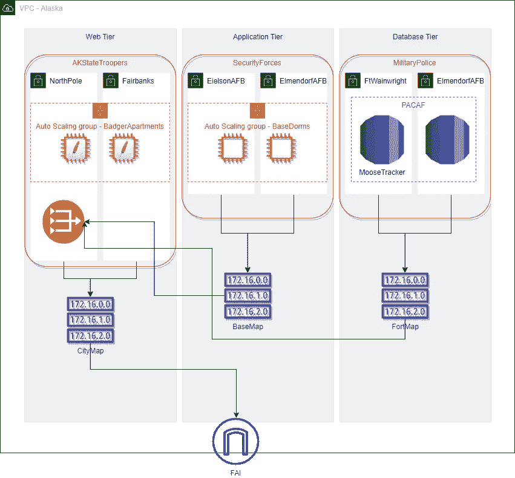

# 先决条件

对于这个项目，我们需要的是一个具有管理员权限的 AWS 帐户。(一如既往，不要使用您的 root 帐户)

我们开始吧！

# Web 层

**创建一个 VPC**
首先，我们将在 AWS 控制台中导航至 VPC 仪表盘。

我们是书呆子。我们喜欢巫师。

和控制台中的其他东西一样，让我们看看右上角的“创建 VPC”按钮。

下一个屏幕截图展示了一个漂亮的特性，它允许您一次性为这个项目创建大部分资产。然而，我似乎是一个惩罚的饕餮者，我会将事情分解一点，以保持我的“三个不同层次”的方法。

因此，我们选择“仅 VPC”，给它命名，给它一个 CIDR 区块，然后嘣。第一步完成了。

**创建一些子网**
接下来，我们将沿着左侧的菜单向下，选择“子网”。寻找“创建子网”按钮，并按下它。

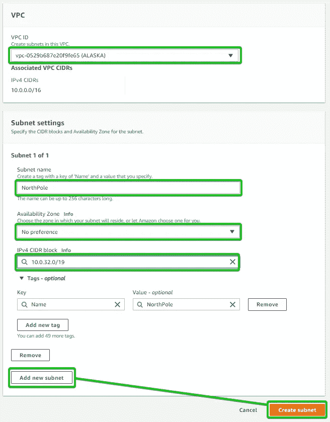

单击“添加新子网”一次创建多个子网，完成后单击“创建子网”。

哇哦。成功。

**路由表**
这是一页，我们会多次回到这一页，但现在我们要为刚刚建立的两个子网创建一个路由表。这将允许实例相互通信，并在以后与 Internet 网关通信。与子网一样，它是控制台左侧的下一个选项，zwoop！右上角为“创建路由表”

请务必手动选择正确的 VPC，因为我们没有使用默认设置。

有了表之后，我们需要将子网与表相关联:

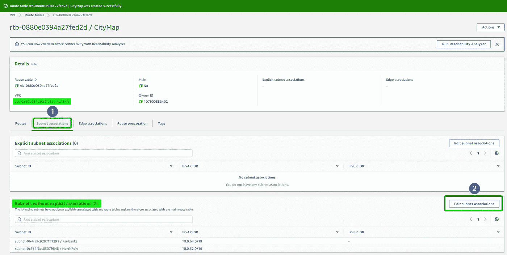

选择“关联”选项卡，然后选择“编辑子网关联”

选择两个子网并“保存”

这创建了一个“显式”关联。我只想说，这可能是隐含的，但我们今天不会讨论这些。这里我还应该指出，默认情况下，任何创建的路由表都有一个名为“本地”的默认路由条目。此路由允许任何实例与子网内使用此表的任何其他实例进行通信。

另一个需要完成的步骤是将这个表作为 VPC 的“主”表。

**互联网网关**
简称互联网网关，下一项资产允许我们之前创建的子网自由访问互联网，从而成为“公共子网”

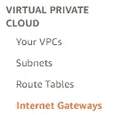

让我们再一次进入下一个选项！

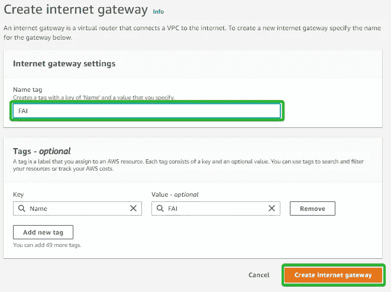

下一步是将网关“连接”到我们在开始时创建的 VPC。

创建后，通知标题会直接提供一个到下一步的简单链接，但是“Actions”>“Attach to ”(操作)“VPC”选项会一直为我们提供。

按照提示，选择正确的 VPC，我们就进入下一个环节！
此时，我们还可以将网关添加到路由表中:

**创建安全组**
安全组作为某种“实例级”防火墙至关重要。这里，我们将创建一个仅允许 HTTP 流量进入的网络。

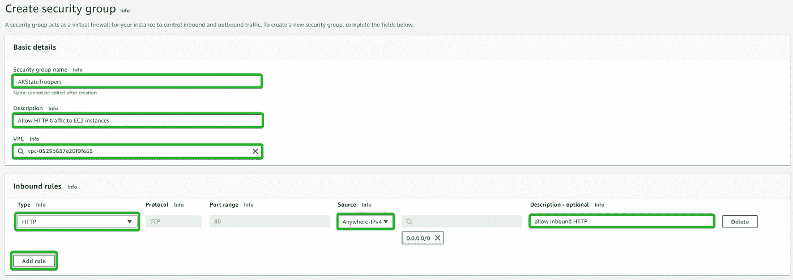

**创建自动缩放组** 通过导航到 EC2 >自动缩放组，我们可以找到典型的“创建 XYZ”向导，但是在启动该向导时，我意识到我确实需要首先创建一个启动模板。我已经在前面的中介绍了创建和使用一个启动模板[，但是这个项目有足够多的独特之处，我将在这里再次向大家展示。](https://awstip.com/creating-an-aws-launch-template-with-aaa-reliability-70347e6d8b38)

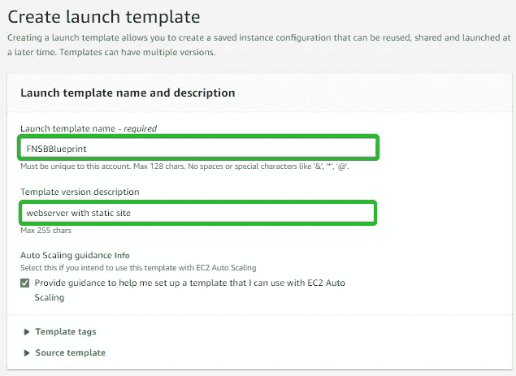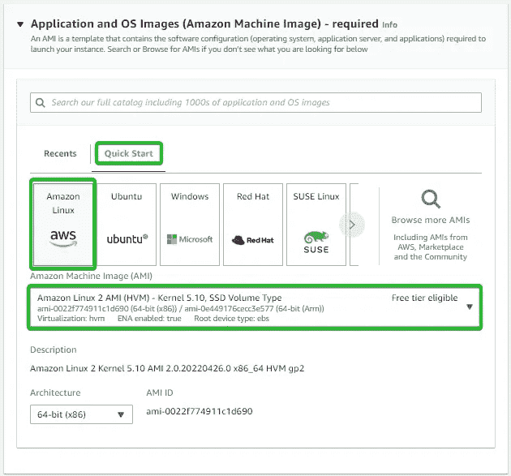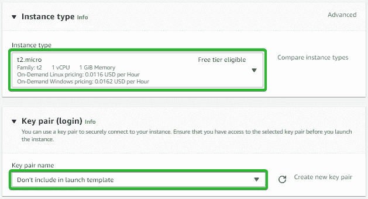

没有显示的是我在以前的项目中使用的引导脚本，它被放置在向导页面最底部的用户数据字段中。

现在我们已经创建了启动模板，我们可以返回到自动缩放组(ASG)向导，并继续:

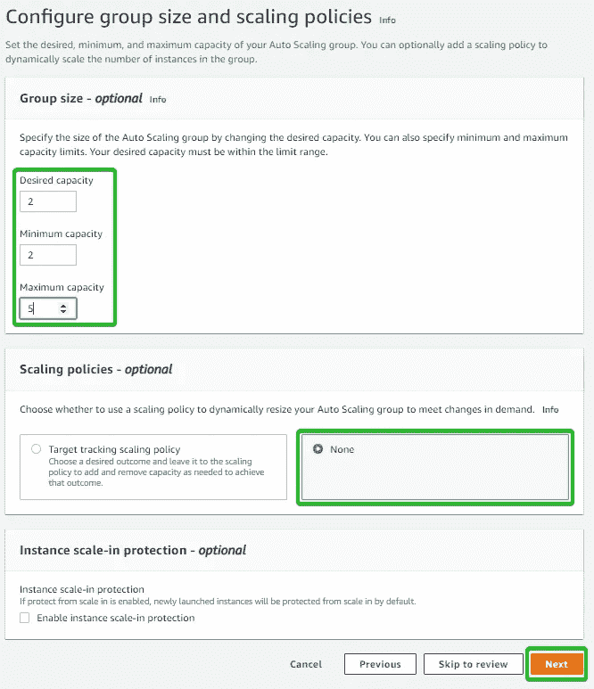

其他一切都是默认的，我们实际上可以利用上面页面上的“跳到评论”按钮，但不管怎样..完成向导，一旦我们的实例完成初始化，我们就可以获取它们的一个公共 IP 并查看我们最喜欢的小 html 页面:

*注意:由于一些奇怪的原因，我的正常引导脚本失败了，所以我必须添加一个* `install php` *命令来启动 Apache 服务器。*

从而结束我们的第一层。*扔纸屑*拿一些液体能量，你的帽子，可能还有猫，让我们继续前进！

# 应用层

**创建更多子网**
导航回我们的 VPC >子网页面，我们将再创建两个子网:

这一次，我们不打算将它们连接到 internet 网关，从而使它们成为“私有”子网。但是，我们需要将它们与路由表相关联。

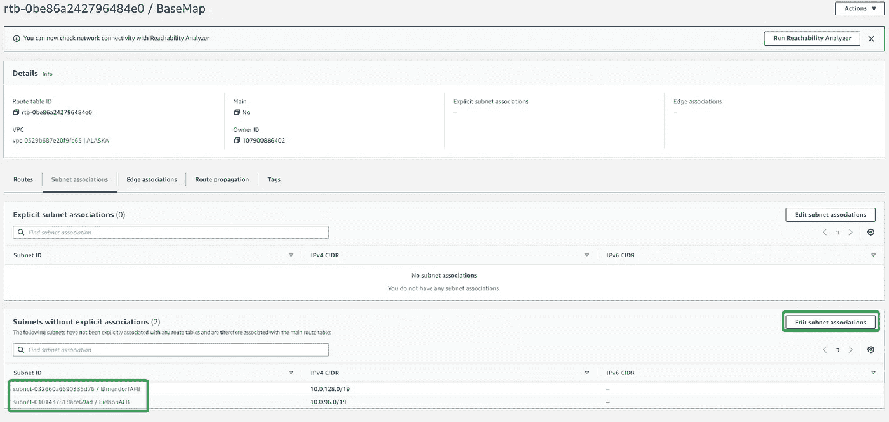

**创建我们的应用安全组**
有趣的是，它只允许来自我们的网络安全组的流量！

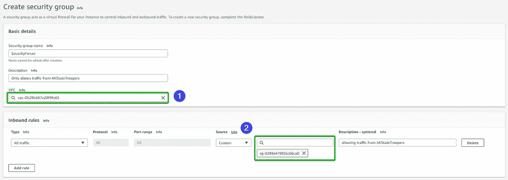

VPC 下拉列表有点棘手…使用 Web 安全组的 ID 来创建入站规则。

**汽车衡再次来袭！** 我们将创建另一个启动模板/自动缩放组组合，但这个组合将只启动 EC2 实例，并且只有一个操作系统。你之前已经看到了这些选项，所以我把我的启动模板命名为 **USAFBlueprint** ，我的 ASG **BaseDorms** 。完成向导，这些将开始旋转！

**创建 NAT 网关**重要的一点是选择正确的子网，确保它是公共类型，并分配一个弹性 IP。

这将允许我们的私有子网与房子的公共端通话。

现在，我们可以导航回路由表，并将 NAT 网关 ID 作为路由条目添加到应用程序层私有路由表中(**底图**)，或者我们可以等到以后，将其添加到两个私有路由表中(**底图/FortMap** )。无论哪种方式，它看起来都会像这样:

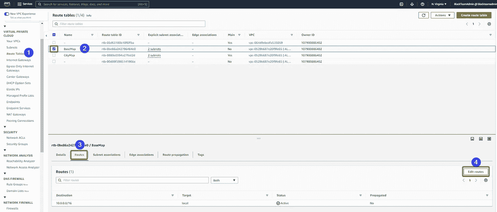

这就是我们的应用层！在我们的最后一站…

# 数据库层

**另一个安全组…**
这个安全组只允许来自我的应用层安全组的 MySQL 流量: **SecurityForces** 。

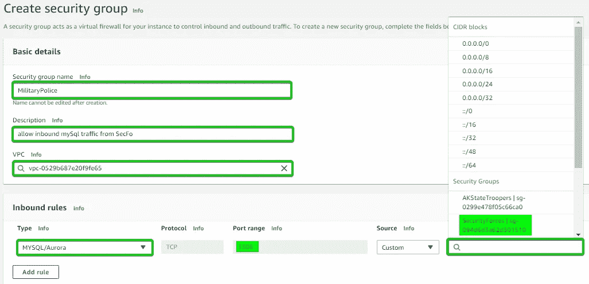

**创建数据库**
接下来，我们要创建一个 MySQL RDS 数据库。现在，这些屏幕截图可能会让我看起来能够顺利完成，但实际上我不得不后退几步来准备这个阶段..

*   数据库不会创建，因为它需要分布在至少两个可用性区域的子网
*   因为我已经用“让 Amazon 选择 AZ”创建了我的所有子网，所以它们都在同一个 AZ 中。
*   最后，我不得不删除/重新创建我的最后一个子网，并手动将其放在不同的 AZ 中。
*   然后，我创建了 DB 子网组，并能够完成数据库创建。

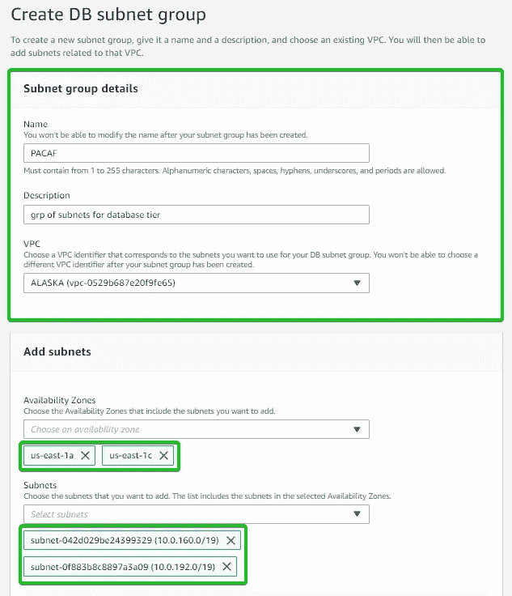

现在我们又回到正轨了！

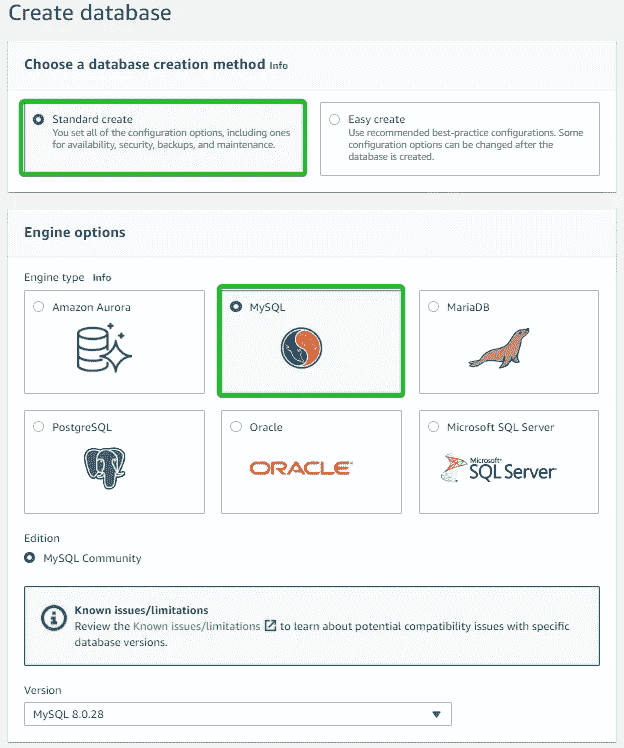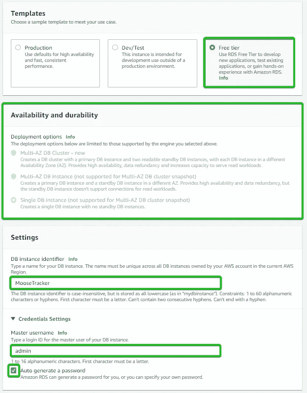

对于这个项目，我们没有使用多 AZ 数据库选项，但除了严格的“自由层”以外的任何选项都将解锁中心框中的选项，从而启用多 AZ。

*在这两张截图之间有很大一部分选项，但这是唯一相关的选项。*

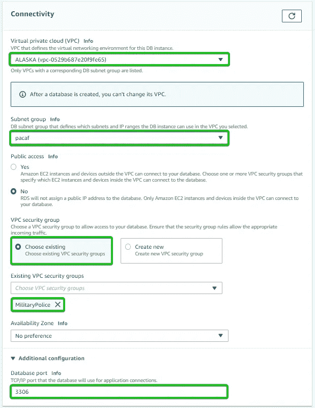

现在你知道了！数据库层！

这里需要注意的是这个项目:

1.  没有任何应用层的功能
2.  实际上并不与数据库层有任何联系，但更多的是为了展示创建类似内容的过程。

不过，在我们结束之前。

# 堡垒

## **测试 Web to App**

简单地说，一个堡垒主机(或者用旧的说法，一个跳转服务器)是锁定你的架构的一个额外的方法，但是仍然允许一个访问点用于某些动作。在这种情况下，我们将创建一个堡垒主机来测试并查看我们的 web 层可以与我们的应用程序层对话！

我们的 Bastion 主机(又名`SpaceWarningSqdn`)将被放置在我们的公共子网内，并被授予(再次通过我们的安全组)ping 我们的一个应用层实例的私有 IP 的权利。

不幸的是，经过凌晨 4 点的混乱，以及一长串测试不同规则配置以使其实际工作的过程，我丢失了大部分截图。但是这里有一个 ping 实际上在工作！

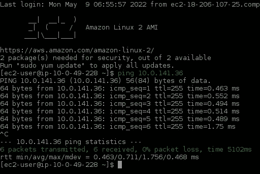

# 结论

三层架构是构建整个服务堆栈的好方法，因为它允许您在逻辑上将其分解，让每个部分单独工作，然后将各个点连接起来，形成一个功能完整的大型项目。

谢谢你和我在一起，下次再见！

腹心蛙！