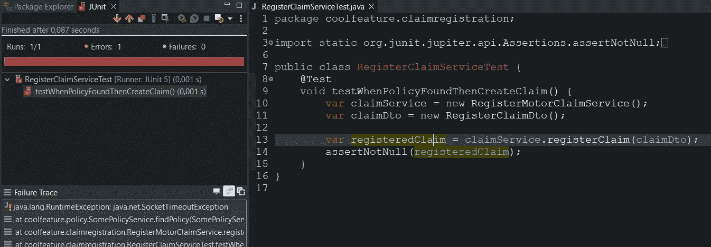
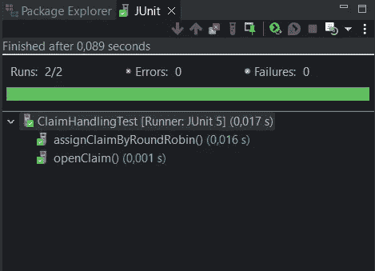
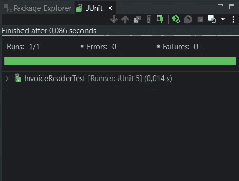
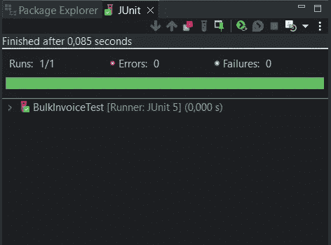
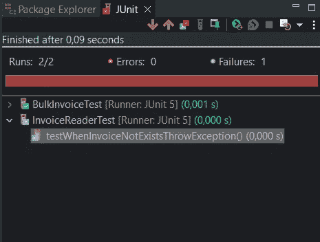

# 让我们闻闻测试# 1——当测试在 Java 中偶尔失败时

> 原文：<https://betterprogramming.pub/lets-smell-some-tests-1-when-tests-fail-occasionally-in-java-628079dd145d>

## 3 个用例在你的代码库中编写健壮的测试用例

埃米尔·普里维尔在 [Unsplash](https://unsplash.com?utm_source=medium&utm_medium=referral) 上的照片

大家好，欢迎来到新一集的*让我们来闻闻测试*系列。在上一篇文章中，我介绍了为什么值得编写测试。此外，根据我自己的经验，我描述了零案例，即在我参与的项目中缺乏自动化测试。

在今天的文章中，我将向你展示偶尔失败的测试是什么味道。接下来，我们将找出它们为什么会这样，最后，我们将重构它们，使它们再次闪耀。

我们开始吧！

# 背景

当我们从*根本不写测试*的阶段进入*好吧，我甚至喜欢它*的阶段时，我们可能会遇到一些我们不太清楚的问题。其中一种情况是测试偶尔失败而没有修改代码。

您是否还记得这样一种情况，当您运行一个测试套件时，所有的测试都通过了，而在另一次运行后，其中一些测试失败了？或者也许你运行了一个单独的测试类，一切看起来都很好，直到你运行了整个测试套件？

我记得这些场景。而且这样的失败都是我自己在开发经验比较少的时候引入的。此外，我看到过一些测试经常会周期性地中断，所以其他程序员只是将它们注释掉，以便在测试报告中获得漂亮的绿色。然而，我们是应该删除测试还是修复它们并不是本文的主题。现在，让我们假设我们需要所有的测试，并且想要修复那些被破坏的测试。

# 定期测试失败的原因

您的测试可能会有这样的行为，至少有几个原因:

*   被测系统(SUT)依赖于外部资源，例如，它使用存储在测试环境无法访问的位置的文件，或者调用真实的 web 服务
*   一个测试用例依赖于另一个
*   测试使用共享的依赖项(例如数据库),并且它们在执行后不会清理测试环境

# 案例 1:被测系统依赖于外部资源

通过*外部资源*，我指的是像数据库、文件系统、web 服务、消息总线等等——你得到了一个大概的概念。

如果您实现了测试，并且被测试的代码利用了这样的依赖，那么有一些事情需要关注:

*   你在写什么类型的测试？
*   您必须处理什么类型的依赖关系？

例如，如果你写*单元测试*，你不应该调用数据库，也不应该与真正的 web 服务通信。相反，您想要隔离您的测试，提供虚假的依赖。

另一方面，即使你编写了*集成测试*，也并不意味着你应该使用所有那些外部依赖。

那么，被测试的系统是什么样的，它依赖于外部资源？

为了更好地理解这个概念，让我们想象以下场景:

*   您刚刚为一项新功能实现了一组测试用例
*   在将变更提交评审之前，您已经启动了通过的整个测试套件

测试已在我们的机器上通过

*   随后，您的同事将您的更改提取到他们的本地机器上，他们让您知道他的构建被破坏了，因为您的新测试没有通过

原因是什么？你赌的是质量，所以你做了测试，一切看起来都很好，不是吗？

突然，你刚想起来每天上午 10 点安装策略系统，猜猜“单元”测试是什么时候失败的:)。原来您实现的类试图连接到一个真实的 web 服务，由于安装过程的原因，该服务是不可访问的。

虽然在系统测试中使用真正的依赖关系是完全可以的，但是对单元测试甚至是集成测试使用相同的方法并不是最好的主意，因为您将测试与您无法控制的因素联系在一起。

这就是外部依赖的本质——它们有时有效，有时无效，因此你的测试会交替闪烁绿色和红色。

西蒙·维亚尼在 [Unsplash](https://unsplash.com?utm_source=medium&utm_medium=referral) 上的照片

这种特殊情况的解决方案相对容易，您可以通过提供带有假实现的依赖项来解决它。我在下面的文章中有更详细的描述。

# 案例#2:测试案例取决于执行的顺序

当谈到单元测试时，我们不应该依赖于测试的执行顺序。例如，如果`testA()`创建了一些数据，我们不应该安全地假设这些数据可以被`testB()`访问。

当然，如果我们真的想保持一个特定的顺序，有很多方法可以实现，尽管使用这种方法会带来麻烦，我不推荐这样做。

我个人最喜欢从例子中学习，所以我们来看看下面这个案例:

单元测试通过了，但是名字有点神秘

如您所见，首先在`test_1()`中，我们创建一个具有`OPEN`状态的`testClaim`对象，然后我们断言声明状态是正确的，最后，我们继续执行`test_2()`。

在`test_2()`中，我们将之前创建的索赔分配给一个用户，这将负责进一步的索赔处理流程。

测试报告完全是绿色的，我们很高兴在我们的团队中推广编写测试的良好实践。

测试通过

如果一切顺利的话，让我们休息一下，喝杯咖啡，然后去☕.

照片由[杰米街](https://unsplash.com/@jamie452?utm_source=medium&utm_medium=referral)在 [Unsplash](https://unsplash.com?utm_source=medium&utm_medium=referral) 上拍摄

后来，有人偶然发现了我们的测试类，他们决定对它进行一点重构。如果测试名称更具描述性，以便其他开发人员可以更容易地了解我们测试的上下文，这将是一件好事。

测试名称已重命名，更具描述性

我们的队友刚刚完成重构，重启了整个测试套件，报告发生了什么变化？嗯…

更改测试名称后测试失败

如您所见，其中一个测试意外失败。这个测试刚刚发生了什么？

我们的队友重命名了测试的名称，其副作用是改变了执行的顺序。**在这个特殊的例子中，我们依赖于测试库的默认行为(**[**JUnit**](https://junit.org/junit5/)**5 . 8 . 2)，它默认按照字母顺序运行测试**。即使我们已经知道了，我们也不应该利用它，因为它只是库的一个实现细节。我们永远不知道这种行为是否会在未来的版本中改变，所以我们应该简单地假装我们不知道我们的测试将以什么特定的顺序执行。

回到测试分析，这里的关键元素是**静态**变量`testClaim`，它的状态是跨测试用例共享的。这意味着相同的对象在所有测试中都是可用的。总的来说，如果测试只在这个对象上做断言，也不会太糟糕。真正的问题是我们的一个测试负责初始化这个对象。换句话说，那个测试使`testClaim`对象发生了变异，这是不好的。

在我们第一次尝试编写测试时，我们很幸运地将我们的思维方式与 JUnit 的行为相匹配，所以所有的测试都通过了。我们期望分别执行`test_1()`和`test_2()`。

然而，在第二次尝试时，我们就没那么幸运了，JUnit 首先执行了`assignClaimByRoundRobin()`(之前的`test_2()`),此时 claim 对象还没有创建。这就是为什么不依赖于测试以特定顺序执行的假设是如此重要——正如您所看到的，顺序可能是不同的。

要解决这个问题:

*   如果被测试的对象因情况而异，那么在每个测试方法中创建单独的版本(将变量`testClaim`的声明从类级别移动到测试方法中)
*   如果对于每个测试用例，测试对象的创建可以是相同的，但是这个对象不应该在测试之间共享，那么去掉变量旁边的`static`关键字，使用你所使用的测试库提供的功能，这允许你在每个测试之前调用一个特定的方法，就像 JUnit 中的`@Before`或`@BeforeEach`注释

让我们看看如何解决这个问题:

对执行顺序不敏感的测试

我在这里所做的是将对象创建提取到一个单独的方法中，该方法在每个测试方法之前被调用。换句话说，`testClaim`对象不再在测试用例间共享，每个测试方法都使用一个全新的对象。

# 案例 3:忘记清理的测试

当执行顺序很重要时，这是前一种情况的特殊味道，并且它影响集成测试。

这在我身上发生过很多次。当我运行一个测试类中的所有测试时，一切看起来都很好。当我使用数据库运行整个测试套件时，问题出现了，一些测试类在执行完测试后没有清理数据库。这同样适用于在测试中使用文件系统，以及在测试类之间以某种方式共享的其他东西。

为简单起见，我将向您展示一个示例，说明您的测试可能会因为文件系统而失败:

*   您创建了两个实用程序:`InvoiceWriter`将发票主体写入文件，另一个实用程序`InvoiceReader`从文件中读取发票内容
*   您用适当的测试用例涵盖了这些功能
*   测试用例存储在单独的测试类中

现在您运行`InvoiceReader`的测试套件:

然后，您正在为`InvoiceWriter`运行一个测试套件，并且它的所有测试都通过了:

但是，当您一起运行所有测试时，它们会失败:

那里发生了什么？**`**InvoiceReaderTest**`**内的测试预计给定目录下不存在该文件，但实际上它确实存在**。这是因为之前的测试类`BulkInvoiceTest`在执行过程中创建了文件，但是它保留了文件而不是删除它。**

**要解决这个问题，您需要在测试类完成后清理测试环境。您可以通过调用一个函数来删除所有以前创建的文件。在 Java 和 JUnit 的情况下，可以使用`@AfterAll`注释:**

****

**当你有一个小项目时，问题相对容易解决，但是当项目很大时，问题就更棘手了。**

**假设您有几十个集成测试类在数据库中创建对象。那么什么测试类会引入这个错误呢？当您在单个测试类中编写测试时，很容易忘记其他测试类也可以像您的测试一样使用相同的资源。当你忘记它的时候，不要担心——最终，一些测试会让你知道它们的存在。**

**解决这些问题的最好方法是养成提前思考的习惯——问自己一个问题:“我在测试类中使用了什么共享资源？”**

# **下一步是什么？**

**如果你读到了这篇文章的这一部分，我祝贺你！在下一集里，我们将仔细看看模仿，以及为什么我们在使用它们的时候不应该太疯狂。**

# **参考**

**[1]:王南钧·什皮查考斯基，*来闻点测试# 0*[https://medium . com/@ kszpiczakowski/Let-smeet-Some-Tests-0-C3 a2 ddbf 7 fbb](https://medium.com/@kszpiczakowski/lets-smell-some-tests-0-c3a2ddbf7fbb)**

**[2]:王南钧·什皮查考斯基，*让你的遗留代码再次可测试*[https://medium . com/@ kszpiczakowski/Make-your-legacy-code-testable-again-becdb 5212 c 38](https://medium.com/@kszpiczakowski/make-your-legacy-code-testable-again-becdb5212c38)**