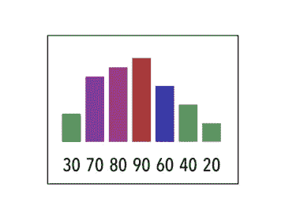

# 在 SwiftUI 中将动画链接在一起以构建条形图

> 原文：<https://betterprogramming.pub/linking-animations-together-to-build-bar-charts-in-swiftui-6a51e3c9bb94>

## SwiftUI 2 中的条形图

一个原生 SwiftUI 条形图。作者的动画。

如果你比较 UIKit 和 SwiftUI，你仍然会发现前者在相当多的领域——有人会说——领先于后者。事实上，开发商丹尼尔·科恩·金迪肯定会同意这种观点。他在 UIKit 下开发了一个名为 [Charts](https://github.com/danielgindi/Charts) 的软件包，这个软件包本身已经成为一个标准。这是一个帮助你创建八种不同类型的图表、饼图和曲线图的软件包，并且可以对它们进行大量的定制，包括一些令人惊叹的动画。

虽然它很优秀——而且我相信可以用`UIRepresentable`在 SwiftUI 中实现——但我认为尝试在本地重新开发它会更有趣。至少是非常小的一部分。通过这样做，我们可以开始更多地了解 SwiftUI 仍在发展的一些领域。

让我们从构建条形图的一些简单代码开始。大概是这样的:

简单的本地 SwiftUI 条形图。

这张图片背后的代码如下所示。简而言之，它只是一个不同颜色矩形的集合，标签排列在它所在的`HStack`的底部:

条形图代码

这是一个好的开始，但我希望有三个问题会引起你的注意:

*   数据都保存在视图本身中。
*   条形的颜色与数据集相关联(如，固定)。
*   它可能会有趣得多——动画，有人想看吗？

让我们努力应对这些挑战。先做动画吧。会有多难…对吗？不对。

动画条形图。

下面的代码说明了我是如何做到的。我使用线程将动画帧链接在一起，显示了 SwiftUI 中我仍然缺少的主要链接之一——这是一种明显的定时/链接动画的方式。它几乎可以工作，如果你原谅第一个条出现时数字下滑。它还说明了许多应用程序开发人员在 SwiftUI 布局中发现挑战的第二个领域。几个月前我用 SwiftUI 写了一篇[关于布局](https://medium.com/better-programming/layout-in-swiftui-with-alignment-guides-fef821e7e06e)的文章。

我知道你在想什么:动画还行，就是有点红不是吗？你会在这篇关于色彩的文章中找到下一个挑战的答案。让我们为`drawBar`视图添加一个函数，使用 HSB 值来解决我们的着色难题:

这会给我们一些颜色:

带有自动生成颜色的条形图。

当然，你可以稍微摆弄一下。这是另一个版本，使用不同的计算方法得到不同颜色的集合。事实上，我想我更喜欢它。这是您在销售线索图像上看到的功能:

带有自动生成颜色的条形图。

*注:我把* `*jump*` *的值溜进了* `*drawBar*` *的参数表里来做这个工作。而我(又一次)作弊，用了神奇的数字 7，也就是小节数。*

非常欢迎你提出自己的版本。为什么不试一试？

这留给我们最后一个需要解决的挑战——我已经在这篇关于设置值的文章中回答了这个挑战。我要用一个可观察的物体(选项 5)来解决这个问题。这个想法是随着时间的推移输入不同的值，所以我得到了一个条形图，它显示了您从外部提供的多个集合。将所有这些放在一起，我们得到了这个，它几乎和图表一样好…尽管不要告诉大卫我说过:

SwiftUI 原生动画条形图。

看起来很眼熟，不是吗？现在是最后一部分:使用自动生成的颜色方案的动画条形图。我一次又一次地用点击的手势在 GIF 中重新加载一个条形图。这是你正在看的 GIF 背后的最终代码。它是已经呈现的代码的超集。配色方案与条码编号相关联，而不是与数值相关联:

这就把我带到了文章的结尾。在接下来的几天里，我会对其他类型的图表做一些类似的事情。敬请关注。

保持冷静，继续编码。