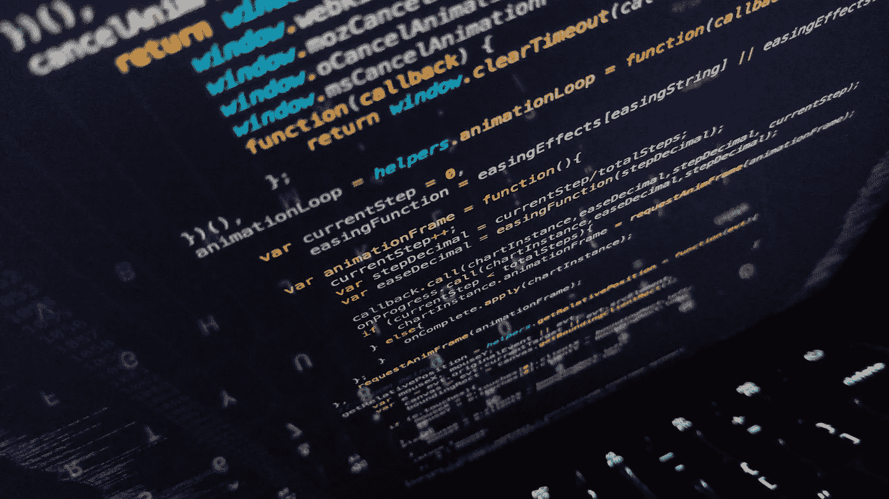

# 在 SwiftUI 中使用 AnimatableModifier 链接动画

> 原文：<https://betterprogramming.pub/linking-animations-using-animatablemodifier-in-swiftui-30269f99bef0>

## 利用带有 SwiftUI 动画修改器的组合框架



照片由[欧文·史密斯](https://unsplash.com/@mr_vero?utm_source=unsplash&utm_medium=referral&utm_content=creditCopyText)在 [Unsplash](https://unsplash.com/s/photos/animation?utm_source=unsplash&utm_medium=referral&utm_content=creditCopyText) 拍摄

动画毫无疑问是 iOS 的命脉。在 SwiftUI 中很容易大部分实现。这当然是假设你不想把你的动画链接在一起，遗憾的是，苹果似乎还没有把这一选项加入到大计划中。但是并没有失去一切，因为通过一点横向思考，我们可以找到克服这个缺点的方法。和我一起踏上旅程，看看如何做到这一点。

第一想法——当然，如果有关的计时是有规律的，你可以使用我在本文[中提到的计时器。他们将在很大程度上发挥作用，尽管挑战不在于常规，而在于非常规。](/using-timers-and-delays-in-swiftui-2-1362f664f013)

也就是说，有一个比使用定时器更好的 SwiftUI 解决方案。一个 SwiftUI 解决方案，使用原生的 AnimatableModifier 来跟踪和报告它已经完成了多少动画值。

当然，您需要定制想要链接在一起的动画，但除此之外，它工作得很好。

在这个例子中，给例程的`animNumber` I 是物体绕一个圆移动的度数。我使用 rounded 来确保我不会被舍入错误所困扰，我比较单个值，因为我希望它触发一次，而且只触发一次。

同时使用该例程的 SwiftUI 代码如下所示:

这段代码使用了我在另一篇文章中定义的延迟方法，看起来像这样。

```
func delay(_ delay:Double, closure:@escaping ()->()) {

DispatchQueue.main.asyncAfter(deadline: DispatchTime.now() + Double(Int64(delay * Double(NSEC_PER_SEC))) / Double(NSEC_PER_SEC), execute: closure)}
```

2 秒钟后，它更新我想在屏幕上显示的文本对象，然后开始旋转它。当`chainEffect`修改器检测到你达到了大约 360 度时，它会触发`releaseMessage`,该文本会显示单词数组中的下一个单词。


动画单词链

你可以在这里看到的下一个结果是上面旋转文本的动画 GIF。就这么简单。

但是我刚刚展示的代码有一个小问题。我应用的动画是针对整个对象，而不是单个对象。想象一下，你想让单词一个接一个地出现，每个单词都淡入。

为此，首先我定义了我想要显示的文本单词的视图:

这个函数像上一个函数一样调用修饰符，有两个参数，第一个是文本内容，第二个是它的索引。我需要索引，因为所有的`TextWord`视图将同时接收到`rMessage` `passThroughSubject`，我想选择一个特定的视图。

接下来是修饰符`ChainEffectV`的代码:

代码几乎与另一个`ChainEffect`方法相同，除了我改变了完成条件。

最后下面是新的`ContentView.swift`，它在一个循环中多次调用`TextView`。与上一个解决方案不同的是，这个解决方案的效率要高得多，因为它在我们尝试制作动画之前就布局了整个显示:

最终输出如下所示:


第二个动画单词链

所有这些都让我想到这篇短文的结尾。感谢阅读。