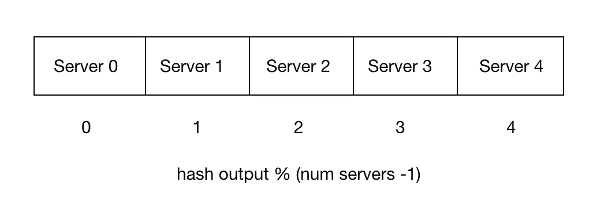
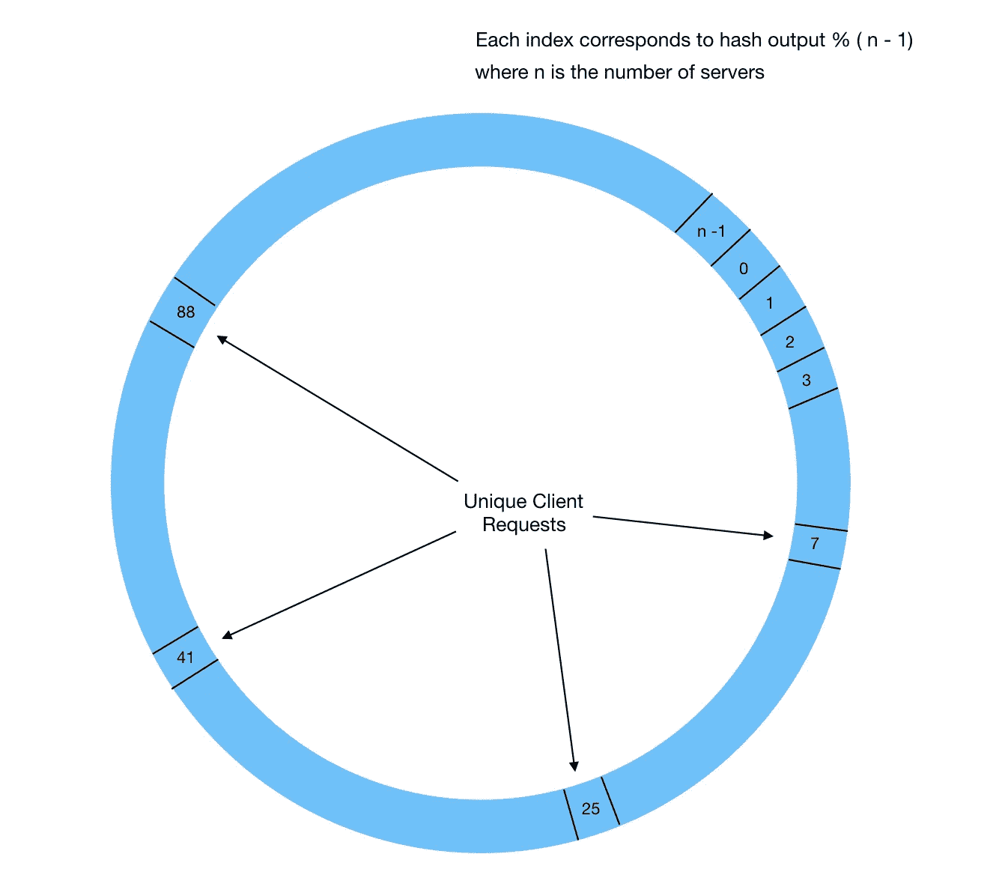
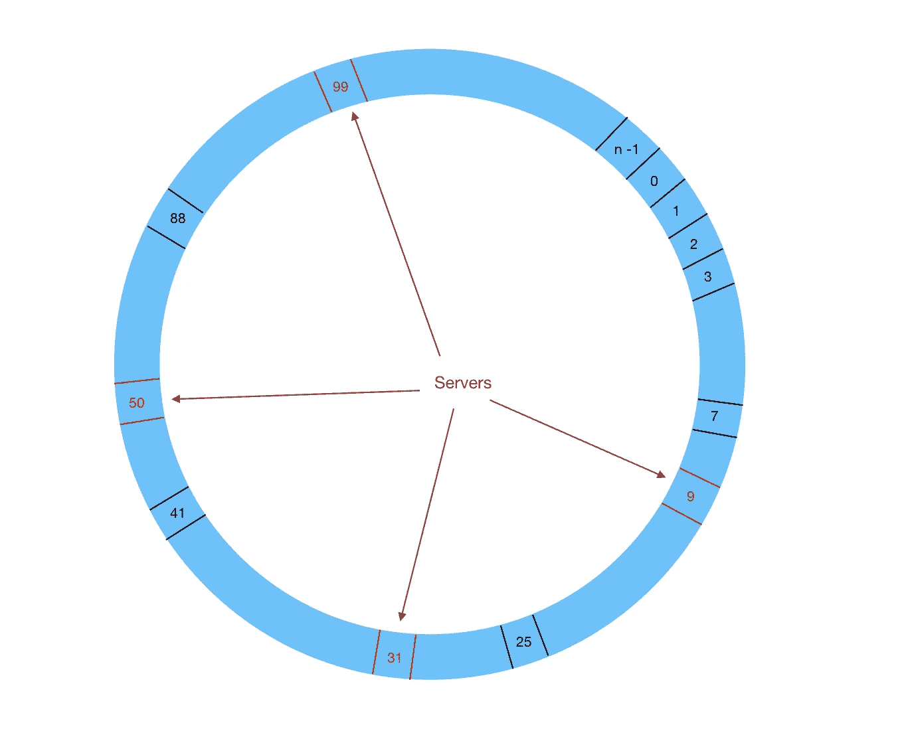
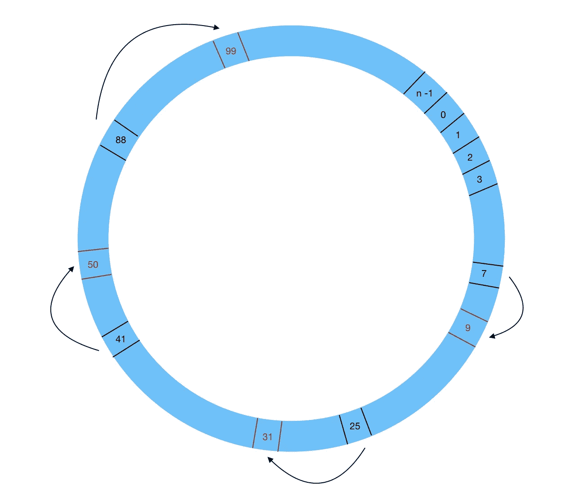

# 负载平衡器如何使用一致散列来分发请求

> 原文：<https://betterprogramming.pub/load-balancers-and-consistent-hashing-in-6-minutes-b5fc460aea4e>

## 六分钟内完成负载平衡器和一致散列

柴坦尼亚电视台在 [Unsplash](https://unsplash.com?utm_source=medium&utm_medium=referral) 拍摄的照片

# 垂直与水平缩放

在整体架构中，客户端通常向一台服务器发出请求。随着请求数量开始增加，单个服务器没有足够的能力来处理所有的请求。

垂直扩展可以是一种选择，即向服务器添加更多的 CPU/RAM。在遇到硬件限制之前，这个选项只能工作这么长时间。

在大多数情况下，增加更多服务器的水平扩展通常是更具可扩展性的替代方案。

垂直与水平比例

# 使用负载平衡器重定向请求

当我们水平扩展时，请求被定向到负载平衡器，而不是直接定向到服务器。

负载平衡器的工作正如其名称所描述的那样:它的目的是通过尽可能均匀地分配请求来平衡每个服务器上的负载。

## **哈希函数和模(%)**

将具有唯一标识符(例如 IP 地址)的所有传入请求被假定为均匀随机的。

使用散列函数，我们能够获得一个输出值，之后我们应用模函数来获得对应于负载平衡器应该将请求定向到的服务器的数字。

1.  哈希(IP 地址)→输出
2.  服务器数量的输出百分比-1 →服务器 ID

使用良好的哈希函数来确保输出值分布在一个值范围内以提高随机性是很重要的。然后，模函数保证服务器 ID 在 0 的范围内。(服务器数量-1。)

## 可视化映射

让我们后退一步，想象一下如何使用数组作为数据结构将每个请求映射到服务器。

在下面这个简单的例子中，数组的索引直接映射到服务器 ID，但是在生产环境中不一定是这样。因此，利用像数组这样的数据结构可以让我们更灵活地将输出映射到我们喜欢的服务器。

将输出映射到服务器的数组数据结构

# 当我们添加额外的服务器时会发生什么？

到目前为止，我们已经假设了固定数量的服务器。然而，由于我们选择了水平扩展，我们应该能够根据自己的意愿添加或删除服务器。

不幸的是，简单地使用散列函数和取模会影响其他请求的处理和重定向。让我们通过下面的例子来理解负面影响。

假设我们有五台服务器，在对用户的 IP 地址进行散列后，我们得到的散列值是 88。如果我们取(88 % 5)的值，我们得到 3。在这种情况下，负载平衡器将请求重定向到服务器 3。

但是，如果我们决定添加一个额外的服务器，我们将得到一个值(88 % 6)，这个值反过来将请求重定向到服务器 4。

## 变革的成本

这种重定向可能看起来微不足道，但是当服务器不是无状态的时，这是有代价的。尽管 HTTP 是一种无状态协议，但一些服务器可能会选择在缓存中存储一些与用户相关的数据以进行优化。

例如，服务器可以选择存储会话日志来记住用户，以减少身份验证的频率。

因此，如果具有特定 IP 地址的用户将被路由到另一台服务器，那么前一台服务器上的缓存需要失效。由于这种变化同样会影响所有其他传入的请求，因此服务器上的所有缓存都需要失效。

这里的变化成本过高，尤其是在同时处理数万台服务器时。那么，在添加或删除服务器时，如何才能减少对其他服务器的影响呢？

# 一致散列法

解决方案是使用一致的散列法。让我们先试着用三个步骤来形象化这个概念。

## 步骤 1:将请求映射到环上的位置

现在，让我们想象一个圆形数组，而不是一个规则的数组。类似于数组，每个请求现在都映射到散列环上的一个位置。

一个哈希环，其中每个客户端请求映射到一个索引

## 步骤 2:将服务器映射到环上的位置

因为每个服务器都有一个 ID，所以我们可以将应用于 IP 地址的相同散列和模函数应用于服务器 ID。让我们假设所选择的散列函数是最优的，并且我们在 IP 地址和服务器 ID 之间没有冲突。

某些索引现在被映射到服务器

## 第三步:顺时针移动

既然我们已经将请求和服务器映射到一个环上，那么最后一步就很简单了。

对于每个请求，我们只需以顺时针方式找到其右侧最近的服务器。例如，映射到索引 7 的传入请求由映射到索引 9 的服务器提供服务。

# 一致哈希如何最大限度地减少对其他服务器的影响？

由于请求由最右边的服务器提供服务，因此服务器数量的变化最多会影响一个其他服务器。

在上面的示例中，添加了一个新服务器，它映射到索引 95。映射到索引 88 的请求现在由映射到索引 95 的新服务器提供服务，而不是以前映射到索引 99 的服务器。

在这种情况下，只有映射到索引 99 的服务器需要使其缓存无效。类似地，如果服务器被移除，下一个服务器的邻居将接管负载，而其他服务器不会受到影响。

在寻找最近的邻居时，一致散列的概念避免了强加在其他服务器上的改变的昂贵成本，并且将成本降低到常数。

# 虚拟节点

## 请求并不总是随机的

在理想情况下，请求是均匀随机的，每个服务器都有均匀的负载。

然而，现实中很少出现这种情况。例如，可能有更多的请求来自某个特定的区域，这意味着与其他服务器相比，某个服务器的负载更高。

为了减轻负载，我们需要在映射到请求的索引和最近服务器的索引之间放置更多的服务器。给定固定数量的服务器，我们能做到吗？

## 使用多个哈希函数

简短的回答是*是的*。回想一下，每个哈希函数都是不同的，并且返回不同的输出。

如果我们获取服务器 ID 并用三种不同的散列函数对其进行散列，我们最终会得到三种不同的输出。如果我们在哈希环上映射这三个不同的值，它们将位于不同的位置。

在服务器 ID 上使用多个散列函数的想法在散列环上创建了虚拟位置，或者我们称之为虚拟节点。因此，我们在环上有更分散的服务器位置，这可以帮助减少每个服务器上的负载。

# 最终注释

我自己对系统设计确实是新手，但是最近，我对理解这些高级架构产生了兴趣。通过写作和解释，我对这个话题有了更深的理解，我希望它也能帮助你理解这些概念。

如果你一路走到这里，感谢你的阅读！我也分享了我在下面使用的一些资源。

# 资源

*   [YouTube 视频](https://www.youtube.com/watch?v=K0Ta65OqQkY)
*   [YouTube 视频](https://www.youtube.com/watch?v=tHEyzVbl4bg)
*   [为什么在哈希中使用模运算符？— Quora](https://www.quora.com/Why-is-the-modulo-operator-used-in-hashing-What-characteristics-makes-it-ideal-in-calculating-location-of-values-in-a-hash-table)
*   [一致散列—Toptal.com](https://www.toptal.com/big-data/consistent-hashing)