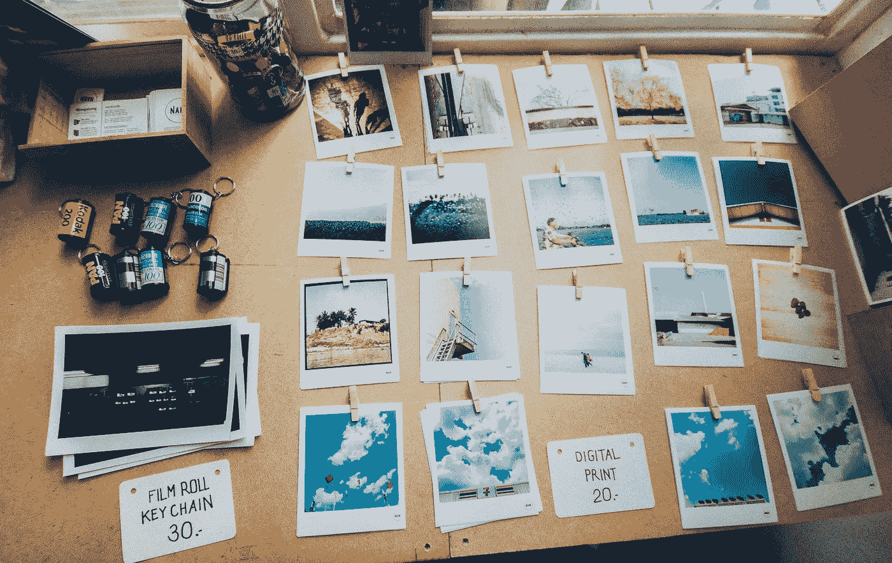

# 使用 Coil 从 Android 上的云存储中加载图像

> 原文：<https://betterprogramming.pub/loading-images-from-cloud-storage-on-a-kotlin-android-app-d1574a059e04>

## 救援的协程和扩展函数



照片由 [Soragrit Wongsa](https://unsplash.com/@invictar1997?utm_source=unsplash&utm_medium=referral&utm_content=creditCopyText) 在 [Unsplash](https://unsplash.com/s/photos/polaroid?utm_source=unsplash&utm_medium=referral&utm_content=creditCopyText) 拍摄

如果你正在开发一个 Android 应用程序，并且你正在云存储中为 Firebase 存储图像，以便稍后在你的应用程序中显示，你可能正在使用一个图像加载库，如 [Glide](https://github.com/bumptech/glide) 、 [Picasso](https://github.com/square/picasso) 、 [Fresco](https://github.com/facebook/fresco) 或 [firebase-ui-storage](https://github.com/firebase/FirebaseUI-Android/blob/master/storage/README.md) 。是的，这些库可以完成这项工作，但是如果我告诉你有一个更愉快和更有效的方法呢？

在本文中，我将向您介绍这个新来的家伙， [**Coil**](https://coil-kt.github.io/coil/) **，**，并且我将向您展示如何使用它用较少的样板代码加载您的云存储映像。
我假设你已经熟悉 Firebase 的云存储，并且已经知道如何在 Android 应用程序中使用它。如果没有，你可能想看一看[文档](https://firebase.google.com/docs/storage)。

# Coil(协同程序图像加载器)

Coil 是一个用于 Android 的开源图像加载库。与其他预先存在的库(Glide、Picasso 等)不同，Coil 完全是在 Kotlin 中构建的，并由协程支持。也是:

*   **易于使用:**因为它利用了一些 Kotlin 语言的特性，比如 Kotlin 扩展函数，这可以让你保持代码简洁明了。
*   **轻量级:**给你的 APK 加~2000 法，和毕加索差不多，比 Glide 少一点。
*   **快:**它的速度与毕加索和 Glide 相当，如[这个基准](https://proandroiddev.com/coil-vs-picasso-vs-glide-get-ready-go-774add8cfd40)所示。

# 入门指南

因为 Coil 使用的是 Java 8，前提条件之一就是你在你的 Android 项目中启用 Java 8。您可以在模块的`build.gradle`文件中这样做:

启用 Java 8

然后，您将它添加为同一个文件的依赖项:

```
dependencies {
    // ... other dependencies
    **implementation 'io.coil-kt:coil:0.11.0'**
}
```

## 使用

使用 Coil 最简单的方法是调用库提供的`ImageView.load()`扩展函数:

```
// URL
imageView.**load(**"https://www.example.com/image.jpg"**)**

// Resource
imageView.**load(**R.drawable.image**)**
```

您还可以在尾随 lambda 上指定一个`placeholder`或任何其他附加配置:

```
imageView.**load(**"https://www.example.com/image.jpg"**)** **{**
    **placeholder(**R.drawable.image**)**
    **transformations(**CircleCropTransformation()**)**
**}**
```

除了扩展功能之外，Coil 还提供了其他加载图像的方法，比如[请求](https://coil-kt.github.io/coil/requests/)和[图像加载器](https://coil-kt.github.io/coil/image_loaders/)，为了简洁我就不赘述了。但是你可以在他们的文档中了解更多。

# 面向 Firebase 的 Coil Plus 云存储

假设您在 Firebase 的云存储上存储了一个图像，可以使用路径“users/me/profile.png”来访问它。要在你的 Android 应用程序中的`ImageView`上显示这张图片，你可能需要首先获取它的`download URL`，然后将它传递给 Coil，正如文档所建议的那样:

使用 Coil 从云存储中为 Firebase 加载一个映像

看起来很简单吧？但是如果我告诉你即使这样也可以简化呢？这就是[点火线圈](https://firebaseopensource.com/projects/rosariopfernandes/firecoil/)的用武之地。

# 火焰线圈:火焰基座和火焰线圈

[firecoil](https://firebaseopensource.com/projects/rosariopfernandes/firecoil/) 是一个开源库，允许你通过简单地提供图像的`StorageReference`来用 coil 加载图像。要使用 firecoil，您需要将`jitpack` maven 添加到项目的`build.gradle`文件中:

```
repositories {
    // ...
    **maven { url 'https://jitpack.io' }**
}
```

接下来，将 firecoil 依赖项添加到模块的`build.gradle`文件中:

```
**implementation 'com.github.rosariopfernandes:firecoil:0.2.0'**
```

现在有了 firecoil，你不再需要获得下载网址。您可以简单地将您的`StorageReference`传递给库提供的`ImageView.load()`扩展函数:

使用 firecoil 从云存储中为 Firebase 加载一个映像

由于 firecoil 是在 coil 的基础上构建的，所以您还可以使用一个尾随的 lambda 来指定其他配置:

使用 firecoil 和附加配置从 Firebase 的云存储中加载映像

就是这样！有了这个简单明了的代码片段，您的应用程序现在应该可以显示漂亮的图像了。

# 资源

*   GitHub 上的线圈:[https://github.com/coil-kt/coil](https://github.com/coil-kt/coil)
*   GitHub 上的 fire coil:【https://github.com/rosariopfernandes/firecoil 
*   线圈文件:【https://coil-kt.github.io/coil/ 
*   firecoil 文档:[https://firebaseopensource . com/projects/rosariopfernandes/fire coil](https://firebaseopensource.com/projects/rosariopfernandes/firecoil)
*   Glide vs. Picasso vs. Coil 基准:[https://proandroiddev . com/Coil-vs-Picasso-vs-glide-get-ready-go-774 add 8 CFD 40](https://proandroiddev.com/coil-vs-picasso-vs-glide-get-ready-go-774add8cfd40?gi=f21b6d717eec)