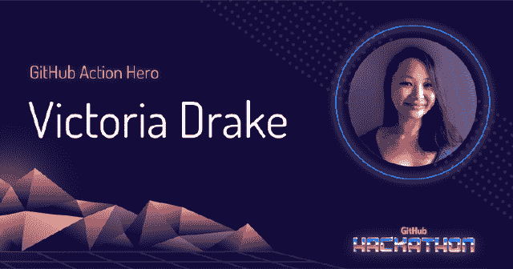

# 妈妈，我是 GitHub 动作英雄

> 原文：<https://betterprogramming.pub/look-mom-im-a-github-action-hero-bce746a66914>

## GitHub 博客为他们的 GitHub 动作英雄系列采访了我

照片来自 GitHub 博客。

GitHub 最近采访了我，因为他们的博客社论题为 [GitHub 动作英雄:维多利亚·德雷克](https://github.blog/2020-06-26-github-action-hero-victoria-drake/)。下面是原面试问题和我的回答的幕后窥视。

# 你的行动名称是什么？

在我创建的几个动作中，我有两个当前最喜欢的。一个是 [hugo-remote](https://github.com/victoriadrake/hugo-remote) ，它可以让你不断地将一个 [Hugo](https://gohugo.io/) 静态站点从一个私有的源代码库部署到一个公共的 GitHub 页面库。这使得源代码库的内容保持私有(例如，您未发布的草稿)，同时仍然允许您使用 GitHub 页面拥有一个公共的开源站点。

第二个是[django-安检](https://github.com/victoriadrake/django-security-check)。这是一种持续检查您的生产 Django 应用程序没有各种安全错误配置的简单方法。您可以将它看作是您在繁忙项目中的 CI/CD 小助手——一个安全提示！

# 你是如何开始使用软件工具的？

当我还是个孩子的时候，我花了几个暑假和朋友一起用 LPC 编写了一个巨大的中世纪幻想世界 MUD(多用户地下城，就像一个多人角色扮演游戏)。它完全基于文本，通过 Telnet 构建和播放。我很早就爱上了终端，也学到了很多面向对象编程和基于原型编程的知识。

我成为了一名自由开发人员，并有幸参与了各种各样的客户项目。意识到公司雇佣有经验的开发人员的困难，我建立了 [ApplyByAPI](https://ApplyByAPI.com) 来帮助他们。正如你所想象的，它允许候选人通过 API 申请工作，而不是通过电子邮件发送简历。它基于 [Django](https://www.djangoproject.com/) 框架，所以在这个过程中，我学到了更多关于构建软件可重用单元的知识。

当我成为[开放 Web 应用程序安全项目(OWASP) Web 安全测试指南(WSTG)](https://github.com/OWASP/wstg) 的合著者和核心维护者时，我对基于原型的、可重复的方法如何帮助构建安全的 Web 应用程序有了更广泛的认识。世界各地的组织都认为 WSTG 是测试 web 应用程序安全性的最重要的开源资源。我们已经通过在我们的知识库中使用 GitHub 动作来应用这种思想——稍后我会告诉你更多。

无论我是在创建一个开源工具还是领导一个开发团队，我童年的经历仍然影响着我今天对编程的看法。我努力创建像 GitHub Actions 这样的可重复的软件单元——只是现在，我为现实世界中的大型企业制作它们！

# 你打造的 GitHub 动作背后的故事是什么？你为什么建造它？

如今，在构建安全的应用程序时，开发人员承担了很多责任。我是一家网络安全公司的全职高级软件开发人员。我发现，当我创建能帮助我和我的团队实现预期结果的系统和流程时，我的效率最高。所以我用我的空闲时间来构建工具，让其他开发人员也能轻松地构建安全的软件。我的行为有助于自动化包含的、可重复的工作单元，这些工作单元可以给开发人员的一天带来很大的不同。

# 你对这一行动或其他行动有未来的计划吗？

是啊！我一直在寻找像 GitHub Actions 这样的工具来提高技术团队的速度，无论是在工作中还是在我的开源项目中。还记得开放 Web 应用程序安全项目吗？在我领导 OWASP 的工作中，我支持使用 GitHub Actions 来提高自动化，以保持质量，安全地将新版本部署到 web，甚至构建 WSTG 的 pdf。

我们一直在寻找新的方法，让 GitHub Actions 让我们的生活更轻松，让我们的读者的项目更安全。

# 你最喜欢 GitHub Actions 的哪个功能？

我喜欢我可以使用熟悉的可移植技术来构建一个动作，比如 Docker。对于协作者来说，操作也很容易，因为在 Dockerized 操作的情况下，您可以使用您的团队熟悉的任何语言。这在拥有多语言团队和环境的大型组织中尤其有用。运行这些可移植的任务没有任何复杂的依赖性，并且您不需要学习任何特殊的框架来开始。

我关于 GitHub 动作的第一篇博文甚至描述了我如何使用一个动作来运行 Makefile！这对于希望通过使用 GitHub 动作来更新管道的大型遗留应用程序尤其有用。

# 在构建 GitHub Action 的过程中，你面临的最大挑战是什么？

GitHub Actions 最大的挑战并不在于 GitHub Actions，而在于遗留软件和公司文化的转变。

迁移遗留软件总是具有挑战性，尤其是大型遗留应用程序。转移到现代的 CI/CD 过程需要在软件层面、团队层面的改变，甚至涉及到个体开发人员的思维转变。当将遗留代码转换到现代管道时，拥有一个像 GitHub Actions 这样的工具会有所帮助，它既无缝又现代又熟悉。

# 关于你的经历，你还有什么想分享的吗？

当我解决了一个挑战，使开发安全软件在未来变得不那么困难时，我最开心，无论是对我自己还是对我领导的技术组织。有了像 GitHub Actions 这样的工具，大量的精神负担可以被转移到自动化过程中——比如免费获得一个完整的大脑！这可以极大地帮助那些准备扩大开发产出的组织。

在网络安全领域，创建可移植和可重用的软件不仅让开发人员的生活更轻松，还有助于使整个工作流程可重复。反过来，这使得软件开发过程更加安全。有了智能流程，技术团队更开心了。不可避免的结果是，他们也会为客户开发更好的软件。