# 在所有错误的地方寻找度量标准

> 原文：<https://betterprogramming.pub/looking-for-metrics-in-all-the-wrong-places-db63ca81d4e9>

## 我们能在拉式请求统计中找到有意义的工程度量吗？分析我公司四年数据的教训

卢卡斯·布拉塞克在 [Unsplash](https://unsplash.com?utm_source=medium&utm_medium=referral) 上的照片

# 科学管理与计量的诱惑

它通常开始足够无辜。作为一名新上任的技术经理、团队领导、敏捷教练，或者其他一些有领导和影响力的职位，你发现自己在想，“*我如何知道我的团队表现如何？我如何知道我们的工作是否高效？我怎么知道我们有什么影响？如果我们调整工作方式，会有什么变化？我们如何衡量？如何才能提高？*

当思考这些问题时,“度量”这个词会懒洋洋地掠过我们的脑海，这有什么奇怪的吗？如果你只是打开互联网随便找一页开始阅读，很可能我们会以数据为主题。我们生活在一个充斥着 sli、SLO 和 SLA 的世界里。KPI 和 OKR 的世界。我们生活在“大数据”大爆炸的余晖中，数据驱动的决策制定目前很流行。

为什么不呢？度量可以是预测性的。在 Nicole Forsgren、Jez Humble 和 Gene King 撰写的精彩书籍 [*Accelerate*](https://itrevolution.com/book/accelerate/) 中，作者展示了在文化、领导力和技术实践方面进行多年研究的结果。他们发现了预测高绩效组织的四个指标，包括组织和非商业绩效。

他们的四个预测指标是:

1.  交付周期(从提交到生产)
2.  部署频率
3.  平均恢复时间(MTTR)
4.  更改失败百分比

对于作者来说，他们选择了反映组织整体的度量标准，这既有趣又有启发性，而且是深思熟虑的。这些指标都没有触及传统上用来衡量“开发人员生产力”的任何东西。这就是我们作为开明的改革工程经理开始害怕黑暗面的诱惑和我们前辈的错误的地方。

我以前写过关于使用度量来衡量开发人员绩效的陷阱。这个领域充斥着精辟的名言，如戴明所说的*“只要有恐惧，你就会得到错误的数字】*，当然还有戈德拉特的名言*“告诉我你如何衡量我，我会告诉你我将如何表现。”*

我们还应该对进入科学管理领域倍加警惕。精益运动的核心思想是消除浪费，这与提高效率几乎是一回事。这表明我们需要一个衡量效率的标准。精益通常建立在迭代改进的敏捷原则之上，并建立在小批量的基础上，同样“改进”意味着我们需要度量——否则我们如何知道我们是否做得更好？

但是我们知道泰勒主义。我们知道，将“科学管理”引入软件工程的尝试通常不会有好结果。软件工程师不是工厂工人。软件的生产不等同于冲压出具有设定公差的工厂零件，没有差异。它不能完全简化为一条生产线。从理论上讲，你在制造一辆汽车时节省下来的效率和质量收益可以重复用于下一辆汽车。软件，没那么多。

当然，虽然我们努力构建像小乐高积木一样的软件组件，我们可以重复使用并组装在一起，但我们的目标不是通过简化论消除差异，即使这样做效果很好。如果是这样的话，我们将会把编程的行为分解成越来越小的片段，直到我们最终找到一个人，他在软件生产线上唯一的工作就是检查并添加所有的分号。

事实上，我们有那份工作。它被称为语法检查器，并且是自动化的。在某种程度上，软件工程的部分工作是可重复的，我们努力通过编译器、CI/CD 管道和配置管理来实现自动化。然后，我们要么以开源的方式免费提供它，要么将其打包成“X 即服务”的模式。无论哪种方式，除了在病理情况下，我们可以假设在任何软件工程任务中至少有某种程度的新颖性。如果没有，我们就掏出信用卡，在每月账单上增加一项服务。

所以我们不是软件生产线上的工人。工作中的创造性元素会产生变化，而变化是不可预测的。查看软件交付度量有任何意义吗？毕竟，例如，参与生产基于软件的产品的人的工作并不关心降低每类的单位成本。

但是也许你已经意识到我的最后一个问题本质上是修辞性的。我刚刚写的所有东西可能都是自我辩护的精心练习，因为*当然，*我要去查看一下我们的 GitHub 指标。我在“商业智能”领域的一家[公司](https://www.hyperanna.com/)工作(尽管我在本文中表达的观点是我个人的观点)，我的使命是让数据驱动的见解民主化。摆弄数据几乎是我的工作。

幸运的是，有一些很好的理由来看待我们开发过程中的数据。对我们来说至关重要的是，精益制造的理念绝对适用。在与大规模生产的合同中，精益是关于引入一种工艺思维和理解系统中的工作流程。

我认为总体的*流量*仍然很重要。如果工作堆积在拉请求的后面而没有被合并，那可能不好。而且，科学的*管理*不说，还有科学的*方法*。如果我们心中有一个假设，我们当然可以开始收集数据，看看它是支持还是反对这个假设。

# 从拉取请求中可以获得哪些指标？

我之前提到过，我在一家商业智能领域的公司工作。由于我沉浸在“数据和分析”的问题领域，从数据开始是很自然的，尽管可能有点危险。作为技术人员，另一件我每天都沉浸在其中的事情是拉请求工作流。

我们的代码保存在 git 仓库中，托管在 GitHub 上。尽管我们围绕分支的开发实践已经随着时间的推移而发展，但是自从我们公司成立以来，有一件事情是不变的，那就是“拉式请求”出于几个原因，对拉取请求指标的分析似乎是一个自然的研究领域。

首先，我希望能够彻底测试我自己的产品——用我非常了解的数据集“喂”我们正在构建的工具。其次，在了解了我们可以利用的度量标准之后，我想了解随着时间的推移，我们的开发团队的“业务照常”会是什么样子。第三，我有一些具体的问题，我希望这些数据能够帮助我回答。

但是，首先，我们可以很容易地利用哪些指标？经过一点思考和对 GitHub API 的研究，我想到了这些:

*   拉取请求的数量
*   文件已更改
*   更改/添加/删除的代码行
*   提交次数
*   评论数量
*   合并前的天数

这些指标可以分为以下几个部分:

*   委托人【有风险！]
*   贮藏室ˌ仓库

我应该注意到，这个列表最初比较长，但是由于我希望以平面文件(CSV 格式)表示指标，由于我将用于分析的工具的当前限制，并且可能最重要的是，由于使用 GitHub API 回填历史数据而没有达到 API 速率限制所花费的时间，这个列表受到了限制。

# 提取数据

使用用 Elixir 编写的小脚本从 GitHub 中提取历史数据(只是为了好玩——作为一个自学练习)。为了让数据保持最新，我们向 GitHub 添加了一个 Webhook，它将在 pull 请求事件时触发，并指向 AWS Lambda。当一个 PR 以合并状态“关闭”时，我们将从该拉请求中提取一行数据，并将其写入数据库。

然后我们用我们自己的产品 Hyper Anna 来分析数据。我们把它配置成每晚自我更新。我必须指出，在这个项目的构思和实施之间的时间里，GitHub 收购并集成了“[拉熊猫](https://pullreminders.com/)”，它提供了许多相同的指标。还有其他可用的服务，如 [GitPrime](https://www.gitprime.com/) 和 [CodeScene](https://codescene.io/) ，它们超越了拉取请求，提供了更多的丰富性。这种丰富性是否转化为有用和可操作的东西是一个重要的问题。我不会亲自解决这个问题，因为这篇文章已经够长了，但是我注意到，正如在上一节中所讨论的，我不希望过于深入地追求度量标准。

我们有公关流程。我们有一些数据。我们有几个问题。看看我们怎么走。

# 我们想学什么？

我想回答三个主要问题，还有一个附加问题:

1.  是否有证据表明我们将公关流程用于学习和教育？
2.  我们是否保持拉取请求小，分支短命？
3.  我们有“发布危机”吗？
4.  额外的问题——数据中还有什么有趣的东西？

我们一次解决一个。

## 代码评审是有效的学习工具吗？

我之所以问这个问题，是因为我们的前任首席技术官总是有一种预感，我们可以通过我们的公关工作流程做更多的事情来相互学习和教育。如果我们要把这种严格和仪式强加给自己和他人，那应该是为了一个更高的目的。不仅仅是打勾。

这既是一个困难的问题，也是一个简单的问题，因为有一个相关的指标，“每个拉取请求的平均评论数”我们目前平均每个拉取请求有 0.04 条评论。那是…不多。

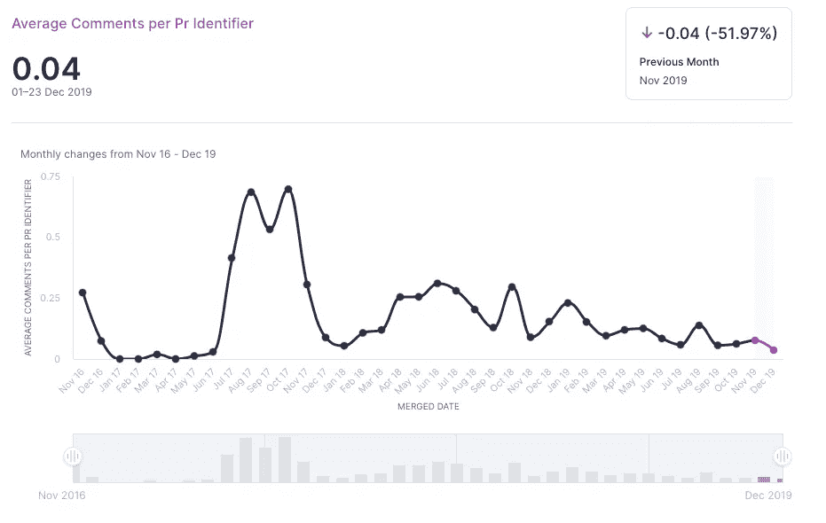

每月每个拉取请求的平均评论

左边的灰度有点模糊，但我们通常低于 0.1，我们在一个月内见过的最高值是 0.7。

如果我继续深入研究，我绝对有信心发现我们拥有的几个峰值是由一些小的异常值驱动的。因此，我们可以相当自信地说，我们没有花太多时间来编写拉取请求的注释。

这些信息有助于我们回答我们提出的问题吗？我倾向于否定，但我认为答案并不明确。

我可以用我自己对我们公司和我们工作方式的了解来扩充这张图表。在我们提交代码的三年里，我们通常会派出两到三个“团队”我们共处一地，大部分时间在办公室外工作，“做微服务”，尽我们最大的能力尝试设计事物和计划工作，以减少跨团队和软件组件的依赖性。我们也集体计划了很多工作，作为一个完整的团队，在我们的团队中。

所以也许没什么好谈的？我的假设是，我们预先或亲自解决了大多数架构问题，并发现了许多格式化程序和 linters 的格式和样式问题。如果工作不明确，通常会在开始实施之前进行讨论和计划。我相信我们的评论数量如此之低是因为我们的大部分沟通并不发生在 GitHub PR 工作流程中，并且我们提出的大多数 PR 没有引起任何争议。

我们确实有一些跨越团队和关注点的存储库。我们的部署工具和“前端”跃入脑海。还有一个古老的“巨石”(三年了，以巨石的标准来看是非常小的，但仍然如此)。我想知道我们是否会看到更多关于存储库跨越团队和关注点的争论？

按评论总数排名的前 10 个存储库

我可以根据存储库快速地将它分解，并根据总的评审意见找出“前 10 名”。我已经模糊了大部分存储库的名称，因为即使公开名称肯定不会泄露实现细节或 IP，但为了写这篇文章，我不需要讨论这个问题。

然而，数量级最高的“执行者”是我们的前端项目，它跨越了所有的团队和特性。接下来的两个是部署工具和旧的 monolith，正如我所猜测的。

这不是什么难懂的科学，但是我可以看到“交叉关注”和对 PR 的评论之间微弱的逻辑联系。我担心在没有进一步研究的情况下得出强有力的结论，但我会犹豫地建议，在我们公司，我们的团队将公关工作流程作为沟通和协作工具，只是作为最后的手段，大部分讨论发生在公关开始之前。

## 我们有“发布危机”吗？

是的，我们有。

我让 Hyper Anna 查看过去三个月拉取请求数量的“一周中的某一天”的变化，我被告知变化很大。特别是，周三比我们每天的平均水平高出 79%。

你能猜到我们什么时候发布吗？

如果你猜的是周三晚上，你就猜对了。

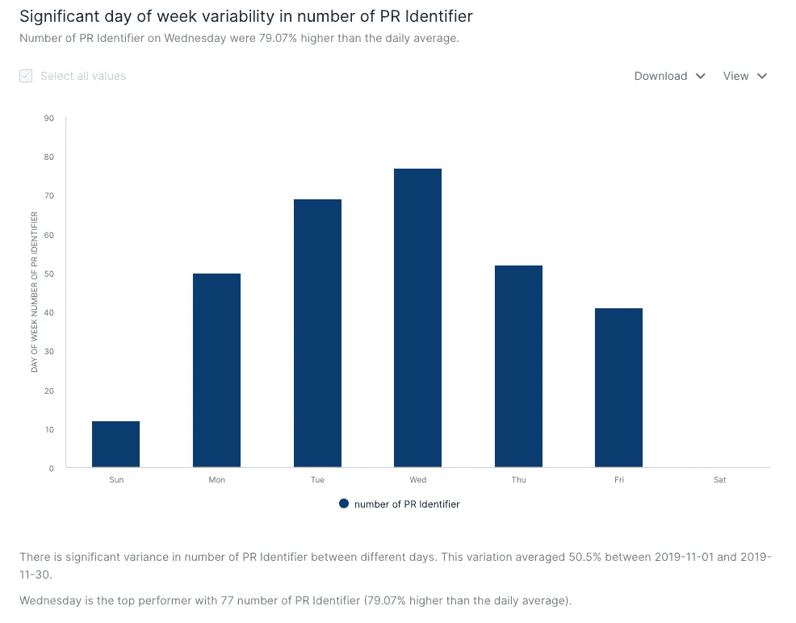

拉取请求数量的“星期几”分析

我们目前不断地将产品发布到我们的集成环境中，每天升级到试运行，每周升级到升级。这很有意思，因为即使有了集成的特性标记和“持续部署”的实践，我们的思想似乎仍然非常坚定地停留在生产部署上。

或者可能只是因为我们周一有很多会议和计划，然后在周四和周五就累了？

很难说，但这将是一个值得关注的有趣趋势，因为我们将继续推动日常生产，并最终实现连续生产部署。然而，真正的问题是:*这种模式有害吗*？常规的周三紧缩对我们有害吗？我在研究直觉和死后事件，但有趣的是，我觉得它确实影响了我们。

持续传递的智慧是，“如果疼，就多做几次。”

我认为——我强调这是我个人的观点——我们正在被“压扁”,因为我们遵循了这些建议，并试图更频繁地进行部署。海浪越来越近，我们被海浪冲击着。所以走得更快感觉我们会走进一个充满伤害的世界，但另一方面，如果波浪都融合在一起，就不再有“波浪”了，对吗？水位再高一点，我们就达到了一个新的基线。

我很好奇。我们会试试看。我会让你知道进展如何。

## 我们是否保持拉取请求小，分支短命？

这是一个个人项目。我以前写过关于基于主干的开发是[真正的启蒙之路](https://medium.com/better-programming/straight-to-prod-ca12205841fc)。当我加入我现在的公司时，他们对“ [git flow](https://www.atlassian.com/git/tutorials/comparing-workflows/gitflow-workflow) ”的解释很宽松，除了“开发”分支每周都会自动合并到“主”中，作为自动化发布周期的一部分。

我很难看到“开发”分支如何提供任何价值，因为在“开发”和“主”之间没有手动的关口或者额外的测试覆盖。有一个脚本在启动合并之前检查构建是否通过，但是当时大多数构建没有运行任何测试——并且“它编译”是一个非常低的 bar⁴.哦，有些项目是 Python 或原始 Javascript，所以它甚至不提供这种保证。(哦，我是一个懒散的悲剧…我鄙视工具对我注意力的影响，但我发现自己在这里达到了😱表情符号)。

当我提议删除 dev 分支时，阻力令人惊讶。然而，深入到提出的问题中，除了一两个围绕我们的修复过程的真正的技术异议(我们很快解决了)，大多数不情愿看起来纯粹是心理上的。

尽管如此，我们坚持去除“dev ”,并鼓励一种文化，以及出于评审目的的小的、短命的分支，直接合并到主文档中。

有用吗？这里感兴趣的主要指标是每个拉取请求的“平均变更”、“平均提交”和“平均合并天数”。

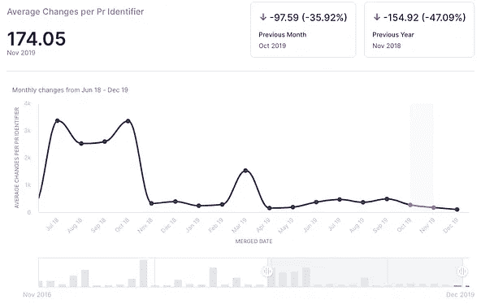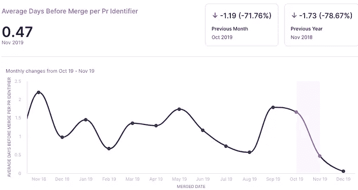

我们的关键指标—每个 PR 的合并、提交和更改前的平均天数

列出这三个指标，在我看来一切都相当稳定。我们可以看到，每个拉取请求平均不到 200 个更改，这个数字在大约一年的时间里一直保持稳定，除了三月份的一个短暂现象，如果我们愿意，我们可以深入研究。与前一年相比，下降幅度非常大，值得进一步研究。

我们现在有一个数字，但它是一个好数字吗？说来有趣，似乎还行。根据我们的回顾和非正式聊天，我们的拉取请求的规模感觉还可以。没有人抱怨它们太大或太小。因此，这张图表可能告诉我们的是，如果我们能在这个值附近保持稳定，我们应该没问题——我们似乎处于“适居区”。如果我们看到一个严重的峰值，这可能意味着有人不小心签入了一百万行日志文件(这以前也发生过！)，或者这可能是我们的纪律正在下滑的迹象，我们需要重新审视我们的工作方式。

接下来我们将看看“每次拉取请求的平均提交量”。该图在过去有一点起伏，但有趣的是在一年多的时间里一直保持稳定。当然，单看第二个图表，您不会知道这些提交中的每一个有多少变化。但是当我们将它与上面的图表结合起来时，我们会有一种感觉，我们在以稳定、规律的节奏工作方面做得很好。加上平均“合并天数”远低于“1”的事实，看起来我们的工作速度通常是一行代码在一天之内从工程师的手中流向我们的集成环境。我不相信这些指标是有预测性的，甚至不一定能说明什么，但是它们确实描绘了一幅相对稳定的代码流向生产的画面。

现在他们谈论“虚荣度量”，不是吗？想知道我对基于主干的开发的不断唠叨是否对开发实践有任何显著的影响，这是一种虚荣的度量吗？这是我想知道的事情吗？

我于 2018 年初加入该公司，但在认真尝试影响我们的分支战略和文化之前，我花了相当长的时间从阴影中狙击。因此，寻找这个问题的证据的一个可能的方法是检查逐年的变化，比如说，“每个拉取请求的平均变化”。

因此，我将采用“每个 PR 的平均变化”图表，并将其更改为年度粒度。结果图片如下，但我们可以看到 2019 年有非常明显的下降。我有理由相信(我将在下一节探讨)2018 年的峰值是由于数据中的异常值，但即使忽略 2018 年，2017 年和 2019 年之间的 PR 也有相当大的下降。我不会如此自负或对因果关系一无所知，以至于认为*实际上是*对我来说是一个“虚荣尺度”。然而，我可以引以为豪的是，作为一个团队，我们已经成功地以一种我们希望平滑我们的产品交付和开发实践的方式，实际上改变了我们的开发实践。

每个 PR 的平均变化，同比

## 在这一节中，我们将详细研究数据，这一切都分崩离析

到目前为止我们都很好。我们首先形成假设，然后检查数据并做出谨慎的判断，但不一定暗示因果关系。我们没有寻找统计意义。

然而，我现在热衷于做的只是浏览我们收集的数据，并保持好奇，看看是否有什么有趣的东西跳出来。有一件事我还没有考虑，那就是一段时间内拉取请求的数量。

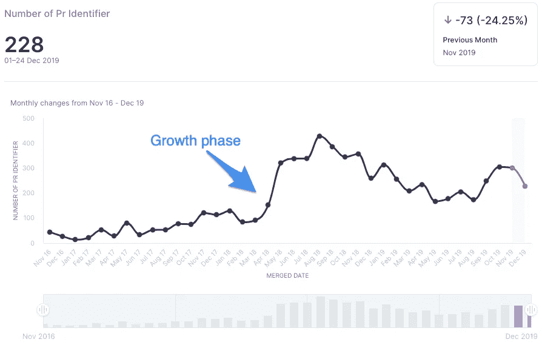

一段时间内拉取请求的数量

当我调出该图时，立即跳出的是从 2018 年 4 月开始的拉取请求数量的大规模持续峰值。这恰好是我们增加工程人员的时期，所以这很可能是由它引起的，或者至少是受它影响的。或者是因为我一直提倡更小的拉请求、特性标志和持续集成，所以可能正在编写相同数量的代码——但是它分布在更大数量的更小的拉请求上？

我们可以回头查看所有其他图表，但我宁愿让工具将它们绘制在一起，并告诉我们这些变化是否相关。首先，我将绘制 2018 年 10 月前后几个月的“拉取请求数量和更改数量”,我们在上面看到了峰值:

变更数量和拉取请求数量

我们在这里可以看到，进入代码库的变更也大幅增长，并且与拉取请求的数量密切相关。如果我们执行相同数量的工作，但是将它分散到更小的拉请求中，我们不会期望看到如此强的相关性。证据似乎支持这一观点，即这一峰值与我们的员工人数增加有关。正在做更多的工作。

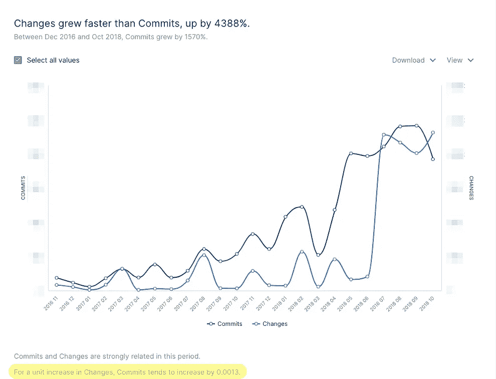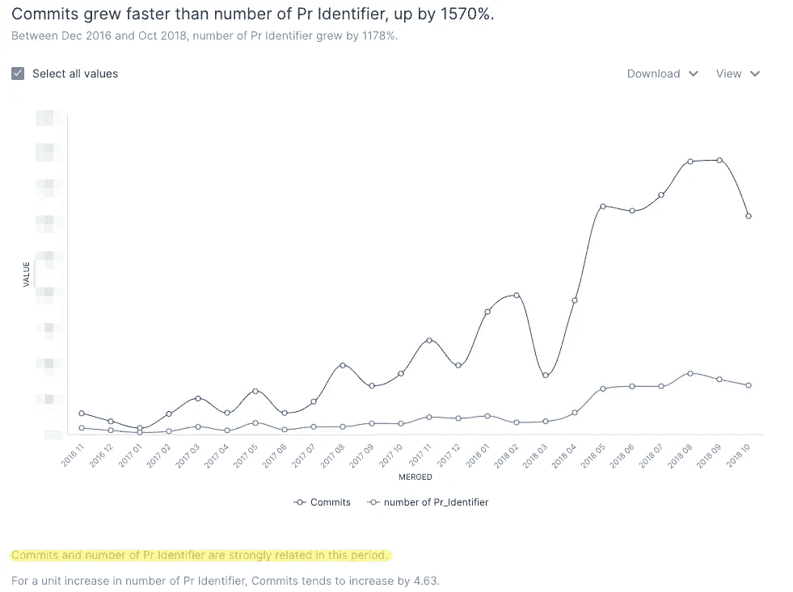

更改与提交和提交。与拉取请求的数量

为了更好地衡量(双关语)，我们将加入“更改与提交”和“提交与拉请求的数量”。从上面的图表中，我们可以看到这两个方面有很强的相关性。这太迷人了。在此期间，我们的工程人员几乎增加了一倍，但每个人的工作量大致相同。这让我开始怀疑是否有一个“自我调节”正在进行，或者是否大多数开发者都有相同的直觉，什么样的规模才是一个好的提交或一个好的公关。或者有没有可能存在某种“海绵”效应，即团队现有的文化可以吸收新成员，而不会失去他们的业务流程？

我们现在不会得到这个问题的答案——尽管我非常希望现在用“每次提交的更改”的比率计算来增强我的统计数据，以查看该比率的平均值如何随时间变化。正如我经常在研究论文中发现自己所写的那样，这将不得不“作为未来的工作”。

但是等等——我们应该扩大我们的时间范围，看看这个历史高点之后发生了什么。因此，我们将回到我们的“更改与提交”图表，但放大历史高点之后的时间段。

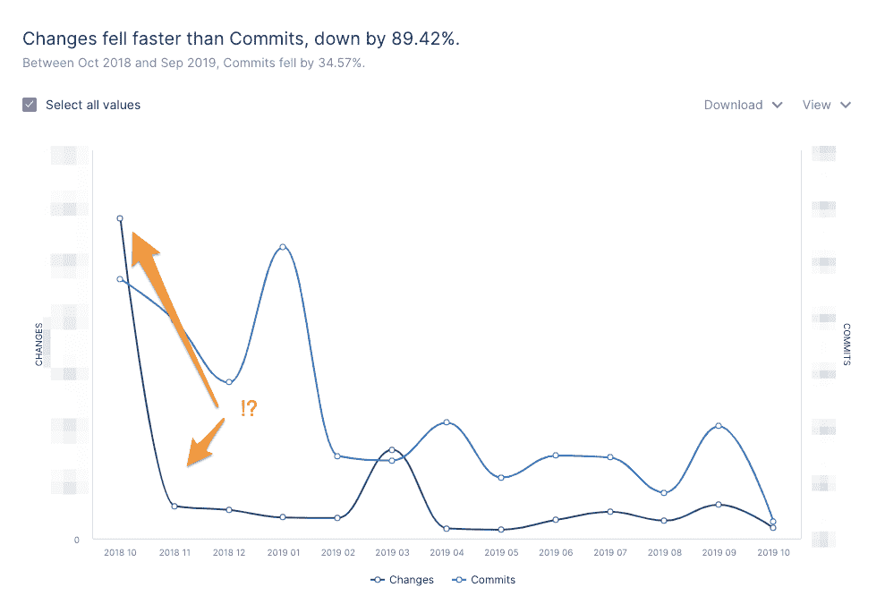

更改与提交—最近从 2018 年 10 月至今

我们可以在这里看到“变更”的巨大下降，而提交的数量却没有相应的下降。因此，尽管我们同样频繁地点击“提交”按钮，但被更改的代码却少得多。这是一个“嗯，哼！”瞬间。这是我没想到会在数据中看到的，因为它打破了我们在 2018 年 10 月之前观察到的模式。

我在脑海中构建的关于“开发者直觉”和“自我调节”的纸牌屋开始散开。现在的数据中有些东西说不通。为什么变化的数量会突然持续下降？

“更改”包括添加的代码和删除的代码。因此，尽管我相当肯定这些“变化”将是添加，我们将通过分别查看添加和删除来再次检查。

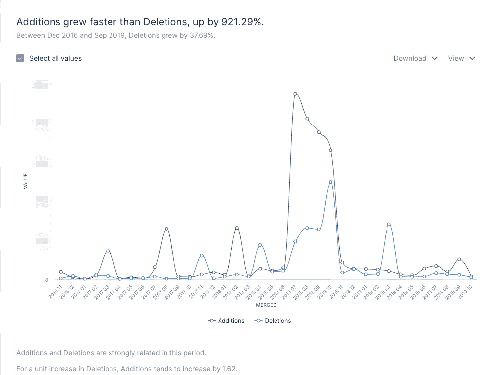

但是没有！我真的很惊讶。增删强相关！对此可以有多种解释，但最直接出现在脑海中的是“返工”。修改现有的一行代码相当于两次修改:删除和添加。因此，这可能意味着我们正在重新编写大量代码，要么重写现有代码，要么同时添加新代码和删除旧代码。

这张图表还通过代码展示了我们公司的历史。在我们的早期历史中，我们可以看到一些大规模的开发热潮，其中增加的内容激增，随后，人们可能会猜测，在删除激增的地方出现了一点清理。然后，我们会看到一个真正的大规模增加，并持续几个月，然后下滑到一个更有规律的模式。

另一个“留给未来工作”的比率计算将是增加对删除，这可能是代码变动的指示。但就目前而言，在 2018 年 10 月之前，我们仍然有一个神秘的增加高峰。

我将通过限制日期范围来放大该峰值，但将数据粒度更改为每周，以便我们可以看到该时间范围内的更多数据点。我没有附上这张图表的图片，因为就在我这样做的那一刻，我意识到我应该看看这段时间内的每日变化。每日添加图表如下:

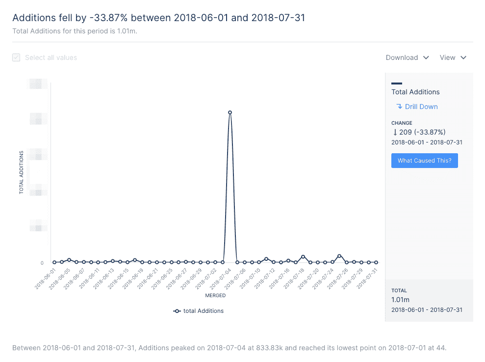

2018 年 7 月至 8 月间增加的代码

好吧。4 月 7 日有一个大高峰。看起来我们的“开发狂潮”可能是个例外。

为了验证这一点，我可能必须回到我们的原始数据源，但首先我需要知道在哪里寻找。4 月 7 日，我请安娜展示了存储库的新增内容，异常之处非常明显。

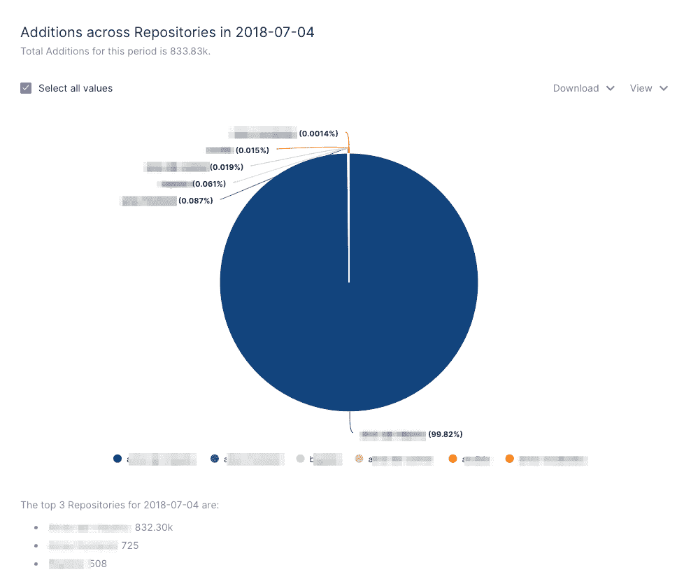

7 月 4 日跨存储库的新增内容

将峰值缩小到特定的日期和特定的存储库之后，我回到了 GitHib。只有七个拉请求需要检查，很容易手工完成。很快，我找到了罪魁祸首。有人在我们的 NLP 组件中加入了英语语言模型和代码。

现在我怀疑了，我回顾了整个“高峰”时期，按存储库划分，每周一次:

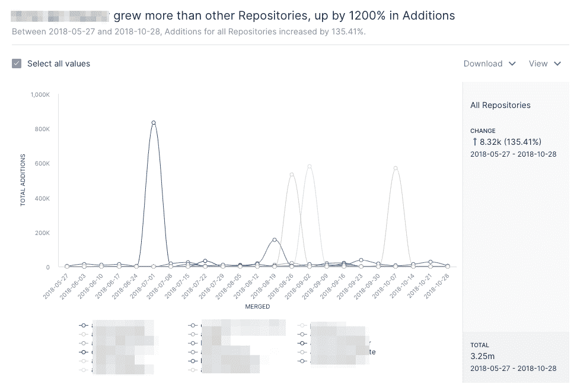

2017 年 7 月至 2018 年 10 月期间由存储库添加的内容

这些峰值中的每一个都远远高于基线，以至于它们让我相信它们在本质上是相似的——开发人员不小心犯了一些他们不应该犯的错误。我花了几分钟调查每一个问题，并确定我的怀疑是正确的。在每种情况下，我们都会发现一个提交，其中引入了日志文件、测试数据或其他一些巨大的机器生成的文件。

对！所以，嗯……这意味着到目前为止我对数据得出的所有结论都可能是无效的。

抱歉。

# 关于拉动式请求指标的结束语

## 关于脏数据

我想我们现在都知道了(如果你还没有意识到的话——在这种情况下，我想象你沮丧地对我摇摇头，咂咂嘴，好像在说，“我告诉过你了”)天真地认为代码度量可以代替任何东西，而不进行广泛的分析和清理，这是多么愚蠢。不需要太多的想象力，现在我们停下来想一想，就可以想象出许多场景，其中“代码提交”与“执行的工作”没有关联，或者可以打破假设好的 PRs 小且可消化的简单模型。例如:

*   大规模重构——可以用 IDE 和类型化语言轻松安全地执行——如果所有测试都通过，只需要在评审过程中盖上一个“橡皮图章”。
*   意外检入大文件，例如测试输出、测试日志等。
*   创建或更新生成的代码，如客户端库。
*   更新庞大的“package-json.lock”文件
*   一次删除整个移动网站，因为你已经决定不支持移动浏览器，直到你可以将响应式设计添加到单个代码库。

总体来说还不算太差。所有这些事情时有发生。当我们的异常值比基线大很多数量级时，我们陷入的陷阱是查看平均值。

对此我们能做些什么？我本人不是数据分析师，但我觉得凭借该领域的知识和一些简单的图表，我已经掌握了正在发生的事情。我认为，引入更先进的统计技术来使图像更准确，很可能会使我们更难直观地看到正在发生的事情。因此，相反，如果我们要“保持简单”,仅仅坚持一段时间的平均值，我们需要更清晰的数据。

那么，我想我的下一个项目是用异常值玩“打地鼠”游戏，从原始数据中去除任何意外膨胀的 PRs。然而，我确实看到这些错误大部分是在 2018 年初犯的，所以我们在 2017 年和 2019 年之间的比较或多或少是好的。我仍然对我们围绕 2019 年 PRs 规模下降以及我们根据 PRs 数量观察到的“发布紧缩”得出的一些结论感到满意。

## 寻找代理人

在公关数据中，没有一个好的代理词可以代表“我们从公关中学到了什么？”。很难想象在这方面会有一个合适的衡量标准。如果以足够的严格性和 safeguards⁵进行的话，一个调查可能会完成这项工作，但是我们只是不能从观察代码被提交中得到任何类型的图片。

更先进的工具，如 GitPrime，将在评审者和被评审者之间形成一个互动网络。这有助于发现孤立的集群和潜在的知识孤岛。但我倾向于相信与人交谈同样重要。

总的来说，这段旅程比以往任何时候都更让我相信，虽然“数据驱动的决策”在消除浪费和精益方面肯定很重要，但最重要的数据是通过相互交谈进行的定性研究。当然，如果仔细管理和清理，度量可以补充这一点，但是不要孤立地使用。

## 对玩弄体制的恐惧

一个经常被引用的对度量标准的批评是，人们有一种内在的想要看起来不错的欲望，所以度量标准会被游戏化，这可能会导致适得其反的行为。例如，如果“代码行数”被用来作为生产率的衡量标准，我们最终会得到不必要的冗长代码，这些代码在垂直方向上杂乱无章。

我创建这些指标并在公司内部免费提供的经验是，大多数人甚至懒得看它们。所以在某种程度上，这很棒！这意味着我们可以对我们的数据感到好奇，去探索和理解，而不必过多担心我们会把一根棍子捅进一个蚁巢，造成一连串意想不到的负面行为。

另一方面，如果目标是创建一种数据驱动的文化，在这种文化中，指标驱动行为，我们可能会面临一场艰苦的战斗。这些指标必须是因果性的——我的意思是，仅仅反映行为的指标不可能改变行为。我们需要一个反馈循环，在这个循环中，度量的值具有某种现实世界的结果。不管这是不是一件好事…好吧，我们已经在本文开头探讨了一些含义。

但作为最后一个想法，这里感觉相关的是克兰兹伯格的第一技术定律:

> “技术没有好坏之分；也不是中立的。”

与技术一样，度量标准也是如此。

1.  服务水平[指标|目标|协议]。例如参见[https://landing . Google . com/sre/sre-book/chapters/service-level-objectives/](https://landing.google.com/sre/sre-book/chapters/service-level-objectives/)。
2.  关键绩效指标和目标以及关键成果。https://felipecastro.com/en/okr/what-is-okr/见
3.  参见[精益和泰勒主义有什么不同？](https://www.lean.org/balle/DisplayObject.cfm?o=3179)
4.  当时，我说…这是👍现在！大部分是。
5.  参见[加速](https://itrevolution.com/book/accelerate/)的‘第 14 章’