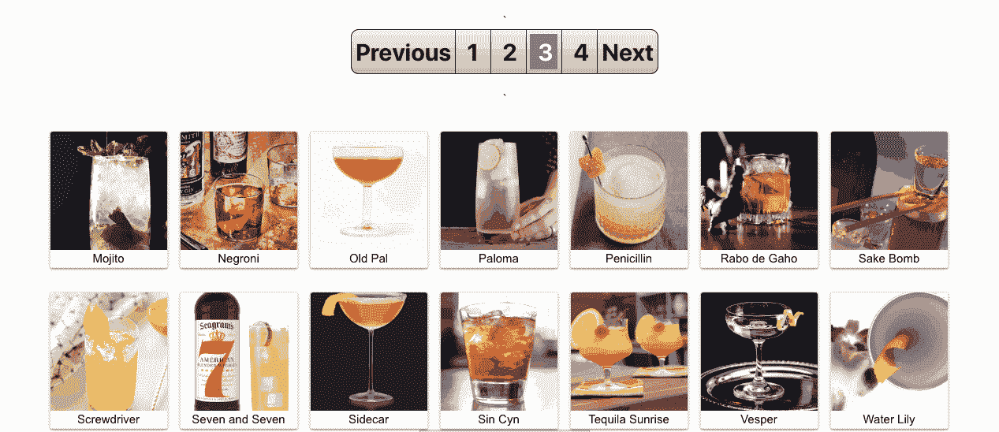
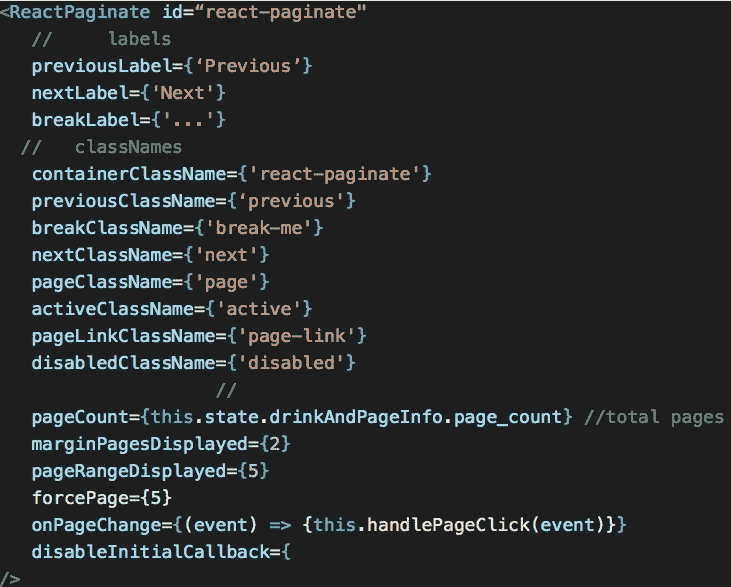

# 用 react-paginate 和 Rails 制作分页栏

> 原文：<https://betterprogramming.pub/making-a-pagination-bar-with-react-paginate-and-rails-will-paginate-gem-2ff9468d11ad>

## *彻底检查分页数据并显示在前端*

点击页面加载数据库的不同部分。

分页的概念是在页面中加载数据库，因此当用户试图查看数据库中的项目时，它们是从后端分段加载的，而不是一次发送整个数据库。由于数据库是一部分一部分加载的，这是一个更快的过程，并提供了某些美学选项，这是通过暴力加载不可能实现的。

在本文中，我们将介绍如何通过`will_paginate` gem 在 Rails 中对数据库进行分页。我们还将简要介绍分页数据在前端显示的各种方式，特别是如何使用与 React 一致的`react-paginate`库。

我正在开发一个混合饮料应用程序，它有一个 React-Redux 前端和一个 Rails 后端。用户可以利用我创建的`AllDrinks`组件，以`DrinkCard`组件的形式浏览所有饮料的数据库，当点击时，会将你带到该饮料的显示页面。

即使我的数据库无论如何都不是很大，如果是，发送整个数据将是一个非常耗时的获取请求，页面可能需要几分钟才能加载。此外，如果我没有分页，当网页最终显示我的所有项目时，它将是一个巨大的页面——用户可能会永远滚动到他们想要的地方。我们应该在这里使用分页，一次只加载数据库的一部分。

# 决定使用哪种前端分页方法

根据您对 UX/用户界面的期望，您可以利用:

**无限滚动**，当到达页面底部或点击按钮时，从数据库的下一页检索更多的项目。在网页上，这些新项目被添加到屏幕底部，并且可以看到上一页已经呈现的内容。在这个方法中，我们增加了用户可以看到的内容。

**分页栏**，点击页码，“下一页”或“上一页”，从数据库的特定部分获取数据。在网页上，这会载入一组全新的项目来取代旧的项目。在这种方法中，用户一次只能看到数据库的一部分。

在从事这个项目之前，我并不熟悉分页的概念，所以我决定使用后一种方法，因为它对我来说更像是实际的页面，而不是无限的滚动。

和我一样，您的基本原理将取决于您正在构建的应用程序的类型。虽然在许多现代应用程序(Twitter，Instagram)中使用了无限滚动，但分页栏在其他受益于更传统布局的网站(Google)中也很普遍。这种情况在网站上尤其普遍，在那里你只想一次显示数据库的某个部分，而不需要像无限滚动那样不断地添加到堆栈中。

尼尔森诺曼集团网站上有一篇文章讨论为什么你可能希望或者不希望无限滚动，UX 集体杂志上的另一篇分析权衡了每种分页形式的优缺点。通过查阅关于这些方法的文献，开发人员可以决定他们的应用程序将从哪种方法中受益最多。

# **will _ paginate Gem 对数据库进行分页**

首先，我将从后端设置开始。在我的 Gemfile 中，我将键入以下代码:

`gem ‘will_paginate’`

然后，我跑`bundle install`并入创业板。

有几种方法可以说明你希望一个页面包含多少项。`will_paginate`的`per_page`方法就是这么做的:它确定每页应该返回多少项。

您可以在控制器或模型中定义这一点。对我来说，最简单的方法就是进入我的饮料模型(`app/models/drink.rb`)并在那里使用`per_page`方法。

在饮料模型中，将数据库分成页面，每个页面最多返回 14 种饮料。

这意味着我每页将返回 14 张饮料卡。一定要记住你在哪里定义了你的`per_page`；在模型中分配它的一个缺点是，当您在控制器中写出您的方法时，您将不能动态地查看/更改它。

现在，我将转到我的`routes.rb`文件夹，并编写以下路线:

`get ‘/all_drinks_paginated/:page’, to: ‘drinks#paginated_drinks’`

我选择在编写实际的`paginated_drinks`方法之前这样做，因为我很健忘如何建立自定义路径，对我来说先编写它们，然后实际编写方法更容易。

在现实生活中，你可以随时随地设置路线。我想尽可能具体地说明我正在做的事情，所以我在路径和方法名称中使用了单词`paginated`。

主要问题是您的路由需要接受一个页面(从前端以参数形式发送的信息)。这类似于 show-page 路由，因为两个路由都以一个参数结束，该参数的值决定了该路由将返回的确切内容。

现在，让我们进入`drinks_controller.rb`(app/controllers/drinks _ controller)并编写我的`paginated_drinks`方法:

根据收到的参数返回数据库页面

我喜欢有一个`byebug` ，这样当取货过来的时候，我可以详细地查看我的参数。它在这里被注释掉了，但是当我想知道发生了什么的时候，我可以很方便地打开/关闭它。

我想做的第一件事是按字母顺序排列我的饮料，这样当用户在网页上看到它们时，就有了某种有序的表象。之后，我可以运行`will_paginate`的恰当地命名为`paginate`方法，它将建立我们想要在数据库中查看的页面。

请记住，我已经将我的页面设置为每个页面有 14 个对象。第一页将返回按字母顺序排列的数据库中的前 14 项，而第二页将返回接下来的 14 项，依此类推。

从那里，我呈现一个 JSON back，其中包含要发送的饮料、当前页面(实际上我并没有使用它，我在我的前端做了这个，后面会解释)，以及`page_count`，这是您的数据库将拥有的页面总数。

例如，假设我的数据库中有 30 种饮料。因为每页只能有 14 种饮料，所以数据库总共有三页:前两页都是满的，每一页有 14 个项目，而第三页有两个项目。发送总页数是很重要的，这样你的分页栏就知道它所负责的页面范围。

总而言之，很简单，对吧？这个方法应该找到用户想要查看的页面，并返回相应的数据。

# **React-Paginate 创建一个分页栏**

前端设置并不容易，但至少安装`react-paginate` gem 是容易的。

`npm install react-paginate — save`

这里有很多东西要介绍，所以首先让我们来看看分页栏的外观以及它应该做什么。

最后，它应该像这样:

考虑到创建分页栏的各种美学因素

我知道这不是世界上最漂亮的东西，但这是功能大于形式的练习。我们应该关注酒吧是如何建立起来的。

看到 1 是蓝色的而“上一个”是灰色的了吗？嗯，我们想让我们的用户知道他们在哪个页面上，如果上一页不存在，我们不想让他们去上一页。

对于较大的数据库，我们还需要考虑省略号(称为 break，风格化为`…`)。省略号将位于我们希望从省略号的任意一侧点击的页面数量之间。例如，如果我们的应用程序有 10 页，也许我们希望省略号之外的两页能够被点击，而其他所有内容都应该由省略号表示。这看起来就像“1，2 … 9，10”虽然本文没有具体介绍它的用法，但它仍然是您应该考虑的事情。

既然我们已经知道了分页栏的外观和功能，我们就可以利用`react-paginate`组件了。

这有很多部分，甚至比下面的代码中看到的还要多。反应分页可以参考[公文](https://www.npmjs.com/package/react-paginate)。

我正在检查我所使用的特定部分，以及我以这种方式构建组件的原因。

**注意:**以下是截图，因为 GitHub gists 不同意在 Medium 上发布整个代码。你可以在这里查看整个要点。

react-paginate 组件的各个部分。

因为这些基本上是`react-paginate`组件的道具，所以你可以随意组织它们。

然而，在我描述为什么我这样组织我的道具之前，应该注意到在中，每个`react-paginate`组件中的`pageCount`、`pageRangeDisplayed`和`marginPagesDisplayed`都必须被定义。在使用这个组件时，请记住这一点。

## **标签**

首先，我想定义我所有的按钮在工具栏中应该是什么样子。您不必担心手动给页面按钮编号——基于`pageCount`和`pageRangeDisplayed`，分页栏会自动填充所需的编号。

但是，对于上一个、下一个和断点标签，您必须手动将其定义为字符串(使用`previousLabel`、`nextLabel`和`breakLabel`)。在许多分页栏中，previous 和 next 可能分别显示为`<`和`>`，但是这是一个决定您希望分页栏如何显示的选择问题。

同样，因为我想尽可能明确，所以我选择将它们定义为“上一个”和“下一个”。

对于 break，通常传统的做法是将其保留为`…`来表示当前未显示的页面范围，因此，我选择保持原样。就目前情况而言，我的数据库并没有那么大，所以我实际上根本不需要使用 break，但是提前计划数据库的增长无疑是一件好事。

## **类名**

接下来是`react-paginate`里面的各种`classNames`物品。对我们来说，这主要是为了 CSS 样式(尽管我肯定有一堆利用类的底层逻辑)。

因为这个组件没有太多的复杂性，所以简单地命名它们比提出一些过于具体的胡言乱语要容易得多。

例如，在定义`containerLabel`时，请记住容器是`react-paginate`在其中施展魔法的 div，按照惯例，将它标识为分页 div 是合适的，而且通常很有帮助，而不是仅仅将其命名为“容器”

`previousClassName`、`nextClassName`、`pageClassName`和`breakClassName`对它们来说都是不言自明的——它们是你按下来导航分页栏的按钮。不过，有趣的是，这些按钮实际上都是封装了一个链接的<李>元素/ <一个角色被设置为按钮的>元素。每一个<李>里面的环节都不出意料的被命名为`previousLinkClassName`、`nextLinkClassName`、`pageLinkClassName`和`breakLinkClassName`。

`activeClassName`和`disabledClassName`描述了正在查看的当前页面，以及无论出于何种原因用户都无法访问的任何页面链接(通常，用户分别到达文档的开头/结尾并试图点击上一页/下一页)。

我们已经有了内置的逻辑，可以根据我们点击的内容改变页面的类名，所以我们真正需要担心的是 CSS。

你会注意到在文档中只有`activeLinkClassName`，因为不应该有一个禁用类可以链接点击的实例。

## **功能道具**

这里的道具用于分页栏的实际处理逻辑，复杂程度各不相同。显式命名，`pageCount`只是通知`react-paginate`数据库包含的总页数。

`marginPagesDisplayed`表示页边距显示多少页，即显示在最左侧分页符左侧的页数和显示在最右侧分页符右侧的页数。对于一个可视化的例子，在这里参考一个关于这个道具[的错误报告。](https://github.com/AdeleD/react-paginate/issues/222)

`pageRangeDisplayed`只是显示要显示的页面范围。

`onPageChange`是当你点击一个页面时触发的回调。由您来创建一个函数，正确地从该页面加载数据；我的有点绕弯，但它做了几乎所有需要做的事情。当我的组件挂载时，这个回调一直触发，这是我不想要的。要在页面初始加载时禁用回调，请将`disableInitialCallback`属性设置为 true。

`forcePage`用于用父属性覆盖所选页面。当您对分页栏有疑问时，请使用此选项。我不太确定*每件事*是如何工作的，但是以前，当我不使用它并点击/加载页面时，我的`active-page`类会在错误的页面上，而数据库中正确的页面却被加载了。通过利用`forcePage`(获得`startingPage`数据作为道具)，问题得以解决。

## **用于正确渲染数据的其他功能**

还有几个我需要和`react-paginate`一起使用的其他函数没有包含在它的库中。这些功能让我的前端一切正常工作/显示。

具体来说，我们有`handlePageClick`函数，它在页面被点击时触发；`getDrinksAndInfoFromPage`函数，负责从后端取数据；和`allDrinks`函数，它在页面上呈现我的饮料卡。

我的`handlePageClick`功能非常简单:

通过使用 React-Paginate 的 onPageChange 特性，我们可以在页面被点击时触发 handlePageClick

它只是将页面点击事件记录到控制台。click 事件表现为一个对象，其中选中的键指向被点击页面的索引，格式为{selected: [NUMBER] }。

页面被表示为一个数组，意味着 0 实际上是页面 1，以此类推。它还会利用`withRouter`的历史属性推送一个特定的路径，因此 URL 会反映用户正在查看哪个页面。这两个都很简单。

`handlePageClick`唯一做的另一件事是给`event.selected`加 1(这样后端就能得到正确的页面)，并以此作为参数来触发我的主函数`getDrinksAndInfoFromPage`。这真是`handlePageClick`的肉。现在来看`getDrinksAndInfoFromPage`:

该函数从后端获取数据，并更改 all drinks . state . drinkandpageinfo 的状态

这个函数非常简单:它接受一个页面(number)作为参数，然后根据该页面从后端获取页面数据，设置 `drinkAndPageInfo`等于接收到的 JSON。JSON 由返回的数据、总页数和当前页面组成。

它还获取接收到的页面参数并将其存储在状态中，并设置`loading:false` ——因为我有一个条件，如果 loading 为真，将显示一个加载动画 GIF(当组件挂载时，loading 开始为真)。由于我们使用的是`setState`，组件重新呈现，这次填充了`drinkAndPageInfo`，loading 设置为 false。现在，我们利用`allDrinks()`函数来显示饮料卡。

`allDrinks()`函数查看接收到的饮料对象数组，并在呈现页面时用它们制作饮料卡组件。我们只需映射数组，基本上将元素转换成饮料卡。如之前在`self.per_page`中定义的，每页将有 14 个。

我使用了两次`getDrinksAndInfoFromPage`:一次在`handlePageClick`中，一次在`componentDidMount()`中，这样用户就可以到达某个页面。

根据用户从何处访问`AllDrinks`(即从导航栏或在查看饮料展示页面后返回)，加载的数据会有所不同。

`componentDidMount`将利用`AllDrinks`从其父组件`DrinksContainer`接收的属性。该道具被称为`startingPage`，根据激活的路线而有不同的值。

如前所述，`handlePageClick`由于在`getDrinksAndPageInfo`中使用了`setState`而导致`AllDrinks`的重新呈现，因此在点击页面按钮后，页面上会显示正确的数据。

用户总是通过点击导航栏链接或者手动输入路径来访问`AllDrinks`组件。这个初始负载就是触发`componentDidMount`的原因，您可以看到它的定义如下:

`componentDidMount(){
this.getDrinksAndInfoFromPage(this.props.startingPage)
console.log(“component Mounted”)
}`

根据所使用的路径，`startingPage`的值会有所不同。如果我们单击导航栏链接，我们会指向“/drinks/”路径，其路径如下:

`<Route exact path=’/drinks/’ render={() =><AllDrinks startingPage={1}/>}/>`

这真的很简单——实际上我们所做的就是将`startingPage`设置为`1`，这意味着第一页被加载。作为一种 UI 选择，当用户最初访问`AllDrinks`时，我希望第一页总是显示的那一页。您可以选择不同的设置，但是我接触过的大多数使用分页栏的网站都遵循这种行为。正因为如此，我决定效仿。

现在，如果我们与熟悉 URL 并想立即转到特定页面的用户打交道，会发生什么呢？此外，如果用户刷新他们在`AllDrinks`中的页面会发生什么？我们应该用不同的途径来解释这一点:

`startingPage`在这里被定义的有点草率，但是做了它需要做的事情。本质上，它只是从 URL 获取页码。它查看 URL，并从最后一个斜杠开始，将它的一部分作为字符串删除。为此，我们只需返回号码。我们需要在最后一个斜杠的索引上加 1，否则结果会是“/#”。

最后，我们取出这个仍然是字符串格式的数字，并使用`parseInt`将其转换为实数。

这里，`startingPage`用于当我们重新加载我们所在的页面时，或者当用户费力地输入上面的整个路径时。

在任一种情况下，该路径激活，并且`componentDidMount`使用`startingPage`(因为在任一情况下都是第一次安装组件，所以`componentDidMount`依次激活)。

例如，如果我们在 URL 中键入第 3 页和伴随的路径(或者简单地重新加载第 3 页，意味着这个 URL 已经存在)，上面的路由被激活，取 URL 的最后一部分。因为 URL 是一个字符串，所以我们返回了“3”。然后我们用`parseInt`把它变成 3，用这个作为`startingPage`。

通过利用这两种途径，以及用历史道具来设计我们的 URL，当与`react-paginate`结合时，我们创建了一个全功能的分页系统。

如你所见，前端肯定比后端更复杂。我的方法绝不是全部，所以鼓励实验和替代解决方案。

# **结论**

至此，我们已经介绍了如何通过`will_paginate` gem 和一些非常简单的模型代码以及一些控制器方法在 Rails 中对数据库进行分页。

我们还讲述了如何使用`react-paginate`及其各个部分，以及如何将一切与适当的路线利用相结合。

在您的应用程序中成功实现分页还有其他解决方案，所以请随意使用它作为基础。找到适合您和您的客户的方法，并创建新颖的代码来进一步提升用户体验。写下你网站的故事，一次一页。