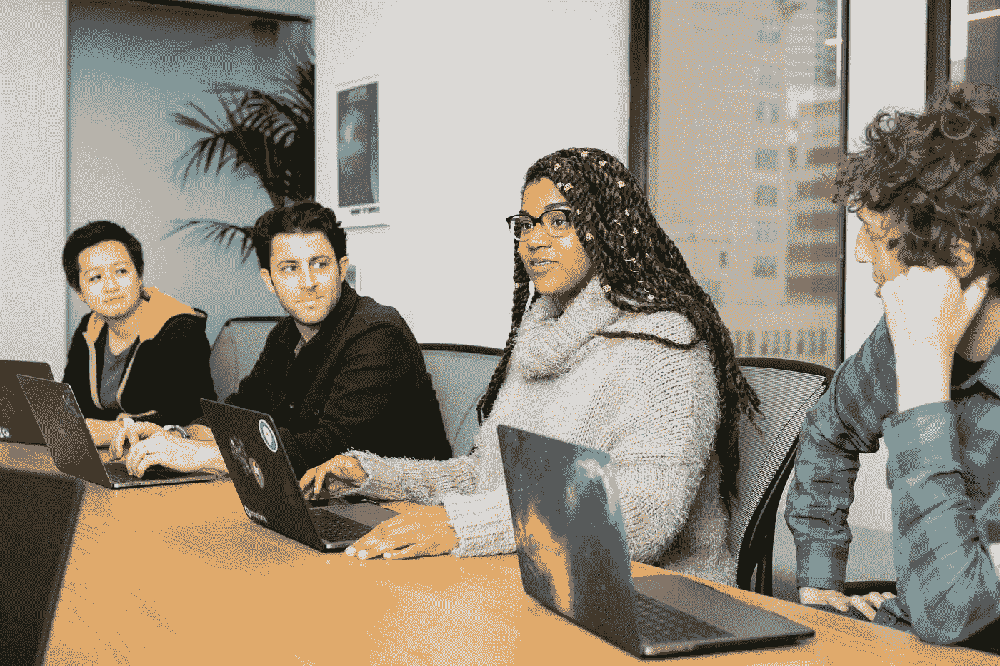

# 让软件工程面试更有创造性和趣味性

> 原文：<https://betterprogramming.pub/making-software-engineering-interviews-more-creative-and-interesting-f25a9f001a2>

## 一个有用的技巧来保持面试的创造性和趣味性，以及一些额外的技巧



由 [Unsplash](https://unsplash.com?utm_source=medium&utm_medium=referral) 上的[地图框](https://unsplash.com/@mapbox?utm_source=medium&utm_medium=referral)拍摄

如果你想在职业生涯中成为一名软件工程师，随着时间的推移，你只会承担更多的责任。每个人都会遇到的一件事是，你开始面试其他软件工程师。

一开始这可能会令人生畏，但随着时间的推移，随着你在这一领域技能的提高，事情会变得容易一些。你甚至会发现自己正处于帮助其他新面试官学习如何面试的位置。

随着时间的推移，你会寻找如何给人一个好的面试体验的技巧和诀窍。这就是为什么我把一些技巧放在一起，并分享我最近在面试中使用的一个挑战。

# 面试官提示

我已经进行了相当多的面试，这些是我的一般面试原则。

*   **不要鲁莽、粗鲁或不尊重人**——以同情和善意待人；很难把自己放在外面。
*   倾听受访者的心声——不要对流行词汇进行评判，倾听他们的想法，即使这不是你所期望的。
*   **准备好转变**——对每个人都遵循相同的面试结构是行不通的，因为没有两个人是相同的。

# 挑战

最近我尝试在面试过程中发挥创造力的一个方法是开发一个我可以和任何级别的软件工程师一起运行的练习。这是一个简单的结构，但它对创造力和变化持开放态度，这让我觉得我比直接提问时更了解桌子/摄像机另一边的人。

它从一个简单的前提开始，然后我问了一系列渐进的问题。在访谈结束时，我将与每个人讨论一套不同的技术和方法。我每次都问同样的六个问题，但根据他们的回答，我会向不同的方向探究一些更深层次的问题。

> 关于这个过程的两点注意事项
> 
> 我对大三学生和大四学生的期望不一样。当我使用这种方法时，我试图得出被采访者在每个领域的知识，但我希望了解他们从自己的经历中学到了什么。
> 
> 让被采访的人知道你可能会为后续问题做些笔记。如果面试官总是看向别处，而你又不确定他们在做什么，这可能会令人不快。

# 入门指南

它始于一个绿地项目。把它做成一个网站，一个应用，随便你怎么选。把它做成一个商店，做成一项服务，并保持开放以保持面试的不同，但保持简单和相似以保持你的面试公平。我想说的是，我们需要数据存储、后端和前端。这就是乐趣的开始。


[史丹利戴](https://unsplash.com/@stanleydai?utm_source=medium&utm_medium=referral)在 [Unsplash](https://unsplash.com?utm_source=medium&utm_medium=referral) 上的照片

# 你对这个系统的梦想是什么？

从他们知道或希望学习的技术开始。让他们知道他们可以选择任何东西，没有错误的答案。有些人选择科技是因为它解决了一个特定的问题，有些人是因为他们知道什么，有些人是因为他们想学习它。

有些人也想谈基础设施，让他们谈吧。以后会有更多的空间，但早点提出也无妨。我在这里寻找的是推理，你为什么选择那一堆？

告诉你很多关于人们的想法。

## 现在你有了一些特性，你如何验证它的工作？

这个问题都是关于测试的。在了解工程师和团队测试代码的态度和方法方面，你可以学到很多东西。[自动还是手动](https://www.atlassian.com/continuous-delivery/software-testing/types-of-software-testing)，为什么？你会包括哪几层测试，单元，集成和/或 E2E？深入挖掘并询问代码覆盖率，看看他们如何评价这个指标。

## 你有更多的人加入你的团队，你们是如何在同一个代码库上一起工作的？

这个人如何在团队中工作？他们喜欢[拉请求](https://www.pagerduty.com/resources/learn/what-is-a-pull-request)吗？[代码评审](https://smartbear.com/learn/code-review/what-is-code-review)怎么样？[结对编程](https://martinfowler.com/articles/on-pair-programming.html)？他们习惯于和别人一起工作吗？还有源码控制？你也可以在这里挖掘敏捷经验和成熟度，单口相声，Sprint 评论等等。这是一个了解人们如何重视团队合作，向他人学习，看他们是否愿意为他人服务的时刻。

## 是时候向项目干系人和您的客户展示您的工作了，您如何使您的系统可用呢？

现在，我们开始(在此插入术语)[开发运营](https://www.atlassian.com/devops)和基础设施。构建和发布软件的经验和方法。你们有没有[建造管道](https://docs.gitlab.com/ee/ci/pipelines)，你们什么时候运行它们？什么样的环境对服务所有参与项目的人有意义。你如何发布软件？

你把它放在什么地方？ [AWS](https://aws.amazon.com/) ，[蔚蓝](https://azure.microsoft.com/)， [GCP](https://cloud.google.com/) ，还是别的？人们从事的项目的这些方面经常会带来很多挫折。这个人是如何处理的？告诉你这件事的时候他们是怎么表达的？

## 出问题了，你怎么能得到更多关于正在发生的事情的信息呢？

哦，孩子，是时候解决问题了。这个人是如何解决 bug 的？他们和谁说话？他们使用什么系统与他们的软件合作来帮助他们？他们使用应用程序日志记录吗？他们把日志存放在哪里？他们如何跟踪他们在 bug 上的进展？他们会采取什么样的积极措施来预防未来的错误？

这里有很多问题和途径，不要永远停留在这里，但根据角色，这段时间真的可以帮助你知道你是否想和这个人一起工作。

## 客户需求不断增长，您如何确保您的软件能够应对挑战？

最后，这个人将如何处理扩展系统的需求？他们将如何确保他们的系统具有弹性？他们会依赖云原生特性吗？他们会配置自动、定时还是手动扩展？这种考虑会改变他们的基础架构选择吗？这部分很难，因为很难假设。同样，当遇到问题时，这个人是如何反应的？

# 更多问题

这些问题可以让你深入挖掘，找到更多的话题。我不打算把它留在这六个结尾。现在我有了笔记和我学到的东西，可以更深入地挖掘，帮助我做决定。

# 我在听什么，在找什么？

我用这个过程来更好地了解一个人，而不是直接询问他们对某项特定技术的体验。

*   他们所知道和经历的
*   他们如何向我解释这些
*   他们包括和遗漏的细节
*   当我不懂的时候，他们怎么教我的

面试可能会很艰难，但我发现了这个挑战，上面的建议让我让人们敞开心扉，帮助我理解他们。作为一个人和软件工程师。希望对你也有帮助。

```
**Connect or Support?**If you like this, or want to checkout my other work, please connect with me on [LinkedIn](https://www.linkedin.com/in/stphnwlsh), [Twitter](https://twitter.com/stphnwlsh) or [GitHub](https://github.com/stphnwlsh).
```