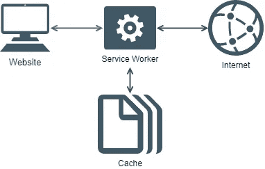
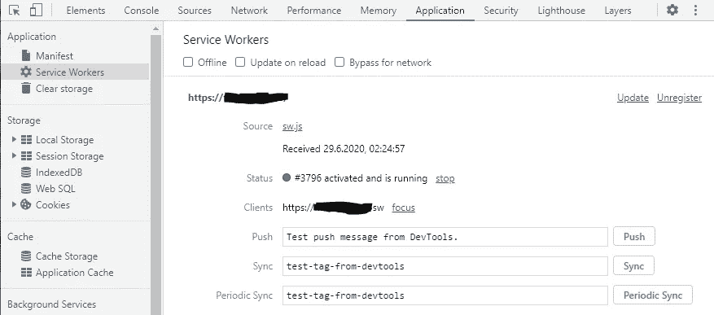

# 中间人通过 JavaScript 服务人员进行攻击

> 原文：<https://betterprogramming.pub/man-in-the-middle-attacks-via-javascript-service-workers-52647ac929a2>

## 它们是可能的吗？它们是真正的风险吗？


在 [Unsplash](https://unsplash.com?utm_source=medium&utm_medium=referral) 上由 [Dmitry Ratushny](https://unsplash.com/@ratushny?utm_source=medium&utm_medium=referral) 拍摄的照片。

我第一次接触到服务人员的概念是在 CTF 防御战期间。在一个挑战中，我们必须注册一个服务人员来拦截用户的流量，并将其重新路由到我们的服务器。这个概念听起来很有趣也很危险，所以我研究了一下，最终意识到这是一篇关于使用服务人员作为“中间人”(MitM)的文章的好主题，以及它在现实世界中的应用是否可行。

# **什么是服务人员？**

当然，你的第一个问题可能是“什么是服务人员？”Google web 开发者指南对它们的描述如下:

> "服务工作者是一个可编程的网络代理，让您控制如何处理来自您的页面的网络请求。"

基本就是这样！它闻起来已经像一个 MitM！服务人员是一段 JavaScript 代码，开发者可以在他们的网站上注册并激活它。它作为代理运行在浏览器的后台，接收一定范围内的每一个请求。此外，服务人员处理和响应请求。例如，它可以发送从缓存中加载的内容，转发初始请求以返回响应，甚至用不同的文档进行响应(参见下面的请求流)。即使当相应的网站关闭时，服务工作者也独立于 web 应用运行。在某些情况下，服务人员甚至会在浏览器关闭时运行(例如在 Android 上)。



服务人员请求流程(作者供图)。

因此，可以使用服务工作者来提高 web 应用程序的性能，并通过提供从缓存提供的先前加载的内容，使应用程序在脱机时完全可用。服务人员独立于 web 应用程序运行。因此，它们可以直接从服务器接收消息，并且是通知和推送 API 的基础。

# 把我们的人安排在中间

所有这些都令人印象深刻，向我们展示了服务人员是多么强大！但是它们怎么能被用作 MitM 呢？为了理解这一点，我们首先需要看看服务人员是如何操作的。


服务人员生命周期(作者拍摄)

上图展示了服务人员的简化生命周期。服务人员必须首先在网站上注册，然后才能使用网站。注册后，浏览器会在后台安装工作人员。一旦安装完毕，服务人员就会收到`activate`事件，开发人员通常会用它来初始化静态文件到缓存的加载。接下来，服务工作器进入空闲状态，在这种状态下，它将采取两种状态:要么终止以节省内存，要么处理`fetch`和消息事件。这包括来自属于工作进程范围的页面的所有请求。

如果注册了新的服务，网页会优先使用旧的工作器，并将新的服务工作器设置为`waiting`状态。一旦网页被关闭，旧的服务工作者被移除，新的服务工作者被激活。这对于 MitM 来说很重要，因为这意味着 MitM worker 只有在重新加载 web 页面之后才会被加载。

注册服务人员的 JavaScript 代码

定义服务工作者的 JavaScript 代码

上面可以看到两个代码片段。第一个代码片段用于注册一个服务人员。必须知道的是，服务人员只能从同一域中的某个位置进行安装。这给攻击者增加了难度。然而，可以使用任意文件上传或类似的方法来绕过这一限制(稍后将详细介绍)。

第二个代码片段显示了服务工作者的定义。当网站发送请求时，`fetch`事件总是被激活。在上面的例子中，工人只有在收到请求时才返回`Hello World!`。

现在我们已经知道了服务工作者的一般用途，让我们来看看 MitM 概念验证:

概念烧瓶应用的证明

我们可以在 [Flask](https://flask.palletsprojects.com/en/1.1.x/) 应用程序中看到我添加了一个打开的重定向。这样做是因为加载服务工作器的地址必须具有相同的来源。我将在后面的限制部分详细讨论这一点。呈现的`index.html`包含我们前面看到的标准服务工作器安装代码，唯一的区别是服务工作器 URL 使用了开放重定向:`https://victim.com/?url=https://attacker.com/static/sw.js`。

概念验证服务人员

服务工作者本身在每个请求上接收一个`fetch`事件，并随后发出两个请求。第一个 fetch 事件(第 4 行)将请求的 URL 和头信息发送到攻击者的域。不用说，任意信息都可以添加到这个请求中。第二个 fetch 事件(第 6 行)向最初请求的 URL 发送一个请求，以便向用户返回真实的响应。

下面的访问日志显示的是 2020 年 6 月 29 日攻击者一方，一个用户在没有任何头信息的情况下请求`https://victim.com/foo`。这个请求的发起者是来自`https://victim.com/?url=https://attacker.com/static/sw.js`的服务人员。

```
123.456.789.123 — — [29/Jun/2020:00:25:02 +0000] “GET /mitm?url=https://victim.com/foo&headers={} HTTP/1.1” 404 209 “https://victim.com/?url=https://attacker.com/static/sw.js" “Mozilla/5.0 (Windows NT 10.0; Win64; x64) AppleWebKit/537.36 (KHTML, like Gecko) Chrome/83.0.4103.116 Safari/537.36”
```

如果你想知道你是否曾经用过服务人员，你肯定用过。打开您的开发人员控制台，其中列出了所有这些组件。例如，在谷歌浏览器中，它位于服务人员下的应用程序标签中。下图显示了我们的 MitM 服务人员:



Chrome 开发工具中的服务人员列表

# 有哪些局限性？

使用服务人员的强大概念作为 MitM 的想法并不新颖。事实上，服务人员本身已经有了许多集成的特性来复杂化和防止 MitM 攻击。

第一个也是最明显的保护措施是，攻击者必须通过执行 JavaScript 来安装服务工作器。这可能是通过滥用 XSS 或其他代码注入攻击。为了避免最简单的攻击，服务人员只使用 HTTPs。否则，open WiFi 上的攻击者可能会修改流量并包含安装 JavaScript 代码。事实上，现在没有 HTTPs 的网站已经很少见了。不管怎样，它仍然是一个方便的保护元素。

下一个保护措施(如前所述)是加载服务工作者的域所提供的安全性。服务工作者只能从相同的源域安装，这意味着攻击者需要将他们的服务工作者文件上传到 web 服务器上，或者利用开放重定向。这两个问题都是 web 开发人员通常试图避免的。此外，该文件需要被解释为 JavaScript。在很大程度上，第二项措施提供了相当好的保护。

第三个也是最后一个保护措施是服务人员的工作范围。默认情况下，服务工作者的路径是作用域的根，只能扩展到下面的所有目录。换句话说，如果您的 MitM 服务人员位于`/example/sw.js`，则只能为`/example/*`安装服务人员，而不能为`/foobar/*`或任何其他路径安装服务人员。一个例外是`service-worker-allowed`割台。这允许我们将范围扩展到任意路径。但是，标题必须由 web 服务器设置。显然，只有当一个网站已经在使用服务人员时，才会出现这种情况。根据网站的实现情况，引入新的服务人员可能会导致新的服务人员取代旧的服务人员的冲突。但是，如果网站实施得当，MitM 服务人员在使用一次后就会被删除。

考虑到所有的事情，真正的问题是“恶意用户会/可能使用这种攻击方法吗？”老实说，我不认为在很多情况下可以使用 MitM 服务人员。需要在同一个域中注入代码和文件——此外，所有这些都不太可能出现在网站的根目录中。尽管这种攻击不太可能发生，但这是一个值得思考的有趣概念。如果情况允许，后果将是毁灭性的。

# 摘要

本文讨论了如何使用服务工作者作为 MitM，并给出了一个概念证明。虽然这种方法更多的是一种理论上的想法，而不是一种可利用的攻击，但了解这些类型的攻击对每个开发人员和安全专家都是有价值的。

感谢您的阅读。希望你和我一样觉得这个话题很有趣！

我想强调的最后一点是:这些知识不应该促使任何人滥用安全问题。相反，我希望每个人都意识到理论上的可能性，并以这种谨慎的心态去发展。更重要的是，如果您发现任何允许这种攻击的问题，不要利用它们。报告他们并帮助解决问题。

有很多机会来合法地测试你的技能，每周都有很多很棒的 CTF 或者通过追求 bug 赏金奖励计划。不管怎样，很高兴能和大家一起学习和分享新的东西。黑客快乐！

# 资源

*   [https://medium . com/bugbountywriteup/pooot-writeup-217384 a6 b 69 c](https://medium.com/bugbountywriteup/pooot-writeup-217384a6b69c)
*   [https://developers . Google . com/web/fundamentals/primers/service-workers](https://developers.google.com/web/fundamentals/primers/service-workers)
*   [https://medium . com/Samsung-internet-dev/a-beginners-guide-to-service-workers-f 76 abaf 1960 f 6](https://medium.com/samsung-internet-dev/a-beginners-guide-to-service-workers-f76abf1960f6)
*   [https://developers . Google . com/web/ILT/pwa/介绍服务人员](https://developers.google.com/web/ilt/pwa/introduction-to-service-worker)