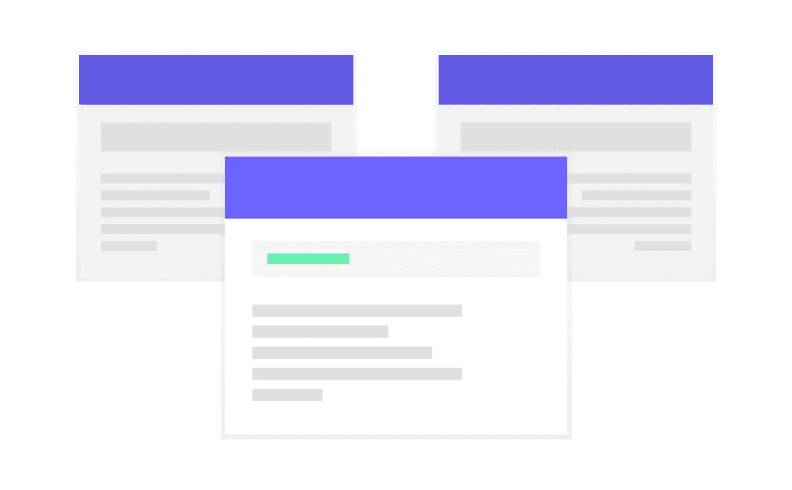

# 如何在 React 应用中处理多种环境

> 原文：<https://betterprogramming.pub/managing-environments-for-provisional-builds-with-react-app-1fb411e3597>

## 为开发和生产之外的环境设置 React 应用程序



资料来源:https://undraw.co/

开发 React web 应用时，开发者默认只能使用两种环境。

*   开发— `NODE_ENV=development`在本地开发应用程序。如果可用，默认使用`.env.development`。
*   生产— `NODE_ENV=production`构建应用程序进行部署时。如果可用，默认使用`.env.production`。

当我们使用 [create-react-app](https://github.com/facebook/create-react-app) 时，`package.json`有如下脚本:

```
"scripts": {
  "start": "react-scripts start", // NODE_ENV=development as default
  "build": "react-scripts build", // NODE_ENV=production as default
}
```

假设我的项目有四个环境:

*   发展
*   测试
*   脚手架
*   生产

但是， [react-scripts](https://www.npmjs.com/package/react-scripts) 只支持开发和生产。

现在，我需要测试和试运行环境。我们不能改变`NODE_ENV`的值，它只能是“开发”或“生产”。

所以，我们使用一个 npm 包`env-cmd`。可以通过下面的链接获得。

[](https://www.npmjs.com/package/env-cmd) [## 环境-cmd

### 使用 env 文件中的环境变量执行命令

www.npmjs.com](https://www.npmjs.com/package/env-cmd) 

上面的 npm 包帮助用户根据环境改变`env`变量。为此，请执行以下步骤。

# 1.安装`env-cmd` npm 包

```
npm install env-cmd --save
```

根据环境添加`env`文件和一个带有公共变量的`.env`文件。

# 2.定义环境文件

## 。包封/包围（动词 envelop 的简写）

```
REACT_APP_NAME = "Rockin MAT"
```

## .环境发展

```
REACT_APP_API_ENDPOINT = "https://api-dev.endpoint.com/"
```

## 环境测试

```
REACT_APP_API_ENDPOINT = "https://api-testing.endpoint.com/"
```

## env.staging

```
REACT_APP_API_ENDPOINT = "https://api-staging.endpoint.com/"
```

## .环境生产

```
REACT_APP_API_ENDPOINT = "https://api.endpoint.com/"
```

注意:在 React 中创建自定义变量需要前缀`“REACT_APP_”`。

# 3.向 package.json 添加脚本

要测试您的工作，请运行以下命令。

对于测试环境:

```
npm run build:testing
```

对于登台环境:

```
npm run build:staging
```

注意:即使您在构建应用程序时添加了两个新的不同环境，`NODE_ENV`也将是生产环境。为了区分构建，我建议您添加`REACT_APP_ENV`并在那里指定您的环境。

万岁！现在，您可以向 React 代码添加两个以上的环境。