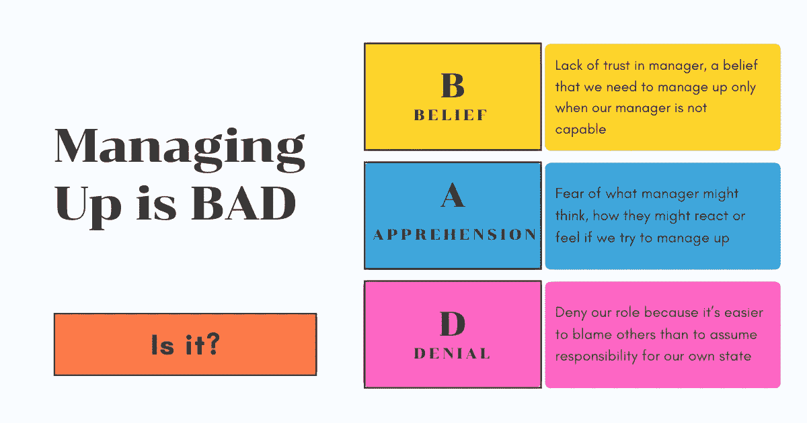

# 向上管理:对自己的成长负责

> 原文：<https://betterprogramming.pub/managing-up-149a93854ca9>

## 如何与你的经理和上司有效沟通

作者照片。

我们都希望与我们的经理保持良好的关系，从事有助于我们职业发展的有影响力的项目，在我们的工作领域受到高度重视，并得到他人的信任和尊重。但是，我们有多少次能够掌控自己的成长呢？

我们头脑中根深蒂固的工作等级制度认为管理是自上而下的——经理对他们的直接下属。我们认为，经理有责任建立信任，与我们建立密切的关系，给我们提供有助于我们表现的工作，并消除所有可能阻碍我们工作成功的障碍。

他们的使命很可能是帮助我们成为最好的自己，因为他们的成功在于我们的成长，但我们是否看到并拥有这种双向关系的另一面？

我们很少考虑我们在这个过程中的角色，我们如何帮助我们的经理，他们在工作中的目标和挑战是什么，他们关心什么，他们的优先事项是什么，以及我们如何才能使他们成功。

向上管理只不过是一种投资，目的是与我们的经理建立关系，以便更好地合作。驾驭这种动态需要采取主动，关心上面的人，分担责任，并拥有我们自己的成长，这是一种与固定心态相反的成长心态。

# 为什么我们避免向上管理？

作者照片。

我们避免向上管理，是因为我们的信念、对可能发生的事情的担忧，以及否认我们在这个过程中的角色。为了便于回忆，把它想象成我们头脑中的坏框架。我们认为向上管理是不好的，反之亦然。

## B —信念

在我与许多人的交谈中，向上管理似乎会带来负面情绪。人们把向上管理与对他们的经理缺乏信任联系起来，认为只有当他们的经理不能胜任他们的工作时，他们才需要向上管理。

虽然糟糕的经理可能会也可能不会成为你的现实，但向上管理对每个人都有效，包括经理和处于领导地位的人——他们也有老板。

你的经理总是需要你的支持来影响他们，帮助他们做出正确的决定。除非你积极主动地抓住合适的机会来提高工作效率，否则这是不可能发生的。

## 恐惧

在某些情况下，恐惧是我们行动或不行动的最大驱动力。我们不采取行动是因为害怕我们的经理会怎么想，他们会怎么反应，或者如果我们试图向上管理，他们会怎么想。

如果你从正确的角度来看，向上管理实际上对管理者非常有益，因为你们两人都学会了关心，互相挑战，成为实现目标的伙伴，并共同拥有成功。

管理者无法独自完成。他们没有独立的成功之路。你的成功就是他们的成功。

## D —否认

我们否认自己在当前环境中的角色，因为指责他人比为自己的状态承担责任更容易。

我们愉快地坐在自己的舒适区内，害怕走出去，承担责任，解决需要解决的问题。这不仅会导致平庸的表现，还会阻止我们为自己和他人探索和创造更美好的未来。

将你的状态归咎于你的经理是一条容易的道路，但是向上管理需要勇气。这需要你对自己的成长负责。

在他的书《高效人士的 7 个习惯》中，[斯蒂芬·R·科维](https://www.goodreads.com/quotes/997084-show-me-someone-who-is-humble-enough-to-accept-and)写道:

> “给我展示一个人，他足够谦逊，能够接受并为自己的处境承担责任，足够勇敢，能够采取任何必要的举措，创造性地解决或应对这些挑战，我将向你展示选择的最高权力。”

如果你能做更多的向上管理，你的经理可以做更少的向下管理。让我们学习如何。

# 你如何有效地管理？

作者照片。

向上管理的想法可能会令人生畏。你如何管理自己的经理？

换一种说法“选择向上有效沟通”如何？注意“选择”这个词，它通过自主和控制感让我们感到强大。所以，下次向上管理的想法让你毛骨悚然的时候，简单地把它换成“选择有效地向上沟通”

向上管理的关键是决定采取行动，负责建立你与经理的关系，以建立信任的方式行事，将你的优先事项与他们的优先事项保持一致，并做与他们有共同目标和使命的工作。这需要跳出[的戏剧三角](https://www.techtello.com/how-to-opt-out-of-the-drama-triangle/)，担当创造者的角色，而不是充当受害者。

因此，虽然我们不能改变他人，但让我们通过实践这七个有效管理的策略来尽力影响他们。

## 1.努力建立信任

花点时间了解你的经理，了解他们工作中的挑战，什么激励他们，什么让他们忙碌，他们关心什么，他们优先考虑什么。收集这些信息的一个简单方法就是简单地询问。

你不需要通过正式的一对一交流或制定会议议程来了解你的经理的信息。使用非正式聊天定期询问和收集这些数据，表现出好奇心，并提出问题。与他们交谈时，问一些这样的问题:

*   为什么这对你很重要？
*   你的首要任务是什么？
*   你脑子里最想的一件事是什么？
*   这个困扰你什么？
*   我很想了解你的角色所面临的挑战。你愿意分享一些吗？
*   你的工作有哪些让你受到启发？

这些信息将帮助您与您的经理建立更好的沟通渠道，方法是做与他们的目标一致的工作，以强调他们计划的潜在风险的方式分享您的担忧，并共同合作寻找更好的问题解决方案。

以这种方式管理将会建立信任，方法是通过对建设性的[冲突](https://www.techtello.com/handle-difficult-conversations/)持开放态度，使想法一致，并有做得更好的愿望。

## 2.向上管理来定义成功

我们太专注于个人目标，以至于没有意识到团队的成功是什么样的。如果不理解团队成功意味着什么，你可能会实现个人目标，但团队仍然会失败。

通过了解你的团队的成功标准，你可以意识到并为超越自己目标的机会做出贡献。一旦你理解了成功是什么样的，你就可以通过以下方式成为成功的一部分:

*   协商和设定你自己的优先事项。
*   在你的作品中寻求清晰。
*   质疑你工作的[有效性](https://techtello.com/effectiveness-vs-efficiency/)。
*   确定并承担额外的责任。
*   [对与你团队的成功不一致的工作说不](https://www.techtello.com/saying-no-at-workplace/)。

通过成为团队成功的一部分而不是专注于个人目标来管理可以促进你的成长。

## 3.设法获得您需要的支持

想要更多的责任和自主权？自己做主，自己要求。

你可能也需要支持来更好地完成你的工作。除非你的经理深入参与你的日常活动，并在工作之外花时间与你沟通，否则他们可能无法确定你需要什么样的支持。

如果你不能对自己工作中的[效果和效率](https://techtello.com/effectiveness-vs-efficiency/)负责，你的工作成果及其产生的影响将会受到限制。

因此，首先通过讨论来确定您需要的支持:

*   是什么阻碍了你实现目标。
*   你能做些什么来克服这些障碍。
*   他们如何能提供帮助。

通过认识到自己的需求并找到满足这些需求的最佳方式来进行管理，可以让你在工作中更有效率，让你做得更多、更好。

## 4.设法让你的工作引人注目

你的经理可能知道你的意图，但除非你向他们展示你工作的影响力，否则他们可能不会意识到你给团队带来的价值。

期望你的经理从你那里获取最新信息会让你受制于他们的时间和对你的工作表现出兴趣的意愿。通过使用推送模式，您可以在适当的时间向他们提供必要的更新，包括好消息和坏消息。

通过让他们了解重要问题，你不仅建立了信任，还为他们提供了一个在为时已晚之前关注问题的机会。

对你和你的经理来说，推不是比拉更有效吗？

通过主动展示自己的工作，并在重要问题上寻求帮助，你可以获得经理的支持，从而做更多前瞻性的工作。

## 5.设法帮助他们看到自己的盲点

大多数经理都不知道在工作场所其他人是如何看待他们的，也不知道他们的行为和行动对其他人的影响。这些盲点会让他们做出某些不利于团队成长的决定或行为。

通过帮助你的经理看到他们的[盲点](https://www.techtello.com/leadership-blind-spots/)，你可以让他们认识到并改变与他人合作的方式。

不过，要小心。虽然传达信息是至关重要的，但它不应该是不尊重。只要不伤害他们的自尊心，你的经理会参与到建设性的讨论中。

我们举个例子。不要说，“你管得太细了，”试着说，“我想我现在已经准备好减少对我工作的监督和指导了。我希望你能相信我，当有重大进展时，我会及时通知你，并寻求我可能需要的任何支持。一天中多次开会会分散我的工作注意力，妨碍我在工作中取得进展。你怎么看？”

第一条信息会让他们产生防御性，而第二条信息会让他们思考和反思其意图。

通过分享反馈进行管理不仅有利于经理，而且对团队也非常有用，团队受益于这种[反馈](https://www.techtello.com/feedback-rich-environment/)所带来的变化。

## 6.管理以符合工作偏好

你是否需要在一周的某一天在家工作，在晚上的某个时间回家照看你的孩子，或者有任何其他的工作偏好？

如果你的经理没有询问你的工作偏好，这在大多数情况下是不会的，你有责任与他们沟通。

如果没有让他们了解你的情况和你计划如何管理工作，你可能会造成混乱，期望不一致，并阻止他们帮助你有效地工作。

公开讨论你的工作偏好，了解你的经理的期望。

*   寻求建议，而不是苛求。
*   讨论如何组织会议以获得最大的参与度。
*   讨论你将如何以及何时与你的团队成员联系。
*   讨论您计划如何管理其他依赖关系。

你的经理不会预料到你的需求，也不会帮助你，除非你和他们谈论这个话题。他们也可能有工作偏好。所以，记得问问他们，灵活地商定一个对你们双方都有效的共同解决方案。

通过对你的具体需求保持透明来进行管理，可以让你把注意力转移到工作上，而不是担心它的影响。

## 7.设法进行有效的沟通

不知道你的经理对不同类型的问题的首选沟通模式对团队来说是非常无效的。你可能最终会发送一封紧急问题的电子邮件，而不知道你的经理一天只检查他们的电子邮件两次，或者给他们发一封最好通过电子邮件传达的信息的文本更新。

通过使用首选的沟通模式，你可以在正确的时间让他们关注正确的事情。

通过了解经理的偏好并与沟通指南保持一致进行管理，可以帮助您通过利用正确的渠道进行沟通并获得期望的关注，从而提高工作效率。

想象一个团队，其中每个人都有效地向上沟通，并努力负责自己的成长。你可以成为给你的团队带来改变的人。现在就做出选择。