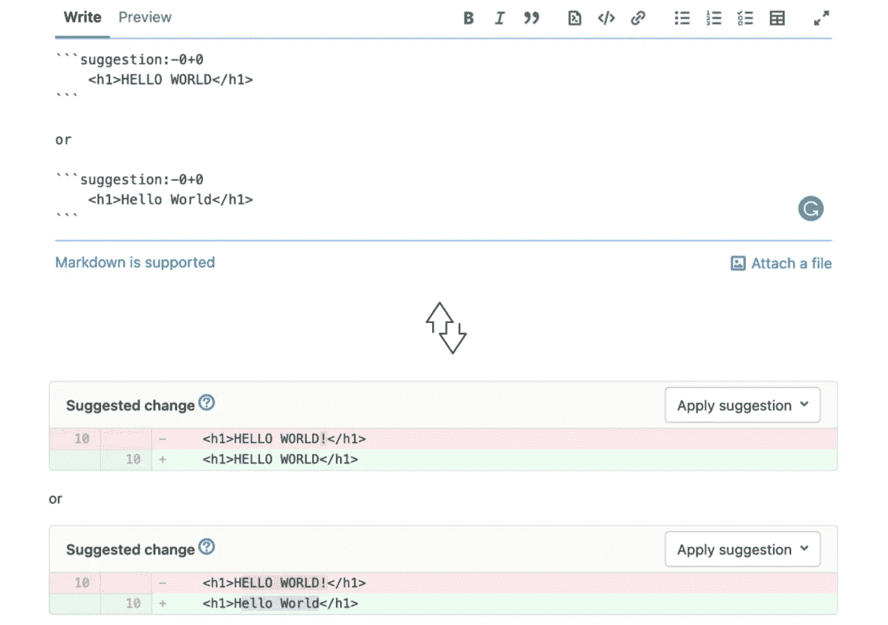
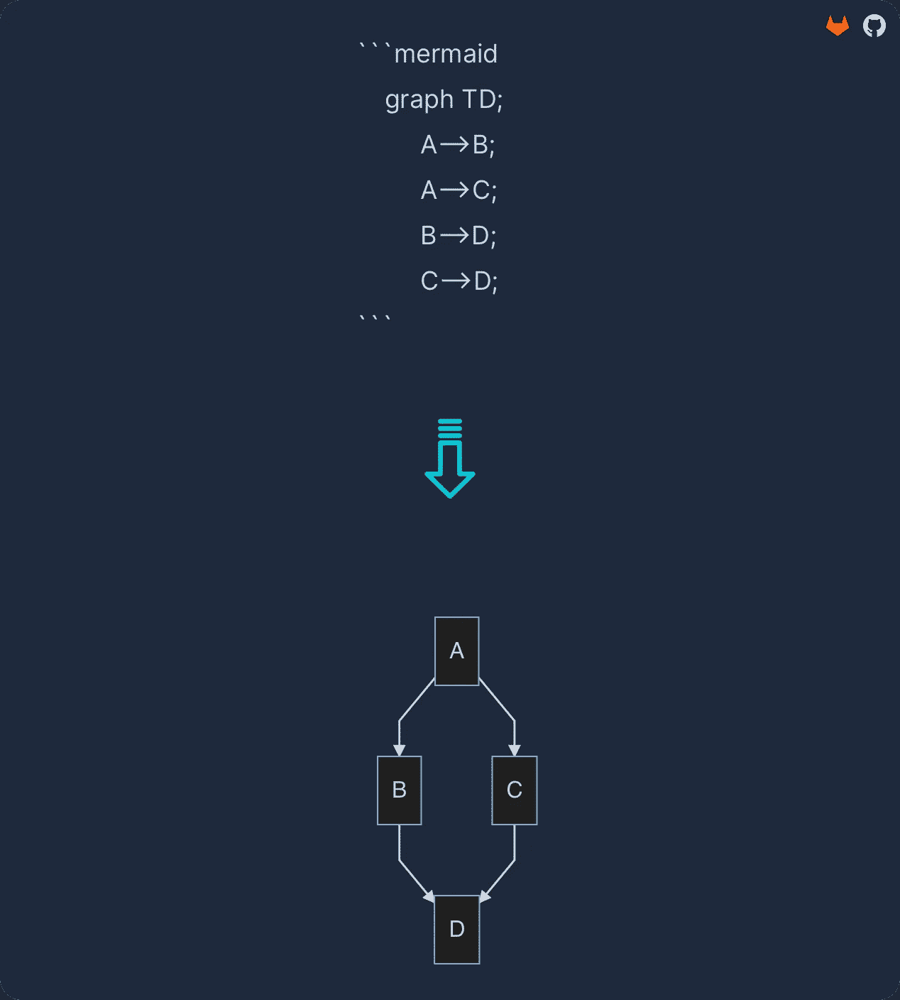
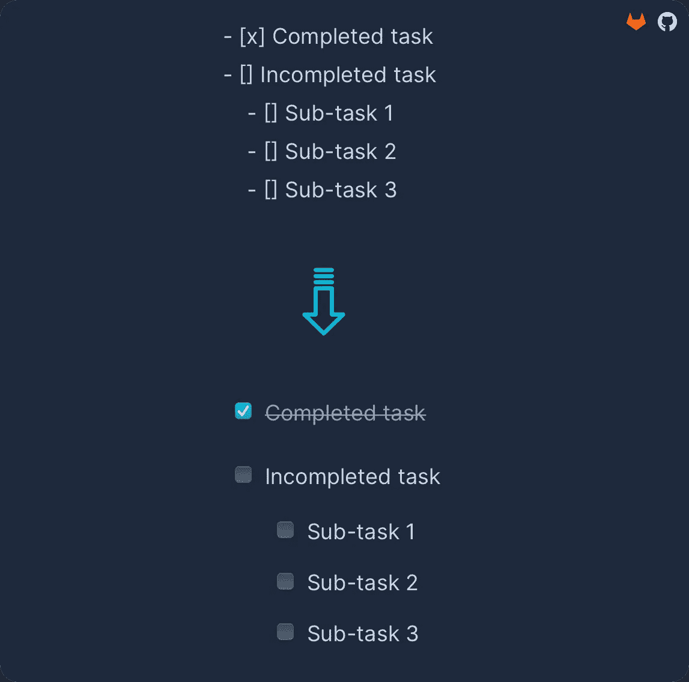
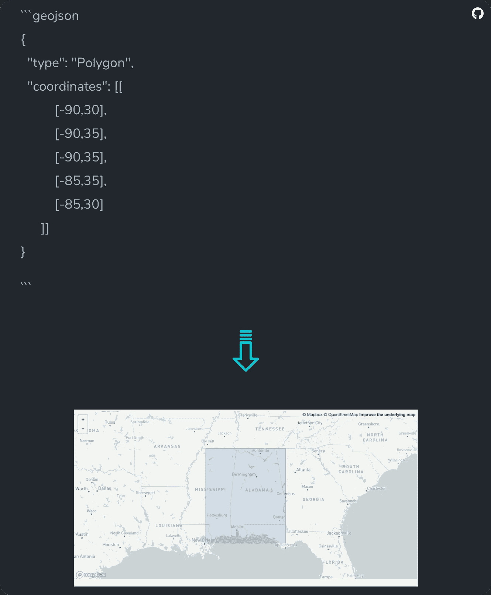
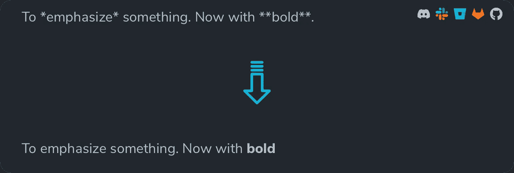
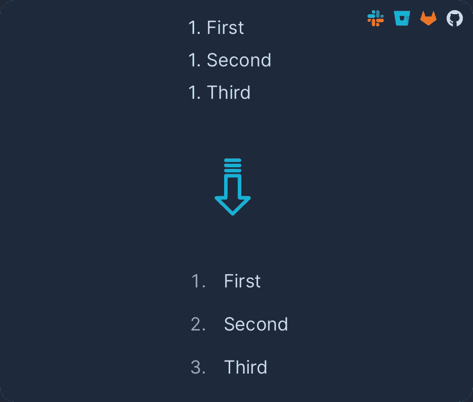
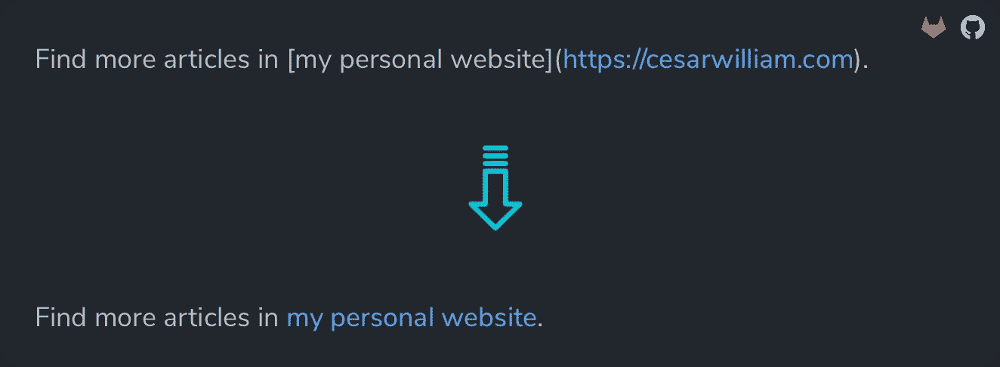
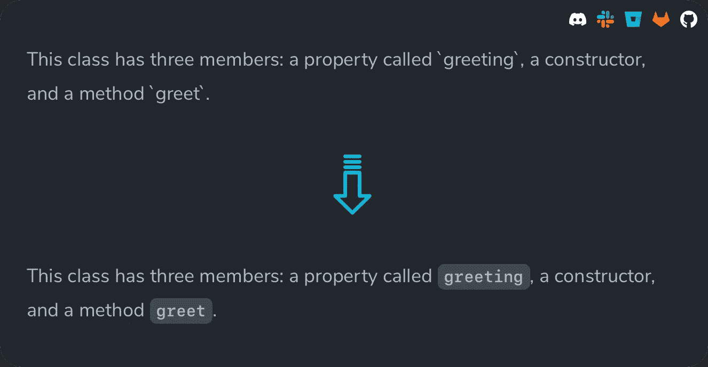
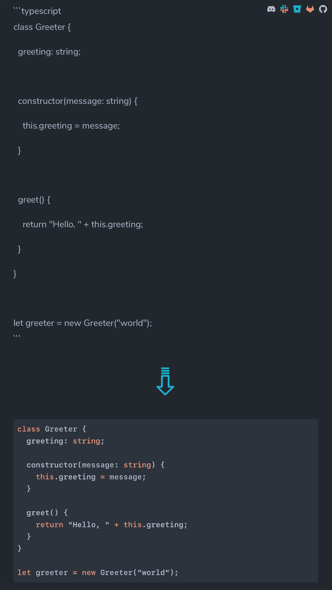

# 开发者降价指南

> 原文：<https://betterprogramming.pub/markdown-guide-for-developers-6d44f1633cbe>

## Markdown 对于开发者来说是一个强大的对话工具。开发人员可以使用它在多个应用程序之间分享他们的想法

与 [Canva](https://www.canva.com/) 合影。

你有没有试过从一个通信应用程序中复制文本，但在另一个文本编辑器中格式不佳？你有没有开始用文字处理器写文档，移植到一个新的平台，它不适应？在这篇文章中，我们将学习如何提高我们的写作技巧，这样我们就不会落入这些陷阱。

# 什么是降价？

Markdown 对于开发者来说是一个强大的对话工具。开发人员可以使用它在多个应用程序之间轻松、清晰地分享他们的想法，并且在大多数情况下是独立于平台的。

在这篇文章中，我将展示我们如何使用 markdown 与同事有效沟通。我们可以在日常聊天中使用 Slack、Discord 或 git 库(如 GitHub、Bitbucket 或 GitLab)来应用这些策略。

使用精心编写的信息清晰地表达你的想法是很重要的。

# Git 仓库

我们将从在您的 Git 存储库中使用的一些建议开始。

## 建议

当使用降价*建议*审查一个拉取请求时，你可以建议对一行或多行代码进行特定的修改。然后，合并请求作者可以通过点击来应用这些建议。这个动作在合并请求中生成一个提交，**由建议**变更的用户创作。

在 GitHub 中，要选择多行代码块，您可以:

*   单击并按住行号右侧，拖动鼠标，当到达所需选择的最后一行时，松开鼠标；或者
*   点击一个行号，按住`Shift`，点击第二个行号，点击第二个行号右侧的`+`按钮。

选择代码块后，单击 diff 图标并编辑建议块中的文本。

## 美人鱼

使用 Mermaid，您可以根据文本描述轻松创建图表、序列、甘特图等。美人鱼的目的是帮助可视化文档，并帮助它赶上发展。文本描述的文档可以在这里找到[https://mermaid-js.github.io/mermaid](https://mermaid-js.github.io/mermaid)。

你可以尝试一下，在这个[美人鱼直播编辑器](https://mermaid.live/)里获取更多的例子。

## 任务列表

问题、注释和拉式请求描述中的任务列表对于项目协调和跟踪重要项目非常有用。

任务列表项由一个减号(`-`)后跟一个左括号(`[`)、一个空格字符或字母`x`(小写或大写)，然后是一个右括号(`]`)。

呈现时，任务列表项被替换为语义复选框元素；在 HTML 输出中，这将是一个`<input type=”checkbox”>`元素。

如果方括号之间的字符是空白字符，则复选框未选中。否则，复选框将被选中。

## 地图

您可以使用 **GeoJSON** 语法在 markdown 中创建交互式地图。 **GeoJSON** 是一种表示地图数据的开放标准文件格式。您可以在 [GeoJSON 规范](https://geojson.org/)中找到更多信息。

# Git 存储库+文档

## 标题和页眉

如果你想创建一个标题，你必须在行首添加一个标签。

随着你添加更多，标题会变得更小。

## 部分

三个破折号代表一条**水平线**，适用于文档的不同部分。

## 强调

为了强调某事，在单词或短语的开头和结尾加星号。一组表示你是斜体，两组表示你是粗体。

## 批量报价

要创建块引用，请在行首添加胡萝卜。

# 目录

您可以通过对列表中的每个项目进行编号来创建有序列表。

但不是用一个，两个，三个等等。我有一个小技巧给你，你可以把 1，2，3 全换成 1。这样，如果你改变列表的顺序，数字保持不变。

## 表情符号

你可以通过在表情符号名称的开头和结尾添加冒号来添加表情符号。例如`:alarm_clock::pig::airplane: When Pigs Fly.`

⏰ 🐷猪会飞时的✈️。

## 环

要在文本中添加链接，只需将要创建超链接的单词或短语括在括号中，然后在括号中添加链接。

## 密码

如果你想在你的文本中添加一些代码，你可以在代码的开头和结尾添加一个反勾号，这会让它看起来很酷。

为了突出显示块代码和语法，您将在代码的开头和结尾添加三个反勾号。

您可以指定正在使用的语言。

## 脚注

脚注允许您添加注释和参考，而不会弄乱文档的正文。创建脚注时，带有链接的上标数字会出现在添加脚注引用的位置。读者可以点击链接跳转到页面底部脚注的内容。

若要创建脚注引用，请在方括号([ ])中添加插入符号和标识符。标识符可以是数字或单词，但不能包含空格或制表符。标识符仅将脚注引用与脚注本身相关联—在输出中，脚注按顺序编号。

使用另一个插入符号添加脚注，并用冒号和文本([ ]:此文本在脚注中。).你不必在文件的结尾加上脚注。您可以将它们放在除列表、块引号和表格等其他元素之外的任何位置。

## 桌子

您可以构建表格来组织评论、问题、请求和 wikis 中的信息。

1.  第一行包含标题，由“管道”(`|`)分隔。
2.  第二行将标题与单元格分开。
    -单元格只能包含空格、连字符和(可选的)冒号，用于水平对齐。
    -每个单元格必须包含至少一个连字符，但是向单元格添加更多的连字符不会改变单元格的呈现。
    -不允许除连字符、空白或冒号之外的任何内容
3.  第三行及其后的所有行包含单元格值。
    -单元格大小**不必**相互匹配。它们是柔性的，但必须用管子隔开(`|`)。
    -你**可以**有空白单元格。
4.  列宽是根据单元格的内容动态计算的。

此外，您可以通过在第二行的“破折号”两侧添加冒号(`:`)来选择列中文本的对齐方式。

## 形象

若要添加图像，请添加感叹号(！)，后跟括号中的 alt 文本，以及括号中的图像资源的路径或 URL。您可以选择在路径或 URL 后添加带引号的标题。

# 结论

看到 markdown 并不可怕，如果你有所有这些想法在你的支配下，你会去比赛和写作快速有效地与你的同事沟通。

由于我们今天生活的现实，开发者现在必须设计出聪明的交流方式。学习如何更好地与同事沟通，对于创建一个远程友好的公司或组织非常重要。