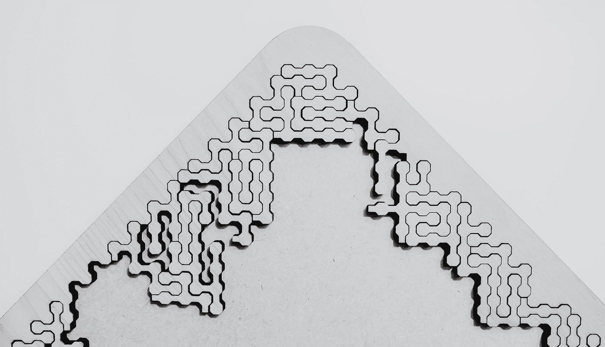

# 通过解决这个单词云 JavaScript 挑战来掌握您的正则表达式技能

> 原文：<https://betterprogramming.pub/master-your-regex-skills-by-solving-this-word-cloud-javascript-challenge-4aef1a1d7d9b>

## 澄清 3 个正则表达式概念的编码挑战



Clark Van Der Beken 在 [Unsplash](https://unsplash.com?utm_source=medium&utm_medium=referral) 上拍摄的照片。

我最近遇到了一个有趣的由几个问题组成的代码挑战。下面可以看到第一个问题:

> “我们爱字云！根据下面的文字，打印出所有使用过的单词及其出现的次数。请忽略标点符号和其他无趣的字符。单词不应区分大小写。

我们可以把这个挑战分成几个部分。

# 1.删除所有标点符号和“无趣”的字符

我们可以通过实现一个快速正则表达式来实现这一点:

```
text.replace(/[^A-Za-z]+/g, " ")
```

上面的代码更有效，因为你不必有一个单独的数组包含所有的标点符号。这个正则表达式基本上可以找到所有是单词或者包含字符 a-z 和 A-Z 的东西，不包括数字和标点符号。

这样做唯一的缺点是，如果你有类似于`25th`的东西，它只会返回`th`，而不是一个单词。如果你允许数字(在`a-z`后加上`0–9`，这样更好。但是如果你有类似于`1/25th`的东西，你会得到`1 25th`，它创造了两个新的“单词”，扭曲了我们的最终结果。我最终使用了下面的正则表达式:

```
text.replace(/[^A-Za-z0–9\/]+/g, " ")
```

我们使用`^`来匹配*不包含*的所有内容，包括字母、数字或`/`。我们可以用空格代替这些匹配。上面的正则表达式会把字符串`This is a test string. This is a string with lots of: punctuations; 1/25th in. it?!`变成`This is a test string This is a string with lots of punctuations 1/25th in it`。

如果你愿意，你可以进一步迭代，但是现在，它非常有效(挑战是有时间限制的，所以我没有一整天的时间来制作完美的正则表达式)。

# 2.在散列表中存储单词和使用实例

现在我们有了一个更精确的字符串，我们可以基于一个空格来分割它。这就是我们如何隔离所有完整的单词，将它们存储在一个数组中，并遍历该数组。当我们迭代时，我们可以通过将它们存储在一个 hashmap 中来跟踪迭代中的一个条目被使用了多少次。参见下面的代码:

由于单词不区分大小写，我们可以将`word`变成小写。然后我们可以检查`wordMap`是否已经有一个值为`word.toLowerCase()`的键。如果它已经有了一个值——比如说，`1`——这意味着我们将那个键上的值增加到`2`，以显示我们有两个`word.toLowerCase()`实例。我们对数组中的每个单词都这样做。

在循环结束时，我们将把每个单词作为一个键存储在`wordMap`中。在每个键上将是每个单词出现的次数。

这就把我们带到了挑战的最后一部分。

# 3.打印所有使用的单词和它们出现的次数

现在我们有了这个，我们终于可以打印单词列表和它们被使用的次数了。我们可以通过一个简单的`for...in`循环来实现这一点:

```
for (var k in wordMap){
  console.log(`${k}: ${wordMap[k]} times`)
}
```

这将打印每个单词以及该单词被使用的次数。下面是我们在代码挑战中针对这个问题的所有代码:

在控制台中，使用我们之前使用的字符串执行代码将如下所示:

```
genWordList("This is a test string. This is a string with lots of: punctuations; 1/25th in. it?!")> this: 2 times
is: 2 times
a: 2 times
test: 1 times
...
```

[*在此将您的免费中级会员升级为付费会员*](https://matt-croak.medium.com/membership) *，每月只需 5 美元，您就可以获得数千位作家的无限量无广告故事。这是一个附属链接，你的会员资格的一部分帮助我为我创造的内容获得奖励。谢谢大家！*

# 参考

[](https://www.rexegg.com/regex-quickstart.html) [## 正则表达式备忘单

### 正则表达式语法参考。包括显示语法、示例和匹配的表格。

www.rexegg.com](https://www.rexegg.com/regex-quickstart.html)