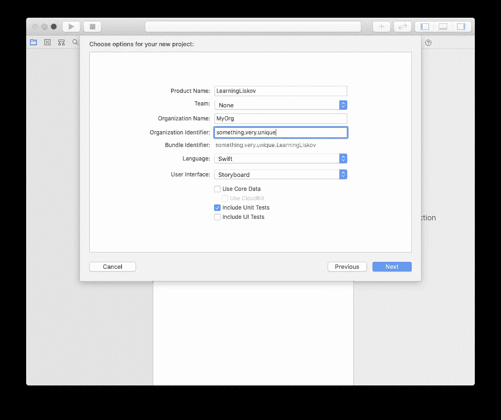

# 掌握 iOS 中的软件工程:利斯科夫替代原理

> 原文：<https://betterprogramming.pub/mastering-software-engineering-in-ios-liskov-substitution-principle-f98d6e1e6b19>

## LSP:软件开发基础简单易懂


丹尼尔·科尔派在 [Unsplash](https://unsplash.com?utm_source=medium&utm_medium=referral) 上的照片

# 固体

让我们继续第三个*坚实的*原理，称为利斯科夫替代原理或简称 *LSP* 。[和之前的文章](https://medium.com/flawless-app-stories/from-hobbyist-to-professional-ios-developer-open-close-principle-5f28d2f09f8c)一样，我将坚持同样的惯例:

*   我给个简单的定义
*   我将给出一个糟糕代码的例子，它在某种程度上违背了我们讨论的原则
*   我将解释为什么这个原则在给定的例子中被打破了
*   我将重构代码，因此该示例符合所讨论的原则
*   我将解释为什么现在它符合它

这次我们甚至将编写一些简单的单元测试来检查我们的代码是否符合 LSP。如果你从未写过它们，不要担心，我会指导你完成整个过程。

# 利斯科夫替代原理

> “设ϕ(x)是关于 t 类型的对象 x 的一个可证明的性质。那么ϕ(y)对于 s 类型的对象 y 应该是真的，其中 s 是 t 的子类型。”
> 
> *-芭芭拉·利斯科夫*

等等，什么？虽然这听起来很复杂，但实际上非常简单。罗伯特·马丁的释义(为了清晰起见，放弃了正式语言)击中了靶心。

> 派生类必须可以替换它们的基类。
> 
> *——罗伯特·马丁*

这个原则的意思是，子类应该总是有可能像基类一样被使用(或多或少有相同的效果)。

最简单的例子是`Animal`基类的`Dog`子类，以及一个允许你抚摸任何动物的函数(`pet(animal: Animal)`)。你应该总是能够在`Animal`级和`Dog`级上使用这个功能。有了继承和多态，它会自动正确地工作。你可以说这是面向对象编程 101。

那么，你为什么还要关心所有现代编程语言默认遵循的原则呢？

事情是这样的:你可能会改变子类的内部逻辑，以至于它不再是基类的替代品。它将在代码级别上编译和工作，但它将提供糟糕和意外的结果，这实际上比简单的编译错误要糟糕得多。

为了说明这一点，我们将使用两个最流行的例子和一个来自我们自己的`UIKit`后院的例子。

# 示例 1:过度使用的鸭子示例

这是迄今为止对该问题最常见的解释。让我们制作一个`Bird`基类和一些子类:

现在让我们试试我们的鸟会有什么表现:

`EmperorPenguin`断了 *LSP* 作为派生类(`EmperorPenguin`)一定是可以替它们的基类(`Bird`)的，然而却不是。

不能将`fly(birds:allBirds, to:)`与`EmperorPenguin`类一起使用。代码编译并运行，但是它并没有做它承诺要做的事情。这就是为什么我们的健全检查`assert`在运行时使应用程序崩溃。

我们犯的主要错误是假设每只鸟都会飞。这根本不是对现实世界的正确描述。我们需要记住，基类应该只有每个子类共享的行为(方法),并且能够正确使用。

在 Swift 中，我们可以通过使用面向协议的编程来修复这个错误:

现在我们看到，如果我们试图让一些鸟飞起来，编译器会立即通知我们，而这些鸟根本不会这么做。

在这个实现中，`Bird`基类并不承担在每个现有的`bird`类型中不共享的行为。

它简单地假设每只鸟都“在某个地方”(在我们简化的世界模型中，它们只能在两个地方)，并且它有一定数量的翅膀(默认分配 2，因为每只没有灭绝的鸟显然都有一对翅膀)。

如果一个对象既是一个`Bird`又符合一个`Flyable`协议，它会自动获得`fly(to city:)`函数的默认实现。

这样我们就拥有了两个世界的最佳之处:我们不必重复代码并分别为每个`Bird`子类实现`fly(to city:)`，而且我们不会破坏 LSP。

# 例 2:在编程中，正方形不是长方形

这里我们将编写承诺的单元测试。

打开 *Xcode* ，创建一个*单视图应用*，确保选中*包含单元测试*复选框。让我们给这个项目命名为`LearningLiskov`:



一旦有了这些，创建一个名为`SquareExample.swift`的新 Swift 文件，我们将使用它来创建我们的示例。在此实现 rectangle 类:

现在要为那个类创建单元测试，打开`LearningLiskovTests.swift`并用下面的代码替换它的内容:

现在按下`⌘+U`或选择`*Product ➡ Test*`，过一会儿你会看到:


我们的简单测试已经成功通过。

让我们回到`SquareExample.swift`并创建一个`Square`，它将从`Rectangle`继承而来(因为根据数学，正方形是矩形的一个子类型)。

我们首先会看到的是`Square`没有同时拥有`x`和`y`。它只有`x`。但是我们继承了拥有`y`的类！为了处理这个问题，我们需要编写如下代码:

这样，无论何时任何人改变`Square`任何一边的长度，它都会改变所有其他边。

让我提醒你，根据 *LSP* “派生类必须可替换它们的基类”，所以`provideTestObject()`应该能够提供任何`Rectangle`或它的子类型，测试应该通过！

所以只需将`provideTestObject()`改为`return Square()`并进行测试`(⌘+U)`。

您将看到测试失败:

```
XCTAssertEqual failed: ("100") is not equal to ("50")
```

事实证明，我们对`Sqare`类的行为做了如此大的改变，它是不可替代的`Rectangle`。它打破了利斯科夫替代原理。这里没有简单的解决方法。

## `Square`不应从`Rectangle`继承

面向对象编程中的继承意味着子类化的对象将获得基类的属性(类变量)和行为(函数和类似`didSet`的东西)。

`Square`的行为(改变`x`或`y`会同时改变`x`和`y`)与`Rectangle`的行为(改变`x`或`y`，只改变它们自己)直接矛盾，所以我们不能用一个代替另一个。

在不违反利斯科夫替换原则的情况下，我们根本无法使用继承来模拟矩形和正方形。

这就是这个例子如此不直观的关键所在:在面向对象编程中，当你说“X 是 Y”(如“正方形是一个矩形”)时，你指的是继承，它有一个非常严格的含义，在现实世界中并不总是相同。

对于这个例子，最好使用`structs`并使`x`和`y`为常量值。结构没有继承，所以我们立即避免了 LSP 问题。我们会马上发现应该对两者进行单独的测试，并且两个结构有不同的构造函数(你只需要正方形的一边！).

# 例 3: `UIKit`自己的“鸭子”

i̵n̵̵`U̵I̵K̵i̵t`̵̵f̵r̵a̵m̵e̵w̵o̵r̵k̵̵`U̵I̵S̵t̵a̵c̵k̵V̵i̵e̵w̵`̵i̵s̵̵b̵r̵e̵a̵k̵i̵n̵g̵̵l̵s̵p̵̵b̵e̵c̵a̵u̵s̵e̵̵o̵f̵̵t̵h̵e̵`̵b̵a̵c̵k̵g̵r̵o̵u̵n̵d̵C̵o̵l̵o̵r̵`̵p̵r̵o̵p̵e̵r̵t̵y̵.̵̵t̵h̵i̵s̵̵p̵r̵o̵p̵e̵r̵t̵y̵̵w̵o̵r̵k̵s̵̵f̵o̵r̵̵t̵h̵e̵̵b̵a̵s̵e̵̵c̵l̵a̵s̵s̵̵(̵̵`U̵I̵V̵i̵e̵w̵`)̵̵a̵n̵d̵̵y̵e̵t̵̵d̵o̵e̵s̵n̵'̵t̵̵f̵o̵r̵̵t̵h̵e̵̵d̵e̵r̵i̵v̵e̵d̵̵c̵l̵a̵s̵s̵̵(̵̵`U̵I̵S̵t̵a̵c̵k̵V̵i̵e̵w̵`)̵.̵̵`U̵I̵S̵t̵a̵c̵k̵V̵i̵e̵w̵`̵s̵i̵m̵p̵l̵y̵̵i̵g̵n̵o̵r̵e̵s̵̵t̵h̵e̵̵b̵a̵c̵k̵g̵r̵o̵u̵n̵d̵̵c̵o̵l̵o̵r̵̵w̵h̵i̵c̵h̵̵i̵s̵̵i̵n̵̵c̵o̵n̵t̵r̵a̵d̵i̵c̵t̵i̵o̵n̵̵o̵f̵̵[a̵p̵p̵l̵e̵'̵s̵̵o̵w̵n̵̵d̵o̵c̵u̵m̵e̵n̵t̵a̵t̵i̵o̵n̵](https://developer.apple.com/documentation/uikit/uiview/1622591-backgroundcolor)法国

*编辑:*他们已经修复了，所以我再举一个例子:`UINavigationController`是从`UIViewController`继承的，但是你不能在`UINavigationController`实例上使用`pushViewController(_:animated:)`函数。如果你尝试，这将会发生:


苹果打破了 LSP

# 总结

利斯科夫替代原理是最容易遵循的原理之一，然而，一旦被打破，它是最难修复的原理之一。

当子类化时，特别是当大量使用`override`(没有从`super`调用相同的方法)时，如果你没有破坏这个特定子类的 *LSP* ，请三思。如果你能记住这一点，你会没事的！