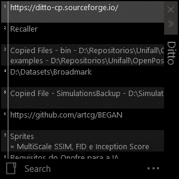
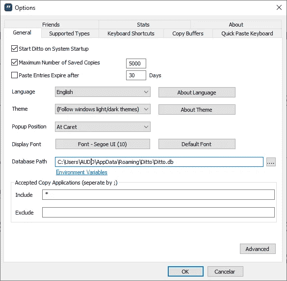
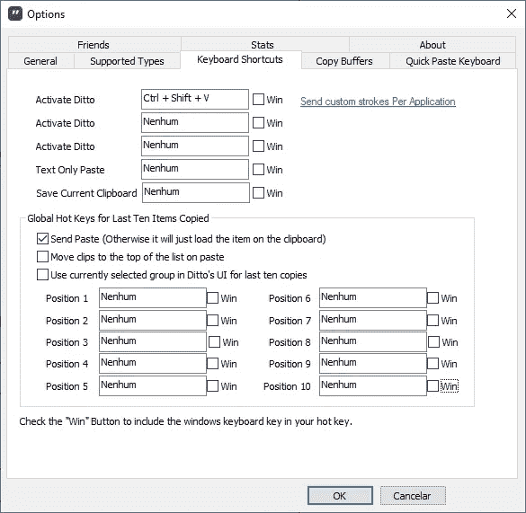

# 同上:更好的剪贴板管理

> 原文：<https://betterprogramming.pub/meet-ditto-better-clipboard-management-98efeb20743a>

## 改变我编码方式的应用程序

由 [Unsplash](https://unsplash.com?utm_source=medium&utm_medium=referral) 上的[谷仓图片](https://unsplash.com/@barnimages?utm_source=medium&utm_medium=referral)拍摄

# 成为召回者

我的名字叫伊戈尔，我是一名召回者。

我倾向于回忆各种各样的事情。如果我读了，我可能会记得。我没有过目不忘的记忆力，也没有超常的智商，但我倾向于回忆事情。

我喜欢把事情联系起来——疯狂的联系。你可能会说一些关于中国的事，我会想起一个关于台湾的有趣事实。我们可能会谈论自动驾驶汽车，我可能会将其与羊业的琐事联系起来。

这些年来，我最讨厌电脑的一点就是复制粘贴。我喜欢它，但我只能有一个副本。我可能会粘贴几次，但也就这样了。一份。

我一直想找回一周前贴的东西。是的，我确实记得一周前我复印了一些东西，如果我还需要的话。

作为一名程序员，我们从堆栈溢出中获取了太多一次性的代码片段，以至于三周后我们还需要再次获取。要么你搜索它，要么你试着回忆你把它贴在哪里。

如果您可以搜索您以前的副本，并检索它们以获得新的粘贴，会怎么样？如果你和我一样是回忆者，这个想法对你来说听起来像一个梦，请做好准备。

# 满足同上

Ditto 是一个剪贴板管理工具。这正是我刚才描述的。它存储你所有的拷贝，并允许你粘贴它们。更好的是，它将允许搜索您的旧副本。

而且是免费的。从 [Ditto 的网站](https://ditto-cp.sourceforge.io/)获取 Ditto。

当你打开它时，弹出的是:

同上屏幕

无论插入符号在哪里，这个黑色窗口都会出现，并包含您以前的所有副本，按时间倒序排列(最新的排在最前面)。在底部，有一个搜索框，用于查找旧的副本。

安装后，我强烈建议更改其默认热键，并根据您的喜好更改主题。我使用`control + shift + v`作为我的同上热键和黑色主题。

前者是通常的`control + v`命令的简单和容易的变体，后者是个人偏好。

这些可以通过从 Ditto 的系统托盘图标访问*选项*项来更改，它们位于*常规*和*键盘快捷键*选项卡内。

还有一些其他更高级的用途，如将您的剪贴板通过多台电脑联网以保持同步，以及为副本添加到期日期，这可能有助于您在共享电脑的情况下确保您的隐私。

我只使用简单的剪贴板管理功能，并将记录副本的最大数量设置为一个非常高的数字。这里是我的配置的一些屏幕。

常规选项卡。它允许您更改主题、存储副本的最大数量，并设置副本的到期日期。

键盘热键标签。在这里你可以用“control + shift + v”来打开“同上”弹出窗口

# 同上编码

Ditto 最容易理解的用例是当你必须将一组东西从一个地方复制到另一个地方。

例如，您可能将三个函数从一个项目复制到另一个项目。他们在不同的地区，所以你不能只选择所有三个。在复制之前，你会复制粘贴，复制粘贴，复制粘贴。用 Ditto，你会复制，复制，复制，然后粘贴，粘贴，粘贴。

另一个用例是当您正在实现一个有问题的功能，并且正在尝试替代的实现时。大多数人会对第一次不成功的尝试置之不理，然后开始第二次。

如果第二次失败了，他们会再次注释掉，并尝试另一次拍摄。诸如此类。如果他们没有主意了，他们可能会取消对其中一个尝试的注释，并尝试让它工作。

使用 Ditto，我只是复制不成功的尝试(保存它们)并删除它们。如果我需要他们回来，他们会在那里，在同上的数据库。

在使用 Python 和数据科学的过程中，我倾向于到处复制很多东西。如何再次执行训练/测试分割的代码？Google，然后栈溢出，砰！

三天后，我为另一个项目再次搜索这个代码。使用搜索框，我现在可以再次找到代码片段，而无需求助于互联网或打开以前的项目代码。

# 限制

Ditto 的主要限制是它受限于 Windows 平台。

然而，不用担心，对于 Linux 和 Mac 用户来说，有几种选择，比如 [CopyQ](https://hluk.github.io/CopyQ/) 和 [ClipIt](https://github.com/CristianHenzel/ClipIt) 。最后，你使用哪种工具并不重要。然而，尝试一下剪贴板管理器的想法。你不会后悔的。

对于那些在 Windows 上安装了 Ditto 的，这个工具大部分时间都工作得很好。但是，有两种情况需要注意:

1.  将文件从一个文件夹复制到另一个文件夹时，保存的副本只是一个参考。它不会备份复制的数据。因此，如果您不小心删除了一个文件，Ditto 不会保存您。
2.  使用 Office 套件时，无论何时复制内容，副本都会嵌入一些样式信息，这些信息并不总是被充分保存。例如，如果您在 Excel 中绘制一些内容并将其粘贴到 PowerPoint 演示文稿中，它会将该绘图的可编辑副本粘贴到您的幻灯片中。如果您以后再次需要该图，并使用 Ditto 检索它，将粘贴该图的图像，而不是该图本身。

这些是我在使用该工具的一年多时间里发现的唯一的极限情况。第一个很容易理解，不可依赖。第二个问题只对 Office 用户重要，所以对你来说可能根本不是问题。

# 结束语

大约一年前，我开始使用剪贴板管理器。起初，这感觉像是一个噱头。当我回忆起它的存在时用过的东西。然而，几周之后，它成了我工作流程中不可或缺的一部分。当我换到一台新电脑时，这是我首先安装的东西之一。

去 Ditto 的[网站](https://ditto-cp.sourceforge.io/)(或者 [CopyQ 的](https://hluk.github.io/CopyQ/)或者 [ClipIt](https://github.com/CristianHenzel/ClipIt) 的)亲自尝试一下。它也可能改变你的生活。如果有，请回来，打个招呼，告诉我们你的经历。

如果您对本文有任何问题，请随时发表评论或[联系我](https://www.linkedin.com/in/ygorreboucas/)。如果你是中新，我强烈推荐[订阅](https://ygorserpa.medium.com/membership)。对于数据和 IT 专业人员来说，中型文章是 StackOverflow 的完美组合，对于新手来说更是如此。注册时请考虑使用[我的会员链接。](https://ygorserpa.medium.com/membership)

感谢阅读:)