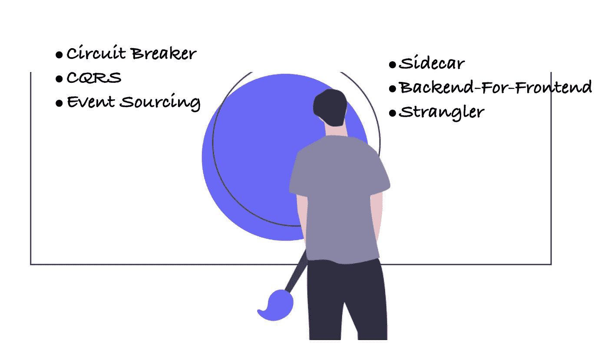
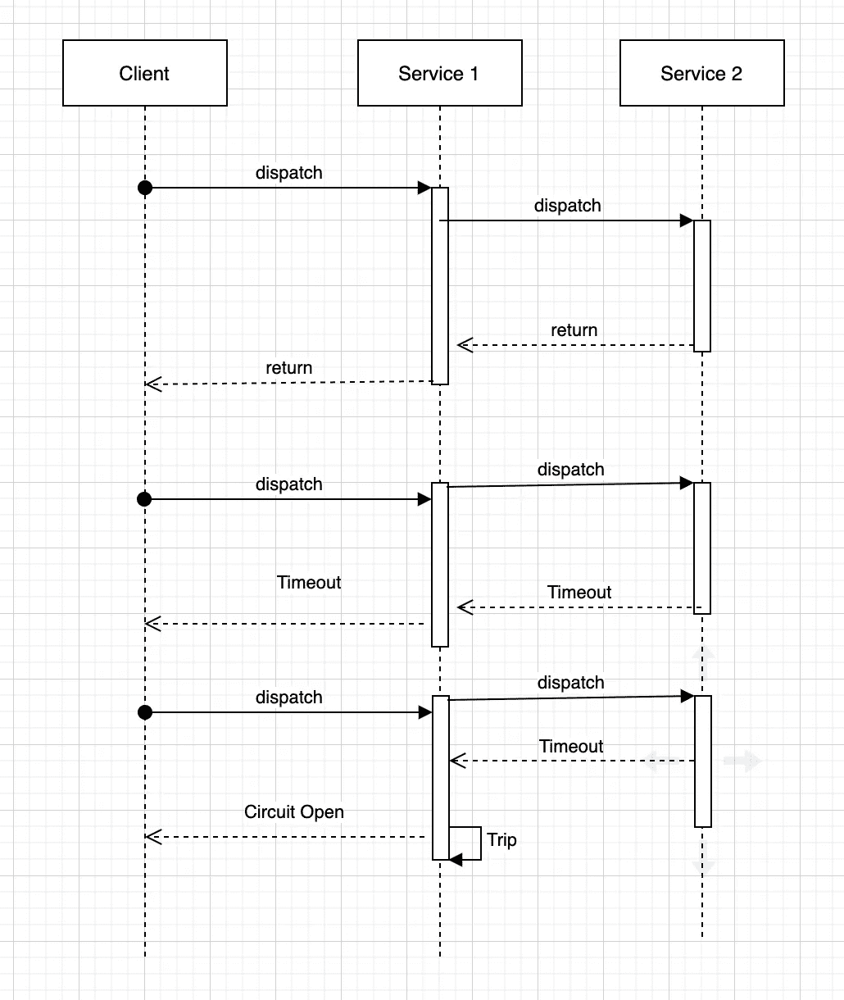
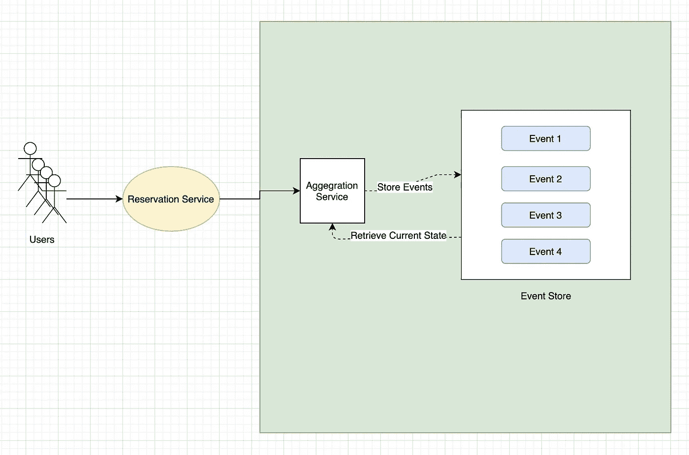
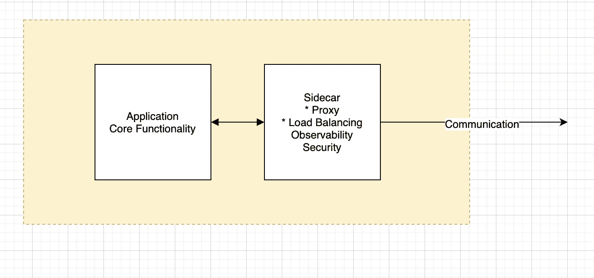
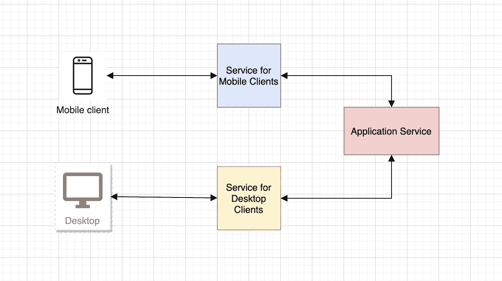
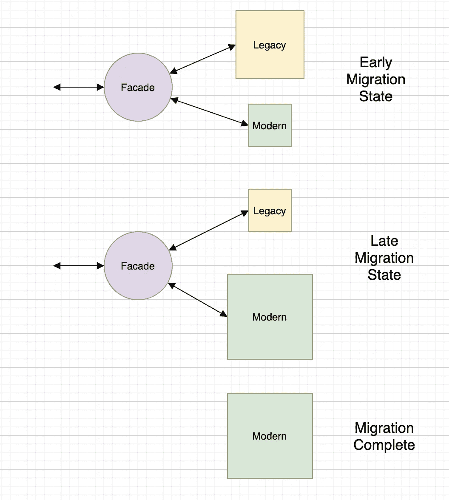

# 面向软件专业人员的现代架构设计模式

> 原文：<https://betterprogramming.pub/modern-day-architecture-design-patterns-for-software-professionals-9056ee1ed977>

## 断路器、CQRS、事件源、边车、后端对前端和扼杀者



来源—[https://undraw.co/](https://undraw.co/)

许多现代应用程序需要在企业规模上构建，有时甚至需要在互联网规模上构建。每个应用程序都需要满足可伸缩性、可用性、安全性、可靠性和弹性需求。

在这篇文章中，我将谈论一些可以帮助您轻松实现上述能力的设计模式。我将讨论每个模式，如何在云原生环境中使用该模式，以及何时使用，何时不使用。

其中一些模式并不新鲜，但在当前互联网规模的云世界中非常有用。

下面是我将在本文中讨论的模式列表:

```
1\. [Circuit Breaker](#4c75)
2\. [Command and Query Responsibility Segregation (CQRS)](#ea92)
3\. [Event Sourcing](#47f9)
4\. [Sidecar](#4c49)
5\. [Backend-for-Frontend](#f4c8)
6\. [Strangler](#c9d5)
```

所以让我们开始吧。

# 断路器

分布式系统的设计应该考虑到故障。如今，世界已经采用了微服务，这些服务大多依赖于其他远程服务。由于网络、应用程序负载等各种原因，这些远程服务可能无法及时响应。在大多数情况下，实施重试应该能够解决问题。

但有时可能会出现一些重大问题，如服务质量下降或服务完全失败。在这种情况下继续重试是没有意义的。这就是断路器模式有用的地方。



断路器。图片由作者提供。

上图展示了断路器模式的实现，其中当服务 1 知道调用服务 2 时存在连续故障/超时，服务 1 不会重试，而是将调用发送到服务 2 并返回回退响应。

有一些流行的开源库，如[网飞的 Hystrix](https://github.com/Netflix/Hystrix/wiki/How-it-Works) 或 [Reselience4J](https://github.com/resilience4j/resilience4j) ，可以用来非常容易地实现这种模式。

如果你使用 API 网关或者像 [Envoy](https://medium.com/better-programming/using-envoy-proxy-to-improve-reliability-security-and-observability-of-microservices-85032e08d3f4) 这样的 [sidecar](https://medium.com/better-programming/using-envoy-proxy-to-improve-reliability-security-and-observability-of-microservices-85032e08d3f4) 代理，那么这可以在代理级别上实现。

**注意:**当电路断开时，有足够的日志记录和警报，以便跟踪在此期间收到的请求，并且操作团队意识到这一点，这一点非常重要。

您还可以在半电路断开的情况下实现断路器，以继续为服务质量下降的客户端提供服务。

## 何时使用这种模式

*   当一个服务依赖于另一个远程服务时，在某些情况下可能会失败
*   当服务具有非常高的依赖性时(例如，主数据服务)

## 何时不使用这种模式

*   当您处理本地依赖时，断路器可能会产生开销

# 指挥和查询责任分离(CQRS)

对于涉及使用数据存储的现代应用程序来说，CQRS 是一种非常有用的模式。它基于在数据存储中分离读取(查询)和写入/更新(命令)操作的原则。

假设您正在构建一个应用程序，要求您将数据存储在 MySQL/PostgreSQL 等数据库中。众所周知，将数据写入数据存储时，操作需要采取几个步骤，如验证、建模和持久化，因此典型的写/更新操作比简单的读操作花费的时间更长。

当您使用单个数据存储同时大规模执行读写操作时，您可能会开始看到性能问题。

在这种情况下，CQRS 模式会很有用。CQRS 模式建议对读写操作使用不同的数据模型。一些变体还建议为这些模型使用单独的数据存储。


CQRS。图片由作者提供。

**注意:**如今大多数 PaaS 数据库都提供了创建*读取副本***([谷歌云 SQL](https://cloud.google.com/sql/docs/mysql/replication/create-replica) 、 [Azure SQL DB](https://docs.microsoft.com/en-us/azure/azure-sql/database/read-scale-out) 、[亚马逊 RDS](https://aws.amazon.com/rds/features/read-replicas/) 等功能。)的数据存储，这有助于更轻松地实现数据复制。**

如果您正在处理本地数据库，许多企业数据库也提供这种功能。

**注意:**现在有些人也喜欢将读取副本实现为快速和高性能的 NoSQL 数据库，比如 MongoDB 和 Elasticsearch。

## 何时使用这种模式

*   当您考虑扩展一个预期有大量读写操作的应用程序时
*   当您想要分别调整读取和写入操作的性能时
*   当您的读取操作接近实时或最终一致时

## 何时不使用这种模式

*   当您构建一个普通的 CRUD 应用程序时，并不期望一次进行大量的读写操作

# 活动采购

事件源是一种有趣的设计模式，其中一系列领域事件被存储为日志，日志的聚合视图给出了应用程序的当前状态。

这种模式通常用于负担不起数据存储锁的系统，以及需要维护审计和事件历史的系统，例如，像酒店/会议/座位预订这样的应用程序。



活动采购。图片由作者提供。

考虑一个酒店房间预订系统，其中用户被期望预订或取消预订。在这里，您需要将预订和取消存储为一系列事件。每次预订前，通过查看活动日志，汇总视图会显示可用房间。

注意:大多数云服务提供商支持消息服务，如 Google Pub/Sub、Azure Service Bus、AWS SQS 等。这些服务与强大一致的数据存储相结合，可以用来实现这种模式。

## 何时使用这种模式

*   当常规的 CRUD 操作不足以满足需求时
*   通常适用于座位预订系统，如公共汽车、火车、会议、电影院等。—或者由购物车操作、支付等事件组成的电子商务系统。
*   当需要强大的审核和事件重放来创建应用程序的当前和过去状态时

## 何时不使用这种模式

*   当常规 CRUD 操作足以满足用户需求时。

# 边车

[边车模式](https://medium.com/better-programming/using-envoy-proxy-to-improve-reliability-security-and-observability-of-microservices-85032e08d3f4)随着微服务的兴起而流行起来。在这种模式中，您将应用程序的组件部署到单独的流程或容器中。这有助于实现抽象和封装。

[特使代理](https://www.envoyproxy.io/)是最流行的边车代理之一，使用广泛。它帮助您将应用程序的核心功能分开，使用 sidecar 来隔离常见的功能，如联网、可观察性和安全性。



边车。图片由作者提供。

这种类型边车可以帮助抽象 L4/L7 类型的通信。像 Envoy Proxies 这样的 Sidecars 甚至通过实现相互 TLS 来帮助实现更高的安全性。

您可以将其与服务网格结合使用，以在各种微服务之间实现更好的通信和安全性。你可以在我的[上一篇文章](https://medium.com/better-programming/the-roles-of-service-mesh-and-api-gateways-in-microservice-architecture-f6e7dfd61043)中了解更多。

## 何时使用这种模式

*   当您处理产品范围内的多种异构微服务时
*   当您处理通常无法应对新时代通信和安全挑战的遗留应用程序时

## 何时不使用这种模式

*   当您处理需要相互通信的有限数量的服务时
*   边车部署可能不经济或不利于操作的小型应用

# 后端对前端(BFF)

在典型的产品开发周期中，后端工程师负责创建与数据存储交互的服务，前端工程师负责构建用户界面。如今，构建应用程序时需要考虑移动和桌面的使用。

尽管移动设备和桌面设备在硬件方面的差距越来越小，但移动设备的连接和使用仍然具有挑战性。

在这种情况下，BFF 模式变得非常方便。在这里，您应该为特定的前端构建/定制后端服务。



后端对前端。图片由作者提供。

为了优化移动客户端的性能，您可能希望构建一个单独的后端服务，以轻量级和分页的响应进行响应。

您可能还想使用这种模式来聚合各种服务，以减少闲聊式的交流。

**注意:**现在，如果您使用 API 网关，BFF 模式可以很容易地在网关中实现，并且您不需要维护单独的服务。

## 何时使用这种模式

*   当您想要为不同的客户端(如桌面和移动客户端)提供产品/服务时
*   当您想要为特定类型的客户端优化响应时
*   当您希望减少移动客户端和各种服务之间的闲聊式通信时

## 何时不使用这种模式

*   当应用程序用户预期使用单一用户界面时
*   当移动和桌面应用程序被期望展示相似的信息和提供相似的功能时

# 扼杀者

如果您在一个正在进行应用程序现代化的组织中工作，那么 Strangler 设计模式是必须的。Strangler 设计模式提倡在您的遗产和新应用程序之上创建一个门面，为消费者提供一个抽象的视图。



扼杀者。图片由作者提供。

这种模式将消费者与迁移活动分离开来。

**注意:**在一个典型的 IT 组织中，如果你从一个 ERP 迁移到另一个，这种类型的模式非常有用。如果您正在使用 API 网关，那么在网关代理本身中实现它会变得更加容易。

您需要决定是在迁移结束时保留外观还是删除它。

## 何时使用这种模式

*   当您迁移或现代化复杂、高度依赖的应用程序(如 ERP 迁移)时

## 何时不使用这种模式

*   当迁移很简单并且直接替换是更好的选择时

```
Hey, if you enjoyed this story, check out [Medium Membership](https://deshpandetanmay.medium.com/membership)! Just $5/month!*Your membership fee directly supports me and other writers you read. You’ll also get full access to every story on Medium.*
```

[](https://deshpandetanmay.medium.com/subscribe) [## 每当 Tanmay Deshpande 发表文章时，都收到一封电子邮件。

### 每当 Tanmay Deshpande 发表文章时，都收到一封电子邮件。通过注册，您将创建一个中型帐户，如果您还没有…

deshpandetanmay.medium.com](https://deshpandetanmay.medium.com/subscribe)