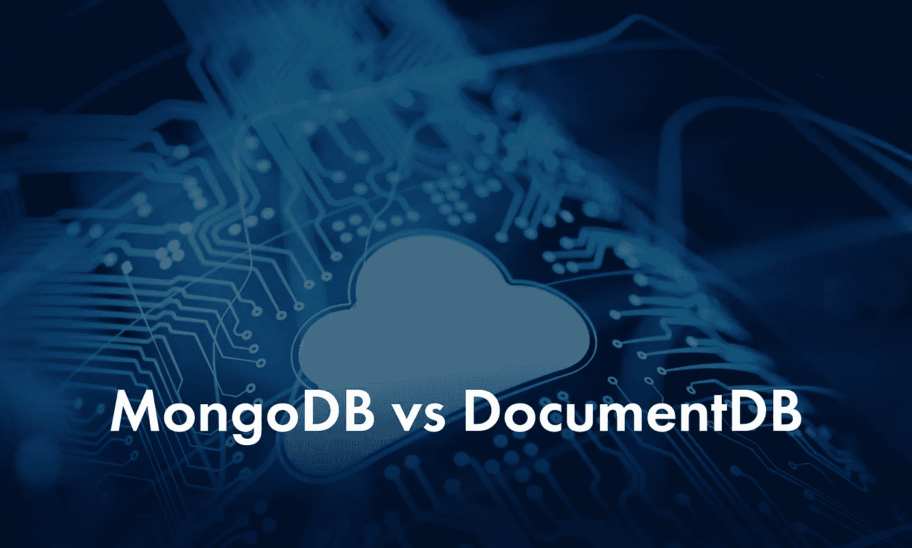

# MongoDB 与 DocumentDB

> 原文：<https://betterprogramming.pub/mongodb-vs-documentdb-which-is-right-for-you-e8015941fa76>

## 哪个适合你？

你是否在试图决定是应该使用 [MongoDB](https://www.mongodb.com/) 还是 [DocumentDB](https://aws.amazon.com/documentdb/) ？随着最近围绕 MongoDB 许可的[争议](https://techcrunch.com/2019/01/09/aws-gives-open-source-the-middle-finger/),选择哪个选项适合你的公司或项目可能会令人困惑。

Amazon 认为核心 MongoDB 代码在保持高可用性的同时很难扩展。亚马逊写了他们的实现，兼容 Apache 2.0 开源 MongoDB 3.6 API。MongoDB 公司最近也改变了他们的许可证，使得未来的模仿更加困难。为此，他们创建了一个全新的许可证，名为[服务器端公共许可证](https://www.mongodb.com/licensing/server-side-public-license)。

考虑到这种分割，您应该让 MongoDB 服务提供商(如 [MongoDB Atlas](https://www.mongodb.com/cloud/atlas) )托管您的关键任务数据库，运行并扩展您的实例，还是使用 DocumentDB？由于公司之间的分歧和没有明确答案的事实，这成为一个困难的决定。

# DocumentDB 是什么？

[2019 年 1 月推出](https://press.aboutamazon.com/news-releases/news-release-details/aws-announces-amazon-documentdb-mongodb-compatibility)亚马逊 DocumentDB(兼容 MongoDB)是 MongoDB 3.6 API 的快速、可扩展、高可用的实现。这是一个完全托管的文档数据库，支持 MongoDB 工作负载。从本质上讲，DocumentDB 是 3.6 版本的克隆版，为扩展而重新实现。它不共享或使用任何 MongoDB 源代码，这意味着它是一个独特的实现，是亚马逊专有的。

代码是闭源的。Amazon 认为他们需要创建自己的实现来提高大型数据集的性能，为任务关键型工作负载提供高吞吐量。为此，他们分离了存储和计算。这允许通过添加低延迟读取副本将读取容量扩展到每秒数百万次请求。

亚马逊的实现是对越来越多努力大规模运行 MongoDB 的客户的回应。亚马逊认为，所有现有的解决方案，包括 MongoDB Atlas，都没有解决客户面临的问题。例如，DocumentDB 支持自动数据扩展，使您可以毫不费力地从 10GB 扩展到 64TB。在 DocumentDB 之前，这种数据伸缩是很困难的。

亚马逊的解决方案还提供了自动容错。根据 DocumentDB 的 [FAQ 页面](https://aws.amazon.com/documentdb/faqs/)，DocumentDB 会自动将你的存储卷分成 10GB 的段，分布在许多磁盘上。您的存储卷的每个 10GB 区块以六种方式复制，跨越三个可用性区域。Amazon DocumentDB 旨在无缝处理最多两个数据副本的丢失，而不会影响写入可用性，它还可以处理最多三个副本的丢失，而不会影响读取可用性。它还具有自我修复存储容量。数据块和磁盘被连续扫描以发现错误并自动修复。

由于这项服务是由亚马逊托管的，因此你可以享受大部分合规服务。DocumentDB 符合许多标准，包括 PCI DSS、ISO 9001、27001、27017、27017、SOC 1、SOC 2、SOC 3，并且符合 HIPAA 标准。

# 听起来很棒！有什么条件？

为了与 3.6 API 兼容，DocumentDB 模拟 MongoDB 客户机所期望的请求和响应。理论上，任何兼容 3.4+的驱动都可以。也就是说，这种说法有相当多的警告没有出现在亚马逊的营销材料中。既有 API 支持方面的差距，也有关键的功能差异需要考虑。

根据 [MongoDB](https://www.mongodb.com/atlas-vs-amazon-documentdb/compatibility) 的说法，亚马逊未能通过 **61%** 的正确性测试。需要考虑的一些最大差距:

1.  聚合管道阶段和查询语言操作符受到严重阻碍。截至本文撰写之时，仅支持 50%。例如，不支持`mapReduce`。对于较大的数据集，这更有可能成为一个问题。点击查看聚合支持[的完整列表。](https://docs.aws.amazon.com/documentdb/latest/developerguide/mongo-apis.html#mongo-apis-dababase-aggregation)
2.  某些数据类型和索引是有限的。不支持 Decimal128 数据类型和不区分大小写的索引。
3.  没有[更改流](https://docs.mongodb.com/v3.6/changeStreams/)支持。大型应用程序可能会从这个特性中受益。鉴于他们的实现，还不清楚这个特性是否会进入 DocumentDB。在使用 DocumentDB 之前，一定要检查您的代码中是否有任何使用变更流的内容。例如，以下 Java 代码将会失败:

在做出决定之前，请确保您了解兼容性问题的完整列表[这里](https://docs.aws.amazon.com/documentdb/latest/developerguide/mongo-apis.html)。Amazon 已经声明他们将继续支持 3.6 API 的大部分，但是他们没有给出任何何时停止支持的指示。你可能要等很长时间才能看到关键特性。

选择 DocumentDB 的最大缺点是停留在 3.6 版本上。由于亚马逊和 MongoDB 的意见分歧，以及新的授权方案，DocumentDB 未来会怎么样还不清楚。MongoDB 不支持亚马逊的实现，打算打一仗。Amazon 还没有宣布任何支持最新版本的计划，所以 MongoDB 现在是一个重要的未来版本(4.0+)，发布了一些 DocumentDB 中没有提供的新功能。

目前还不知道亚马逊是否会创建一个新的偏离 MongoDB 主线的 API。如果发生这种情况，用户将被锁定到只有亚马逊支持的 MongoDB 的尴尬分叉版本。另一个选择是永远停留在 DocumentDB 3.6 上，这将导致用户错过很棒的 MongoDB 新特性。选择 DocumentDB 可能会导致意外的供应商锁定，并且很难过渡回 MongoDB。亚马逊还没有解决这个问题，所以只有时间会告诉我们会发生什么。

MongoDB 4.0 版中发布的一个优秀特性的例子是多语句 ACID 事务。DocumentDB 不太可能支持这一点，尤其是对于分离存储和计算的分布式实现。例如，此 Java 代码将在 DocumentDB:

这可能是 MongoDB 将在未来几年发布的许多优秀特性中的第一个。DocumentDB 用户将无法访问这些功能，也不知道他们是否会发布自己的类似功能。

# 那么我为什么要用 AWS DocumentDB 呢？

最终，这一切都归结于规模。如果您需要或有可能以每秒数十万次的读写扩展数 TB，DocumentDB 可能是一个不错的选择。这句来自他们[新闻稿](https://press.aboutamazon.com/news-releases/news-release-details/aws-announces-amazon-documentdb-mongodb-compatibility)的话说明了一切:

> “再加上高级查询处理、连接池以及优化的恢复和重建等优化，Amazon DocumentDB 的吞吐量是当前可用的 MongoDB 解决方案的两倍。”

选择 DocumentDB 的另一个原因是将一切都保存在 AWS 中。将您的大部分或全部服务放在 AWS 上可能是有益和方便的。DocumentDB 是亚马逊唯一托管的 MongoDB 兼容服务。另一种方法是在 EC2/EBS 上自己管理数据库，这很难做到。如今，管理自己的数据库实例通常不是很好的时间利用——除非您有一个专门的团队和一个特定的用例。

亚马逊涉足云服务业务已经有很长时间了。他们无疑是业内最好的，因此您可以信赖他们来保护和扩展您的数据。其他供应商没有相同的记录或经验。如果您需要这些保证，请选择 DocumentDB。否则，坚持使用 MongoDB。