# 9 个最有用的故事书插件和功能示例

> 原文：<https://betterprogramming.pub/most-useful-storybook-addons-and-features-in-examples-f751ed8ffbc>

## 插件解锁故事书的高级功能和新工作流程


# 将涵盖哪些内容

*   [链接](#e086)；
*   [可达性](#5b08)；
*   [设计](#c217)；
*   [故事来源](#9f8d)；
*   [模拟服务人员](#82dd)；
*   [@故事书/测试-反应](#595f)；
*   [互动](#496c)；
*   [半音阶](#0779)；
*   [伪州](#15fc)；

**注意**:在你的项目中添加了插件依赖后，你需要更新`**.storybook/main.js**`文件中的`**addons**`数组。


我们开始吧。

# 链接

将故事链接在一起，用您的 UI 组件构建演示和原型。

```
yarn add -D @storybook/addon-links
```

[](https://storybook.js.org/addons/@storybook/addon-links/) [## 链接插件|故事书

### 故事书链接插件可以用来创建链接，在故事书的故事之间导航。

storybook.js.org](https://storybook.js.org/addons/@storybook/addon-links/) 

`linkTo`举例:

结果:

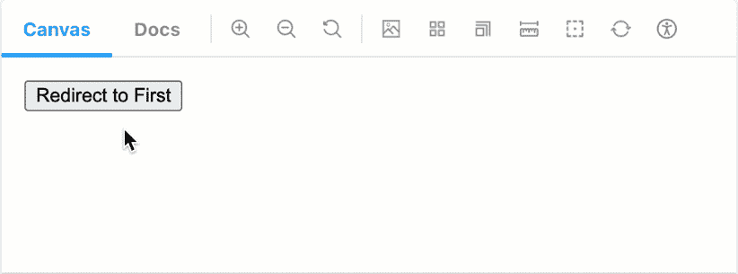

`withLinks`举例:

# 易接近

测试组件是否符合 web 可访问性标准。

```
yarn add @storybook/addon-a11y --dev
```

[](https://storybook.js.org/addons/@storybook/addon-a11y/) [## 辅助功能插件|故事书

### 这个故事书插件有助于使你的 UI 组件更易访问。框架支持首先，安装…

storybook.js.org](https://storybook.js.org/addons/@storybook/addon-a11y/) 

结果:


此外，您可以检查辅助功能工具栏:

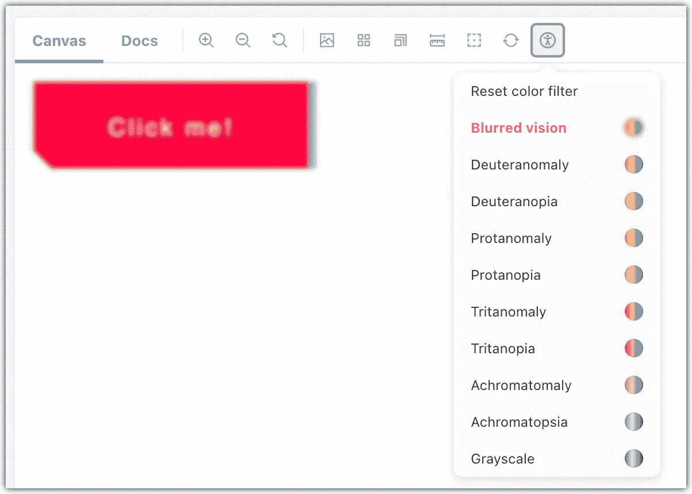

# **设计**

故事书插件，用于在插件面板中嵌入你的设计预览。

```
yarn add -D storybook-addon-designs
```

[](https://storybook.js.org/addons/storybook-addon-designs/) [## 设计插件|故事书

### 一个故事书插件，在插件面板中嵌入 Figma 或网站，以便更好地设计开发工作流程。这个插件…

storybook.js.org](https://storybook.js.org/addons/storybook-addon-designs/) 

示例:

结果:

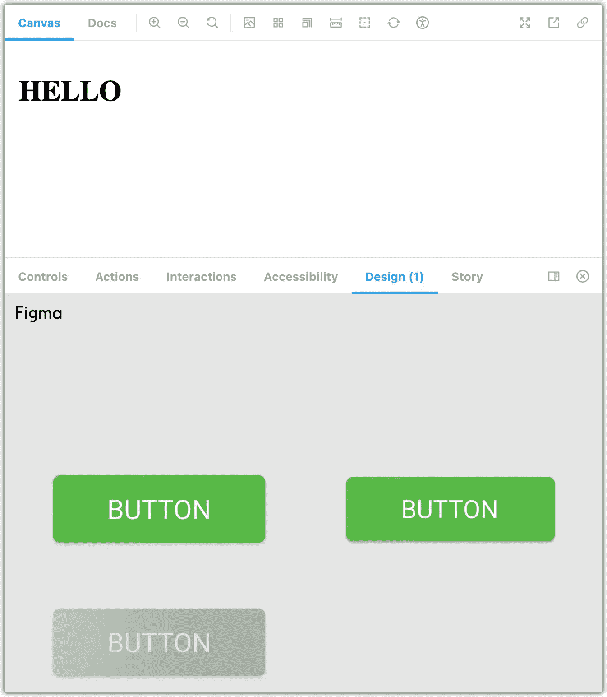

# **故事来源**

查看故事的源代码，了解其工作原理，并将其粘贴到您的应用程序中。

```
yarn add @storybook/addon-storysource -D
```

[](https://storybook.js.org/addons/@storybook/addon-storysource/) [## 故事书

### 这个插件用于在插件面板中显示故事源。

storybook.js.org](https://storybook.js.org/addons/@storybook/addon-storysource/) 

结果:

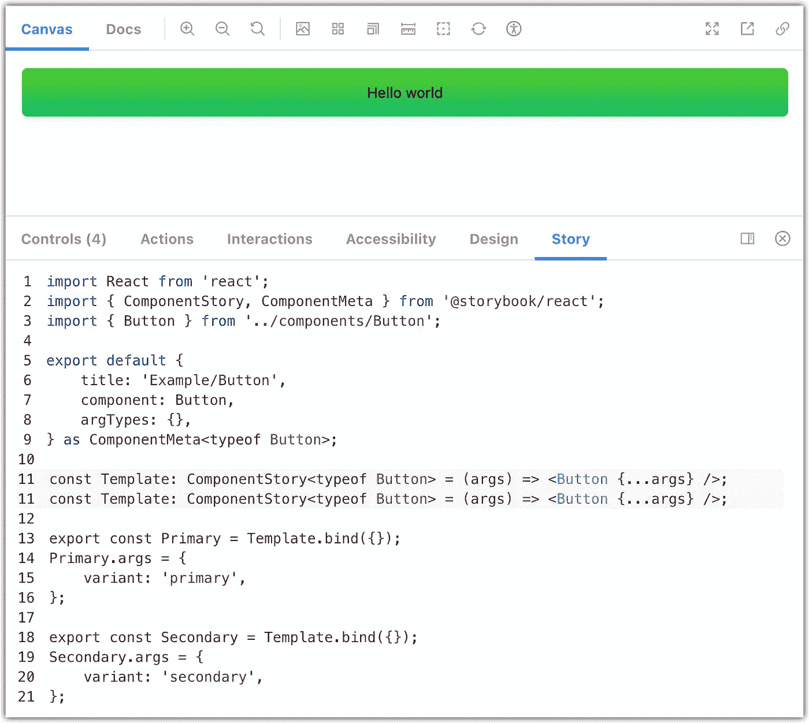

# **模拟服务员**

用模拟服务人员在故事书中模拟 API 请求。

## 特征

*   在您的故事中模拟 Rest 和 GraphQL 请求。
*   记录组件在各种场景中的行为。
*   免费使用其他插件获得 a11y、快照和视觉测试。

[](https://storybook.js.org/addons/msw-storybook-addon/) [## 模拟服务人员插件|故事书

### 在您的故事中模拟 Rest 和 GraphQL 请求。记录组件在各种场景中的行为。获得…

storybook.js.org](https://storybook.js.org/addons/msw-storybook-addon/) 

首先，我们需要初始化模拟服务工作者来启用全局模拟。这些也可以在您的开发环境中启用。

[](https://mswjs.io/) [## 模拟服务人员

### 通过在网络层拦截请求来模仿。无缝重用相同的模拟定义进行测试、开发…

mswjs.io](https://mswjs.io/) 

将 [msw](https://www.npmjs.com/package/msw) 和 [msw-storybook-addon](https://www.npmjs.com/package/msw-storybook-addon) 库添加到您的项目中:

```
**yarn** add msw msw-storybook-addon -D
```

运行 MSW init 命令:

```
**npx** msw init public/ --save
```

它将创建`public/mockServiceWorker.js`文件:

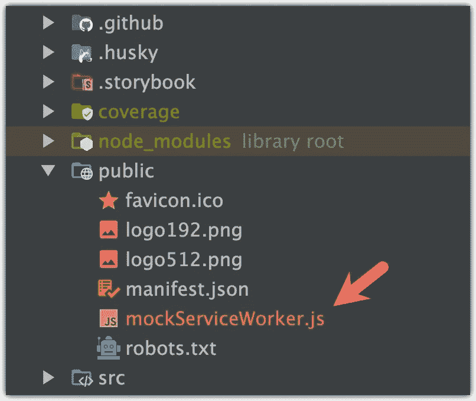

接下来，用`.storybook/main.js`文件中的`msw-storybook-addon`更新 **addon** 数组:


更新`.storybook/preview.js`文件

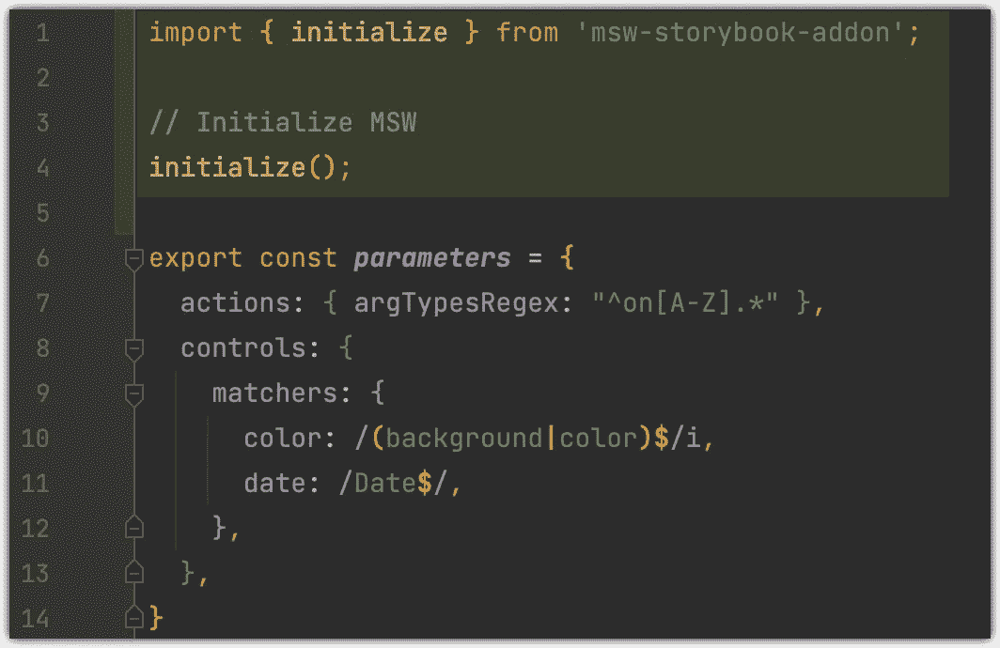

接下来，用 msw decorator 更新您的故事，并添加 API 模拟:

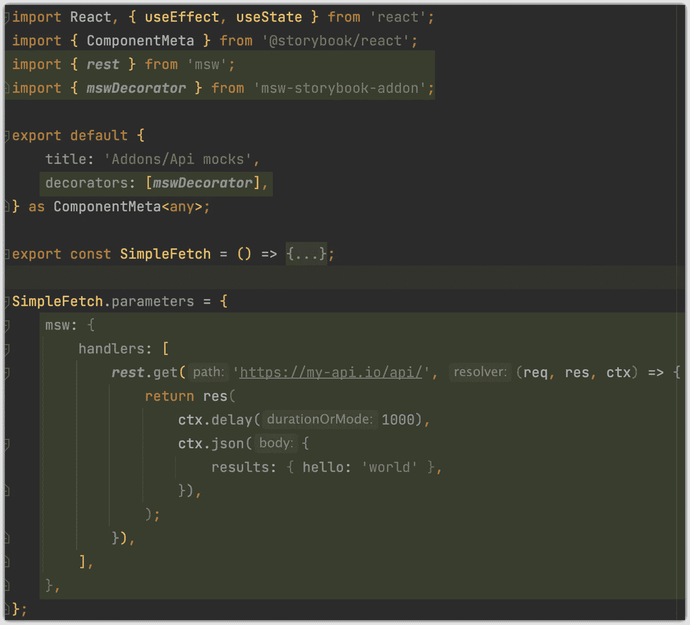

示例:

# **@ story book/testing-react**

允许你在单元测试中重用你的故事的测试工具。

```
yarn add @storybook/testing-react -D
```

[](https://storybook.js.org/addons/@storybook/testing-react/) [## @ story book/testing-react Addon | story book

### 允许你在单元测试中重用你的故事的测试工具你正在为你的组件使用故事书…

storybook.js.org](https://storybook.js.org/addons/@storybook/testing-react/) 

假设我们有一个简单的组件:

三个简单的故事:

*   装载状态；
*   数据成功提取状态；
*   错误状态；

故事

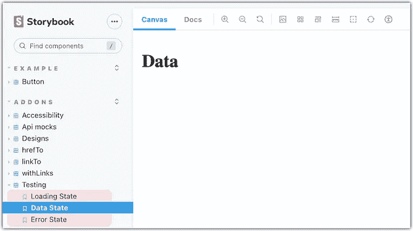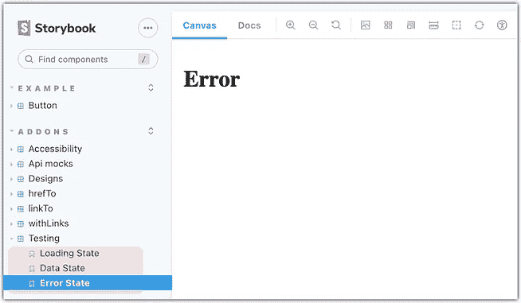

我们已经有了模拟数据，所以我们不需要在测试中再次这样做。我们可以重复使用我们的故事:

# 相互作用

故事书插件交互支持对[故事书](https://storybook.js.org/)中的交互和测试进行可视化调试。

```
yarn add -D @storybook/addon-interactions @storybook/jest @storybook/testing-library
```

[](https://storybook.js.org/addons/@storybook/addon-interactions/) [## 互动插件|故事书

### 故事书插件交互支持对故事书中的交互和测试进行可视化调试。通过…安装此插件

storybook.js.org](https://storybook.js.org/addons/@storybook/addon-interactions/) 

让我们创建一个简单的组件。我们有很多不同的条件:

使用[交互](https://storybook.js.org/addons/@storybook/addon-interactions/)插件，您不需要一次又一次地手动遵循组件步骤:

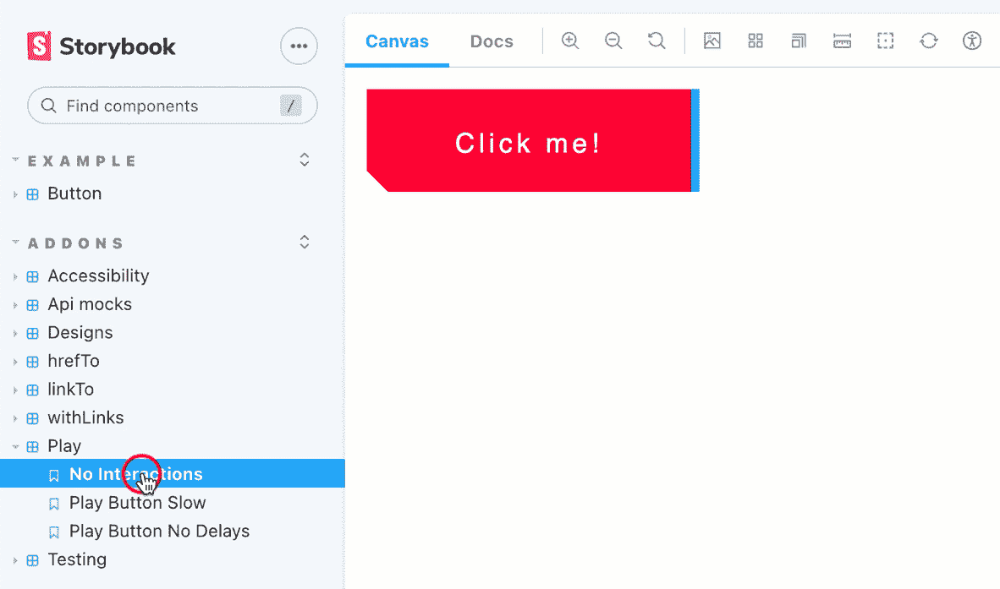

使用`play`功能，你可以描述交互步骤，故事书将会重现它们。

延迟的结果:

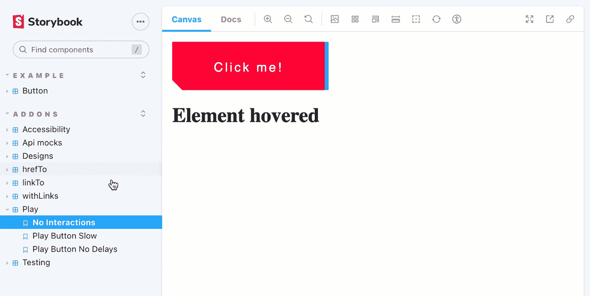

没有延迟的结果(对测试有用):


⚠️ **注**:虽然技术上可以使用`screen`，但建议使用`within(canvasElement)`。除了在找不到 DOM 元素时给你一个更好的错误消息，它还能确保你的 play 函数与故事书文档兼容。


⚠️:注意:你也可以在测试中重用播放功能

# 彩色的

跨浏览器自动化视觉测试。收集用户界面反馈。版本化文档。你可以在我的另一个故事中找到答案:

[](https://artem-diashkin.medium.com/react-and-chromatic-automated-visual-regression-testing-22551b8ebc93) [## 反应和色度。自动化视觉回归测试

### 一步一步的自动化视觉回归测试

artem-diashkin.medium.com](https://artem-diashkin.medium.com/react-and-chromatic-automated-visual-regression-testing-22551b8ebc93) 

# 伪状态

故事书的 CSS 伪状态。

```
yarn add storybook-addon-pseudo-states -D
```

[](https://storybook.js.org/addons/storybook-addon-pseudo-states) [## 伪国家插件|故事书

### 在 Storybook 中切换组件的 CSS 伪状态。这个插件试图“强迫”你的组件的伪…

storybook.js.org](https://storybook.js.org/addons/storybook-addon-pseudo-states) 

结果:


示例:

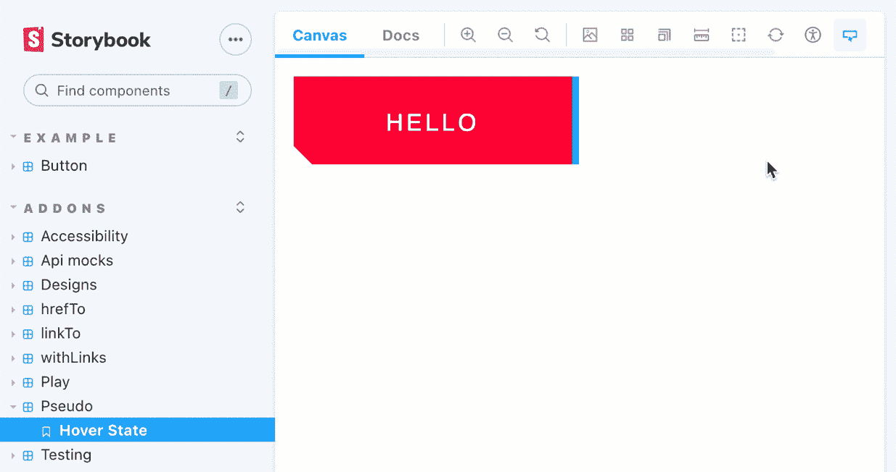

# **性能**

一个故事书插件，帮助更好地理解和调试 React 组件的性能

```
yarn add storybook-addon-performance --dev
```

[](https://storybook.js.org/addons/storybook-addon-performance/) [## 性能插件|故事书

### 一个故事书插件，帮助更好地理解和调试 React 组件的性能🚧这个插件是实验性的…

storybook.js.org](https://storybook.js.org/addons/storybook-addon-performance/) 

`.storybook/main.js`文件更新:

```
module.exports = {
  addons: ['storybook-addon-performance/register'],
};
```

组件示例:

故事:

结果:


您可以选择要渲染组件的多少个副本，然后单击`**Start all**` **。结果每次都会更新没有保存，但是……**

如果您点击`**Pin as baseline**`按钮，对您的组件进行更改，并再次点击`**Start all**`，您将看到不同之处。

我将添加一个简单的 onClick 函数，并重新启动:


结果经过`Start all`:

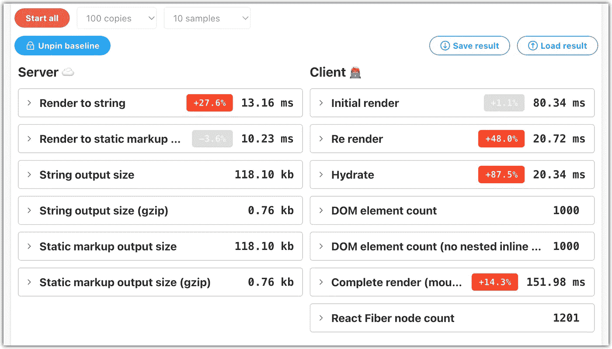

GitHub repo 的链接:

[](https://github.com/nemrosim/react-visual-regression-testing-example) [## GitHub-nemrosim/react-visual-regression-testing-example

### 此时您不能执行该操作。您已使用另一个标签页或窗口登录。您已在另一个选项卡中注销，或者…

github.com](https://github.com/nemrosim/react-visual-regression-testing-example)