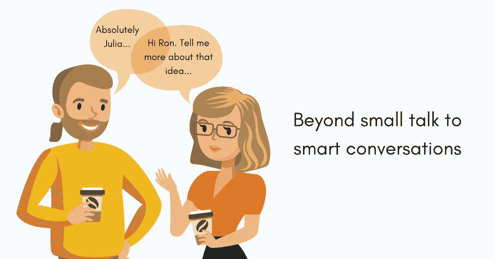
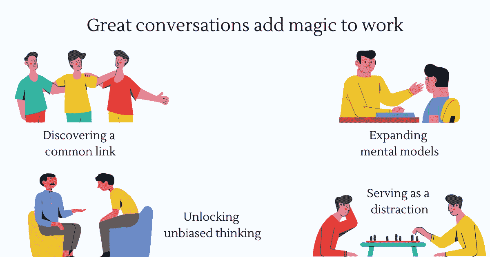
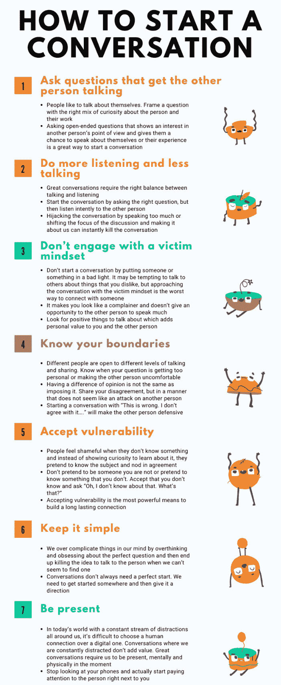

# 超越闲聊，进入智慧对话

> 原文：<https://betterprogramming.pub/moving-beyond-small-talk-to-smart-conversations-b7f490dac3d6>

## 将对话带回工作场所

图片来源:作者

在工作中搭讪可能会令人生畏。我们避免目光接触，把头转开，假装忙着打电话，所有这些都是为了让自己免于遇到某人却不知道该说什么的尴尬时刻。

如果我们真的鼓起勇气直视他们的眼睛，对话就开始了——嘿，怎么了？最近怎么样？你好吗 —立即终止对话。每个人都知道这些话是一种礼貌的尝试，没有参与的意图。

在工作中有很多机会与同事建立联系。在会议开始前几分钟怎么样？或者在午餐时间，喝咖啡休息时间，或者其他的水冷却器聊天？

你可以用闲聊来填补那些沉默的时刻，但只有理解他人的深切愿望才能在工作中形成有意义的联系——对他们来说什么是有价值的，他们对工作感兴趣的是什么，他们如何解决问题，他们在努力什么，什么对他们来说是容易的。

> “我们似乎很少交谈了。我的意思是，我们聊天(通常通过短信或电子邮件)，但我们并没有真正解决问题。我们花了很多时间避免不愉快的对话，却没有足够的时间去努力理解生活和工作在我们周围的人。”
> 
> — Celeste Headlee，“我们需要谈谈:如何进行重要的谈话”

是的，开始一段对话，对别人好奇，关注别人，试图形成一种联系，确实需要付出努力和精力。没有一件容易的事能给我们的生活增加多少价值。

在我们谈论工作中该聊些什么之前，我们应该知道这些对话是如何给我们的工作生活增加重要价值的，以及为什么它们值得我们花费时间。

# 伟大的对话是如何给工作增添魔力的

鸣谢:作者

工作场所的谈话会很有魅力。我们周围有很多有趣的人，他们可以激励我们，让我们恢复活力，打开我们的思维，或者给我们的工作生活增添额外的意义。

## 发现共同的联系

与同事开始对话，从对他们一无所知到找到共同的兴趣，可以立即让你充满活力。你会发现你们都对开源社区做出了贡献，热爱解决问题，对设计系统感兴趣，对编写代码充满热情——等等。

和在异乡找到一个老家的人是一样的感觉。你立即点击并连接，抓住那个薄弱环节，当你投入更多的时间和精力在这段关系上时，你可能会和那个人建立联系。

新发现的联系为你的工作生活增添了积极的一面，并能帮助你在对你重要的工作中分享想法和互相学习。

## 扩展心智模型

与另一个跨职能部门的同事交谈可能会让你想到一个困扰你很久的问题。

> “当一个可能远离问题表面的局外人以一种解开解决方案的方式重新构建问题时，大创新最常发生。”
> 
> —大卫·爱泼斯坦，“范围”

与具有不同背景和领域知识的人交谈也可以帮助你从这些领域中汲取思想，将你的思维扩展到你的能力范围之外，并建立新的思维模式来解决问题和做出更好的决策。

它使[心态](https://www.techtello.com/fixed-mindset-vs-growth-mindset/)从拘泥于专家转变为欣赏多面手的价值。

## 起到分散注意力的作用

与同事进行一次有意义的谈话，可以让你在深度专注的工作后得到急需的休息，为你的大脑重新注入能量和燃料，以完成更高质量的工作。

在你需要的时候，有目的地进行这些对话可以很好地分散注意力，帮助你更有效率。

它们也可以成为创造性外流的来源，帮助你从对问题的困扰转移到给你的大脑空间来形成新的联系。

哈佛大学研究员、心理学家谢莉·h·卡森建议:

> “分心并不总是坏事。如果你被困在一个问题上，中断可以迫使一个潜伏期。换句话说，转移注意力可以让你从对无效解决方案的执着中解脱出来。”

## 开启无偏见的思维

只有当你花时间超越你的偏见并尝试去理解他们，你对工作中的人的看法才能改变。

当你很快就把某人在工作中的行为归因于性格缺陷，而没有考虑他们的环境因素时，你的归因偏见可能在起作用。

通过与同事和同事的交流，你将能够合理解释为什么人们会以特定的方式行事，并设计出更好的合作策略，而不是诉诸战斗或逃跑的反应。当有机会解释时，一个难相处的人可能会变得非常合作。

> “只需要一次好的交谈，就能改变你对别人的世界、你的世界以及整个世界的理解。”
> 
> — Celeste Headlee，“我们需要谈谈:如何进行重要的谈话”

伟大的谈话给工作增添了魔力。他们让你与其他志同道合的人接触，拓展你的思维，提高你的生产力，并通过从草率的判断转变为理解的态度，让你成为一个更好的人。

谁知道呢？你可能会遇到一个帮助你开启梦想创业的人，或者成为你一生的朋友，甚至是你的生活伴侣。

# 在工作中开始谈话和建立有意义的联系的 7 种方法

这七种方法将指导你如何在工作中进行有效的交谈，不涉及闲聊，增加工作的价值，而不会让你感到不舒服。

## 1.问一些能让对方开口的问题

人们喜欢谈论自己。一个恰当地结合了对这个人和他的工作的好奇心的问题是开始谈话的好方法。

> “除了生理上的生存，人类最大的需求是心理上的生存——被理解，被肯定，被肯定，被欣赏。当你感同身受地倾听另一个人时，你给了那个人心理空气。当这一重要需求得到满足后，你就可以专注于施加影响或解决问题了。”
> 
> —斯蒂芬·R·科维

在等待会议开始时，您注意到在分析部门工作的 Jon。这是一个很好的机会，你可以通过问“嗨，乔恩。我是来自[…]的[…]。我将与您的团队合作，将我们的产品与新的分析系统相集成。作为新系统的总设计师，你可能是分享你的产品的关键亮点的最佳人选。我很想知道它是怎么设计的。”

新的产品经理 Keith 加入您的团队。要让第一印象有价值，可以问:“嗨，基思。我是[…]。我在[…]工作。产品管理让你感到兴奋的是什么？”

你老板的老板茱莉亚在电梯里。不要错过与人交流的机会，说:“嗨，朱莉娅。我是来自[…]的[…]。我们正在开发这款令我兴奋不已的新产品[…]。你分享了一些关于我们上一个产品的深刻见解。很好奇想知道大家对这款的看法。”

问一些开放式的问题，表示对另一个人的观点感兴趣，并给他们一个谈论自己或自己经历的机会，这是开始谈话的好方法。

## 2.多听少说

伟大的希腊斯多葛派哲学家爱比克泰德说过:“我们有两只耳朵和一张嘴，所以我们能听的是我们说的两倍。”

伟大的对话需要说与听之间的恰当平衡。积极倾听虽然很难，但却是沟通和建立联系的最有效手段，可以激励他人敞开心扉，分享他们的真实想法和感受。

> “如果你渴望成为一名优秀的健谈者，那就做一名专注的倾听者。要成为有趣的人，先要对别人感兴趣。问一些别人乐意回答的问题。鼓励他们谈论自己和自己的成就。”
> 
> ——戴尔·卡内基

通过问正确的问题来开始对话，然后专注地倾听对方，并希望更多地了解他们。人们可以看出我们什么时候是真的好奇，什么时候是假装的。

通过说得太多或转移讨论的焦点并把话题转移到我们身上来劫持谈话会立刻扼杀谈话。

## 3.不要抱着受害者的心态

不要以贬低某人或某事开始谈话——我们的老板很糟糕，这是一个垃圾陈述，这次会议是浪费时间，等等。

与他人谈论你不喜欢的事情或对你来说不太好的事情，并假设他们也有同样的感觉，这可能很有诱惑力，但带着[受害者心态](https://www.techtello.com/how-to-opt-out-of-the-drama-triangle/)进行对话是与某人联系的最糟糕的方式。

这会让你看起来像个爱抱怨的人，而且不给对方机会多说。

与消极心态的人交谈会让他们失去兴趣，导致他们在未来的交往中避开你。

听听奥利维亚·福克斯的建议:

> “尽量让你的问题集中在积极的话题上，因为人们会把你和你的谈话产生的任何感觉联系起来。专注于可能引发积极情绪的问题。有了你的问题，你就有了把对话引向你想要的方向的力量。”

寻找积极的事情来谈论，为你和他人增加个人价值。

## 4.了解你的界限

不同的人对不同层次的谈话和分享持开放态度。知道你的问题何时变得太私人或让对方不舒服。

此外，有不同意见并不等同于强加于人。分享你的不同意见，但不要用攻击的方式。

以“这是错误的”开始对话。我不同意……”会让对方产生防御心理。

然而，如果你首先带着好奇心去理解他们，问“告诉我你为什么这样想”，当你稍后说“我的观点是[……]时，他们会更乐意接受你的不同意见。你觉得怎么样？”

## 5.接受弱点

布琳·布朗谈到极度的脆弱。她说:

> “这种想法认为，为了建立联系，我们需要让自己被看到，真正被看到。”

当人们不知道某事时，他们会感到羞耻，而不是表现出好奇心去了解它，他们假装知道这个问题并点头同意。这种肤浅的对话毫无意义，也无法建立信任和联系。

不要假装成你不是的人，或者假装知道你不知道的事情。接受你不知道，然后说，“哦，我不知道。那是什么？”

接受脆弱是开始对话和建立长久关系的最有力的手段。

通过问“我不太了解[…]”来开始对话。我能向你请教一下吗？”

## 6.保持简单

我们过度思考和纠结于完美的问题，让我们的大脑变得过于复杂，当我们似乎找不到一个完美的问题时，我们最终扼杀了与这个人交谈的想法。

对话并不总是需要一个完美的开始。我们需要从某个地方开始，然后给它一个方向。

当你想不出其他事情的时候，问这样的简单问题可以让对话顺畅进行:

*   你的工作有什么有趣的地方？
*   什么让你忙碌？
*   这些天你在学什么？
*   谁对你的生活影响最大？
*   你遵循什么实践来持续改进？
*   你在关注什么新技能？
*   你对[…]有什么建议？
*   我对[…]很好奇。关于这个话题有什么资源推荐？

## 7.出席

在当今世界，我们周围不断有干扰，很难选择人际关系而不是数字关系。但是我们经常分心的谈话不会增加价值。伟大的对话需要我们在精神上和身体上都活在当下。

Celeste Headlee 说，“我们得到了所有可怕的建议，我们要看着某人的眼睛，点点头，说‘嗯嗯’。(它)只是教你如何假装你在注意——如果你在注意，那是完全没有必要的！"

而奥利维亚·福克斯谈到完全当下:“完全当下的能力让你鹤立鸡群；它让你难忘。当你全神贯注时，即使是五分钟的谈话也能产生令人惊叹的效果，以及情感上的联系。”

停止看你的手机，开始关注你旁边的人。开始对话时，承诺要在场，而不是屈服于干扰。

如果我们能学会与周围所有有趣的人交往，工作生活会更有意义。超越闲聊的对话是理解和相互学习的渴望，这可能是一种强大的能量来源。

# 摘要

