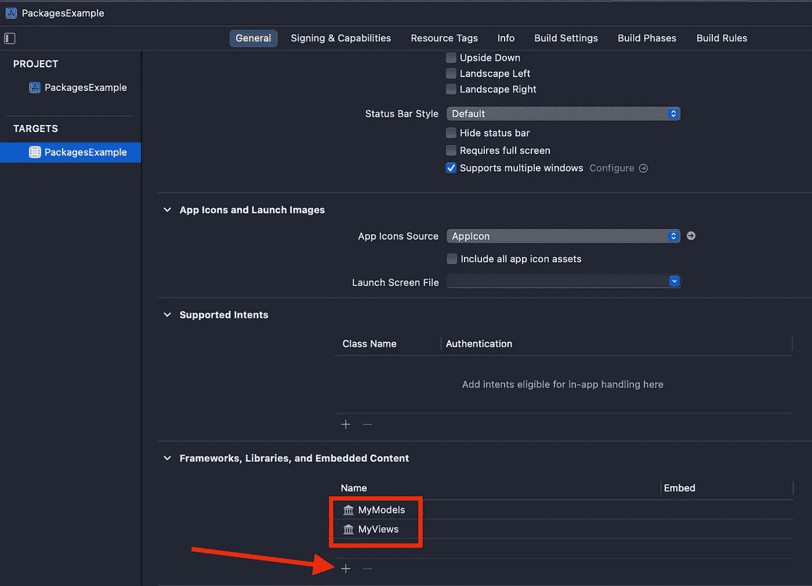

# 将 SwiftUI 视图和模型转移到单独的 Swift 包中

> 原文：<https://betterprogramming.pub/moving-swiftui-views-and-models-into-separate-swift-packages-4319acdd8827>

## 编写模块化代码

图片由 [Mediamodifier](https://pixabay.com/users/mediamodifier-1567646/?utm_source=link-attribution&utm_medium=referral&utm_campaign=image&utm_content=5766346) 从 [Pixabay](https://pixabay.com/?utm_source=link-attribution&utm_medium=referral&utm_campaign=image&utm_content=5766346) 获得

Swift 包是将我们的代码分成可以跨多个项目使用的模块的好方法。

这是在 SwiftUI 中使用它们的简单指南，但是任何 Swift 代码都可以这样分发。

# 创建 MyViews 包

打开 Xcode 并点击*文件>新建>包…* 或者按 Command、Control、Shift 和 n。为这个项目创建一个新文件夹很有用，当你决定要将文件放在哪里时，你可以使用*新建文件夹*按钮来完成。我把我的新文件夹命名为`PackagesExample`，但是名字并不重要。调用您的包`MyViews`并确保它没有被添加到任何项目或工作区中。

您的包中的 *Sources* 文件夹将为每个目标拥有单独的文件夹。

创建两个包含 Swift 文件的新文件夹，如下所示:

*   `MyViews/Sources/MyViews/MyViews.swift`
*   `MyViews/Sources/HelloButton/HelloButton.swift`

打开`HelloButton.swift`，加上这个:

这是一个简单的按钮，在其初始化器中采取行动，就像普通的 SwiftUI `Button`一样。注意，所有东西都被声明为公共的，因为我们希望能够在包模块之外引用这些东西。

现在我们要写`MyViews`，看起来非常相似:

您可能想知道为什么我在两个地方添加了完全相同的代码。

原因是为了证明您在 Swift 套餐方面确实有两种选择。

它可以仅用于`import HelloButton`，或用于`import MyViews`并通过`MyViews.HelloButton`引用。

通常，我会决定我们希望用哪种方式构建包。要么我想要一个内部有类似于`HelloButton`的类型的主目标，要么我想要为所有东西创建一个单独的目标。这两种方法都有好处。

有了一个大模块，我可以一次导入许多东西，但也许我不想用一个 import 语句访问所有东西。

我们需要在`Package.swift`文件中指定所有的目标和依赖项，这个文件应该是在您创建包时创建的。

# 创建 MyModels 包

现在我们将为我们的视图模型创建一个包，我们将做同样的事情。

可能只有`import ContentViewModel`或`import`和`MyModels`被`MyModels.ContentViewModel`引用。

打开 Xcode 点击*文件>新建>包……*或者按*命令、控制、Shift 和 N* 。调用您的包`MyModels`并确保它没有被添加到任何项目或工作区中。

您的包中的 *Sources* 文件夹将为每个目标创建单独的文件夹。

创建两个包含 Swift 文件的新文件夹，如下所示:

*   `MyModels/Sources/MyModels/MyModels.swift`
*   `MyModels/Sources/ContentViewModel/ContentViewModel.swift`

打开`ContentViewModel.swift`并添加以下内容:

这是相当简单的代码，带有一个迭代计算按下`HelloButton`的次数的函数。

`MyModels.swift`不出所料是这样的:

同样，我们需要在`Package.swift`文件中指定所有的目标和依赖项，这个文件应该是在您创建包时创建的。

# 将这一切结合在一起

那么我们将如何使用这些包呢？在同一个根文件夹中创建一个新的 app 项目，作为两个名为 anywhere you want 的包。我把我的叫做`PackagesExample`，和我的根文件夹一样，但是名字不重要。接下来，您需要添加您创建的包，方法是转到*文件>添加包…* 并点击窗口底部的*添加本地…* 按钮。

添加`MyViews`和`MyModels`包并不会将它们完全添加到您的项目中。

我发现在将包模块添加到目标的框架、库和 general 选项卡上的嵌入内容之前，我无法导入包模块:

图像由罗布·斯特金拍摄

现在，我们终于可以在`ContentView.swift`中整合 UI 了:

这是一个简单的`VStack`,每个`HelloButton`下面有一个`Text`,显示它被点击或点击的次数。

为了让事情变得有趣，我用两种方法创建了按钮，一种是传递对函数的直接引用，另一种是传递一个尾随闭包，在这个闭包中我调用了函数。

两种方式都适用于任一按钮，因为它们的代码是相同的。

我已经包含了`ContentViewModel`和`MyModel.ContentViewModel`，但是实际上您可能已经决定了在您的包中是包含通用模块还是更具体的模块。

如果您不想为您的包使用远程存储库，您可以就此打住！

# 创建和发布 GitHub 库

使本地包远程化的最简单的方法是为它们创建 GitHub 存储库。

如果你是使用 GitHub CLI 的人，你可能已经知道如何做到这一点，但我将使用 GitHub 桌面应用[因为我非常喜欢图形用户界面。](https://desktop.github.com/)

当 GitHub 桌面安装并打开后，按 command + O 并浏览到`MyViews`或`MyModels`包。您可能会得到消息“这个目录似乎不是一个 Git 存储库。是否要在这里创建一个存储库？”

点击链接*创建一个存储库*，如果需要，将 git ignore 改为 Swift，保留所有其他字段的默认值。

如果您没有得到那个消息，那么继续添加存储库。

作为创建存储库的一部分，GitHub Desktop 已经用代码的当前状态创建了一个初始提交。如果您在此之后进行了任何更改，您需要在此处提交它们。如果您对包的当前状态满意，单击右边的*发布库*按钮。

现在 GitHub 按钮上应该有一个*视图，靠近*发布库*按钮的位置。点击这个，你会被带到 GitHub 网站。*

复制 URL 并返回到`PackagesExample`，或者任何你称之为你的应用程序项目的地方。

# 用远程包替换本地包

在文件检查器中右键单击或按住 control 键单击您刚刚上传的包，并选择*删除*，但选择*移除引用*而不是*移至回收站*！

现在您的 Swift 包的本地版本已被移除，转到*文件>添加包…* ，并将您从包的 GitHub 复制的 URL 粘贴到右上角的搜索框中。如果一切顺利，您应该能够添加包，并且项目应该仍然可以构建，因为它有正确的模块。

对另一个包重复我们到目前为止所做的一切，这样您的项目中就有两个远程包，而没有本地包。

# 有什么区别吗？

您可能会注意到，程序包相关性列表中的文件是不可编辑的。这是因为它们的版本现在由 GitHub 库控制，这提供了包的主要优势之一。

如果不能编辑这些包，我们可以确保不修改不属于特定项目的代码。

但是因为这些是我们的包，我们希望能够偶尔编辑它们。Xcode 仍然可以打开一个包，但这不会给我们完整的故事，因为我们的视图和模型是分开的。

到目前为止，如果我想编辑一个远程包，最简单的方法就是进入*文件>添加包…* ，点击*添加本地…* ，然后像我最初创建它们时一样添加它们。

据苹果公司称，本地包总是覆盖远程包。这意味着，无论远程存储库发生什么变化，都将始终使用本地存在的模块版本。

这意味着远程存储库也不会改变以匹配本地存储库，因此您仍然需要使用 GitHub Desktop(或者您通常使用的源代码控制)提交和推送您的更改。

当您不再对本地包进行更改时，再次选择*移除引用*。

这将确保您回到使用远程存在的版本，允许您检查您提交的内容是否被成功推送。