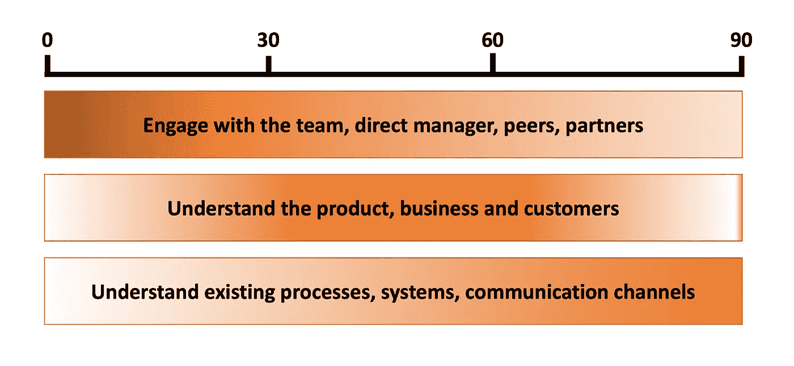

# 作为现有团队的新经理，我的 90 天计划

> 原文：<https://betterprogramming.pub/my-90-day-plan-as-a-new-manager-of-an-existing-team-137896a8a3f8>

## 工程经理的高级概述

作者图片

最近，我在回顾我的硬盘时发现了一份文件，这是我在大约 5 年前作为一个现有团队的工程经理加入 Workfront 时创建的 90 天计划。回过头来看，我可以确认它工作得很好，所以我认为在这里分享它是有意义的，因为它可能会帮助其他人开始管理现有的团队。

我把我的 90 天计划分成 3 部分，每部分 30 天。我的第一个重点是与人交往，并确保我开始建立联系和信任。第二个重点是了解产品、业务和客户。最后一个焦点是对现有流程、系统、沟通渠道等的理解。上图代表了我的注意力随时间变化的热图。

在制定这个计划之前，我有机会与团队成员交流，并对团队有所了解。事实上，这是一次对团队的面试，他们在那里确保我是他们团队工程经理的一个很好的候选人。在采访过程中，我非常关注细节和团队成员提出的问题，我能够做出以下观察:

*   这个团队在技术上非常强大，他们有信心解决任何问题
*   担心没有时间投资现代技术和他们感兴趣的工作
*   他们需要一个“大使”来帮助他们降低压力，确保他们能够集中精力
*   有更多活跃的人，我感觉到谁更有领导能力/权威。

有了这些信息后，我想出了下面的计划。

# 前 30 天:与团队、直接经理、同事和合作伙伴互动

*看——问——听——学*

在这方面，我的第一个行动是联系我的招聘经理，了解他的入职计划。对我来说，重要的是确认我对车队的观察是正确的。我还想和我的经理坐下来，谈谈将向我汇报的每一位工程师，以便更好地了解他们。

由于我已经确定了更有领导力/权威的工程师，我的第二个重点是确保我的猜测是正确的，因为确保我尽快与这些人建立信任对我来说非常重要。确保他们知道我是来帮助提高他们的领导力，而不是降低他们在团队中的角色。

我计划与团队的产品经理密切合作。我想了解我们竞争的市场、我们的客户需求以及我们即将推出的功能。

对我来说，与同事交谈并确保我理解所有跨职能的依赖关系是另一个重要的关注点。

最后但同样重要的是，理解团队/公司文化，以确保我相应地调整我的领导风格。

# 未来 30 天:了解产品、业务和客户

*学习——理解功能——获得所有权*

我打算把这段时间用于我的速成学习。将全部注意力集中在理解组织的结构、流程、依赖关系等方面。与同行同步以符合期望。

这对了解产品和市场以及理解我们正在解决的客户难题至关重要。并审查预期功能的积压以及架构和技术债务。

对我来说，所有这些都必须以一种加速的方式发生，因为我在第二部分的主要目标是确定我可以掌控的可交付成果，获得对自己的信心，并向团队展示我可以帮助他们。

# 过去 30 天:了解现有流程、系统和沟通渠道

*学习—理解流程—解决问题*

我计划的最后 30 天的重点是了解项目是如何启动的，产品的战略计划是什么，预算计划是如何完成的，等等。了解资源管理、绩效管理、晋升周期以及奖励最佳表现者的方式。

在这个阶段，我应该已经发现问题，并利用所有学到的知识，通过为团队解决关键问题来快速取胜，这样团队就可以开始信任我。我还必须向产品经理和我的同事展示，我是一个很好的合作伙伴。

希望您喜欢阅读我加入 Workfront 领导现有团队的计划，以下是我的计划摘要:

## **与团队、直接经理、同事和合作伙伴互动**

*   从直接经理那里获得需要首先关注的现有问题和目标的方向
*   与团队成员互动。确定关键人物并参与/建立信任。
*   与项目经理紧密合作，确定工作市场、客户需求和所需工作的类型
*   与同事交流，了解跨职能部门的依赖关系
*   了解团队/公司文化，并确保我的领导风格与文化相匹配。

## **了解产品、业务和客户**

*   加速学习组织结构、流程、依赖关系等
*   与跨职能部门的同事保持同步，以符合预期
*   加速学习产品和需要交付的内容。熟悉行业/市场/客户…
*   与团队一起评审产品的待定项/特性/架构，团队需要达到什么质量标准
*   获得交付物的所有权

## **了解现有流程、系统和沟通渠道**

*   了解项目是如何启动的，产品的战略计划是什么。预算规划是如何完成的。
*   了解资源管理、绩效管理、晋升周期和奖励员工的方式。
*   在此阶段，应该已经发现问题，并利用所有学到的知识通过解决关键问题来快速取胜

这就结束了。感谢阅读。