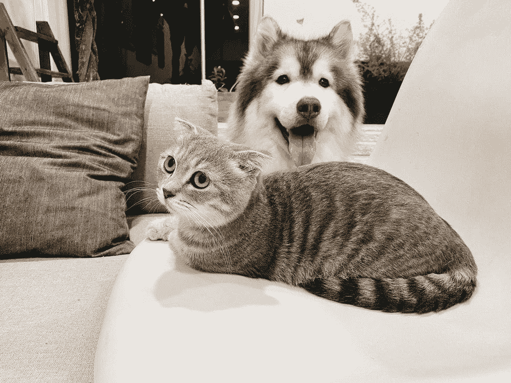

# 朴素贝叶斯与 SVM 在图像分类中的比较

> 原文：<https://betterprogramming.pub/na%C3%AFve-bayes-vs-svm-for-image-classification-75c16b29a96d>

## 两种最流行的图像分类器的比较



[信号源](https://unsplash.com/photos/7QjU_u2vGDs)

# 背景

Naïve 贝叶斯是最简单的分类器，它使用图形模型的语言。该方法假设每个类别在码本上有其自己的分布，并且每个类别的分布与其他类别的分布显著不同。例如，建筑类别可能强调表示窗户、门或地板的代码字，而面类别可能显示眼睛、鼻子和嘴的代码字的重要表示。

另一方面，SVM 分类器搜索使两类数据之间的间隔最大化的超平面，这可用于分类、回归和异常值检测。为了使用 SVM 对多个任务的图像进行分类，我们使用了一对多的方法。给定 *n 个*类别，我们训练 *n 个* SVM 分类器，每个分类器负责将类别 *i* 与剩余的*n–1*类别区分开来。最后，我们将一幅图像分配给具有最大计算输出的 SVM 类别。

人们普遍认为，支持向量机比 Naïve 贝叶斯表现更好，返回更高的精度。在本文中，我们将在加州理工学院的[微调数据集上执行图像分类，以查看关于 SVM 和 Naïve 贝叶斯的这一假设是否正确。](https://drive.google.com/drive/folders/1kLMG1pa3xV_TwK0DnibSbjYrj_hjGttf)

# 数据收集

下载上述数据集后，我们编写以下代码将图像划分到训练集和测试集中:

# 特征抽出

两种分类器都要求输入是从图像中提取的特征，因此我们使用视觉词袋方法:

# 培养

从数据集中提取特征并构建码本后，我们可以将它们输入 SVM 和 Naïve 贝叶斯分类器进行训练:

您可能会注意到，在上面的代码片段中，我使用了一个名为`save_model`的函数来将训练好的模型序列化并存储在`pickle`文件中以备后用:

# 估价

获得训练模型后，我们根据测试数据评估它们的准确性:

# 主要观察结果

我们对`Airplane`、`Face`、`Motorbike`类的图像进行分类，得到如下结果:

*   当我们以 50:50 的比例划分训练集和测试集时，每组 100 幅图像用于每一类，SVM 和 Naïve 贝叶斯的结果分别是大约 78%和 74%的准确度，这表明了很小的差异。
*   然而，当我们将训练和测试集中的图像数量增加到每个类别 800 个图像时，SVM 和 Naïve 贝叶斯的结果分别变为大约 91%和 81%的准确度，显示出更大的差距。
*   当我们以 80:20 的比例对数据集进行分区时，这意味着 80%的数据用于训练，剩下的 20%用于测试，准确率甚至提高了:SVM 的准确率为 94%，Naïve 贝叶斯的准确率为 83%。

# 结论

从这个实验中，我们可以得出结论，支持向量机优于 Naïve 贝叶斯图像分类，并且随着数据集大小的增加，差异变得更大。这篇文章的代码报告可以在[这里](https://github.com/billtrn/image-classification)找到。

```
**Want to Connect?**Check out my personal [blog](https://billtrn.com).
```