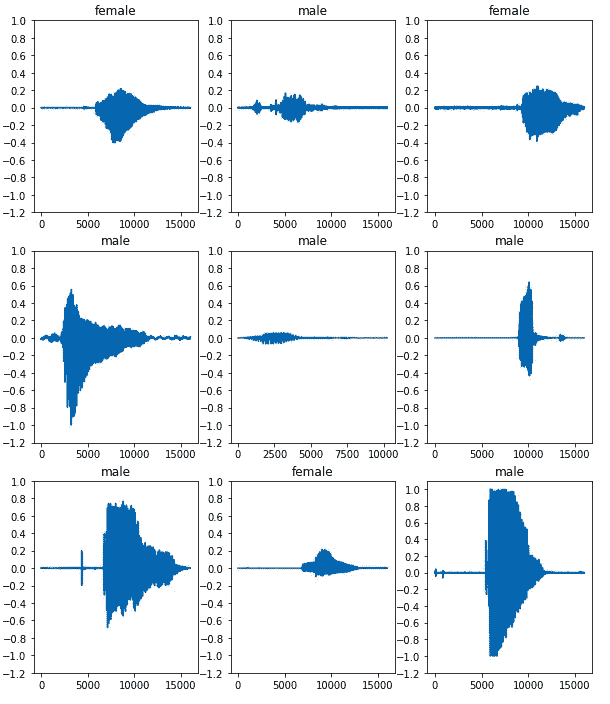
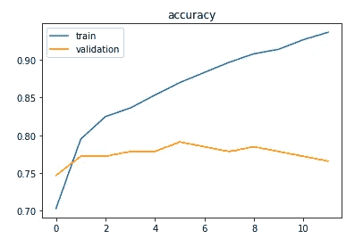
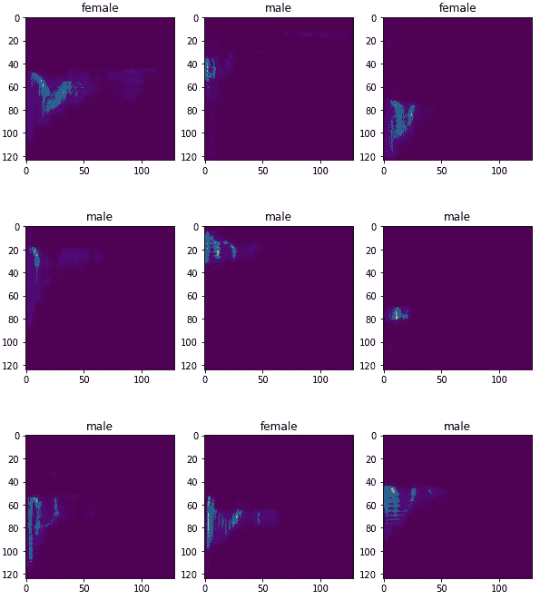
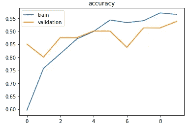

# 基于神经网络的语音命令性别识别

> 原文：<https://betterprogramming.pub/neural-network-based-gender-recognition-for-voice-commands-c6c80c30c8d1>

## 如何通过使用最少的手动标记示例进行引导来获得良好的准确性

****

**由[杰森·罗斯韦尔](https://unsplash.com/@jasonrosewell?utm_source=medium&utm_medium=referral)在 [Unsplash](https://unsplash.com?utm_source=medium&utm_medium=referral) 上拍摄的照片**

# ****背景****

**语音命令是现代人工智能应用的一大部分。tensorflow 网站发布了很好的基础语音命令识别教程[ [链接](https://www.tensorflow.org/tutorials/audio/simple_audio) ]。这篇博客的灵感来自那篇教程，但是我们开始做一些不同的事情。该教程建立了一个基于神经网络的模型，以对来自[语音命令](https://www.tensorflow.org/datasets/catalog/speech_commands)数据集的子集的“下”、“前进”、“左”、“否”、“右”、“停止”、“上”和“是”命令进行分类，该数据集包括跨命令的 8，000 个音频文件(在 CC_BY 许可证下)。**

**然而，我们对声音指令的性别感知感兴趣。例如，它可能适用于医疗设备，这些设备需要知道用户的性别，以便提供适合性别的响应。**

# ****手动贴标****

**在这篇博文中，我们使用了 tensorflow 教程中相同的语音命令子数据集。数据集没有任何性别标签，所以我们需要做的第一件事是创建带标签的示例。我们是手动完成的。对于每个命令，我们手动将大约 100 个音频文件标记为男性或女性。除了从每个命令类别中统一采样之外，我们没有区分实际的命令，因为我们渴望训练一个模型来识别跨命令的语音性别的潜在特征。**

**总的来说，我们只手动标记了 8000 个未标记音频文件中的 800 个例子。我们可以标记更多，但我们想看看在我们投入更多之前，仅用大约 800 个例子是否能取得好的结果。**

**这里有两个例子的音频片段，一个是男性的，一个是女性的。它们是可以清楚辨别的。还有一些例子是相当模糊的。我们在那些案件中运用了我们最好的判断力。毕竟声音性别大多是感知。**

**一个清晰的男声命令道**

**一个清晰的女声命令道**

# ****数据探索****

**通过一些简单的 Python 代码探索，我们看到所有的文件都是 wav 文件，并且都只有一秒钟长。它们都是独白，意味着在给定的 wav 文件中只有一个通道。采样率为每秒 16，000 次，我们绘制了几个样本数据的波形(使用`tf.audio.decode_wav`将幅度重新调整为[-1，1】)。**

****

**波形样本。作者图片**

**我们看到他们都非常不同。男性和女性的波形似乎没有任何明显的模式。这在某种程度上是意料之中的，因为波形可能是在各种嘈杂的背景环境中说出的任何命令。**

# ****利用迁移学习****

**由于我们只有非常有限的标记数据示例(~800)，我们决定首先尝试迁移学习，希望利用已经被训练成“理解”音频的已发布模型。**

**我们选择了另一个 tensorflow 教程[ [链接](https://www.tensorflow.org/tutorials/audio/transfer_learning_audio) ]建议的 [YAMNet](https://tfhub.dev/google/yamnet/1) 模型。该模型获取波形数据并为输入产生嵌入。我们使用 tensorflow 教程中的`extract_embedding`函数[ [link](https://www.tensorflow.org/tutorials/audio/transfer_learning_audio#load_the_audio_files_and_retrieve_embeddings) ]来提取每个波形输入的嵌入，并构建了一个完全连接的层模型，该模型获取嵌入并对输入的性别进行分类。我们在嵌入之上的简单模型架构如下所示:**

```
model_t = tf.keras.Sequential([
  # Shape of the embedding is (1024).
  tf.keras.layers.Input(shape=(1024), dtype=tf.float32),
  tf.keras.layers.Dense(512, activation='relu'),
  tf.keras.layers.Dense(1, activation='sigmoid'),
])
```

**我们用早期停止训练模型 20 个时期。模型性能不理想。验证准确率约为 75%，模型明显过度拟合。**

****

**迁移学习准确性**

**现在我们面临着一个决定:我们应该回去标记更多的数据吗？我们应该迭代当前的模型并修改它的架构吗？或者，我们应该尝试不同的模式？标记数据可以在任何时候进行，而且几乎总是有益的，所以没有必要急于这样做。底层转移模型的架构是固定的，所以我们被限制只能调整我们的薄层，这可能不是很有成效。因此，我们决定尝试一个不同的模型，看看我们是否可以先用现有的标记数据做得更好。**

# ****从零开始建模****

**回想一下我们从波形图中观察到的:男性和女性之间没有明显的模式。鉴于我们只有这么少的数据点，声音性别的微妙之处可能太难直接从波形中学习。**

**我们知道声音的性别可能与声音的音高有关。因此，我们可以将波形(即时间空间中的振幅)傅里叶变换为频率空间中的频谱图。为了避免时间维度的损失，我们使用滑动窗口在重叠的时间帧中变换波形。事实上，tensorflow 已经为这种处理提供了一个助手函数`tf.signal.stft`。产生的输出是一个二维矩阵，可以作为图像处理。以下是一些示例图:**

****

**语音命令的声谱图。作者图片**

**我们可以看到女性样本的彩色区域看起来更大更亮。现在，我们可以为音频频谱图建立一个简单的图像识别模型，如下所示:**

```
model = tf.keras.models.Sequential([
  # Spectrogram shape is (124, 129, 1).
  tf.keras.layers.Input(shape=(124, 129, 1)),
  tf.keras.layers.Conv2D(32, 3, activation='relu'),
  tf.keras.layers.MaxPooling2D(),
  tf.keras.layers.Dropout(0.2),
  tf.keras.layers.Conv2D(64, 3, activation='relu'),
  tf.keras.layers.MaxPooling2D(),
  tf.keras.layers.Dropout(0.2),
  tf.keras.layers.Flatten(),
  tf.keras.layers.Dense(128, activation='relu'),
  tf.keras.layers.Dropout(0.5),
  tf.keras.layers.Dense(1, activation='sigmoid'),
])
```

**同样，我们训练了 20 个周期，并提前停止。然后我们可以看到模型性能还不错。验证准确率在 90%以上。**

****

**从头开始建模的准确性。作者图片**

**当我们看一些错误分类的例子时，我们可以看到它们甚至对人的耳朵来说都是模糊的。**

**一个男声指令被误归类为女声**

**一个被误归类为男性的女声指令**

# ****结论****

**令人惊喜的是，我们可以用这么少的数据点建立一个声音性别分类器。傅立叶变换可能帮助最大。关于使用的完整代码，请参考这个[笔记本](https://github.com/eileen-code4fun/MachineLearning/blob/main/audio/commands/voice_gender.ipynb)。**