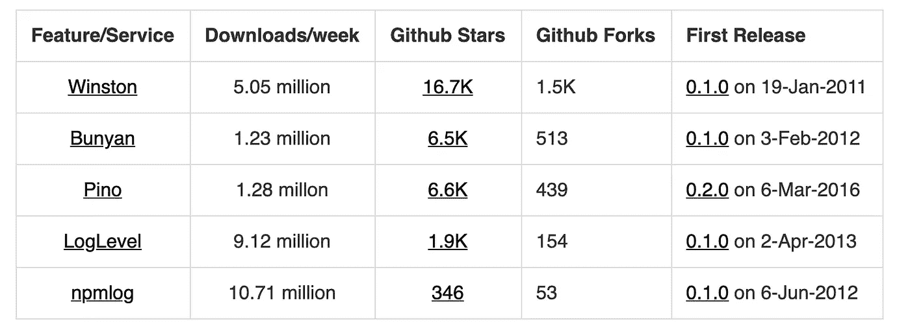
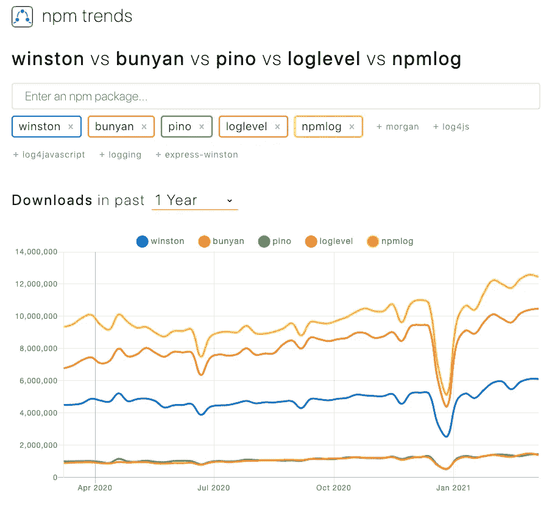

# 比较 5 个 Node.js 日志库，让您做出最佳选择

> 原文：<https://betterprogramming.pub/node-js-logging-libraries-5789c379640b>

## 为工作选择正确的库是至关重要的

图片来自 [Pixabay](https://pixabay.com/?utm_source=link-attribution&utm_medium=referral&utm_campaign=image&utm_content=3163292) 的 [5598375](https://pixabay.com/users/5598375-5598375/?utm_source=link-attribution&utm_medium=referral&utm_campaign=image&utm_content=3163292) 。

使用正确的 Node.js 日志库可以让您对应用程序的工作方式有前所未有的了解。拥有适当的日志记录就相当于在一个空间中拥有一个强大的望远镜，上面有您所有的应用程序。

您是否希望能够看到您的应用程序在生产负载下的行为？在本文中，我们将分析五个流行的 Node.js 日志库，它们可以轻松地为您完成这项工作。所有这些都可以在 NPM 上找到，每周下载超过一百万次，所以它们相当受欢迎。

我们开始吧！

# 假设

1.  您熟悉 Node.js 的工作方式，并且可以在本地运行 Node。
2.  您可以安装 npm 库，并对`package.json`和 npm CLI 有基本的了解。

我们将使用 Express.js 作为示例应用程序，查看将所有 Node.js 日志记录库的日志写入控制台的代码示例。

# 1.温斯顿

Winston 是一个流行的日志库。它被设计得很简单，并支持多种`transports`的通用日志。Winston 将自己定义为“几乎所有事情的记录者”

有了 Winston，你可以将日志路由到其他服务，比如 [AWS CloudWatch](https://www.npmjs.com/package/winston-cloudwatch) 、 [graylog2](https://www.npmjs.com/package/@eximius/winston-graylog2) 、 [logz.io](https://www.npmjs.com/package/winston-logzio) ，甚至 [Sematext Logsene](https://www.npmjs.com/package/winston-logsene) 。我们甚至可以添加 Express 中间件，让 Winston 更好地使用 Express 进行日志记录。

下面是 Winston with Express 使用 [express-winston 中间件](https://github.com/bithavoc/express-winston)的代码示例:

当我们用`node winston.js`运行服务器并在浏览器上点击`http://localhost:3001/test/api`时，它会给出如下输出:

上面的代码也可以作为[拉请求](https://github.com/geshan/nodejs-logging/pull/2/files)使用。

# 2.班扬

[Bunyan](https://www.npmjs.com/package/bunyan) 是另一个著名的 Node.js 日志库。班扬被 [Joyent](https://www.joyent.com/node-js/production/modules) 用于生产。它将自己定义为一个用于 Node.js 服务的简单快速的 JSON 日志库。

班扬主张日志应该是 JSON 格式的。除了 Node.js 之外，它的特性还包括一个用于漂亮打印的 CLI、序列化器和对多运行时的支持，如 Webpack 和 Browserify。

以下是使用[快速班扬记录器](https://github.com/villadora/express-bunyan-logger)的快速班扬代码示例:

当我们用`node bunyan.js`执行代码并点击浏览器上的`http://localhost:3002/test/api`时，它将显示类似如下的输出:

默认情况下，Bunyan 的日志非常详细。

上面的代码也可以作为[拉取请求](https://github.com/geshan/nodejs-logging/pull/3/files)使用。

# 3.皮诺

[Pino](https://www.npmjs.com/package/pino) 是一个相对流行的 Node.js 日志库，它认为自己是一个“开销非常低的 Node.js 日志记录器”它将[异步日志](https://github.com/pinojs/pino/blob/HEAD/docs/asynchronous.md)归功于它的快速性能。Pino 声称在许多情况下，它的基准测试比其他产品快五倍以上。

其他特性包括[子记录器](https://github.com/pinojs/pino/blob/master/docs/child-loggers.md)和[对多个 web 框架的支持](https://github.com/pinojs/pino/blob/master/docs/web.md)。它有多个核心和社区模块，有助于形成一个蓬勃发展的生态系统。使用 Pino，您可以通过使用适当的传输方式将日志发送到许多服务，如 [MySQL](https://github.com/pinojs/pino/blob/master/docs/transports.md#pino-mysql) 、 [Datadog](https://github.com/pinojs/pino/blob/master/docs/transports.md#pino-datadog) 、 [AWS cloud watch](https://github.com/pinojs/pino/blob/master/docs/transports.md#pino-cloudwatch) 或 [log flare](https://github.com/pinojs/pino/blob/master/docs/transports.md#pino-logflare) 。

以下是使用[快速 Pino 记录器](https://github.com/pinojs/express-pino-logger)的快速 Pino 示例:

当我们用`node pino.js`运行服务器并在浏览器上点击`http://localhost:3003/test/api`时，它将发出如下输出:

很像在 Bunyan 中，Pino 的默认日志也很详细。我们可以使用 [pino-pretty](https://github.com/pinojs/pino-pretty) CLI 来使日志更漂亮。

上面的代码示例可以作为[拉请求](https://github.com/geshan/nodejs-logging/pull/4/files)来访问。

# 4.Loglevel

Loglevel 是一个非常流行的日志库，可以在 Node.js 和浏览器中使用。Loglevel 将自己定义为“JavaScript 的最小轻量级简单日志”它还声称要取代`console.log`，从而消除`console.log`的缺点。

Loglevel 似乎很容易使用，也很方便。它的自述文件补充道，“这是一个基本可靠的日常日志库。”它不做花哨的事情，但有你实际使用的核心功能。

下面是一个非常简单的 Loglevel 的例子，有一个 Express 服务器，没有中间件:

当我们用`node loglevel.js`运行上面的代码并点击浏览器上的`http://localhost:3004/test/api`时，它将显示如下输出:

与其他库相比，Loglevel 的输出非常简单。此外，我们没有使用任何特定于 Express 的中间件来使用 Loglevel 进行日志记录。

你也可以通过[拉取请求](https://github.com/geshan/nodejs-logging/pull/5/files)来访问上面的例子。

# 5.Npmlog

Npmlog 是 NPM 使用的另一个非常流行的日志库。根据 Npmlog 的自述文件“这个日志是非常基本的。它为 npm 进行日志记录。它支持自定义级别和彩色输出。”

这个 Node.js 日志库没有什么花哨的地方，上一个版本是四年前发布的。然而，它是本文中列出的最流行的日志库。截至 2021 年 1 月，它是唯一一个每周下载量超过 1000 万的图书馆。

下面是 npmlog 在 Express 和无中间件情况下的一个快速示例:

当我们用`node npmlog.js`启动 Express 服务器并点击浏览器上的`http://localhost:3005/test/api`时，它会显示如下输出:

与 Loglevel 类似，输出很简单，我们也没有使用任何 Express 中间件。

上述代码可作为[拉取请求](https://github.com/geshan/nodejs-logging/pull/6/files)获得。

# Node.js 日志库的快速比较

下面是我们已经讨论过的 Node.js 日志库的快速比较。所有数据都是在 2021 年 1 月的最后一周收集的:

五个 Node.js 日志库的快速比较。

如果我们来看看下载趋势， [NPM 趋势](https://www.npmtrends.com/winston-vs-bunyan-vs-pino-vs-loglevel-vs-npmlog)描绘了如下画面:

过去一年五个 Node.js 日志库的下载趋势

尽管 npmlog 只有 346 颗星和 53 个分叉，但据报道，它每周被下载超过 1200 万次。在 GitHub 恒星方面，温斯顿的恒星数量是班扬的 513 的三倍。温斯顿也是最古老的图书馆(创建于 2010 年 12 月 30 日)，于 2011 年 1 月 19 日首次发布。

根据 [npm 比较](https://npmcompare.com/compare/bunyan,loglevel,npmlog,pino,winston)，npmlog 以 2550 万分最多。班扬得分最少，为 290 万。

# 结论

为了在 Node.js 中获得最佳的日志记录和监控体验，最好是选择适合您需求的库，而不是追求数字。

使用最符合您的目的的库和对您的用例最有意义的附加组件或特性。

如果你遵循一些[日志最佳实践](https://geshan.com.np/blog/2019/03/follow-these-logging-best-practices-to-get-the-most-out-of-application-level-logging-slides/)来获得最大收益，那也是很棒的，因为它们是[软件工程师最好的朋友](https://geshan.com.np/blog/2019/11/laracon-au-2019-overall-a-good-experience/#slides)。很长一段时间以来，我一直在宣扬伐木的[重要性。伐木快乐！](https://geshan.com.np/blog/2015/08/importance-of-logging-in-your-applications/)