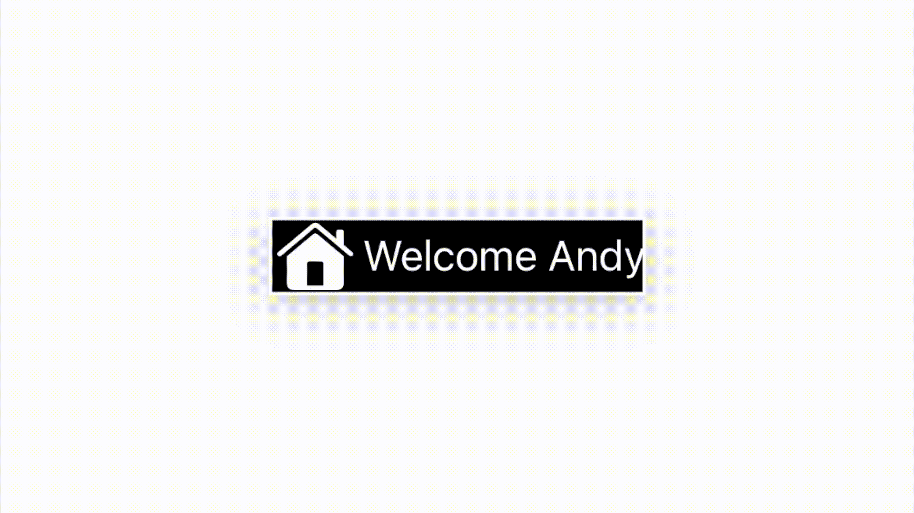

# NotSwiftUI 刚刚变得更好——知道如何使用它在 iOS 中创建 UI 组件

> 原文：<https://betterprogramming.pub/notswiftui-just-got-better-a7033fd9d6c9>

## 为所有 UIKit 爱好者打造更美好的未来，以及投资 it 的重要性

# 关于 NotSwiftUI

回到 2021 年 12 月，我发布了这个。

基本上创建了我自己的 SwiftPackage..稍微宣传了一下。这个包被方便地命名为 [NotSwiftUI](https://github.com/Jonas1197/notSwiftUI) ，它的核心思想是 UIKit 提供的所有 UI 元素本质上都是`UIViews`。从最简单的`UIView`、`UIButton`或`UILabel`一直到`UITextField`、`UITextView`、`UISwitch`，甚至还有`UIStackView`。

NotSwiftUI 提供了一种独特的方式来声明新元素，并以一种方便甚至是有趣的方式使用所有这些 UI 元素。不仅声明和创建这些元素变得更加容易，而且应用各种效果和配置也变得更加容易，例如应用阴影、添加带颜色的边框、执行动画、裁剪视图边界、添加目标、添加触摸手势、设置属性化字符串等等……这个列表真的是不胜枚举。

声明具有各种属性的按钮

# 为什么不是 SwiftUI

使用 SwiftUI 后，你应该会发现错误或“特性”。框架的某些部分有时感觉“不完整”,实现预期结果的各种方法甚至可能感觉“粗糙”。

SwiftUI 很棒，不要误会我的意思，我确实认为它是未来——但是——尽管如此，它还远远不够完整和可靠。这自然是我个人和专业的观点，有些人可能不同意我的观点。但是从我的经验来看，我还没有完全满足于并致力于用 SwiftUI 进行一个大规模的项目。

尽管我严厉批评，SwiftUI 还是做对了很多事情，尤其是在创建 UI 的时候。NotSwiftUI 背后的核心思想是在 UIKit 和 SwiftUI 之间架起一座桥梁，并允许开发人员自由地快速有效地创建 UI，同时保持代码的可读性和易懂性。

向水平 UIStackView 视图添加一些元素

SwiftUI 和 UIKit 之间的桥接意味着允许开发人员使用最少的代码完成相当复杂的任务，同时保持可读性。这都是为了节省时间。大量的时间花在了修复各个地方的视图，连接动作，添加手势识别器，添加动画等等。

NotSwiftUI 的主要思想是允许开发人员用更少的代码快速完成所有这些工作。因为一切都是一个 UIView，一切都作用于一切，如果不是，那么什么都不会发生。

# 它在进化！

自 12 月以来，发生了许多事情。我在自己的领域变得更有经验，T2 也是如此。我也确保尝试将 NotSwiftUI 融入到我的项目中。从而使其适用于更多样的用途。

因此，今天您可以使用 NotSwiftUI 完成比以往更多的工作。您可以执行动画，为按钮添加目标(或作为一个`UITapGesture`)作为闭包，在标签、文本字段、文本视图和按钮中使用属性字符串，创建更多的 UI 元素等等。

点击后会以动画形式改变标题的按钮

结果呢

# 结论

[NotSwiftUI](https://github.com/Jonas1197/notSwiftUI) 在不断进化。但是随着时间的推移，将会添加更多的功能，作为一个仍然相信 SwiftUI 已经达到其成熟形式但仍然希望享受其[声明性](https://www.techtarget.com/searchitoperations/definition/declarative-programming)本质的人， [NotSwiftUI](https://github.com/Jonas1197/notSwiftUI) 试图尽可能无缝地将两个世界连接在一起。

去吧，去试试，去实验，去留下反馈(很重要！)， [NotSwiftUI](https://github.com/Jonas1197/notSwiftUI) 为大家而来，让生活更轻松，更有趣，更享受！