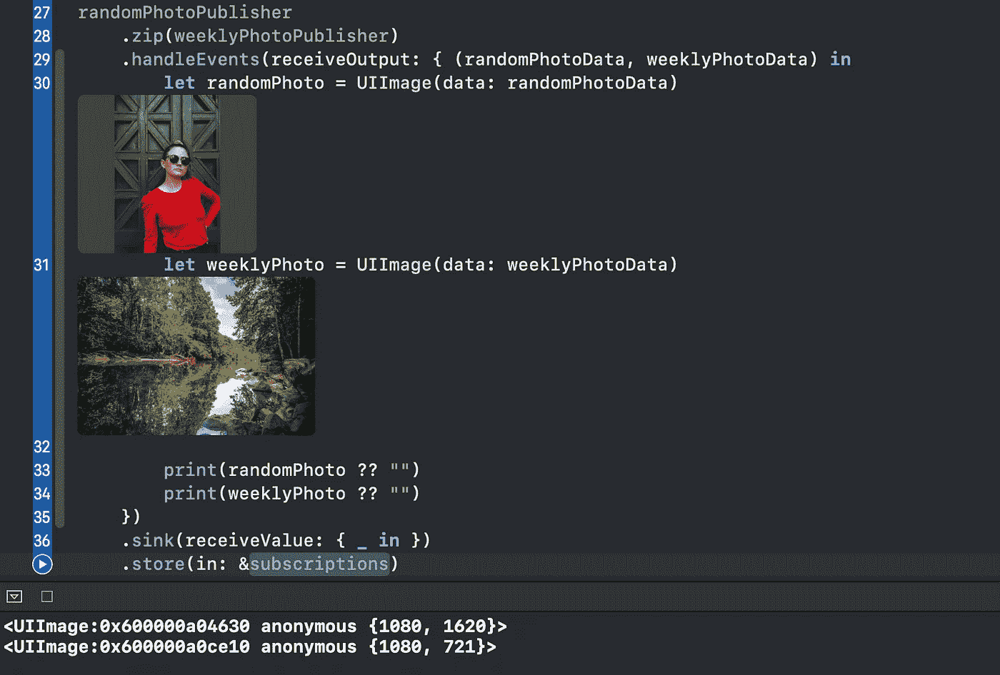

# 使用 Swift 5 中的 Combine 观察 2 个网络请求的完成情况

> 原文：<https://betterprogramming.pub/observe-the-completion-of-2-network-requests-using-combine-in-swift-5-6fc9e7304e4f>

## 利用的力量。邮政运营商

丹尼尔·罗梅罗在 [Unsplash](https://unsplash.com?utm_source=medium&utm_medium=referral) 上拍摄的照片。

考虑这种情况:应用程序中的一个特定屏幕需要同时发出两个不同的请求。你的目标是在完成后*才更新 UI。在本教程中，我们将学习如何使用 Combine 观察几个网络请求的完成情况。*

我们将利用一个强大的`.zip`操作符，它允许我们从几个上游`Publishers`接收包含事件的元组。

简而言之，这些是您将在本教程中掌握的主题:

*   使用`.zip`操作器组合几个`Publishers`。
*   使用内置的`URLSessionDataTask`发布器执行网络请求。
*   使用带有键路径的`.map`操作符获得转换后的发布者。

完成的 Xcode 操场的源代码可以在文章的底部找到。

# 我们开始吧

首先，我们需要导入`Combine`并创建一个`subscriptions`属性:

现在，让我们创建一个从 Unsplash 获取随机照片的方法:

我们可以看到，Combine 为`URLSessionDataTask`内置了一个发布器。

使用`.map(keyPath:)`操作符，我们只用一行代码就获得了`Data`。

然后，如果在请求过程中发生任何错误，我们使用`.replaceError`操作符用一个空的`Data`对象替换错误。

最后，我们使用`.eraseToAnyPublisher`方法删除发布者的类型。

太好了！现在我们可以从 Unsplash 获取一张随机照片。现在让我们再添加一个获取本周特色照片的方法:

现在，我们的任务是启动这些请求，并在两个请求都完成时得到通知。通过使用`.zip`操作符，我们实现了我们想要的:

注意在`.handleEvents`操作符中，我们如何获得包含两个`Data`对象的元组:一个来自`randomPhotoPublisher`，另一个来自`weeklyPhotoPublisher`。

如果我们跑操场，我们会注意到两个图像同时打印出来:

我们已经成功地观察到使用 Combine 完成了几个请求。

# 结论

感谢阅读！

Xcode 游乐场的源代码在[这个要诀](https://gist.github.com/zafarivaev/41241de9bb4b178950352f92733e4009)里有。