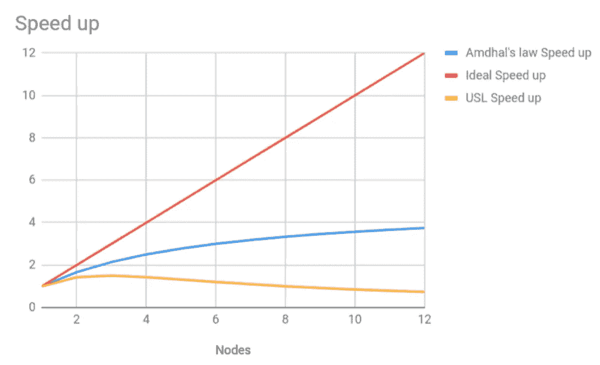
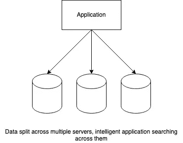
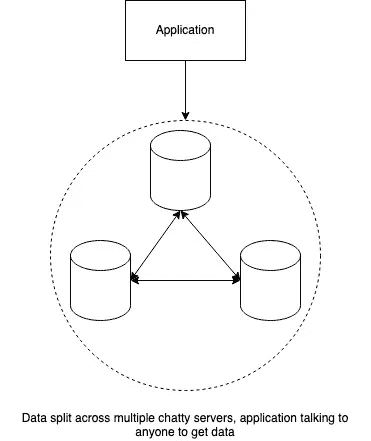
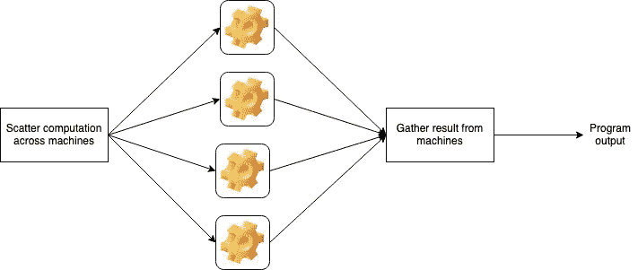
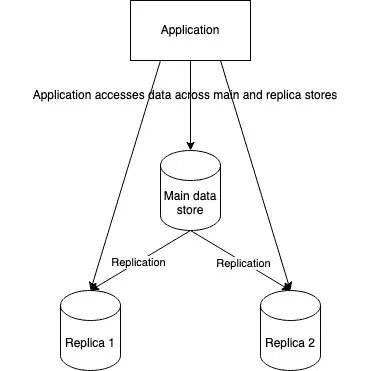
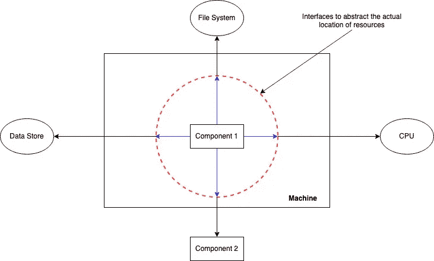

# 关于构建可扩展系统

> 原文：<https://betterprogramming.pub/on-building-scalable-systems-6b2900a547cc>

## 了解可伸缩性


艾萨克·史密斯在 [Unsplash](https://unsplash.com?utm_source=medium&utm_medium=referral) 上拍摄的照片

在软件工程中，可伸缩性是指系统应该能够通过使用更多的计算资源来处理工作负载的增加，而无需对其设计进行重大更改。

# 为什么系统不能扩展

软件虽然“虚拟”，但需要物理机器才能运行。而物理机器是受物理定律约束的。光速限制了 CPU 从内存中读取数据的速度。电线承载信息的能力决定了有多少数据可以从系统的一部分转移到另一部分。材料科学决定了硬盘可以旋转多快来读写数据。

总的来说，所有这些意味着我们的程序运行的速度或它们能做多少工作都有严格的限制。在这些限度内，我们可以非常有效率，但我们不能突破它们。因此，我们被迫使用软件或硬件设计技巧来让我们的程序做更多的工作。

可扩展性的问题是设计一个可以绕过我们当前硬件的物理限制来服务更大工作负载的系统。系统无法扩展，因为它们要么对给定的硬件使用不当，要么因为它们无法使用所有可用的硬件，例如，为 CPU 编写的程序无法在 GPU 上运行。

要构建一个可扩展的系统，我们必须分析软件如何与硬件协同工作。**可扩展性存在于现实和虚拟的交汇处**。

# 可扩展性的关键轴心

## 潜伏

这是完成工作负载的单个请求所花费的时间。延迟越低，系统的净输出就越高，因为我们可以通过快速完成每个请求来在单位时间内处理更多的请求。改善延迟可以理解为“加速”(更快地处理每个单位的工作负载)，通常通过将工作负载分成多个并行执行的部分来实现。

## 吞吐量

可伸缩性的另一个方面是单位时间内可以完成多少工作。如果我们的系统一次只能服务一个请求，那么[吞吐量](https://kislayverma.com/software-architecture/distributed-systems-as-data-pipelines-throughput-capacity-and-backpressure/) =延迟 X 时间。但大多数现代 CPU 都是多核的。如果我们同时使用它们会怎么样？通过这种方式(以及其他方式)，我们可以增加系统可以处理的"[并发](https://www.youtube.com/watch?v=oV9rvDllKEg)请求的总数。与延迟一起，它定义了在任何时间点系统中发生的所有事情。这可以从“纵向扩展”或并发性的角度来考虑。

[利特尔定律](https://kislayverma.com/software-architecture/distributed-systems-as-data-pipelines-throughput-capacity-and-backpressure/)给出了一个强有力的公式，让我们分析一个系统及其子系统在不断增加的负载下将如何运行。


如果系统工作队列中的项目数量不断增长，最终将不堪重负。

## 容量

这是理论上系统可以处理的最大工作量。任何更多的负载和系统开始失败，要么完全或个别请求。

# 性能不是可扩展性

高性能的系统不一定是可扩展的系统。忽略可伸缩性问题通常会导致一个非常简单的系统，该系统对于给定的规模非常有效，但是如果工作负载增加，就会完全失效。

一个高性能但不可伸缩的系统的例子是文件解析器，它可以在单个服务器上运行，并在几分钟内处理高达几个 GBs 的文件。这个系统很简单，对于适合一台机器内存的文件来说足够好。一个可扩展的版本可能是 Spark 作业，它可以读取存储在许多服务器上的许多 TB 的数据，并使用许多计算节点对其进行处理。

如果我们知道工作负载将会增加，我们应该预先进行可扩展的设计。但是，如果我们不确定未来是什么样子，一个高性能但不可伸缩的解决方案是一个足够好的起点。

# 量化可扩展性

## 阿姆达尔定律

除了实现上的问题之外，随着资源的增加，程序的运行速度在理论上也有限制。阿姆达尔定律(1967 年由吉恩·阿姆达尔提出)是定义它们的关键定律。

它指出，每个程序都包含可以在给定额外资源的情况下并行执行的部分，以及只能串行运行的部分(称为串行部分)。因此，无论有多少资源可用，程序的速度都是有限的。总加速是运行串行部分所用时间加上运行并行部分所用时间的总和。因此，串行部分为程序在更多资源下的运行速度设定了一个上限。


这意味着通过[分析我们的程序结构](https://www.youtube.com/watch?v=EfOXY5XY9s8)，我们可以确定最大的资源量，这对于加速程序是有意义的——再多也没用。


## 普适性法则(USL)

虽然阿姆达尔定律定义了通过允许部分程序并行运行来提高程序性能的最大额外资源量，但它忽略了添加更多资源的一个关键开销——在所有新处理器/机器之间分配和管理工作的通信开销。

[USL](https://wso2.com/blog/research/scalability-modeling-using-universal-scalability-law/) 通过在阿姆达尔定律中加入另一个包含通信成本的因素，将这一点形式化。这进一步减少了我们可以从增加资源中获得的净收益，并提供了一个更现实的程序加速程度的度量。


真实世界的测试表明，在最坏的情况下，随着每个新资源的增加，这些通信开销会成倍增加。由于更多的资源，程序性能在开始时有所提高，但是这种提高最终被通信开销所淹没。



# 扩展系统的策略

## 垂直可扩展性

垂直可伸缩性表示，如果我们的计算机不够强大，无法运行某个程序，我们只需购买一台足够强大的计算机。这是最简单的方法，因为我们不需要对系统本身做任何改变，只需要对运行它的硬件做任何改变。超级计算机是这种可伸缩性策略的体现。

这实质上是在问题上砸钱，以避免设计的复杂性。我们可以建造更强大的计算机，但这样做的成本会成倍增加。即使这样也是有限度的。我们当然无法建造一台强大到足以运行整个谷歌的电脑。

所以垂直可伸缩性策略可以带我们走一条很好的路，但是在面对大多数现代规模需求时这是不够的。为了进一步扩大规模，我们需要对我们的程序本身进行根本性的改变。

## 水平可扩展性

最简单的计算机程序是在一台计算机上运行的程序。垂直可伸缩性的限制表明，服务于 web 级工作负载的根本瓶颈是我们的程序被限制在一台计算机上。

水平可伸缩性是设计可以利用多台计算机来完成一项任务的系统的过程。如果可以实现这一点，那么扩展系统就是简单地添加越来越多的计算机，而不是被迫建立一个单独的超大型计算机。

“分发”一个程序的挑战可能远比程序本身的实际逻辑更难。我们现在不仅要处理计算机，还要处理这些计算机之间的线路。分布式计算的谬误是非常真实的，它要求将水平可伸缩性融入到程序的结构中，而不是从上面附加上去。

# 分布式系统

在接受水平可伸缩性时，我们接受了[分布式系统](https://kislayverma.com/tag/distributed-systems/)——其中各种计算资源，如 CPU、存储和内存，位于多个物理机器上的系统。这些都是复杂的[架构](https://kislayverma.com/category/software-architecture/)，所以让我们来看看一些主要的方法。

## 分发数据

存储的数据通常表示系统的状态，就像没有正在进行的活动处理一样。为了存储网络规模的数据，我们别无选择，只能将其存储拆分到许多机器上。虽然这意味着我们没有存储限制，但现在的问题是如何找到特定数据点所在的服务器。例如，如果我在数百个硬盘上存储了数百万首歌曲，我如何找到一首特定的歌曲？

各种技术被用来解决这个问题。其中一些是基于以智能的、预先确定的方式选择使用哪个服务器，以便在读取数据时可以应用相同的逻辑。这些都是简单的技术，但有些脆弱，因为先验逻辑需要随着存储服务器数量的增加或减少而不断更新。基于 Shard id 或 modulo 的实现就是这种方法的一个例子。



其他一些技术基于构建共享索引来定位服务器组中的数据。服务器相互通信以找到并返回所需的数据，而实际的读取程序并不知道有多少服务器。卡桑德拉的点对点方法就是一个例子。



## 分布式计算

程序的计算或运行通常会修改系统所拥有的数据，从而改变其状态。能够利用多台机器的 CPU 内核意味着我们有比只有一台机器更多的计算能力来运行我们的程序。

但是如果我们所有的 CPU 都不在一个地方，那么我们需要一种机制来在它们之间分配工作。根据定义，这样的机制不是程序的“业务逻辑”的一部分，但我们可能会被迫修改业务逻辑的实现方式，以便我们可以将它分成几个部分，并在不同的 CPU 上运行。



这里可能有两种情况 CPUs 可能同时处理同一块数据(共享内存),或者它们可能完全独立(无共享)。

在前一种情况下，我们不仅必须将计算分配给多个服务器，还必须控制这些服务器如何访问和修改相同的数据。类似于单个服务器上的多线程编程，这种架构通过分布式锁定和事务管理技术(例如 Paxos)强加了昂贵的协调约束。

无共享架构的可伸缩性要高得多，因为任何给定的数据都只在一个时间点的一个地方进行处理，并且不存在重叠或冲突更改的危险。问题变成了确保这种数据本地化的发生，以及找到这部分计算在哪里运行。

## 复制数据



这是一个混合场景，即使我们的数据适合一台或多台机器，我们也故意在多台机器上复制它，只是因为当前的服务器无法承受读写这些数据的计算负载。本质上，有如此多的处理正在进行，以至于能够分布计算，我们被迫分布数据(或至少它的拷贝)。

使用数据库的读取副本来扩展读取密集型系统，或者[使用缓存](https://kislayverma.com/software-architecture/architecture-patterns-caching-part-1/)就是这种策略的一个例子。

# 分布式计算中的考虑因素

当我们构建一个分布式系统时，我们应该清楚我们期望实现什么。我们也应该清楚我们将得不到什么。让我们在假设系统设计良好的情况下考虑这两个因素。

## 我们得不到的

## 一致性

[Eric Brewer 定义了 CAP 定理](https://kislayverma.com/summary/working-around-the-cap-theorem/)，该定理指出，面对网络分区(网络崩溃，导致系统的一些机器不可访问)，系统可以选择保持可用性(继续运行)或一致性(保持系统所有部分的信息均等)。这可以通过考虑以下情况来直观地理解:如果一些机器不可访问，则另一个机器应该停止工作(变得不可用)，因为它们不能修改不可访问的服务器上的数据，或者冒着不更新丢失的机器上的数据的风险继续运行(变得不一致)。

大多数现代系统选择不一致，而不是完全失败，这样至少部分系统可以运行。这种不一致随后通过使用像[crdt](https://crdt.tech/)这样的技术来协调。

## 简单

分布式系统设计不可避免地比单服务器架构在从网络层到更高层的所有级别上都更复杂。所以我们应该预料到复杂性，并尝试用好的设计和进化的工具来解决它。

## 减少错误

更复杂的体系结构的一个直接副作用是错误数量的增加。在这个可伸缩的系统上有更多的服务器、更多的服务器间连接和更多的负载，必然会导致更多的系统错误。这看起来(有时是正确的)像是系统不稳定，但是一个好的设计应该确保每单位工作负载的这些错误更少，并且它们保持孤立。

## 我们必须得到什么

## 可量测性

这在本文的上下文中是显而易见的。我们正在构建分布式系统以实现可伸缩性，因此我们必须了解这一点。

## 故障隔离

这不是一个结果，而是设计分布式系统的一个重要的护栏。如果我们不能隔离越来越多的错误，系统将会变得脆弱，大部分会立刻失效。理想的分布式系统设计隔离特定工作流中的错误，以便其他部分可以正常工作。

# 为什么分布式系统很难？

一句话——耦合。

虽然在软件工程中有许多类型的耦合，但有两种在阻碍系统可伸缩性方面起着主要作用。

这两者都源于单个服务器程序对“全局的、一致的系统状态”的假设，这种状态可以被“可靠地”修改。一致的状态意味着程序的所有部分看起来都是相同的数据。系统状态的可靠修改意味着系统的所有部分总是可用的，并且可以被访问/调用来修改它。但是正如我们所看到的，CAP 定理明确地否定了分布式系统中的一致性、可用性和可调用性。这使得从单一服务器架构到分布式架构的飞跃非常困难。

让我们看看这两种类型的耦合。

## 位置耦合

位置耦合是指程序假设在一个已知的、固定的位置有可用的东西。例如，文件解析程序假设文件位于其本地文件系统上。或者假设其数据库在给定的固定位置可用的服务。或者系统的一个子部分，假设另一个子部分是同一运行时的一部分。


这种系统很难横向扩展，因为它们不理解“不在这里”或“多个”。此外，他们的实现可能会假设接触这些其他组件是廉价/快速的。在分布式系统中，这两个方面都很关键。执行部分计算的子组件可能完全运行在某个其他服务器上，因此很难找到，与之通信也很昂贵。一个数据库可以由许多服务器组成一个分片集群。

因此，位置耦合是水平可伸缩性的一个关键问题，因为它直接阻止资源被添加到“其他地方”。

## 断开定位联轴器



打破位置耦合的诀窍在于从希望通过接口访问系统的另一部分(文件系统、数据库、子组件)的部分中抽象出访问该部分的细节。这在不同的场景下意味着不同的东西。

示例:在网络层，我们可以使用 DNS 来屏蔽远程服务器的特定 IP 地址。负载平衡技术可以隐藏某些特定系统的多个实例正在运行以服务高负载。智能客户端可以隐藏数据库/缓存集群的详细信息。

不知道被调用系统的物理位置的一个有趣的方法是，不要试图定位它们，而是将所有命令放在一个公共的、众所周知的地方(像一个消息代理),从那里它们可以上传命令并执行它们。当然，这产生了与众所周知的位置的位置耦合，但是理想情况下，这在数量上小于使系统的所有部分都耦合到所有其他部分。

## 时间耦合

这种情况下，系统的一部分期望它所依赖的所有其他部分在被调用时立即([同步](https://kislayverma.com/tag/asynchronous-programming/))满足其需求。

在可伸缩性的上下文中，时间耦合的问题是所有部分现在必须同时“扩展”,因为如果一个部分失败，它的所有相关系统也会失败。这使得整体架构对工作负载的局部峰值非常敏感——系统任何部分的任何负载变化都会导致整个系统崩溃，从而消除了水平扩展的许多优势。

## 打破时间耦合

打破时间耦合的最常见方法是使用消息队列。调用系统不是“同步”调用系统的其他部分(调用并等待直到输出出现)，而是将请求放在消息总线上，由另一个系统使用

你可以阅读更多关于[消息传递概念](https://kislayverma.com/software-architecture/defining-messaging-terms-precisely/)以及[事件如何被用于构建进化架构](https://kislayverma.com/software-architecture/using-events-to-build-evolutionary-architectures/)的内容。事件/消息驱动的架构可以极大地提高分布式系统的可伸缩性和弹性。

```
**Want to Connect?**If you liked this article, subscribe to my weekly newsletter [It Depends](https://kislayverma.com/newsletter-archive/) to read about software engineering and technical leadership
```