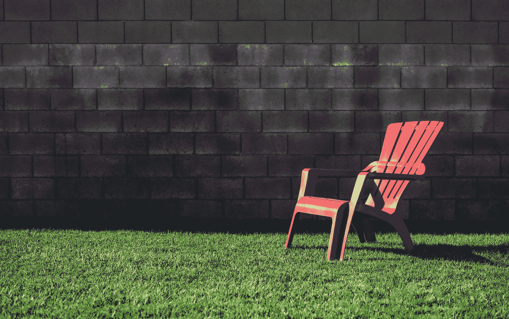
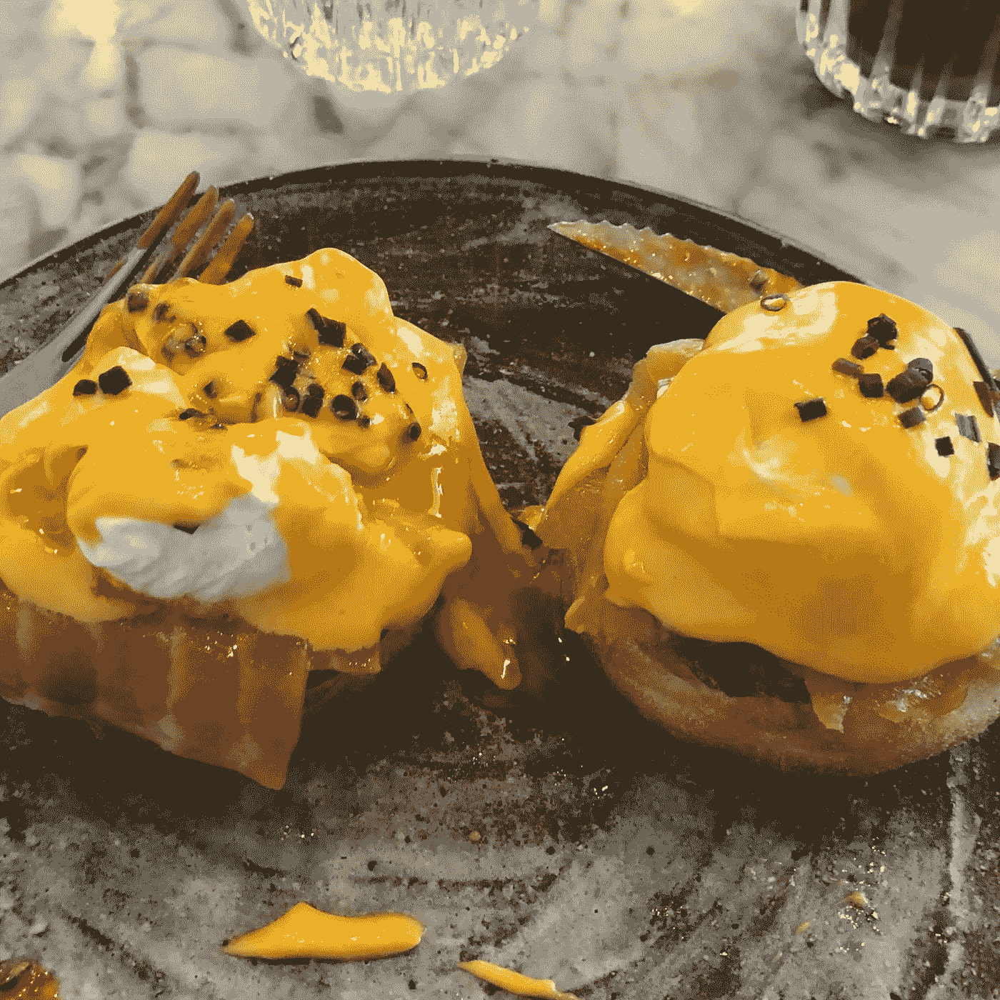

# 一个月的工程休假

> 原文：<https://betterprogramming.pub/one-month-into-engineering-a-sabbatical-72e5bc5819ab>

## 反思的时间到了



蒂姆·莫斯霍尔德在 [Unsplash](https://unsplash.com/s/photos/sabbatical?utm_source=unsplash&utm_medium=referral&utm_content=creditCopyText) 上的照片

我的休假没能达到我第一个月的期望，但主要原因是期望本身。如果你还没有读过[我关于我为什么休假的帖子](/why-i-bought-a-sabbatical-instead-of-a-fancy-car-2de1436e4a81)(或者你没有记住每个单词)，我是一名来自明尼苏达州的 30 岁工程师，住在伦敦，试图加深我与当下和我自己的联系，与我爱的人共度美好时光，探索和试验快乐的想法，考虑我如何能对世界产生积极的影响，为了快乐和影响而学习。这是实际情况。

我完成的比我预期的少多了！我多少意识到第一个月需要一些调整，但这并没有阻止我对缺乏“进步”感到沮丧。我曾梦想拥有每周主题，在那里我会深入钻研一周的某个特定主题，然后从另一边出来成为表面专家。*“第二周你应该深入探索伦敦的艺术，学会如何从艺术中感受他人的感受。”*这还没有发生——部分原因是我们搬家了(为了房租，我们搬到了离伦敦更远的地方)，花的时间比我预期的要多得多。这也只是一个不切实际的期望。这是事实，因为我的主要目标之一是放慢速度，活在当下——在试图最大化生产力的同时做到这一点是很有挑战性的！当我意识到我不能完成我希望的那么多事情时，我很早就有了一点危机，但幸运的是，我认为我很快就接受了这一点。除了搬家，这里也是我一直关注的地方。

# **建立在我的常规基础上**

这些年来，我发现一个良好的早晨习惯是我感觉良好的关键之一。在我休假的第一个月，我试图享受我的晨间惯例，并在寻找“完美”中建立它。这是现在正常情况下的样子:


我的早餐和冥想观现在我们搬出了伦敦！

这才是核心！我通常在上午 11-11:30 结束。我在好日子里尝试融入的其他作品有:

*   30-60 分钟的西班牙语练习
*   30-60 分钟的“快乐”探索(主要听 SloMo)
*   30-60 分钟的阅读

时间很长，但我感觉最好的日子大多是当我真正出现在我的日常生活中，慢慢来，并且一天中没有做太多其他事情的时候。这个程序现在感觉很好，但我渴望听到推荐！

# 我是如何学习的

简单来说就是慢慢来。既然我优先考虑放慢速度和减少多任务，这意味着我没有完成很多。尽管如此，我认为进展顺利。我没有精力投入到工作中，所以当我听播客或阅读时，我会感到非常投入。它通常是这样的:

1.  听 45 分钟的播客，什么也不做(可能是散步)。有时候，我会停下来记下有趣的细节或要跟进的事情。
2.  让我的思想(有时)放松一下，然后静静地坐着，思考我刚刚听到的内容(有时和实际内容一样长)。做些笔记。
3.  如果这是一个真正的大脑熔炉，说服我的搭档伊娃听听这个播客，然后讨论我们的见解。她是一个很好的休假伙伴。
4.  我感到很受鼓舞，并有点担心如何与我能接触到的人分享我学到的这个很酷的东西！

有时间深入学习而不是快速学习是一种奢侈和享受。我觉得这样会让我更难忘。

**了解幸福**

正如我在[的第一篇帖子](/why-i-bought-a-sabbatical-instead-of-a-fancy-car-2de1436e4a81)中提到的，在过去的 10 年里，我一直对我能从科学和“专家”那里学到的关于幸福的东西非常感兴趣。为那些对我的幸福“真正重要”的事情优化我的财务状况一直是我能够抽出时间工作的主要原因之一(除了有幸从事高薪技术工作和有一个可以分担成本的伴侣……)。在我休假的头几天，我在飞机上偶然看到史蒂文·巴特利特在《一个 CEO 的日记》中对的采访。莫是一名工程师，他很早就变得富有(后来成为谷歌 X 的 CBO)，但他发现自己很痛苦。他采用工程学的方法来计算幸福，然后写了《幸福求解》(我已经开始读了)。强烈推荐听[这一集](https://open.spotify.com/episode/1dBnMUeFd0nqX6j4q7KQK5?si=kIptXGA7RHOgxOutl7Vo8A)。它激励我重新开始学习什么让别人更快乐，以及向内寻找什么让我更快乐。

我不想在这里过于深入地探讨这些观点，因为你最好直接去寻找资料来源。这里有几个亮点和我正在尝试的东西。

**我们灌输给大脑的内容训练它通过那个镜头来看待世界**——如果你不断阅读/观看新闻，你就不断向你的大脑强化 ***你的生活*** 在很大程度上是消极的，因为媒体是世界上正在发生的最糟糕事情的放大镜。反过来也是如此。消费积极的内容可以让我们对这个世界感觉更好(不要和有毒的积极内容混淆)。

*   免责声明:我仍然认为做一个对话题知情的公民是非常重要的，但这并不等同于总是过度消极。当一个可怕的行为发生在你的社区或世界时，当它迫使你采取行动，帮助某人，或了解可以帮助你做正确事情的事实时，你感到的痛苦和愤怒是合理和有用的。我相信，为世界上一切顺利的事情充电，可以帮助你面对那些你可以帮助解决的负面问题。
*   **我正在尝试的**:在消费完一段内容(电视剧集、Reddit 帖子等)后，向自己签到。我感觉如何？这有助于形成真实健康的世界观吗？如果它不能让我感觉良好，它给我的知识/教训值得吗？自从疫情开始以来，我已经稳步减少了查看新闻的瘾，这让我感觉更好，所以这感觉像是一个验证数据点。我刚看完*女巫*，这是一部推荐给我的恐怖电影，以十七世纪的女巫恐惧故事为主线。我的签到是这样的: ***我感觉如何？*** *有点惊恐，恐惧会让人做出如此可怕的事情。* ***值得吗？*** *不是每天，但我认为，当我们陷入自己的恐惧时，我们会对他人做出可怕的事情，这是一个重要的教训。*

你可以对抗大脑中的负面偏见——人类在感知我们的环境时会有负面偏见，因为认为灌木丛中的声音是老虎在进化上更安全，尽管 99%的时候它不是。当一切都很好的时候，我们仍然经常被消极的事情所吸引。我没有查理聪明。这食物尝起来不好吃。莫说:“每当你有一个消极的想法时，就让你的大脑去寻找 9 件积极的事情。否则你就不公平，因为 99%的事情都没问题。”

*   免责声明:重点是不要隐藏在虚假的、想象的积极中。重点是在你看来要学会公平和平衡。我们自然会变得足够消极，所以要努力变得积极。
*   **我正在尝试的事情**:我开始写三个*“我很感激……”*句子，然后用三个*“今天发生的三件大事是什么？”*(我还会问*“我如何才能让今天变得更好？”*作为提升的机会)。我不清楚到目前为止这是否有任何明显的不同，但它很快，令人愉快，对我来说，训练我的大脑学会感恩是有意义的。

我一直在听莫的播客 SloMo，在那里他采访了人们如何过上幸福而有意义的生活。所有的剧集都很好，但迄今为止，这些对我来说是最有影响力的:

*   [吉米·纳尔逊——当病毒成为解药的时候](https://open.spotify.com/episode/0tgxEPvcnkiyRfPmPvUxb9?si=3cb19962b7b44ff6)
*   [史蒂文·巴特利特——如何无情地追求自己](https://open.spotify.com/episode/03P6vxUmzA4I8TDiPi14ne?si=ef6ab56c67b34e58)
*   [莫·格达(CEO 日记)——如何重新训练你的大脑以获得最大快乐](https://open.spotify.com/episode/6M6nqJG8gjv7axdB7axZzc?si=64716e40d1264250)

我在他的书*中为快乐而解决，*还为时过早，无法给出关于它的想法——我将在下个月跟进。

# 奇怪的(再)发现:独自外出就餐

我喜欢在外面吃饭，我很久没有做的一件事是独自在外面吃饭。很多人真的对这样做感到不舒服，但我建议尝试一下。去你喜欢的地方吃饭，不要一直看着你的手机(如果你真的需要给食物拍照，你可以…我也一样)。对我来说，这是一种完全不同于和别人出去吃饭的体验。我可以更加关注我正在吃的食物和我所处的环境。有时我会忍不住无意中听到一些对话，工作人员通常会跟我说更多的话，隐藏在我手机里的欲望是真实可触的，观察起来很有趣。



# 一个月后我感觉如何？

我感觉很好，但是我想我不能说我感觉和我工作时有很大的不同。正如我上面提到的，我曾有过对自己感到非常沮丧的时刻，或者对我花了这么多休假时间在移动或 BT 的技术支持热线上感到沮丧。然后我也对自己的沮丧感到沮丧，而不是接受这些事情只是需要发生(我设法在对我的沮丧感到沮丧之前开始接受事情……)。

充斥在我脑海中的许多“工作”层面的忙碌只是被像搬家和在新地方安装互联网这样的事情所取代，然而，有一些证据表明我变得稍微更现实了。在我散步的时候，我已经开始真正地听到鸟儿在我周围歌唱，注意到美丽的花朵，并以一种我以前从未有过的方式到处发现一只蝴蝶。当我寻求活在当下时，我仍然经常陷入沉思，但大多数时候，这些想法比工作带来的要轻松。

我很惊讶我这么快就不再想工作了。我非常热爱我正在做的工作，我觉得它非常重要(我现在仍然这样认为)，但我几乎立即停止了对细节的担心。展望未来，我希望仍然对我正在做的事情保持关心和热情，但保持一些观点，让我可以远离它，而不会让它消耗我的思想。

我一点也不觉得无聊。如果有的话，我渴望有时间做更少的事情。我对即将到来的计划感到兴奋，但我最期待的是我完全满足于静静地坐着看窗外的时刻。

# 给休假者的建议

*   降低你对将要实现的目标的期望。如果你有和我相似的目标，放慢速度可能比完成很多事情更重要。
*   寻找灵感和榜样来支持你的目标。在[这个播客](https://open.spotify.com/episode/1dBnMUeFd0nqX6j4q7KQK5?si=kIptXGA7RHOgxOutl7Vo8A)上找到莫 Gawdat 对我来说是个幸运的时机。如果你需要强迫自己学习你想学的东西，考虑一下你是否真的想学这些东西。如果你这样做了，在把自己逼得太紧之前，寻找更多的灵感来激发你的动力。
*   和你周围的人就你的时间设定界限和期望。**你的时间不会因为你在休假而变得不自由或毫无价值。你放弃了薪水和“最重要的工作”,为自己腾出时间，所以你的时间现在和以前一样宝贵(如果不是更宝贵的话)。伊娃和我为此纠结了一会儿，因为她工作很忙，我觉得她有时会把东西扔给我，只是因为我“什么也没做”利用你的灵活性去帮助更多的人是很好的，但是要确保你是真的想从你的休假中得到什么。**
*   不要搬到新的公寓/房子！移动需要大量的能量。回想起来，我希望我已经探索过让搬运工为我们处理尽可能多的事情。它会更贵，但它可能会为我赢得更多的时间。我犯了一个错误，觉得自己的时间在一段时间里不值什么。

# 下一步是什么？

第二个月，伊娃和我会去西班牙(她来自那里)。她将远程工作，我将尝试自学西班牙语。我打算继续我的日常生活(虽然当我不在家的时候总是更难)，我打算主要优先考虑慢下来，活在当下，学习快乐，因为我不会担心搬家。

我即将完成这篇文章的编辑工作，就像我们即将结束在西班牙的一个月一样。如果自我成长的内在旅程在第一个月对你来说还不够深刻，我保证在第二个月事情会变得更深刻，在那里我有更多的时间来反思和“审视内在”(包括一个自我指导的安静的周末静修！).

```
**Want to Connect?**I’m striving to “learn to social media” and have been sharing some snippets as [@sabbatical.engineer](https://www.instagram.com/sabbatical.engineer/) on Instagram if you want to stay a bit more real-time. Send me your questions, comments, and crazy ideas of things to try!
```