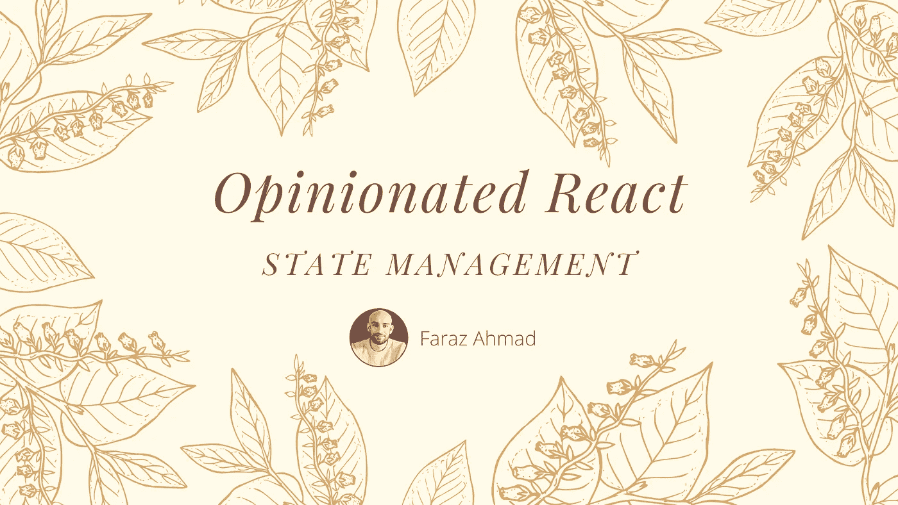

# 固执己见的反应:状态管理

> 原文：<https://betterprogramming.pub/opinionated-react-state-management-200d577ff122>

## 您不需要使用第三方库来管理 React 应用程序中的状态

固执己见的反应——国家管理——法拉兹·艾哈迈德

# 介绍

我已经和 React 合作了四年多。在这段时间里，我形成了一些我认为应用程序应该是什么样子的观点。这是关于这个话题的一系列观点文章的第三部分。

# 我要报道的内容

状态管理有很多部分。我不可能一口气讲完所有的内容。在这篇文章中，我将向您展示如何使用 plain React 来管理组件中的状态。

请务必关注我将来发布的与州管理相关的帖子，我将在这些帖子中介绍:

*   组件级状态与全局状态
*   良好的用例以及我的 React 上下文模式
*   状态枚举代替布尔值

# 只需使用 React

我经常看到团队在使用 React 内置的状态管理解决方案之前采用像 Redux、MobX 或其他东西这样的状态管理库。

这些库没有任何问题，但是对于构建一个全功能的 React 应用程序来说，它们不是必需的。根据我的经验，使用 plain React 要简单得多。

如果你认为你有很好的理由使用这些库中的一个，而不是使用`useState`或`useReducer`，请留下评论，因为我很想知道你的用例。

下次构建组件时，尝试使用 plain React。

# 钩住

我上面提到了两个钩子:`useState`和`useReducer`。以下是我使用它们的方法。

## 从使用状态开始

我首先用 useState 钩子构建我的组件。快速完成工作:

使用 State 呈现电影列表。

如果我们需要另一个状态，只需添加另一个`useState`钩子:

添加另一个 useState 以显示 isLoading 状态

## 当你有很多状态时

我对相关状态的限制是两个。如果我有三个相互关联的状态，我选择`useReducer`。

按照上面的例子，假设我们想要在获取电影失败时显示一条错误消息。

我们*可以*添加另一个`useState`调用，但是我认为它看起来有点乱:

太多固定电话

让我们将它重构为使用`useReducer`，这将简化我们的逻辑:

当我们有两个以上的状态时

# 问与答(Question and Answer)

在每篇文章中，我都回答了我在 Twitter 上收到的一个问题。这是本周的问题:

# 包扎

这是我正在撰写的系列文章的第三部分。如果你喜欢这个，请在下面评论。你还想让我报道什么？一如既往，我欢迎反馈和建议。

感谢阅读。

附言:如果你还没有看过，一定要看看我以前在这个系列中的文章:

1.[一个固执己见的向导反应过来:文件夹结构和文件命名](https://medium.com/better-programming/an-opinionated-guide-to-react-folder-structure-file-naming-8b723d39a0d6)
2。[固执己见的反应指南:组件文件结构](https://medium.com/better-programming/an-opinionated-guide-to-react-component-file-structure-5eb9f4a8d763)