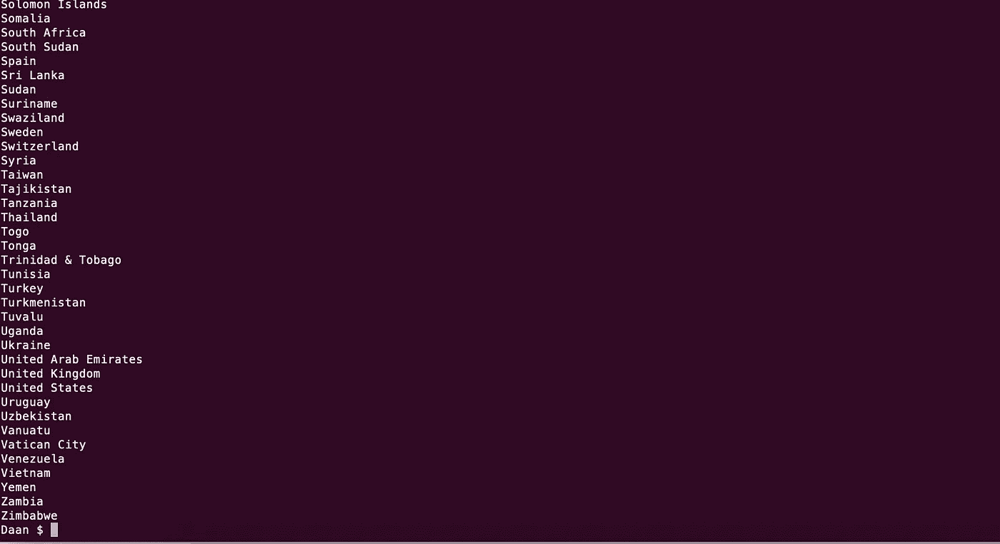

# 通过了解如何使用管道来优化您的 CLI 体验

> 原文：<https://betterprogramming.pub/optimizing-your-cli-experience-by-knowing-how-to-pipe-13669023eb23>

## 了解这个强大而优雅的特性的基础知识


知道如何使用管道可以真正改变您使用 CLI 的方式。它可以为您使用的一些命令的看似复杂的输出带来更多的结构。但前提是你知道如何正确地吹奏。

管道，您可以通过使用`|`符号来利用它，将一个命令的输出作为另一个命令的输入来发送。并且这个命令的输出可以作为下一个命令的输入，等等。

管道有助于创建强大的命令，这些命令可以执行复杂的任务。

在本文中，我们将通过几个例子来演示如何使用管道以及使用管道的可能性。

# 让我们从简单的开始

让我们来看一个非常基本的例子，在这个例子中我们使用了管道。在本例中，我们将使用一个包含所有[国家](https://gist.githubusercontent.com/kalinchernev/486393efcca01623b18d/raw/daa24c9fea66afb7d68f8d69f0c4b8eeb9406e83/countries)的文件。我们将使用`cat`来显示这个文件的内容。

```
cat countries
```

对于这样一个相对较长的文件，您可以看到提示跳转到了文件的末尾。内容太长，不适合您的屏幕。这是因为`cat`命令会显示整个文件的内容。



但是有更聪明的方法，使用管道来显示这个文件的内容。

```
cat countries | less
```

这导致`cat`命令的输出传递给第二个命令，即`less`。

`Less`是一个终端分页程序，它可以通过箭头键浏览结果。要退出，按下`q`。


除了`less`，你还可以使用`more`。`More` 可以一次一屏的查看文本文件的内容。

使用`more`时，按`Enter` *可逐行浏览文件。T* 要一次导航一页，按下`Spacebar`，其中一页相当于您当前终端屏幕的大小。要退出命令，只需按下`q`。

# 但是你还可以做更多

除了浏览文件内容，您还可以用管道做更多的事情。

例如，如果您想知道文件中有多少个国家，您可以使用`wc`命令，这是单词计数的缩写。`-l`选项打印行数。

```
cat countries | wc -l
```

该命令返回 196，这意味着该文件中有 196 个国家。

如前所述，可以组合两个以上的命令:

```
cat countries | head -10 | tail -3
```

该命令将获取`cat`的输出，并将其用作`head`命令的输入。`head`命令列出了前十个国家，因为这是我们告诉它要做的。

这十个国家将被用作`tail`命令的输入。因为`head`的输出被用于下一个命令。`tail` 命令将返回最后三个国家。

这意味着，从最初的国家列表中，只有国家 8、9 和 10 会显示在屏幕上。

# 搜索

假设您想要在我们之前使用的文件中搜索特定的国家。您可以自己一行一行地检查内容来跟踪信息。

一个更好，也可能更快的选择是使用`grep`命令。`grep`命令用于搜索文本。

`Grep`将扫描文件中您想要检索的信息，并以您喜欢的格式显示结果。

让我们从一个非常基本的`grep`命令开始，我们在国家列表中查找单词`Netherlands`。注意，默认情况下，`grep`是区分大小写的。如果您想要搜索不区分大小写，请添加`-i`选项。

```
grep "Netherlands" countries
```

该命令将返回`Netherlands`，这意味着该字符串在国家列表中出现过一次。如果我们打错了，输入了`Metherlands`，将不会返回任何内容。

就其本身而言，这个命令是相当不言自明的。如果您想知道一个字符串在文件中出现了多少次，您也可以使用`-c`选项。

很多时候，你需要更多的上下文来了解你要搜索的字符串在文件中的位置。您可以使用`-n`选项，它将返回行号。


作为替代，您可以使用`-C`选项，它提供了上下文行。


# 这是如何与管道一起工作的？

让我们来看一个更实际的例子，我们想检查某个 IP 地址在过去五分钟内是否访问过我们的网站。我们可以通过在网站的访问日志中使用`grep`来高效地完成这项工作。

这不是一个高流量的网站，所以 100 行日志应该足够覆盖过去 5 分钟。

```
cat /path/to/access/log | tail -100 | grep -ic "ip: 127.0.0.1"
```

我们将在该文件的最后一百行中搜索我们的目标 IP 地址`127.0.0.1`，并区分大小写。因此，出现的次数将打印在屏幕上。

# 结论

我希望这篇文章让您对如何使用管道有了基本的了解，这样您就可以优化您的 CLI 体验。

我们用`less`、`more`、`wc`和`grep`讲解了配管的基本知识。其中一些命令可以帮助您更有效地提取您正在寻找的信息。

如果你有任何问题，请在评论区告诉我。我很乐意回答你的问题。