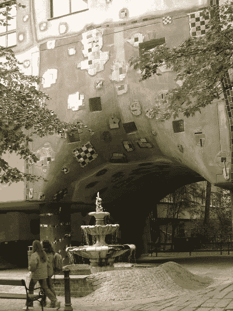
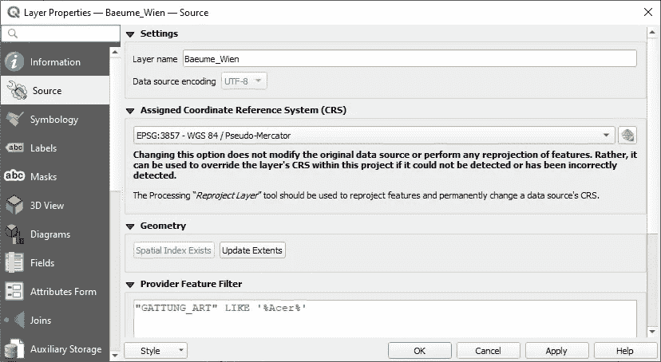
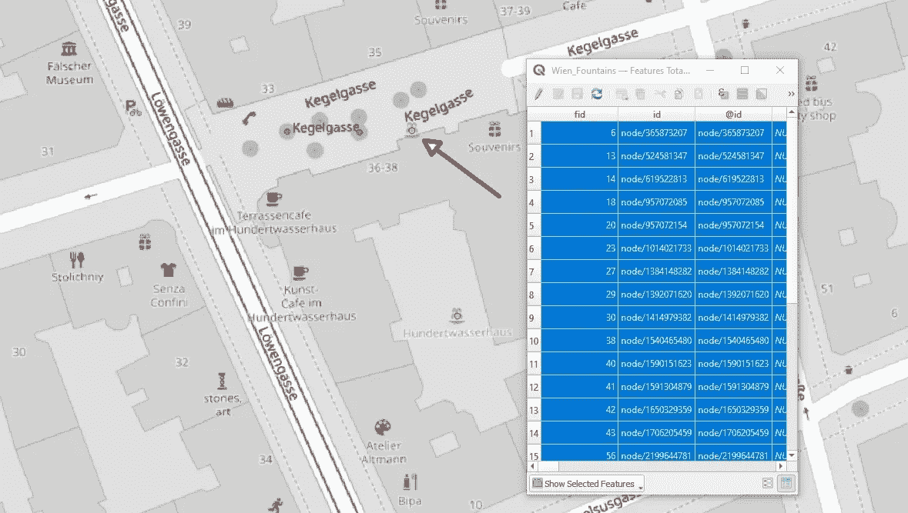
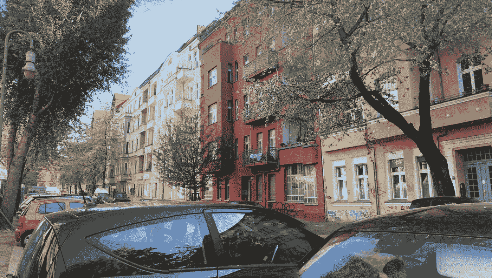
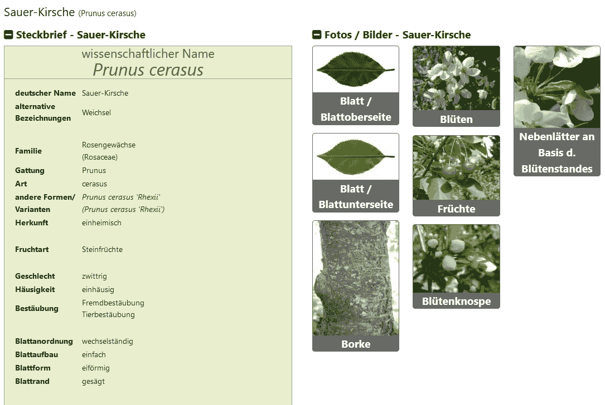
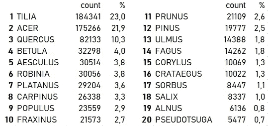
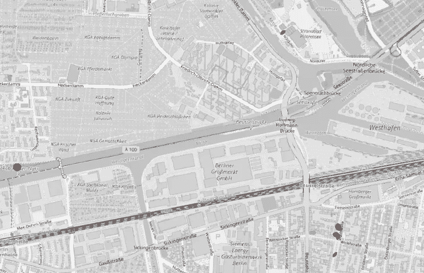
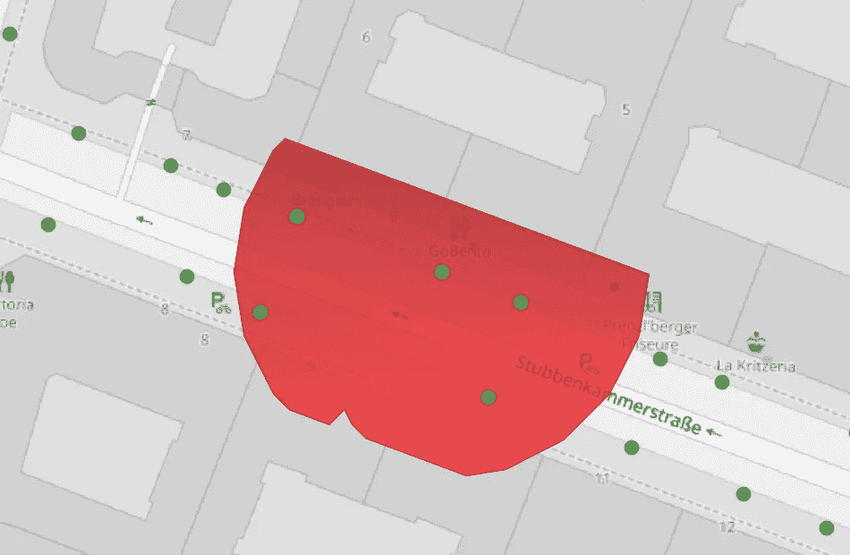

# 如何处理城市树木数据

> 原文：<https://betterprogramming.pub/osint-with-urban-tree-data-2b5b7b732f42>

## 使用 QGIS、天桥、Python 和开放树数据在影像中定位地点


吉利·斯图尔特在 [Unsplash](https://unsplash.com?utm_source=medium&utm_medium=referral) 上拍摄的照片

许多[地理迷——在罗马尼亚郊区、巴西红土半森林……或澳洲和/或南非呆了相当长时间——患上了这种疾病，被恰当地描述为:](https://www.geoguessr.com/)[“严肃的地理迷从不停止演奏”](https://www.reddit.com/r/geoguessr/comments/zkf5cg/getting_too_cracked_at_nmpz/izzcy2i/)

任何图像，无论是朋友或家人的，假期的，婚礼的……无论什么……都不会因为其主要内容而被欣赏——而是地理猜测大脑立即跳出来试图找出那张图像是在哪里拍摄的挑战。

虽然游戏规则如此，但每个人都试图通过纯粹的知识或直觉来解决位置问题；这只是去 OSINT land 及其更复杂的工具的一次短途旅行。

# 这个想法

我最近在看到一个朋友的照片时染上了这种病。展示了一个德国城市的建筑正面——前门，两扇窗户，其他一切都很难描述，没有多少明显的特征。但是，在画面的两边，清晰可见的是两棵树和它们的一些树枝。一棵甚至露出了一点树干(桦树，很容易)，另一棵很容易从树叶上辨认出是枫树。

我最近从德国城市收集了大量的城市树木数据，从中获得了一点乐趣……那么为什么不尝试一些不同的东西，看看是否真的可以用来确定那个确切的位置呢？因此，在大致了解了该去哪个城市以及一些令人惊叹的公开数据后，旅程开始了。

剧透:成功了！我不会分享完全相同的图像，但是让我们尝试一个来自互联网的随机图像，并将这种方法与 OSMs[override API](https://wiki.openstreetmap.org/wiki/Overpass_API)相结合。

# 第一次尝试:树、天桥和 QGIS

在谷歌上快速搜索“柏林随机图片”后，我选定了下面这张图片。一个漂亮的喷泉和几棵树应该不错。它没有。原来这里是维也纳。不是柏林。我所有的初始设置都是浪费时间。但幸运的是，维也纳也在网上分享它的树木数据。



从维也纳网上找到的随机图片。让我们进行地理定位(这个喷泉看起来如此独特，使用谷歌镜头可能会更容易。尽管如此，让我们试一试没有)

我假设你，这位优秀的读者，确实带来了一些 QGIS 的先验知识，所以每一步都不会有冗长乏味的细节。好了，让我们一点一点地来看这个过程:

1.加载 Vienna tree 数据并导出/转换为一个新的矢量文件，该文件带有一个投影坐标系(我将简单地使用 EPSG:3857-WGS 84 伪墨卡托)。作为底图，我还将 OSM 数据作为灰度图像加载到了背景中(使用 QuickMapService 插件)。

2.使用[天桥](https://overpass-turbo.eu/)获得维也纳的所有喷泉并输出到 geojson。导出将在地理坐标系中进行，因此导入到 QGIS 并导出到 EPSG:3857 与维也纳树数据一样。

这是天桥代码:

```
[timeout:3600];
(area["ISO3166–2"="AT-9"];)->.myarea;
(node["amenity"="fountain"](area.myarea););
out center;
```

3.现在的计划是过滤维也纳所有的喷泉，只显示大约 20 米范围内有枫树的喷泉(图中右边的树显然是枫树)。

要实现这一点，首先，使用图层属性中的查询过滤整个树图层中的槭属树种:



使用查询生成器仅过滤字段“GATTUNG_ART”以“Acer”开头的树

完成后，在下一步检查缓冲区是否与任何喷泉相交之前，在每棵树周围创建 20 米的缓冲区:矢量->地理处理->缓冲区。可能在创建后取消选择缓冲区，使其不再可见，因为它只会在以后碍事。

4.为了找到所有潜在的喷泉，我们使用“按位置选择”工具，可以在 QGIS 的“矢量”->“研究”下找到。
从“喷泉层”中选择特性并通过比较特性从“缓冲区”中设置。方法是“相交”运行该工具。

5.右键单击 fountains 图层并显示属性表。它仍然包含所有的喷泉，所以在左下角，切换视图到“显示选定的功能。”

6.现在，我们可以通过右键单击并选择“缩放至要素”来检查每个条目(如果您不小心左键单击，它将覆盖您的选择，您必须再次执行步骤 4)。



第十个条目已经导致在维也纳的 Hundertwasserhaus 前面的正确位置。黄色的点是选定的喷泉，紫色的点是枫树。

只要看一下 OSM 地图，就很容易找出大多数地点。不到一分钟就确定了正确的位置。

如果图像中有一棵容易识别的树和一个明显的地标，这种方法很简单，而且效果很好。接下来，我们看一个更复杂的例子。

# 未知树木与 Python、QGIS 和立交桥

在处理一个更困难的例子时，这是在过程中实现某种形式的自动化的好时机，因此，允许两个以上的输入，而不是在过程中死于鼠标点击的无聊。最初，我们的想法是使用 geopandas 来完成任务……但是无论如何都要对任何结果进行可视化检查，因此完全使用 QGIS 可能会更容易！

在这个例子中，我在谷歌街景中随机将自己放入柏林(这次是真的),并想首先只尝试树木。让我们考虑下面的图像:



柏林的随机谷歌街景图片(我会贴上正确的位置，包括下面的链接)

## 识别树木

这种方法的一个主要注意事项是，必须先识别树木，然后才能将其用于任何有用的用途。然而，这也可能是一个机会…在维也纳的数据集中，他们不仅包括了“槭属”的属名，而且实际上还包括了“槭属”的种名。

如果你擅长这个，查找位置会容易得多(尽管不是所有的城市都在他们的数据中包含这个信息)。

对于我们所有难以区分树木和灌木的人来说，我们需要向互联网寻求帮助。那里有各种各样的地点，但通常从树木所在的国家/地区选择一个是个好主意，因为它们往往只覆盖当地的植物群。

为此我将使用[https://www.baumkunde.de/baumbestimmung/](https://www.baumkunde.de/baumbestimmung/)，因为它甚至可以选择隐藏外来树木。首先，让我们做右边的树。过滤一种开白花的落叶树，排除外来物种，留给我们 21 个选择。它的树皮也很明显，所以主要根据这些因素来判断，我看了一下[樱花](https://www.baumkunde.de/Prunus_cerasus/)，在网上查看了几张图片后，我认为我对这个选择很满意(图片中的叶子确实很模糊，但往往与网上的图片风格相同)。



在[上的樱花](https://www.baumkunde.de/Prunus_cerasus/)

接下来是左边的树。这并不容易，因为它没有任何可见的花朵，但我们可以通过树皮缩小树木[的范围来开始搜索——结果一无所获！树皮搜索不能被外来物种过滤，那些少数可能有效的(如白蜡树)有对称的叶子，而图像中的一些树枝似乎每个树枝都有交替的叶子图案。](https://www.baumkunde.de/baumbestimmung/laubhoelzer/bestimmung-rinde.php)

但并不是所有的希望都破灭了！也许柏林发布了一个最常见的树的排名，并通过这些树。他们的[七大名单](https://www.berlin.de/sen/uvk/natur-und-gruen/stadtgruen/daten-und-fakten/stadtbaeume/)——覆盖了 75%的树木——可悲的是没有帮助。但是，我们并不真的必须使用他们的列表！我们有自己的数据！让我们快速浏览一下最常见的 20 种树，看看是否有帮助:



柏林 20 大树种的分布

鹅耳枥，我已经查过的 Top 7 之后的第一个新条目，看起来不太对劲，但是其中一种杨树(小叶杨)的树皮引起了我的注意。它甚至有交替生长的叶子。一个普通的树形状也很合适(虽然我没有找到看起来太熟悉的图片)，所以我选择了它。

## 使用 QGIS 和 Python 实现选址自动化

现在，让我们做一些类似于维也纳方法的事情，但是将枯燥的部分自动化。

要在 QGIS 中运行以下代码，请转到插件-> Python 控制台。在控制台的顶部，有一个按钮“显示编辑器”，在那里你可以粘贴代码并编辑它。代码是用 QGIS v.3.28.2 编写的，但应该可以在所有 v3.x 版本中工作。

它的工作方式是通过特定规则过滤图层列表(例如，如前所述，通过过滤特定树种)，然后在这些图层内的每个要素周围构建缓冲区，最后返回所有这些输入缓冲区相交的区域。现在，不是在输入图层中创建选择，而是创建一个名为`Single_parts`的新图层，其中包含潜在区域，然后可以将其圈起来以确定某个站点是否有效。

这个`Single_parts`名称源自最后一步，在这个过程中，代码“溶解”所有缓冲区，实际上创建了一个大的碎片层。这样做是为了减少重叠区域的数量，否则如果许多相同的树彼此靠近，就会产生重叠区域。

```
# Run this code in the QGIS Python console. Change the variables as needed.
# Everything will be created in-memory and one in-memory output layer added
# to the project after succesful run

from qgis.core import QgsVectorLayer, QgsFeatureRequest, QgsVectorFileWriter
import processing

# # # # # # CHANGE THE FOLLOWING WITH YOUR OWN VALUES # # #

# Load the input vector layer (must be present in QGIS layers panel)
tree_layer = QgsProject.instance().mapLayersByName('Trees_Berlin')[0]

# Define rules to check for. Basically add all layers and
# their filters needed to pin down the location
rules_list = [(tree_layer, '"Gattung" = \'POPULUS\''),
              (tree_layer, '"Gattung" = \'PRUNUS\''),          
             ]

# search distance all elements in rules_list should be within
search_dist = 25

# # # # # # # # # # # # # # # # # # # # # # # # # # # # # #

# init list to fill with buffer layers
buffer_list = []

# add in memory buffers for all elements in rules_list to buffer_list
for i, rule in enumerate(rules_list):
    rule[0].selectByExpression(rule[1])
    layer1 = processing.run("native:saveselectedfeatures", 
                            {'INPUT': rule[0], 
                            'OUTPUT': 'memory:'}
                            )['OUTPUT']
    rule[0].removeSelection()

    buffer_layer = processing.run("qgis:buffer", 
                                    {'INPUT':layer1, 
                                    'DISTANCE':search_dist, 
                                    'SEGMENTS':5, 
                                    'END_CAP_STYLE':0, 
                                    'JOIN_STYLE':0, 
                                    'MITER_LIMIT':2, 
                                    'DISSOLVE':True, 
                                    'OUTPUT':f'memory:buffer_layer{i}'}
                                  )['OUTPUT']

    buffer_list.append(buffer_layer)

# init a clip layer by clipping rules 0 and 1
clip_layer = processing.run("native:clip", 
                             {'INPUT':buffer_list[0],
                              'OVERLAY':buffer_list[1],
                              'OUTPUT':'memory:clip_layer'}
                             )['OUTPUT']

# add additional buffers to the clip layer if more than 2 in buffer_list
if len(buffer_list) > 2:
    for l in range(2, len(buffer_list)):
        clip_layer = processing.run("native:clip", 
                                 {'INPUT':clip_layer,
                                  'OVERLAY':buffer_list[l],
                                  'OUTPUT':'memory:clip_layer'}
                                 )['OUTPUT']

# finally split the mulitpart polygon into single parts and 
# add to QGIS display
single_parts = processing.runAndLoadResults("qgis:multiparttosingleparts",
                                              {'INPUT': clip_layer, 
                                               'OUTPUT': 'TEMPORARY_OUTPUT'}
                                            )
out_layer = QgsProject.instance().mapLayer(single_parts['OUTPUT']) 
```

对于柏林和这两种树类型，这产生了一个只有 306 个区域的*列表。考虑到那个城市的规模，我觉得这已经很不错了，尽管这还需要一些时间。*



306 个潜在区域的随机样本，其中两种类型的树最多。相距 25 米

但是也许我们可以让我们的生活更加轻松。这里有几个关于如何实现这一点的想法:

*   沿着街道，看起来好像还有一棵李树。现在，人们可以获取柏林的所有街道，将它们缓冲 10 米，并且只选择那些与至少两棵李树相交的街道。然后使用这些剩余的缓冲区，并与上面的 306 个区域相交
*   或者用门牌号。虽然在图像中几乎看不清，但黄色房子里的数字看起来像个位数。但也可能是别的东西，甚至不是门牌号(另一个剧透:是的)
*   车都停在街道左侧，整体看起来挺窄的。所以，它可能只有一条车道，甚至可能是一条专用的单行道

所以，让我们试试最后一个。首先，回到立交桥，找到柏林所有的单行道(我也过滤到`residential`，因为许多较大的双车道道路也被标记为单行道):

```
[timeout:3600];
(area["ISO3166–2"="DE-BE"]->.Berlin;);
(way["highway"="residential"]["oneway"="yes"](area.Berlin);
);
out geom;
```

将其添加到 QGIS 并转换为投影 CRS (EPSG:3857)。然后，您只需修改 Python 脚本，将这些街道作为输入图层添加到现有的树图层之后

```
oneway_layer = QgsProject.instance().mapLayersByName("Berlin_OneWay_Streets")[0]
```

然后将其添加到规则列表中(注意，由于我们不想在这一步中过滤任何东西，所以使用 1=1 作为“过滤器”)

```
(oneway_layer, '1=1')
```

# 结果

至此，我们只剩下 39 个结果，可以相对快速地进行检查。列表中的第 15 个数字已经给出了一个看似合理的结果，通过再次检查，我们发现[成功](https://media.giphy.com/media/a0h7sAqON67nO/giphy.gif)！



最终目的地:stubenkammerstrae([此处](https://www.google.com/maps/@52.5420257,13.4237724,3a,49.2y,180.1h,100.54t/data=!3m8!1e1!3m6!1sAF1QipOaHYQxTA5i9QMG9BRhbGHB_TemE_xTvAApgMzi!2e10!3e11!6shttps:%2F%2Flh5.googleusercontent.com%2Fp%2FAF1QipOaHYQxTA5i9QMG9BRhbGHB_TemE_xTvAApgMzi%3Dw203-h100-k-no-pi-0-ya23.648138-ro-0-fo100!7i8704!8i4352?hl=en)

检查原始数据时，我并不是 100%正确地认为那棵白花树是樱桃树——相反，它似乎是一棵樱桃树。所以只要你对物种不是绝对确定，就坚持属。

此外，数据中的树布局看起来与图像中的有点不同。我本以为阅读区域内左下角的绿点是李树…但结果是山楂，李树在左边。不知道是我错误判断了视角还是真的有问题。

# 结论

所以它是有效的。容易吗？不。或者至少不总是。但是除了上面那两个人为的例子，我实际上在一个未知的图像上成功地使用了它。所以这可能有点道理。一如既往:您的里程可能会有所不同。

总而言之，我猜这种方法有三个主要的注意事项:

*   不是每个城市都这样发布树数据的。不过，这在未来可能会有所改善，因为许多数据集是最近几年才出现的。此外，我不知道德语世界以外的这类数据，但从我们的[开放数据](https://medium.com/@jandegener/the-state-of-open-data-in-germany-tree-register-data-329d1c7bbd50)状态来看，其他人可能走在前面
*   人们必须知道去哪个城市看看。创建一个包含所有可用数据的大型数据集可能会有一些好处，但我知道当一些数据被重新发布时，德国当局有时会有点善变。我不确定我是否想戳任何熊…即使那样，在数百万棵树中搜寻到底有多大帮助也是值得怀疑的…
*   任何东西都有正确识别树木的能力，尤其是在冬天没有树叶的时候，这可能是一件很难和完全不可能的事情。我已经概述了一些可能不太明显的需要注意的事情(比如交替休假增长，这非常有帮助)，但我仍然承认追逐幽灵可能会浪费大量时间。

但是谁知道这些数据还能做什么呢？一些城市会公布种植年份…所以如果在几棵大树中间有两棵树苗，这可能是很方便的信息！也许是树的高度？也许是他们的状态和疾病？

谁知道呢。至少，摆弄树数据很有趣:)。