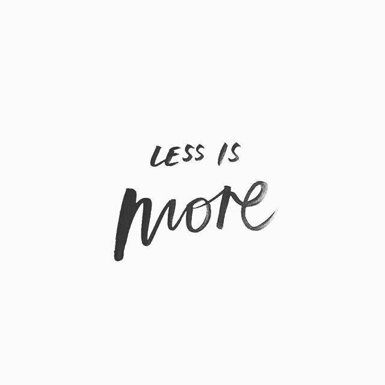
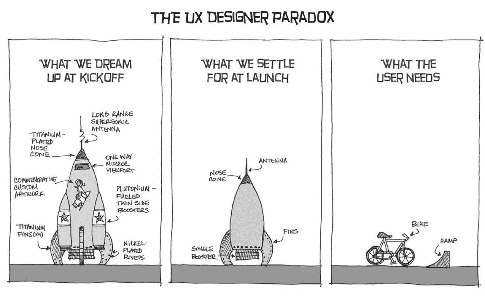

# 过度工程:我们为什么要这么做，以及解决它的 10 种方法

> 原文：<https://betterprogramming.pub/overengineering-why-we-do-it-and-10-ways-to-tackle-it-460663d35ff3>

## 过度工程的影响比你想象的要大

[少即是多](https://iraonherdreams.com/practice-minimalism/)

T2 人们通常是谨慎行事，而不是冒险。规避风险是人的天性。

当开发软件产品时，这有时会产生不必要的复杂性。其他时候，必要的细节被忽略，这导致了一个欠设计的产品。这种平衡并非微不足道。

Max Kanat-Alexander 解释说过度工程是“当你的设计或代码实际上使事情变得更复杂，而不是简化事情。”

> “当你的设计或代码实际上使事情变得更复杂，而不是简化事情时，你就过度工程化了。”— [麦克斯·卡纳特-亚历山大](https://www.codesimplicity.com/post/what-is-overengineering/)

过度设计软件产品是一种常态，并且经常在没有立即意识到的情况下发生。

其中一个原因是，我们专注于持续交付价值，同时管理开发软件带来的期限、竞争、不确定性和模糊性的压力。

结果，过度工程对团队的生产力有负面影响，因为现在必须管理额外的复杂性负担。

这更加耗时，将我们的注意力从“酷东西”上转移开，进一步增加了已经很紧的截止日期的压力。最终，实现定义的业务目标变得更加复杂。

作为一名产品经理，能够发现你的产品何时被过度设计是至关重要的，因为这会影响你快速行动的能力。过度工程的一个常见症状是对产品方向的困惑。稍后我会详细说明更多症状。

现实是，由于人类与生俱来的特性，我们无法防止或消除过度工程。我们天生就有偏见。快速、自动的思考是我们的天性。但是这不是无知的借口。

在这里，我将分享我的想法，为什么我们倾向于过度工程化软件产品，它看起来像什么，为什么它是一个值得解决的问题，以及我们可以采取的步骤来解决它。

# 为什么过度工程是常态

想象一下，你的任务是开发一个移动应用程序，让人口密集地区的人们可以轻松方便地交换自产产品和自制商品(如有机酸奶、康普茶等)。).

立刻，几个问题浮现在脑海里。它们可能是以下几种:

*   建造要花多少钱？
*   需要多长时间建造？
*   我们想要解决的最重要的问题是什么？
*   我们应该建立什么功能？
*   构建这个手机 app 需要哪些技能？
*   目标用户如何获得该应用的访问权限？

还有无数其他的问题可以问。有些问题甚至看起来无关紧要，但事实并非如此，因为每个问题都互有因果。都是有联系的。

《在系统中思考*一书的有影响力的作者 Donella Meadows 用反馈回路的概念详细解释了这种联系。*

*回到移动应用程序的例子，问题是本地生产的商品被浪费了，还是我们正在消费缺乏优质营养的大规模生产的食物，还是别的什么？*

*如果一个特定的问题没有被确定为值得解决，那么我们如何知道应该优先考虑哪些特性，并首先投资于构建呢？*

*一个没有明确定义的问题可能会促进过度工程化，因为团队最终会设计和构建功能，或者是以防万一，或者是因为它可能会解决其中的一个问题。这也使得衡量成功变得更加困难。*

*概括地说，我们过度工程化软件产品有两个主要原因。*

## *原因 1:软件开发是解决问题的练习*

*首先，开发软件是一个由产品愿景引导的不确定的实验之旅。我们使用“工具”、方法(例如[精益创业](http://theleanstartup.com/)和[设计冲刺](https://www.thesprintbook.com/how))和各种技能将概念变为现实。*

*没有开发软件产品的手册或模板，实现一个产品或功能可以有数百种方式。还不知道具体什么时候一个产品会吸引大量的采用或实现产品的市场适应性。*

*当我们从研究中收集见解、收集客户反馈、测试新想法和原型概念时，我们的产品需求经常会发生变化或发展。*

*这是因为开发一个软件产品是一个解决问题的练习。创建商业上可行的软件产品的公式是复杂的。第一次做对就像中彩票一样。*

## *原因二:人类往往是非理性的*

*其次，人类在动态环境中开发软件产品。我们渴望确定性，但是软件开发没有什么是确定的。我们也有复杂的头脑，但是我们做决定和处理偏见的方式一点也不简单。*

*据估计，一个普通成年人每天会做出 35，000 个远程意识决定。令人惊讶的是，有趣的是我们对日常思维过程的控制是如此之少。*

*我只能想象那些决定在新的商业计划上投资多少的决策者在想什么。*

*智能手机和其他智能设备也改变了我们吸收信息和与信息互动的方式，因为它们充当了一条无形的电缆，向我们的大脑传递数字信息。*

*这进一步鼓励了我们的[本能的、自动的和情绪化的(系统 1)思维](https://en.wikipedia.org/wiki/Thinking,_Fast_and_Slow)。然而，这与开发成功的软件产品主要需要的思维方式是相反的。我们需要[批判性思考](https://medium.com/critically-deciding/why-we-needed-critical-thinking-yesterday-6321af72bea9)来做出好的决定。*

*除了我们作为人类的工作方式，我们还面临着向客户展示价值、赢得市场份额和吸引人才的压力。所有的商业计划最终都需要产生预期的投资回报。*

*更重要的是，软件产品需要在商业上可行。这一点，加上上面的两个主要原因，就是过度工程成为常态的原因。*

*因为不清楚到底应该设计和构建什么来实现特定的回报和获取特定的市场规模，所以我们需要尽可能地保持软件产品的设计和开发的灵活性。*

*为了识别过度工程化的软件，我们首先需要了解过度工程化的软件是什么样子的。*

# *过度工程的症状*

*从设计或代码的角度来看，软件产品通常是过度工程化的。它们表现为特定的行为或动作。许多参与开发软件产品的人可能都熟悉过度工程的症状。*

*下面是软件开发社区中的一些人对这些症状的描述。*

*Jeff Sternal 将过度工程描述为:*

> ***“解决你没有的问题的代码。”***

*过度工程可能出现在软件架构、基础设施和安全性中。 [Marko Vuksanovic](https://medium.com/@mvuksano) 分享了这些领域的一些例子:*

> ***“当你没有一个客户时，创建一个微服务架构。”***
> 
> ***“当您的用户只关心 10 秒时，设计一个 50 毫秒延迟的系统。”***
> 
> *“谈到安全性，我们针对与您的业务无关的威胁进行设计。”*

*无论是写一篇文章，创建一个演示文稿，设计一个用户界面，或设计一个平台的架构，笔到纸仍然是一个伟大的技术，让你的想法，以便他们可以更好地组织。*

*写代码也是一样。 [Dsimcha](https://stackoverflow.com/posts/1943342/revisions) 解释道:*

> ***“…当所有事情都经历了如此多的间接性，以至于很难找到一段代码来真正实现一些具体的、领域级的功能。”***

*一旦我们有了不好的经历，从那时起，我们倾向于“多做一点”来为不可预见的未知做准备。在产品开发中，这很危险，因为我们:*

> *根据推测，建造比实际需要更多的东西*

*约翰·金解释了编程的两条黄金法则:1。“很容易理解”和 2。“很容易改变”。他指出，他们经常相互冲突:*

> ***“易于阅读和理解的代码通常意味着当程序需求改变时，代码很难改变。奇怪的是，反过来也是如此。”***

*苹果软件工程师马克·坎拉斯在 Quora 上分享道:*

> ***“过度工程是指在解决一个问题的同时优化其他第三条件的行为，这些条件不太可能实现，从而推高了成本。”***

*也有我们完全没有正当理由的时候。特性的设计和代码的实现都是基于一个假设，即我们可能不需要它，但我们还是会这样做，“以防万一”，或者因为经典的“我们有一个宏伟的愿景”*

*前面我提到过，overengineering 也是一个适用于设计产品的团队的概念。作为产品设计师，我们进行用户研究，以帮助我们确定哪些痛点应该优先解决，以及应该为最终用户创造哪些收益。*

*简而言之，数据既不会告诉我们具体设计什么，也不会告诉我们如何设计解决方案。因此，第一次就获得正确的功能或产品设计是很少见的。*

*我们做了一些假设，有时假设太多了。本质上，我们最终会把未来想象得太遥远。这导致产品、设计和工程团队的共同努力，有时会构建出超出用户需求的东西。*

**

*“从软件开发人员和产品经理的角度看过度工程化问题”([视角](https://twitter.com/rspective/status/984684411181518848))*

*我相信，如果你参与了软件产品的开发，上面的许多症状你都很熟悉。但是我们为什么要在乎呢？*

*让我们来看看过度工程的一些后果和影响。*

# *过度工程的后果*

*过度设计一个产品会有很多后果，但最终会限制一个组织对变化做出反应的能力。让我们打开它。*

## *更高的商业成本*

*过度工程导致更高的商业成本，其中许多是“看不见的”。这里最大的挑战是准确跟踪所有的影响和成本发生的细节。*

*此外，能够主动预测这些意外成本似乎是一次性的练习，而不是日常练习。成本可能以技术债务、运营效率降低、费用增加和/或未能及时交付价值的形式产生。*

*后者在不同团队的计划中有许多流动效应。*

*例如，销售和市场营销通常与产品开发同时进行，为产品发布做准备，因此对该时间表的更改意味着销售和市场营销正在进行的其他计划工作的中断。*

*花在意外成本和干扰上的钱越多，用于探索创新和雇佣独特人才等新机会的钱就越少。*

## *技术债务积累*

*产品经常在快节奏、动态的环境中开发。期限经常被错过，未知的未知是常态。产品经理在分秒之间做出权衡，工程师在分秒之间不断地将代码变更推向生产。*

*频繁的变化和高压力的条件使得做出好的决策变得困难，这常常导致技术债务。从心理学上来说，把技术债放在 backlog 一栏更容易。事实上，我们不会回头看，因为我们太专注于快速前进。*

*这种技术债务，如果被忽视太久，会降低整个产品开发团队的生产力和操作效率。*

*例如，代码中存在的增加的复杂性使得工程师更难理解和在未来发展。另一个例子是，更多的时间花在讨论如何管理或解决因走捷径而造成的负担上。*

*这占用了讨论如何发展平台的时间，例如，我们可以进行哪些实验来提高保留率。*

*同样，在代码复杂性增加的情况下，工程师花更多的时间去理解实现未来的解决方案和管理债务，而不是如何提高产品的性能，简化新功能的发布，等等。*

## *团队生产力和效率下降*

*未能及时交付价值也与主要后果有关。当与不清楚业务目标和目的的团队一起工作时，他们在作为一个团队成功交付产品时变得效率低下。*

*例如，我正与一家优先推出新功能的企业合作。它需要设计、产品、工程营销、客户支持和销售的共同努力才能成功交付。*

*然而，不同的团队并没有清楚地理解该特性的业务目标和目的。由于不匹配的理解，结果是交付了质量差的特性。可以想象，这导致了客户的低质量用户体验。*

*上述后果最终导致团队士气低落，积极性下降。此外，产品开发成本最终比最初估计的要高。*

*所有这些后果归结为成本。因此，企业面临着无法获得预期投资回报的风险。为了降低这种风险，接下来让我们看看如何检测软件何时被过度工程化。*

# *如何解决这个问题*

*过度设计的产品通常具有指数级的流动效应，这是很危险的，因为它们不会立即出现。*

*例如，我正在开发一个为新产品定义业务工作流程的产品。当开始开发产品中的工作流时，不是从关键工作流开始，而是所有的工作流同时实现。*

*在实施之前，我们花了大量时间研究和尝试完善工作流程。令我们失望的是，结果是一组过于复杂的工作流，难以在现实生活中使用。*

*从早期的用户测试中，我们了解到一些工作流在“特殊”和罕见的情况下过于死板。我们还了解到，工作流程更多的是指导方针，而不是严格遵循的精确指令。*

*没有及时发现这一点会导致不必要的开发工作和糟糕的用户体验。因此，我们必须就如何确定工作优先级和降低风险做出明智的决策。*

*那么，我们如何在行动中抓住自己？*

*[ThoughtWorks](https://medium.com/u/8075bdd73dd9?source=post_page-----460663d35ff3--------------------------------) 的首席顾问马尔科·武克萨诺维奇，有一个快速简单的方法来检测你是否过度工程化。只需这样做:*

> *问:**如果我们省略 X 会发生什么？"**如果答案是:"**没什么，"**或"**对业务目标来说没什么重要的"**，那么你很可能过度工程化了。"*

*但这既不是银弹，也不存在。在开发软件产品时，完美信息是不存在的。因此，批判性思维起着重要的作用。*

*问这样的问题:“什么是太多的代码？”以及“什么叫过度设计？”是没有用的，因为它们会导致主观的答案。另外，没有可靠的方法来衡量代码或设计的正确数量。*

*对于任何功能、增强或产品来说，花在设计上的代码量或时间是不同的。这完全取决于上下文、需求和您希望解决的当前问题。*

*另一方面，在团队内部和团队之间指导和启用良好的决策技能有助于发现过度工程。具体来说，我们可以通过问一些问题来当场抓住自己。*

*这些问题有助于确定在产品实现过程中设计多少代码和编写多少代码之间的平衡。因此，我们能够做出更好的决定。*

## ***六个问题来检测它***

1.  *我们正在解决的问题是什么，这个代码/设计如何直接解决它？*
2.  *你的代码/设计将解决哪些场景或用户故事？我们需要传递的最重要的用户故事是什么？*
3.  *您为什么选择这种设计/实现方法？*
4.  *我们可以采用哪些替代方法来实现(例如，框架、语言等)？*
5.  *这是设计/实现需求的最简单的方法吗？如果没有，还有什么其他方法？*
6.  *我们能不能让这个变得更简单，并且仍然达到要求？*

*如果对上述一个或多个问题的答案缺乏信心，很有可能发生了过度工程。此时，明智的做法是停下来，明确你和你的团队的目标是什么。*

*然后，彻底审查设计和/或代码，以尽量减少任何过度工程。这不是要问的问题的完整列表，而是我在与不同的产品和工程团队合作时发现有用的问题。*

> *"避免过度工程化的最好方法就是不要设计得太远."——Max Kanat-Alexander，著有《[代码简单性](https://www.amazon.com/Code-Simplicity-Fundamentals-Max-Kanat-Alexander-ebook/dp/B007NZU848)》和《[理解软件](https://www.amazon.com/Understanding-Software-Kanat-Alexander-simplicity-programmer/dp/1788628810)》*

*虽然检测和最小化过度工程是一种改进，但最好的方法是通过不要设计得太远来避免过度工程。*

## *避免过度工程的四种方法*

1.  *用清晰的成功标准定义和传达目标。*
2.  *让需求透明化。*
3.  *确保交流依赖关系，并根据需要进行协作，以提出最佳解决方案。*
4.  *尽早评估你的产品，并且经常模拟产品的使用方式，这样你就可以确定你的产品是否达到了预期的价值。*

*在极少数情况下，过度工程可能是某个商业决策或让产品更快上市的策略的结果。*

*然而，这样做是基于这样的认识，即在不久的将来，如何解决过度工程的影响的计划将产生额外的时间和成本。*

> *“完美是足够好的敌人，做到比完美更好。”——海伦·麦克奎恩*

*如果我们能够有意识地发展，批判性地思考，并有效地合作，团队将能够完成事情，特别是有效地解决问题，并迅速适应变化。*

*如果你问:“如果我们省略 X 会发生什么？”答案是“没什么”或“对业务目标来说没什么关键的”，那么你可能工程过度了。*

# *结论*

*你有这样的经历可以分享吗？我很乐意听到你发现的任何其他有助于识别你的软件产品是否被过度工程化的问题或技术。欢迎在下面的评论中分享。*