# 上下班打卡系统第 9 部分:后端测试—服务的单元测试

> 原文：<https://betterprogramming.pub/part-9-testing-backend-testing-2d021f48403b>

## NestJS + Angular 教程

这篇文章是我描述上下班打卡系统的系列文章的一部分。如果你想了解更多，你可以阅读以下内容:

*   [上下班打卡系统第 1 部分:图](https://medium.com/@ccaballero/part-1-clock-in-out-system-diagram-a0a51bab02a7?source=post_page---------------------------)
*   [上下班打卡系统第二部分:基础后端— AuthModule](https://medium.com/better-programming/part-2-clock-in-out-system-basic-backend-i-authmodule-66d4a5c56122?source=post_page---------------------------)
*   [上下班打卡系统第 3 部分:基本后端——用户模块](https://medium.com/better-programming/part-3-clock-in-out-system-basic-backend-ii-usersmodule-a56f42b20f62?source=post_page---------------------------)
*   [上下班打卡系统第 4 部分:基础后端— AppModule](https://medium.com/better-programming/part-4-clock-in-out-system-basic-backend-iii-appmodule-850dd17883e?source=post_page---------------------------)
*   [上下班打卡系统第 5 部分:种子数据库和迁移数据](https://medium.com/better-programming/part-5-clock-in-out-system-seed-database-and-migration-data-cf037be21aac?source=post_page---------------------------)
*   [上下班打卡系统第 6 部分:基本前端](https://medium.com/@ccaballero/part-6-clock-in-out-system-basic-frontend-an-7e5f9ed08c3f?source=post_page---------------------------)
*   [上下班打卡系统第 7 部分:使用 Docker/Docker-Compose 部署后端(NestJS)](https://medium.com/@ccaballero/part-7-deploy-backend-nestjs-docker-docker-compose-2429c0b6aa9c?source=post_page---------------------------)
*   [上下班打卡系统第 8 部分:使用环境部署前端(角度 6+)](https://medium.com/@ccaballero/part-8-clock-in-out-system-deploy-frontend-angular-6-using-environments-ad267325d3b6?source=post_page---------------------------)
*   [上下班打卡系统第 9 部分:后端测试——服务的单元测试](https://medium.com/@ccaballero/part-9-testing-backend-testing-2d021f48403b?source=post_page---------------------------)
*   [上下班打卡系统第 10 部分:后端测试——控制器单元测试](https://medium.com/@ccaballero/part-10-testing-backend-testing-unit-testing-controllers-4177370ef581?source=post_page---------------------------)
*   上下班打卡系统第 11 部分:后端测试-e2e 测试
*   上下班打卡系统第 12 部分:前端测试单元测试
*   上下班打卡系统第 13 部分:前端测试集成测试

# 后端测试概述

这是关于测试的第一篇文章，也可以认为是关于质量评估(QA)的第一篇文章。

这个项目不是从一开始就使用测试驱动开发(TDD)开发的，但我目前正在测试阶段进行。多亏了测试阶段，我发现了很多小错误。如果这个项目已经投入生产，这可能是一个大问题。事实是，该项目将在接下来的几周内进入生产模式。这些测试对于修复目前已经发现的几个 bug 非常有用。

测试的第一步是决定你应该测试什么。人们可能会说，你必须测试整个应用程序，你必须获得接近 100%的覆盖率。事实上，你不需要测试整个应用程序——但是你必须测试软件中最关键的部分。这可能接近 90%或 70%，取决于您的应用程序。

在我们的例子中，我将建议我们应该测试服务(app.service、user.service 和 auth.service)和控制器(app.controller、user.controller)。不需要测试 d to、常量、实体或模块。那些测试很难，价值也很小。

后端使用 [NestJS](https://nestjs.com/) 框架开发，该框架使用 [Jest](https://jestjs.io/) 作为测试工具。此外，NestJS 包括一个强大的测试包，它模拟了一个类似于[角度测试包](https://angular.io/guide/testing)的环境。

# 服务测试

在这篇文章中，我将描述服务单元测试，这是测试金字塔中最简单的测试。我对那些开始从事测试工作的人的建议是，从对服务进行单元测试开始。这些都是小功能，有独特的任务，很容易被隔离。因此，它们是最简单、最容易测试的。

测试金字塔

# 应用服务

我们要测试的第一个服务是`app.service.ts`。它使用两种服务:`AuthService`和`UserService`。我们的测试套件必须检查`app.service`将使用正确的参数调用服务。

第一步包括我们将要开发的每个测试的初始配置。`app.service.ts`在其构造函数中需要两个服务(`AuthService`和`UserService`)，这两个服务将是间谍。来自`@nestjs/testing`的`Test`包提供了创建测试模块进行测试的方法`createTestingModule` 。在这个`testingModule`中，`providers`数组由`AppService`和两个使用工厂创建的间谍组成。以下代码向您展示了这一初始配置:

下一步包括知道我们想要测试什么。主要思想是独立于任何其他函数/方法来测试每个函数/方法。以下方法是`app.service.ts`中代码的一部分。

`authIn`和`authOut`方法应该检查是否使用正确的参数调用了`authService`。在我们的例子中，测试是单元，因此方法`this.authService.authIn`和`this.authService.authOut`不应该使用真正的函数/方法来调用。这就是为什么我们用间谍来做这些事。测试函数的代码如下:

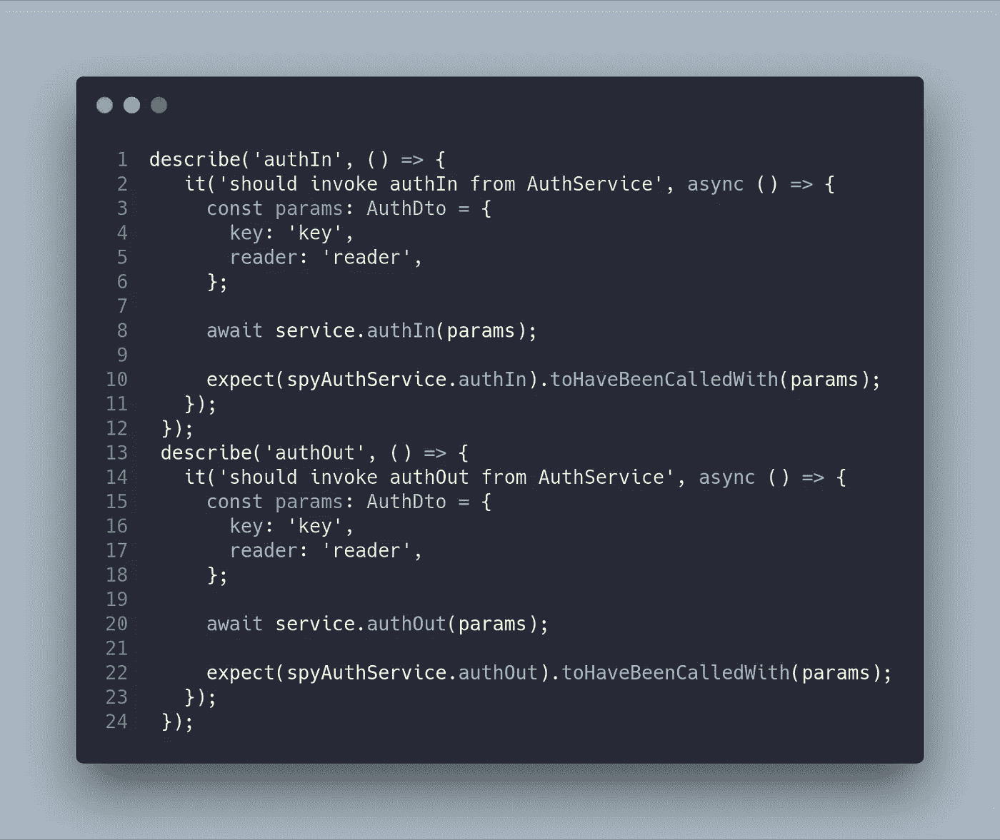

在之前的测试中，您可以注意到`expect`与方法`authIn`和`authOut`相关。它检查这些方法是否被调用，参数是否正确。方法`authIn`或`authOut`中抛出的错误是不相关的，因为在这些方法中，责任被委托给了其他服务。

与`usersTicketing`方法相关的测试如下:

当执行`Date`中的功能`now`时，创建一个间谍供使用。这是为了防止用户在同一天返回。(测试必须是纯粹的，不依赖于外部因素)。在这个测试中，我们需要检查方法`getUsersMustBeWorkingNow`是否已经被调用，方法`usersTicketing`的结果是否是一个包含密匙`users`的对象，密匙`UserService`中提供了密匙值和当天的时间戳。

# 用户服务程序

测试用户服务的程序与`app.service.ts`中使用的程序相同。第一步是创建测试模块，其中包含将在下面的测试中使用的 spy 和服务。

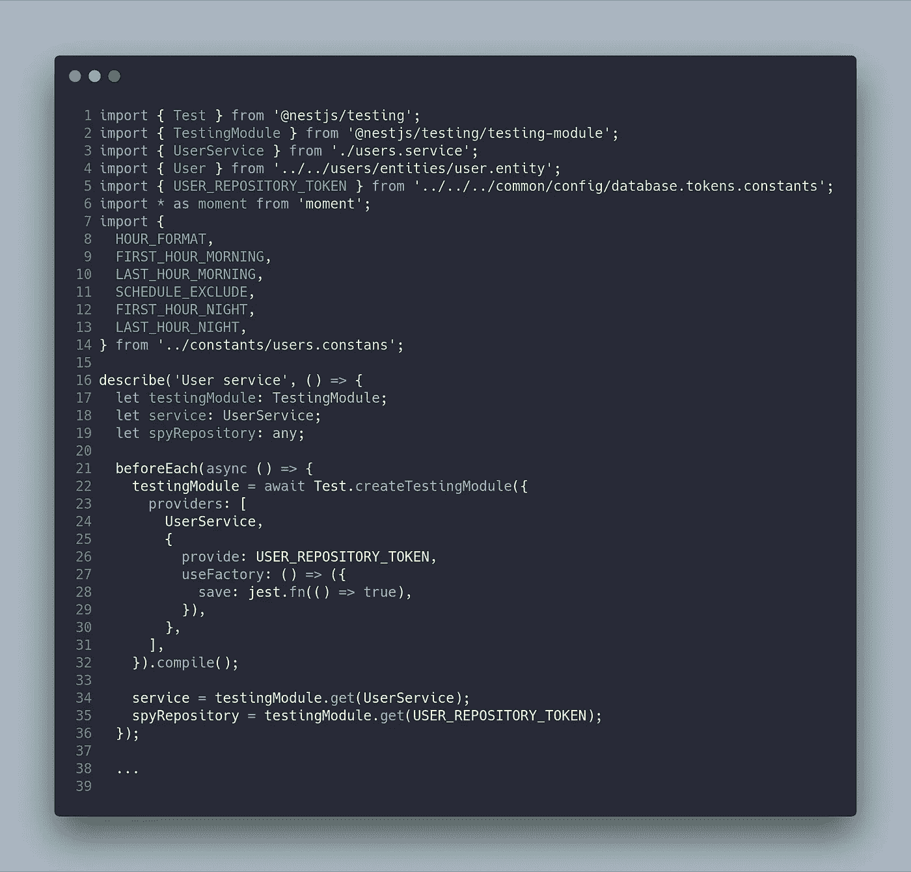

第一种方法非常简单，因为使用的技术与`app.service.ts`中的相同。要测试的代码如下:

它的测试套件只检查方法`save`是否用正确的参数(`User`原型和初始参数)调用，如下面的代码所示:

下一个要测试的方法是调用`TypeORM` ORM，如下所示:

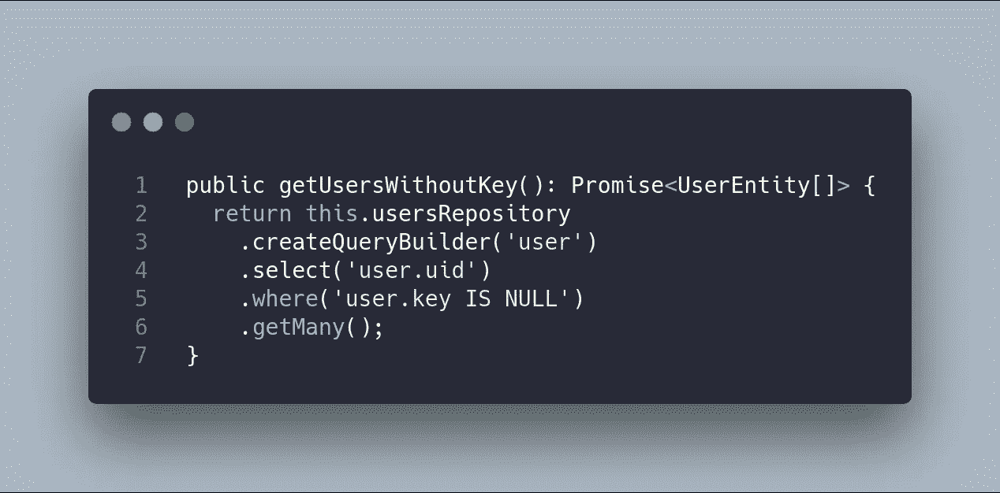

在这个测试中，我们需要使用链式责任从`usersRepository`中窥探每个方法。为此，我们使用 Jest 提供的工厂。

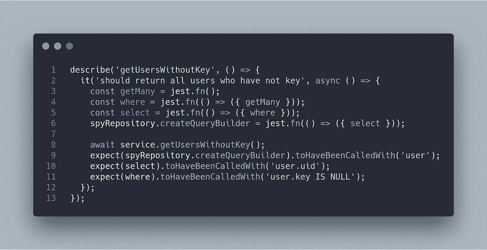

如你所见，我们正在检查从`TypeORM`调用的每一个方法，以及调用它的参数——简单快捷。

下面的方法可能有强烈的代码味道(长方法)。但是如果您仔细阅读该方法，您会注意到它是一个很好的数据库查询调用，并且没有代码味道。

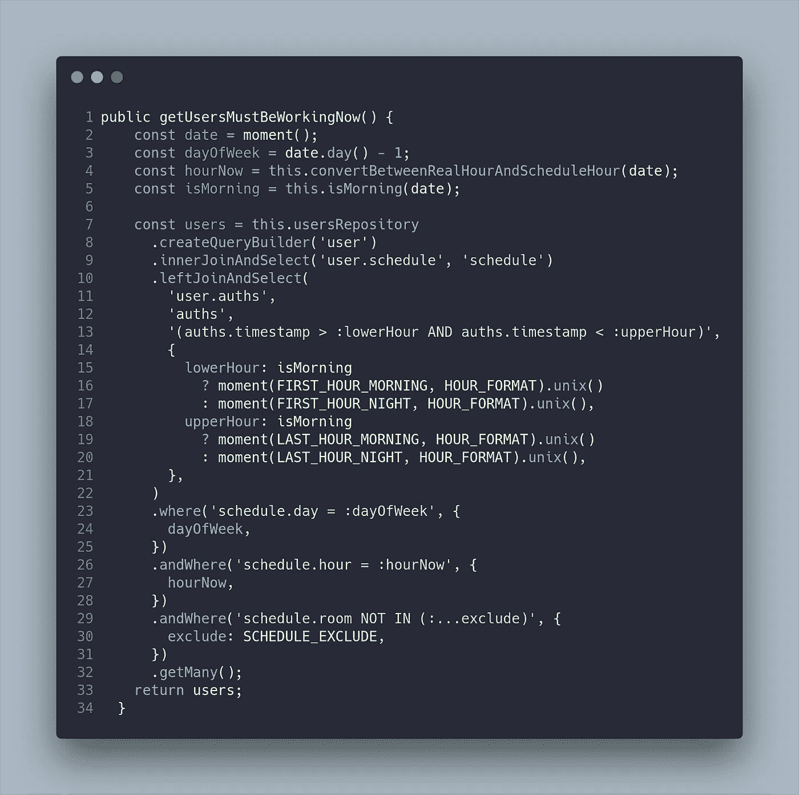

该查询有几个参数组合，但测试是相同的。为了做这个测试，我们需要包含一个输入和输出的表格。Jest 有一个名为`each`的参数，可以用来参数化我们的测试。

下表列出了:

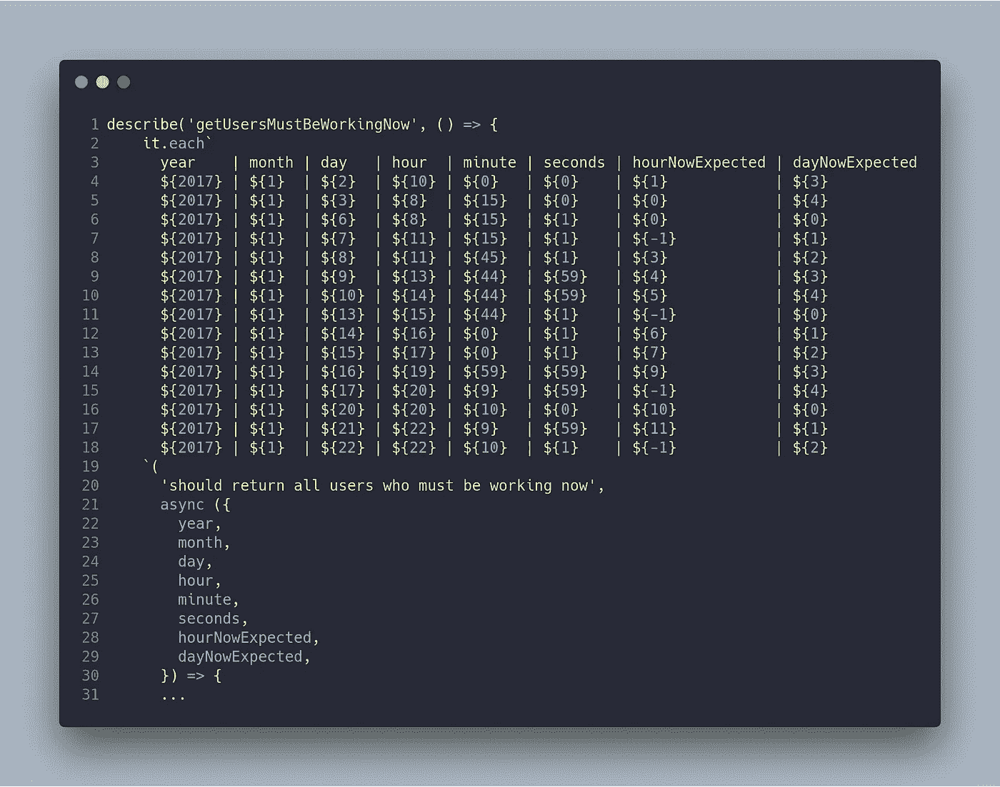

您可以看到，我们的表格中用于测试的参数如下:

*   **年**:对应于我们想要测试用户是否在建筑物中的时刻的年份
*   **月**:对应于我们想要测试用户是否在建筑物中的时刻的月份
*   **日**:对应于我们想要测试用户是否在建筑物中的时刻的一天
*   **小时**:对应于我们想要测试用户是否在建筑物中的时刻的小时
*   **分钟**:对应于我们想要测试用户是否在建筑物中的时刻的分钟
*   **秒**:对应于我们想要测试用户是否在建筑物中的时刻的秒。
*   **hourNowExpected** :使用另一个参数列表返回方法的小时
*   **dayNowExpected** :应使用其他参数列表返回方法的日期

我们的测试需要很多间谍来测试 ORM。表中的预期值用于检查私有方法是否返回将用于 ORM 查询的值。如果私有方法是公共的，测试会更容易，但是测试不应该改变原始代码(除非发现了 bug)。

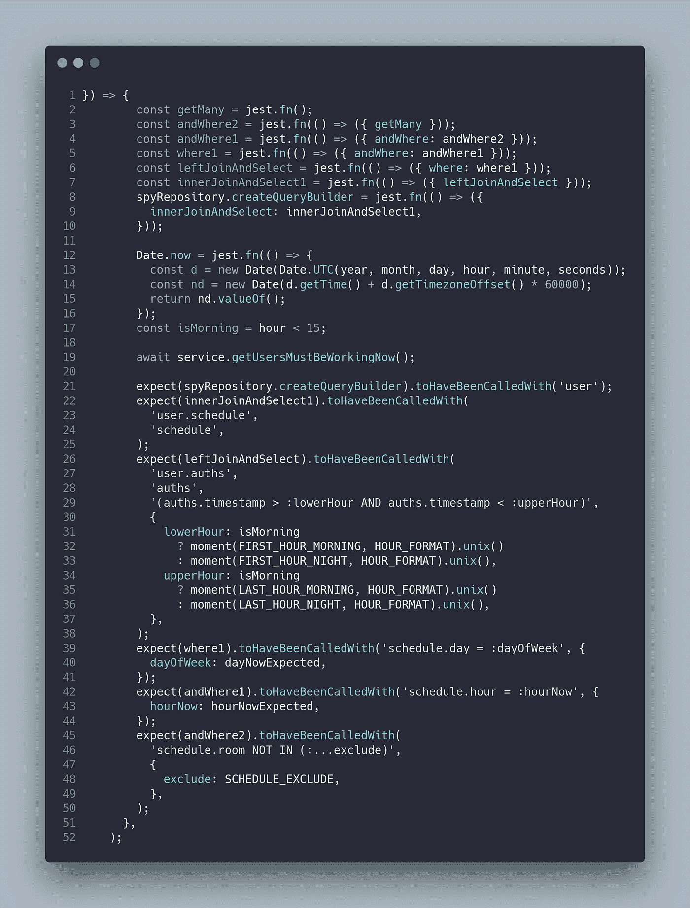

测试的第一部分是创建间谍来检查它是否使用正确的参数被调用。然后，调用方法`service.getUsersMustBeWorkingNow()`。最后，有一个期望列表，它检查 ORM 的方法是使用正确的参数调用的。

该测试的最终代码如下:

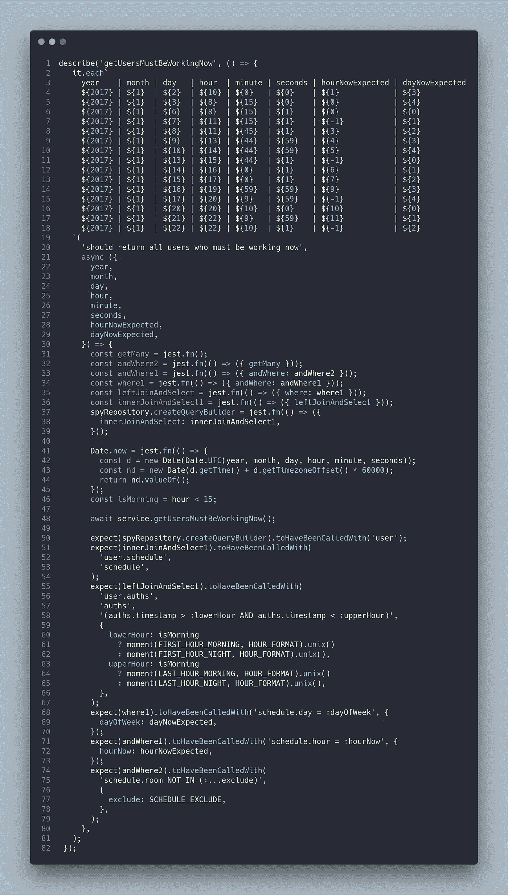

# 授权服务

最后要测试的服务是`auth.service.ts`。该技术类似于前面的测试。每个测试的第一步是初始配置。

要测试的代码如下:

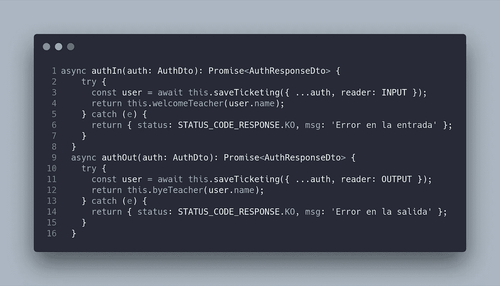

您可以看到，有几个私有方法无法直接测试。这是因为私有方法类似于在公共方法中复制/粘贴这段代码。因此，这些方法不是测试套件的一部分。

私有方法如下:

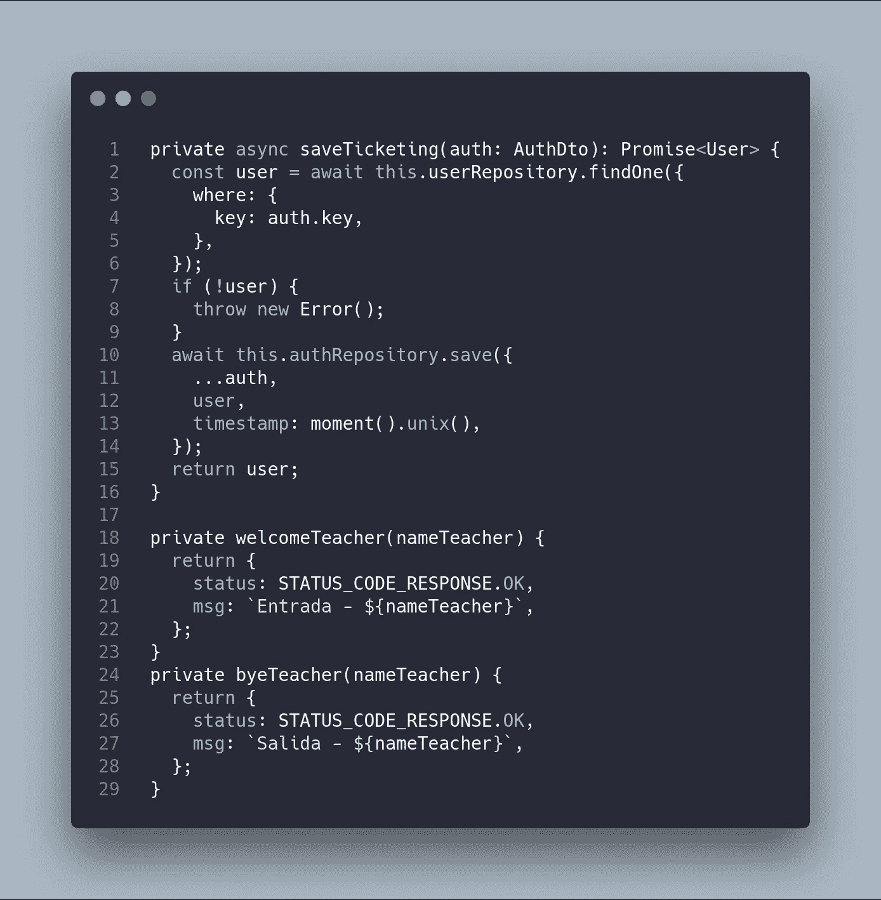

在我们的方法`authIn`和`authOut`的测试套件中，有三个不同的测试。它们代表了您在下面看到的场景。

`authIn`应该:

1.  进行身份验证并回复问候
2.  找不到用户时返回错误
3.  出现意外错误时返回错误。

`authOut`应该:

1.  保存认证并返回*再见*
2.  找不到用户时返回错误
3.  出现意外错误时返回错误

`authIn`代码如下:

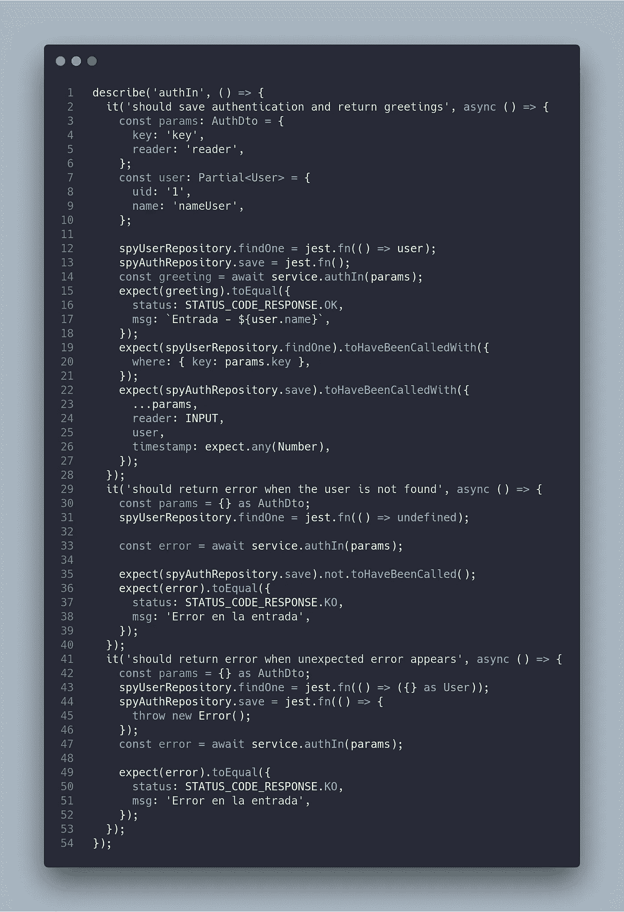

`authOut`代码如下:

# 结论

在本文中，我解释了如何使用 Jest 和 NestJS 框架测试后端服务。这段代码最有趣的特性是，我们可以使用 spies 来隔离我们的测试，我们可以创建一个输入和输出表来自动化许多相同但使用不同参数的测试。

在下一篇文章中，我将向您展示如何对控制器进行单元测试。

*   GitHub 项目是[https://github.com/Caballerog/clock-in-out](https://github.com/Caballerog/clock-in-out)。
*   GitHub 分支是[https://GitHub . com/Caballerog/clock-in-out/tree/part 9-back end-unit-test](https://github.com/Caballerog/clock-in-out/tree/part9-backend-unit-test)。