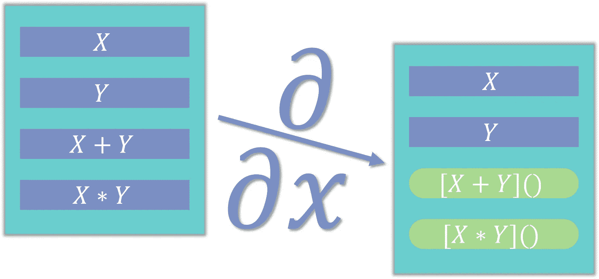

# 应用程序中派生状态的模式

> 原文：<https://betterprogramming.pub/patterns-for-deriving-state-97fd6c8c2c6a>

## 在应用程序中派生状态的常见和高级用例

我本来打算写一篇关于为什么应该派生状态而不是手动同步它的文章，但是 Kent C. Dodds 已经写了一篇关于这个主题的优秀的[文章](https://kentcdodds.com/blog/dont-sync-state-derive-it)。

因此，相反，我将回顾我这些年来看到的一些常见情况，以及如何在不手动同步状态的情况下处理它们。

# 过滤和排序列表

对列表或表格进行过滤和排序是 web 开发中非常常见的情况。最直接的方法是保存一个排序列表，并随着内容的更新重新排序。

将来添加更多功能时，像这样手动处理状态很容易出错。我们从两个不同的地方调用`sortByColumn`,我们需要对原始列表上的每个不同的转换都这样做。

如果我们导出排序，我们将改为这样做:

# 显示经过的时间

显示从(或到)某个时间的滴答声时钟的通常方式是使用`setInterval`来更新还剩多少时间。

虽然这段代码有效，但我们管理的是可以派生的状态。

当我们需要更新开始时间，显示不同的粒度时间，并且当你考虑到`setInterval`并不真正保证它会在那个时间间隔内运行时，这种方法就失效了。

它只能保证在指定的时间后运行，但是如果有什么东西阻塞了它，它可以在未来的任何时间运行。

一种更好的方法是保存原始开始日期，并使用当前时间得出经过时间:

我知道强制渲染通常是一种反模式，但在这种情况下，我们真的没有其他方法来告诉 React 何时应该重新渲染。

如果你使用的是 [MobX](https://mobx.js.org/) ，已经有一个很好的实用函数可以做到这一点——MobX-utils 中的`‘now()’`函数。

# 在清单中显示选定的项目

我在创建清单时看到的一个常见模式是将选中的项目放在包含选项的状态中。

例如，让我们试着建立一个你可以放在汉堡里的东西的列表:

这不是很好的 React 代码，可能有点做作，因为它甚至不是一个完全受控的组件，但这是一个非常常见的使用模式，当您的选项对象变得更加复杂时，它非常诱人。

如果选项列表发生变化，它还会忽略所有选定的选项。因为它在内部管理状态，所以该函数必须小心地将其内部表示与外部变化同步。

相反，我们可以写:

是的，我们实际上是在为每个选项迭代所有选择的数组，所以这或多或少是一个`O(n²)`操作，其中`n`是选项的数量。`(O(n²)`是一个[的大 O 符号](https://en.wikipedia.org/wiki/Big_O_notation)。

如果选项的数量很少，这就不算是性能问题。而且，如果选项的数量大到足以成为一个问题，那么你可能需要考虑一个不同于清单的 UI 范例。

还有一些方法可以让这个函数在`O(n)`执行，这在性能上相当于前面的例子，但是换来了更加冗长和复杂的代码。

# 派生状态不仅限于视图层

大多数派生状态的例子集中在如何限制组件内部的同步状态，但是在较大的应用程序中，我们经常将大部分状态放在视图层之外——逻辑层内部(MVC 中的控制器，或者目前大多数状态管理框架的存储)。

限制在逻辑层中派生的状态也很重要——即使是不鼓励同步状态的框架，比如 [Redux](https://redux.js.org/) 。

例如，以前面的相同列表排序示例为例，但这次是用 Redux 编写的:

通过在我们的商店内手动排序，如果不同的操作导致列表改变，我们必须再次对列表进行排序。

相反，要导出状态，我们应该这样写:

这降低了性能，但是，和往常一样，如果性能成为一个问题，可以通过使用内存化来解决。

# 派生状态的设置器

当您的存储公开一个派生属性时，我们通常希望能够更改该派生属性。我们可以通过创建采取新的派生状态并推断正确的原始状态的动作来做到这一点。

举个例子，我们来看一个商店，它在某个范围内保持显示一个图形的时间间隔。我们希望保持存储简单，只使用以天为单位的时间，但对于用户来说，我们希望显示更易于阅读的日期(例如，一周、四个月等等)。

这种使用派生状态的存储的示例如下所示:

我们可以为格式化字段公开一个 setter，而不是只公开一个改变日期的函数，让用户(通常是视图层)负责从派生状态转换到内部表示:

这是一个有点做作的例子，因为您可能应该在组件内部而不是在商店中格式化它，但是它可以解释这一点。

在 MobX 中，我们可以通过为计算属性创建一个 setter 来做到这一点:

# 为什么我在大多数例子中使用类语法而不是钩子语法

我最初试图使用新的钩子语法编写所有的例子，但是，很快就发现，用钩子手动编写同步状态的例子会产生非常复杂的代码，似乎没有人会真正使用。

由于我已经看到了使用这些情况的实例，通常是与类语法一起使用，并且还没有有幸看到任何人将它与 Hook 语法一起使用，所以我选择使用我在实践中实际看到的内容来编写糟糕的代码示例。

由于我在类语法中写了不好的例子，所以我也选择了在类语法中展示好的例子，这并不意味着在本文中一种语法优于另一种语法，这样变化会更加明显。

也就是说，我认为钩子本质上是一个单一的函数，并且意味着某种线性流程，这使得编写不必要的状态管理更加困难——并且编写派生的状态更加自然。

钩子使得使用最佳实践编写 React 代码更加自然

下面是用类语法编写的两个例子的钩子语法代码:

## **过滤和排序列表**

## **在清单中显示选中的项目**